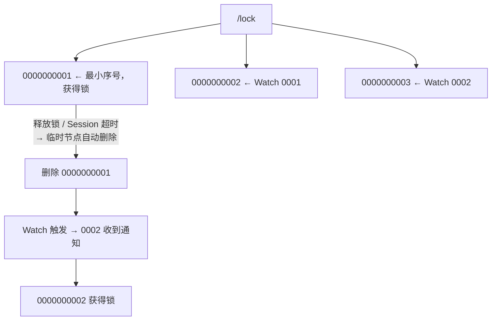
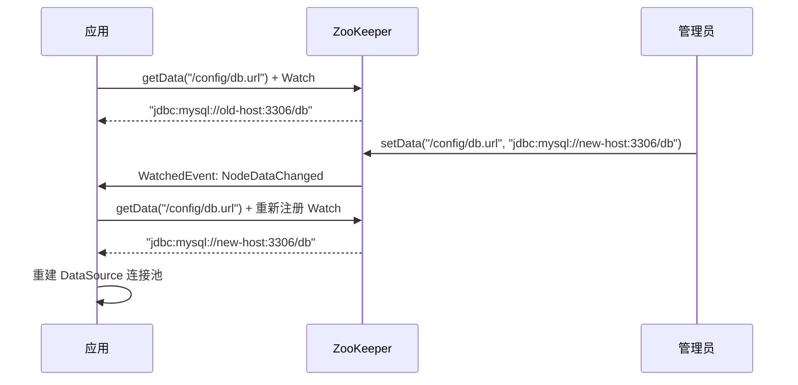
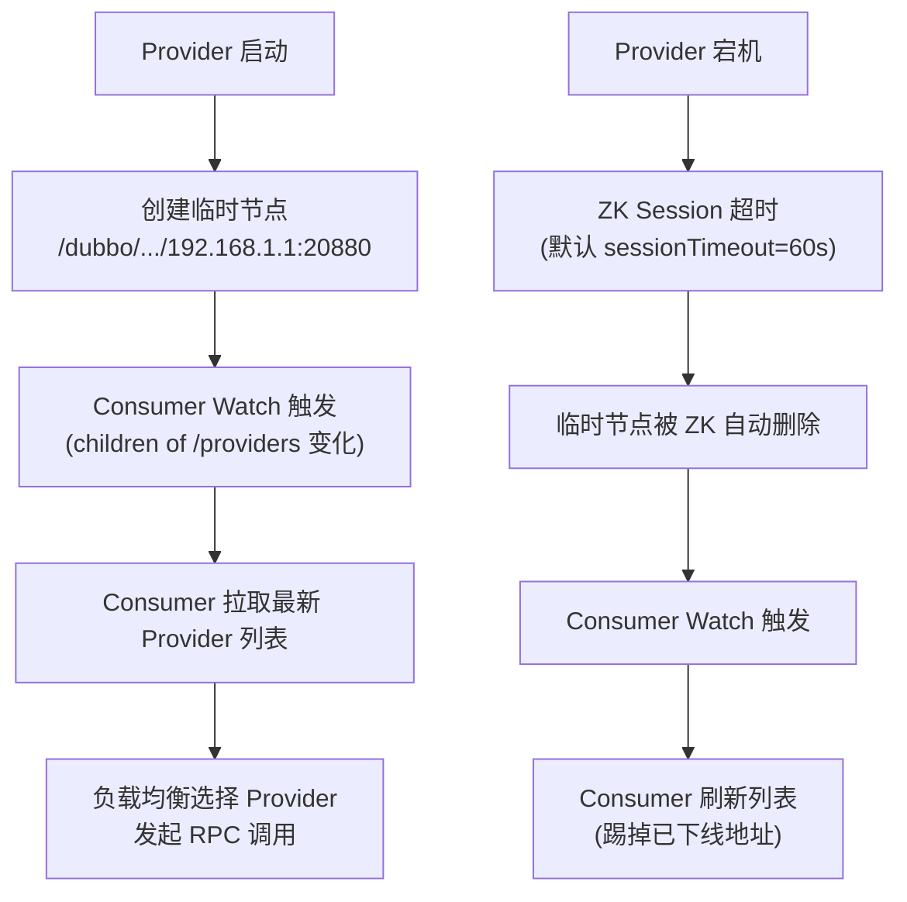

# 历史背景——从 Chubby 到 ZooKeeper

2006 年，Google 发表了 Chubby 论文，描述了一套基于 Paxos 的分布式锁服务，用于 Google 内部（GFS、BigTable 等都依赖它做 master 选举和元数据存储）。同一年，Yahoo Research 受 Chubby 启发，开始打造 ZooKeeper——但没有照抄 Chubby 的锁服务定位，而是将 ZK 抽象为更通用的**分布式协调原语**。

为什么叫"协调原语"而不是"锁服务"？因为 Yahoo 的工程师发现，分布式锁、服务注册、配置管理、Leader 选举……这些场景在底层用到的能力是共通的：**一个高可用的、支持 Watch 通知的、类文件系统的树形存储**。既然底层是一致的，上层场景完全可以由用户自由组合，没必要把 ZK 限定在一个特定领域。

本文覆盖 ZK 最经典的三个实践场景：用临时顺序节点实现分布式锁，用 Watcher 实现配置热更新，用临时节点实现服务注册发现。

---

# 一、分布式锁——临时顺序节点方案

## 1.1 Why：为什么不能直接"抢同节点"？

```java
// ❌ 错误的直觉方案：所有人抢创建同一个 /lock 节点
// 
// 问题："惊群效应"（Herd Effect）
// - 100 个客户端同时 Watch /lock 节点
// - 锁被释放 → 100 个客户端同时收到通知 → 同时尝试创建 /lock
// - 只有 1 个成功，99 个失败后重新 Watch → 下次释放又是 100 个同时醒 
// - 随着竞争加剧，ZK 集群和客户端都承受巨大的无用开销
```

## 1.2 What：正确方案——临时顺序节点 + Watch 前驱

核心思想是**排成一个逻辑队列**，每个人不 Watch 锁节点本身，而是 Watch **排在自己前面的那个节点**：



这样，**每次锁释放只唤醒一个等待者**，完美避免了惊群效应。

## 1.3 How：Curator InterProcessMutex

Netflix Curator 封装了这套逻辑，一行代码即可使用：

```java
// Curator InterProcessMutex（生产推荐）
InterProcessMutex lock = new InterProcessMutex(client, "/lock/order");
if (lock.acquire(10, TimeUnit.SECONDS)) {
    try {
        // 临界区代码
    } finally {
        lock.release();
    }
}
```

**Curator 在背后做了的事情**：
1. 在 `/lock/order` 下创建临时顺序节点
2. 获取所有子节点，按序号排序
3. 如果自己的序号最小 → 获得锁
4. 否则 → Watch 前一个节点（只等前驱）
5. `release()` 时删除自己的临时节点 → 触发后继者的 Watch

**Watch Dog 机制**：Curator 的 `InterProcessMutex` 还带了"自动续期"——如果临界区执行时间超出 ZK Session 超时，锁不会自动释放（和 Redis 分布式锁不同，Redis 默认 TTL 到期自动删 key）。

## 1.4 Do：三种锁方案选型

| 方案 | 实现复杂度 | 惊群 | 可重入 | 自动续期 | 推荐场景 |
|------|--------|------|--------|---------|---------|
| **手写 ZK 锁** | 高 | 容易踩坑 | 需自己实现 | 需自己实现 | 学习理解原理 |
| **Curator InterProcessMutex** | 低（开箱即用） | 无 | ✅ | 通过 Session 心跳 | **生产首选** |
| **Redisson RedLock** | 中 | 无 | ✅ | Watch Dog 续期 | 项目已用 Redis 不想再加 ZK |

**选型决策**：如果你的项目已经部署了 ZK 集群（比如 Kafka 或 Dubbo 的依赖），直接用 Curator 的分布式锁是最佳选择。如果你的项目没有 ZK，Redis RedLock 也可以胜任绝大多数场景——但要注意 RedLock 的争论（Martin Kleppmann 提出过不少质疑）。

---

# 二、配置中心——Watcher 驱动热更新

## 2.1 What：模型很简单

```
所有应用的 DB 连接串、限流阈值、开关配置……
  统一存在 ZK 的 /config 子树下
    应用启动时读取一次
    然后注册 Watcher 持续监听变化
      配置变更 → ZK 推送通知 → 应用刷新配置 → 无需重启
```

## 2.2 How：完整代码流程



```java
// 配置监听代码
String path = "/config/db.url";
byte[] data = client.getData().usingWatcher((event) -> {
    if (event.getType() == Watcher.Event.EventType.NodeDataChanged) {
        // ⚠️ Watcher 是一次性的！触发后必须重新注册
        byte[] newData = client.getData().usingWatcher(this).forPath(path);
        refreshDataSource(new String(newData));
    }
}).forPath(path);
```

## 2.3 Why：Watcher 机制的坑和应对

| 坑 | 细节 | 解法 |
|------|------|------|
| **一次性触发** | Watcher 触发即失效，必须重新注册 | 每次回调中重新设置 Watcher |
| **事件不包含数据** | `NodeDataChanged` 只告诉你"变了"，不含新值 | 收到通知后手动 `getData()` |
| **连接断开间隙** | `Disconnected` → 重连期间配置变更丢失 | 用 Curator 的 `TreeCache`，自动处理重连和断点续传 |
| **回调阻塞** | Watcher 回调在 ZK 的 EventThread 中串行执行 | 耗时操作异步化，不要在 Watcher 中执行 |
| **节点不存在** | 创建 Watch 时节点还不存在 → 需要等 NodeCreated 事件 | Curator 的 `NodeCache` 自动处理 |

**Curator TreeCache 一键解决上述所有问题**：

```java
TreeCache cache = new TreeCache(client, "/config");
cache.getListenable().addListener((c, event) -> {
    switch (event.getType()) {
        case NODE_UPDATED:
            // 配置更新 → 自动包含新数据，不需要手动 getData
            String newValue = new String(event.getData().getData());
            refreshConfig(newValue);
            break;
    }
});
cache.start();
```

---

# 三、服务发现——Dubbo 注册模型

## 3.1 What：ZK 如何表示服务？

Dubbo 是最知名的 ZK 服务发现实践。每个服务在 ZK 中有一棵子树：

```
/dubbo
  /com.example.OrderService
    /providers
      /192.168.1.1:20880      ← 临时节点！提供者下线即删
      /192.168.1.2:20880      ← 带权重、分组等元数据
    /consumers
      /192.168.1.3:35678      ← 消费者 IP（可选）
    /configurators             ← 路由规则、权重调整
    /routers                   ← 条件路由规则
```

**临时节点**是这个模型的核心：Provider 启动 → 创建临时节点；Provider 宕机或进程退出 → ZK Session 超时 → 临时节点自动删除 → Consumer Watch 触发 → 刷新 Provider 列表。服务的上线和下线是**自动感知**的，无需手动变更 DNS 或负载均衡器。

## 3.2 How：服务上下线的完整链路



## 3.3 三种注册中心对比

| | ZooKeeper | etcd | Nacos |
|------|-----------|------|-------|
| **一致性模型** | CP（强一致，Leader 选举期间不可用） | CP（强一致，Raft 协议） | AP + CP 可切换 |
| **健康检查** | Session 心跳（被动） | Lease 续约（被动） | 主动 TCP/HTTP 探活 + 临时实例 |
| **生态绑定** | Dubbo / HBase / Kafka | K8s / CoreDNS / gRPC | Spring Cloud Alibaba / Sentinel / Dubbo |
| **选型建议** | Java 存量项目、已有 ZK 部署 | 云原生、K8s 环境、新项目 | 国内微服务全栈（阿里体系） |
| **关键短板** | 大量临时节点时 Watch 风暴 | gRPC naming resolver 不够成熟 | 国内社区为主，国际化较弱 |

**为什么 Dubbo 早期选择 ZK 而不是 Eureka/etcd？**
1. ZK 的强一致性保证了 Provider 列表不会出现"两个消费者看到的列表不一致"的问题
2. ZK 的临时节点 + Session 超时机制天然适合"服务探活"——Provider 心跳断了就自动下线
3. 2010 年代初期，ZK 几乎是阿里外部唯一成熟的分布式协调中间件

---

# 四、ZooKeeper 运维常见坑

| 问题 | 现象 | 根因 | 解法 |
|------|------|------|------|
| **Session Expired** | 客户端突然掉线，临时节点全丢 | JVM GC 停顿 / 网络闪断 > `sessionTimeout` | 加大 `sessionTimeout`（默认 30s，调大至 60s），优化 GC |
| **临时节点堆积** | ZK 节点数持续增长 | 客户端异常退出但 Session 未过期 | ZK 3.6+ 的 `multi` 操作和 `ephemeralOwner` 审计 |
| **Watcher 风暴** | `/providers` 大量变更触发级联 Watch | 大批量 Provider 上下线 | 避免 Watcher 过细，用 Curator TreeCache 控制粒度 |
| **磁盘快照膨胀** | ZK DataDir 占满磁盘 | 事务日志和快照不自动清理导致 | 配置 `autopurge.snapRetainCount=3` + `autopurge.purgeInterval=1` |
| **过半节点宕机** | ZK 集群完全不可用 | 5 节点宕 3 个即不可用 | 集群规模 3-7 节点，偶数节点无用 |

---

# 延伸阅读

**Do——动手实践：**
- 用 Curator 写一个分布式计数器（基于临时顺序节点 + EPHEMERAL_SEQUENTIAL）
- 自己实现选主（Leader Latch）和 Curator 的 LeaderLatch 对比
- 模拟 Session Expired：`Thread.sleep(70000)` 在持有锁但超过 sessionTimeout 后，观察锁是否被自动释放

**Todo——深入方向：**
- [ ] Curator 内部实现：ConnectionState 管理和重试策略
- [ ] ZK 的"Write-Fast"模型 —— 为什么 ZK 的读（Follower 可读）比写（必须过 Leader）快那么多
- [ ] 从 ZK 迁移到 etcd/Nacos 的场景评估和灰度策略
- [ ] ZK 3.6+ 的内置 Observer 节点：不参与投票，只提供读，跨数据中心部署的最佳实践

*本文参考资料：*
- Flavio P. Junqueira, Benjamin Reed《ZooKeeper: Distributed Process Coordination》——第 1-6 章（实践场景）
- Apache Curator 官方文档: https://curator.apache.org/
- Mike Burrows, "The Chubby lock service for loosely-coupled distributed systems" (OSDI 2006)
- Alibaba Dubbo 文档 - 注册中心: https://dubbo.apache.org/
- Martin Kleppmann, "How to do distributed locking" (2016): https://martin.kleppmann.com/2016/02/08/how-to-do-distributed-locking.html
