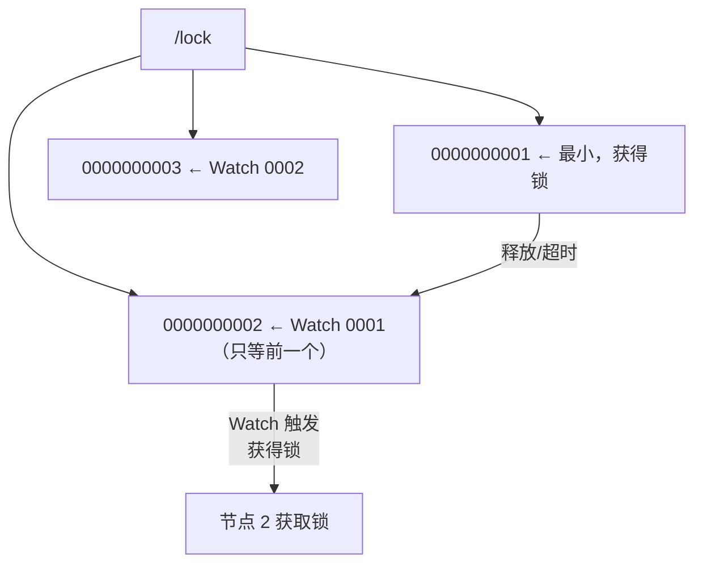
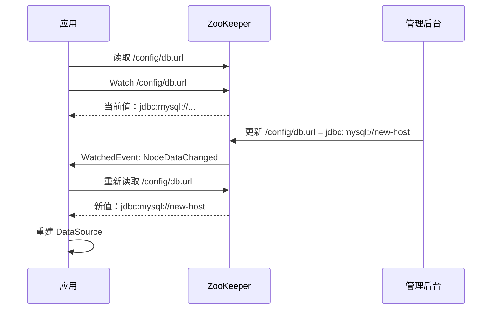
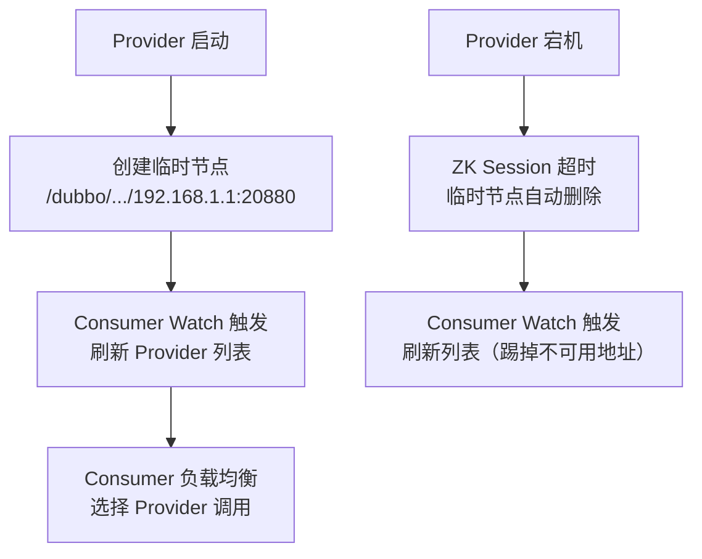

# 一、分布式锁——临时顺序节点方案

## 1.1 为什么不用"创建同名节点"？

```java
// ❌ 错误方案：所有线程抢创建同一个节点
// 问题：惊群效应——锁释放时所有等待者同时唤醒，只一个成功，其余继续等
```

## 1.2 正确方案：顺序临时节点



```java
// Curator InterProcessMutex（推荐）
InterProcessMutex lock = new InterProcessMutex(client, "/lock/order");
lock.acquire();
try {
    // 临界区
} finally {
    lock.release();
}
```

## 1.3 三种锁方案对比

| 方案 | 复杂度 | 惊群 | 可重入 | 推荐 |
|------|--------|------|--------|------|
| **临时顺序节点+Watch前驱** | 高 | 无 | 需自己实现 | ⭐⭐ |
| **Curator InterProcessMutex** | 低 | 无 | ✅ | ⭐⭐⭐⭐⭐ |
| **Redisson RedLock** | 中 | 无 | ✅ | ⭐⭐⭐⭐ |

---

# 二、配置中心——Watcher 驱动热更新

## 2.1 基本架构



## 2.2 代码实现

```java
// 配置监听
String path = "/config/db.url";
byte[] data = client.getData().usingWatcher((event) -> {
    if (event.getType() == Watcher.Event.EventType.NodeDataChanged) {
        byte[] newData = client.getData().forPath(path);
        refreshConfig(new String(newData));
    }
}).forPath(path);
```

## 2.3 Watcher 注意点

- **一次性触发**：Watcher 触发后即失效，必须重新注册
- **先通知后读**：`NodeDataChanged` 事件不含新值，需主动 getData
- **连接断开**：`Disconnected` 事件后 ZK 客户端自动重连，但期间配置无法更新
- **Curator 的 TreeCache** 自动处理以上问题，直接监听子树

---

# 三、服务发现——Dubbo 注册模型

## 3.1 ZK 节点结构

```
/dubbo
  /com.example.OrderService
    /providers
      /192.168.1.1:20880      ← 临时节点，提供者下线即删
      /192.168.1.2:20880
    /consumers
      /192.168.1.3            ← 临时节点
    /configurators            ← 路由规则
```

## 3.2 服务上下线流程



## 3.3 三种发现模型对比

| | ZooKeeper | etcd | Nacos |
|------|-----------|------|-------|
| **一致性** | CP（强一致） | CP（强一致） | AP+CP 可切换 |
| **健康检查** | Session 心跳 | Lease 续约 | 主动探活 + 临时实例 |
| **生态** | Dubbo/HBase/Kafka | K8s/CoreDNS | Spring Cloud Alibaba |
| **选型建议** | Java 存量项目 | 云原生/K8s | 国内微服务 |

---

# 四、ZooKeeper 常见问题

| 问题 | 原因 | 解法 |
|------|------|------|
| **Session Expired** | GC 停顿 / 网络闪断超过 `sessionTimeout` | 加大超时时间，减少 GC 停顿 |
| **临时节点残留** | Session 未到期但进程已退出 | ZK 3.6+ `multi` 操作用 `ephemeralOwner` |
| **Watcher 延迟** | 大量节点变更事件排队 | 避免 Watcher 过多，按需分散到子目录 |
| **磁盘快照膨胀** | 数据变更频繁，快照文件增大 | 定期 `zkCleanup.sh`，或增加 `autopurge` 配置 |

*本文参考资料：*
- Martin Kleppmann《Designing Data-Intensive Applications》（DDIA）——第 5 章（复制）、第 7 章（事务）、第 8-9 章（分布式系统与共识）
- Diego Ongaro, "In Search of an Understandable Consensus Algorithm (Raft)", 2014: https://raft.github.io/raft.pdf
- Leslie Lamport, "Paxos Made Simple", 2001
- antirez, "Is Redlock safe?", 2016: http://antirez.com/news/101
- Eric Brewer, "CAP Twelve Years Later", 2012
- Daniel Abadi, "PACELC", 2010
- Alibaba Seata 官方文档: https://seata.io/
- Redis 官方文档 - Distributed Locks: https://redis.io/docs/manual/patterns/distributed-locks/
