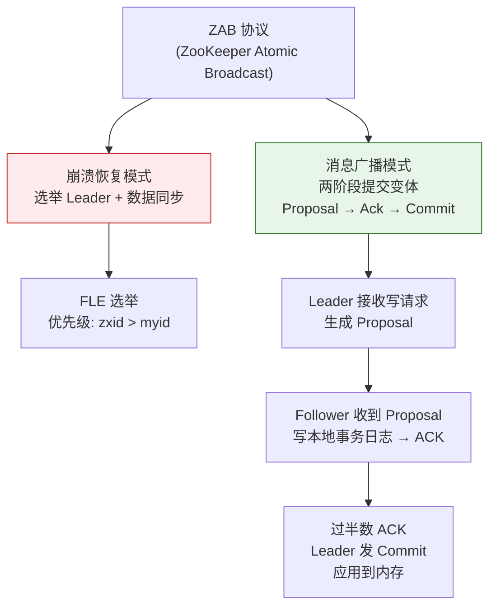
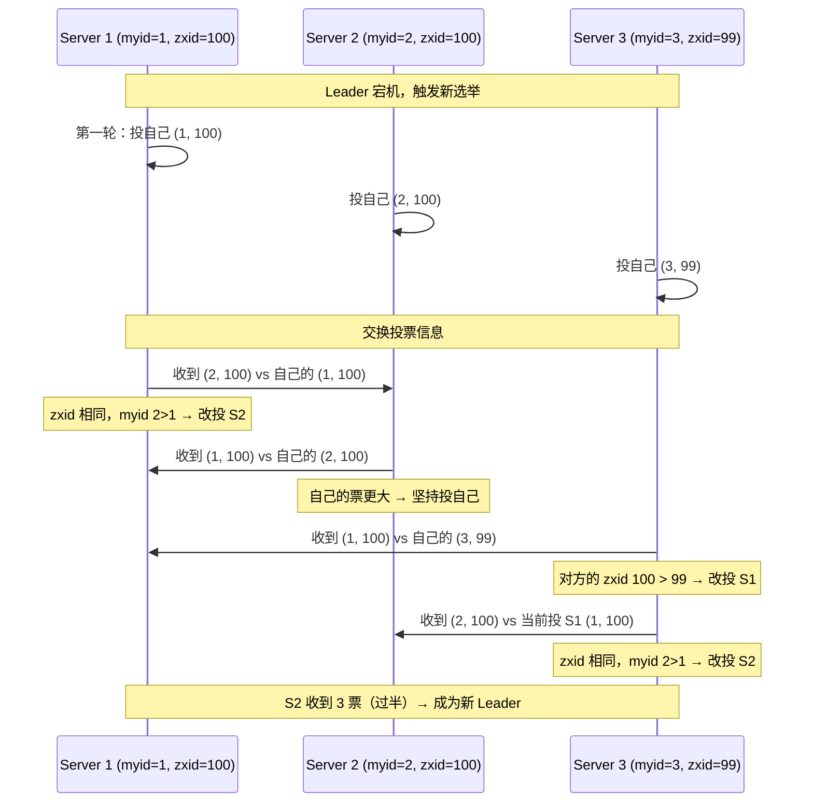
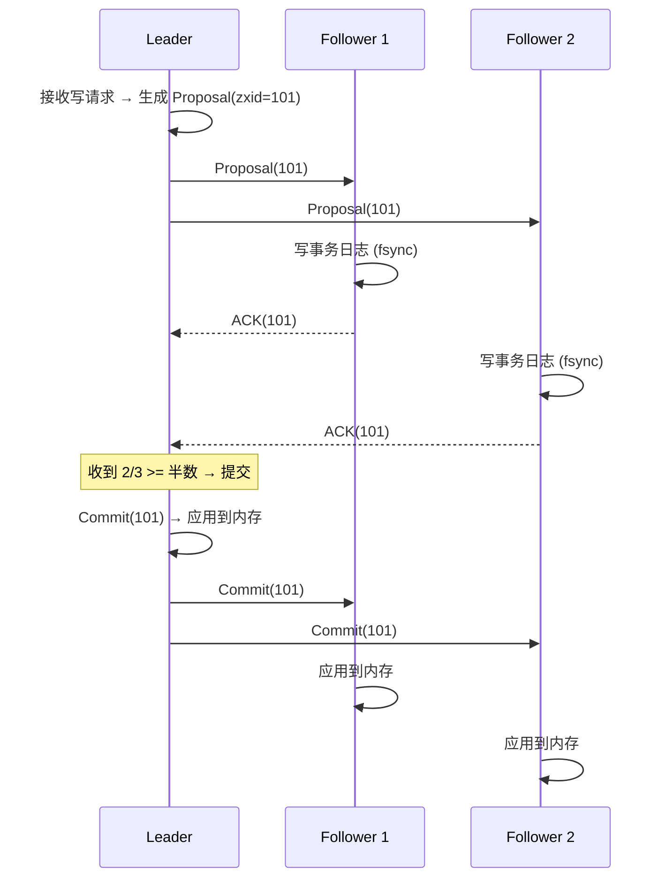

# 历史背景——Yahoo 为什么需要 ZooKeeper？

2006 年前后，Yahoo 内部有数十个分布式系统（搜索引擎、广告平台、内容管理……），每个都需要自己实现 Leader 选举、配置管理、分布式锁等基础能力。这些能力如果用数据库实现太重，如果每个团队从零写一遍又太浪费。于是 Yahoo Research 的工程师（Flavio Junqueira 和 Benjamin Reed 等）决定做一个**专门为分布式协调而生的轻量级服务**——ZooKeeper。

ZK 的设计哲学非常清晰：**用最简单的数据结构（类文件系统的树）和最少量的 API（create/get/set/delete/exists + Watcher），提供最硬的保证（顺序一致性 + 原子性 + 持久性）。**

其中，ZAB（ZooKeeper Atomic Broadcast）协议是 ZK 实现一致性的基石。它不像 Paxos 那样抽象难懂（Lamport 的 Paxos 论文发表近 10 年才被工程界广泛理解），也不像 Raft 那样强调可理解性（Raft 论文恰恰是 ZAB 协议之后才提出的），而是专为 ZK 场景设计的"实用派"共识协议。理解 ZAB，你就理解了为什么 ZK 能在几百台机器上稳定运行十几年。



---

# 一、ZAB 协议的两个模式

## 1.1 What：ZAB 是什么？

ZAB 是为 ZooKeeper 量身设计的一致性协议。它定义了集群在"正常运行时"和"异常恢复时"的两个行为模式。这个双模式设计对应了分布式系统最关键的两个问题：

- **正常运行**：如何高效地将写请求在所有节点间达成一致？
- **异常恢复**：Leader 宕机后，如何选出新 Leader 并确保数据不丢？

## 1.2 崩溃恢复（Crash Recovery）

```
触发条件：
  - Leader 宕机 / 网络分区隔离 / 集群刚启动

目标（ZAB 的"安全保证"）：
  ① 选出数据最新的节点作为新 Leader（避免数据回滚）
  ② 所有节点必须同步到一致状态：
     - 已提交（Commit）的事务 → 绝不能丢
     - 已提出（Proposal）但未提交的事务 → 必须回滚（因为客户端没收到 "OK"）
```

**关键的"已提交不丢"保证**：如果一个写请求已经被某个客户端收到 "OK" 响应（说明过半节点已经 ACK + Leader 发了 Commit），那这个写的结果在新 Leader 上任后必须还在。ZAB 通过 `zxid` 来保证这一点——选举时选 `zxid` 最大的节点为 Leader，确保新 Leader 拥有所有已提交的事务。

## 1.3 消息广播（Message Broadcast）

```
正常运行时（类比两阶段提交的简化版）：

  Leader 接收客户端写请求
    → 为请求分配递增的 zxid（事务 ID）
    → 生成 Proposal 广播给所有 Follower
    → Follower 将 Proposal 写入本地事务日志
    → Follower 返回 ACK
    → Leader 收到过半 ACK
    → Leader 发送 Commit 给所有 Follower（同时也 commit 自己）
    → 所有节点将该事务应用到内存数据结构（DataTree）

关键简化：ZAB 没有"Prepare"阶段（不像 Paxos 需要两阶段），
        因为 ZK 一次只有一个 Leader，不存在并发提案。
```

**为什么不需要 Prepare 阶段？**
- 标准 Paxos 需要 Prepare 是因为可能有多个 Proposer 并发提案
- ZK 的集群中只有 Leader 能发起提案（Follower 收到的写请求会转发给 Leader）
- 单一 Proposer + FIFO 信道 = Proposal 本身就是有序的，无需 Prepare 协商编号

这也是 ZAB 比标准 Paxos 高效的原因——省掉了一轮 RTT。

---

# 二、FLE——ZooKeeper 的 Leader 选举

## 2.1 What：FLE（Fast Leader Election）

FLE 是 ZK 3.4.0 后的默认选举算法（替代了早期的"LeaderElection"和"AuthFastLeaderElection"）。它的核心规则只有一条：

```
每个节点投票给 (myid, zxid)

比较规则（PK 优先级）：
  ① 先比 zxid：zxid 大的优先（谁数据最新谁当 Leader）
  ② zxid 相同时比 myid：myid 大的优先（确定性裁决，避免平局）
```

## 2.2 How：选举过程



**注意**：S3 的 myid=3 最大，但因为 zxid=99（比 S1 和 S2 少了 1 个已提交事务），所以没有资格当 Leader。**这不是"按号排辈"——只要你的数据不是最新，号再大也没用。** 这正是 ZAB 保证"已提交数据不丢"的关键机理。

## 2.3 选举轮次与 logicalclock

每轮选举增加一个 `logicalclock`（选举纪元）。它的作用是**区分不同的选举**：

- 节点收到更高 `logicalclock` 的投票 → 说明新一轮选举开始了 → 更新自己的 clock → 加入新一轮
- 节点收到更低 `logicalclock` 的投票 → 说明是旧轮次的投票 → 忽略

这防止了"上一轮的选票混入新一轮选举"。

---

# 三、消息广播——两阶段提交变体



**关键设计**：

1. **Follower 的 ACK 必须是顺序的**：ZK 在 Leader 和每个 Follower 之间维护了一个 FIFO 队列。Follower 必须按照 Proposal 的顺序（即 zxid 递增顺序）来 ACK。不能"后面的先 ACK，前面的跳过去"。

2. **Commit 可以乱序到达**：Commit 消息的发送是异步的，Follower 可以乱序接收。但 Follower 应用 Commit 时仍然按 zxid 顺序——因为 FIFO 队列保证了 Proposal 是顺序的，Commit 只需要等前面的都到了再一起应用。

3. **过半即提交**：不需要等所有 Follower 的 ACK，过半即可 Commit。这也是 ZK 集群推荐奇数节点（3/5/7）的原因——偶数节点比奇数多一个故障容忍，但多了一个节点的开销。

---

# 四、数据同步——新 Leader 如何追齐？

新 Leader 当选后，不能立刻开始服务。它需要先和所有 Follower 做一次**数据对齐**：

```
数据同步流程（New Leader Epoch）：

1. Leader 将当前最新 zxid 记为 newEpoch
2. Leader 向所有 Follower 发送 NEWLEADER 包（包含 newEpoch）
3. 每个 Follower 对比自己的最新 zxid：
   - 自己的 zxid < Leader 的 zxid → 接受同步
   - 自己的 zxid > Leader 的 zxid → 拒绝（理论上不应发生，FLE 保证了）
4. Leader 从自己的事务日志中找出 Follower 缺少的部分
5. 通过 Proposal + Commit 方式逐个同步给 Follower
6. 同步完毕 → Leader 发送 UPTODATE → Follower 可以参与投票
7. 全部 Follower 就绪 → 集群对外提供写服务

关键点：同步过程中，Leader 使用 Proposal + Commit 两阶段，
        而不是直接拷贝内存快照。这样 Follower 的事务日志
        和 Leader 保持完全一致（不仅是数据一致，日志结构也一致）
```

---

# 五、ZAB vs Raft

| | ZAB（ZK） | Raft（etcd） |
|------|-----------|------------|
| **选举优先级** | zxid > myid（数据最新的当 Leader） | Term + Log Index 更完整（更明确"完整"的定义） |
| **日志修复** | Leader 从自己日志复制差异部分 | Leader 强制覆盖 Follower 差异日志 |
| **读一致性** | Follower 可读（sync 操作保证） | 默认 Leader 读（linearizable read） |
| **成员变更** | 动态重配置（ZK 3.5+） | 联合共识（Joint Consensus） |
| **协议表述** | 无独立论文，散布在 ZK 论文和代码中 | 独立论文 + 可视化动画 |
| **设计哲学** | 实用主义，为 ZK 树形存储量身定制 | 可理解性优先，为了教学和实现正确性 |

---

# 六、总结

| 机制 | 核心原理 | 一句话 |
|------|---------|--------|
| **崩溃恢复** | 选 zxid 最大的节点为 Leader | 保证已提交数据不丢 |
| **消息广播** | 单 Leader 两阶段提交变体（无 Prepare） | 过半数 ACK 即 Commit |
| **FLE 选举** | zxid 优先，myid 确定性裁决 | 数据最新者当选，避免平局 |
| **数据同步** | Proposal + Commit 逐条对齐 | 保证事务日志全集群一致 |
| **logicalclock** | 选举纪元，隔离不同轮次 | 防止旧选票污染新选举 |

# 延伸阅读

**Do——动手验证：**
- 用 docker-compose 搭建 3 节点 ZK 集群，`kill -9` Leader 进程，观察 `zkServer.sh status` 的切换
- 写一个简单的 Java 客户端，创建临时顺序节点 + Watch 前驱，观察锁唤醒过程
- 用 `echo stat | nc localhost 2181` 查看 ZK 运行状态（zkxid、连接数等）

**Todo——深入方向：**
- [ ] ZAB 1.0（ZK 3.4）到 ZAB 2.0（ZK 3.5+）的协议改进（特别是成员变更）
- [ ] FLE 选举的性能分析：为什么 ZK 集群不推荐超过 7 个节点？
- [ ] ZK 事务日志（tlog）和快照（snapshot）的磁盘格式与恢复机制
- [ ] ZK 3.6+ 的 Observer 节点在跨数据中心部署中的角色

*本文参考资料：*
- Flavio P. Junqueira, Benjamin Reed《ZooKeeper: Distributed Process Coordination》——第 7-9 章（ZAB 协议）
- Patrick Hunt et al., "ZooKeeper: Wait-free coordination for Internet-scale systems" (USENIX ATC 2010)
- Diego Ongaro, "In Search of an Understandable Consensus Algorithm (Raft)" (2014)
- Apache ZooKeeper 官方文档 - ZAB Protocol: https://cwiki.apache.org/confluence/display/ZOOKEEPER/Zab1.0
