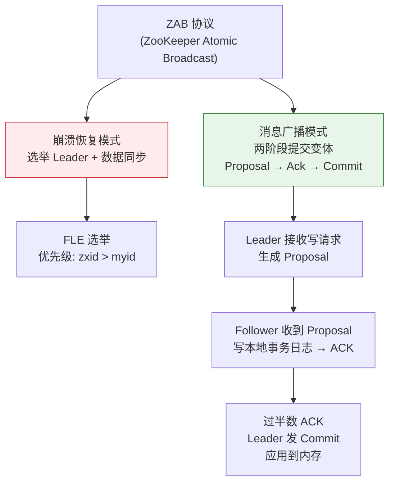
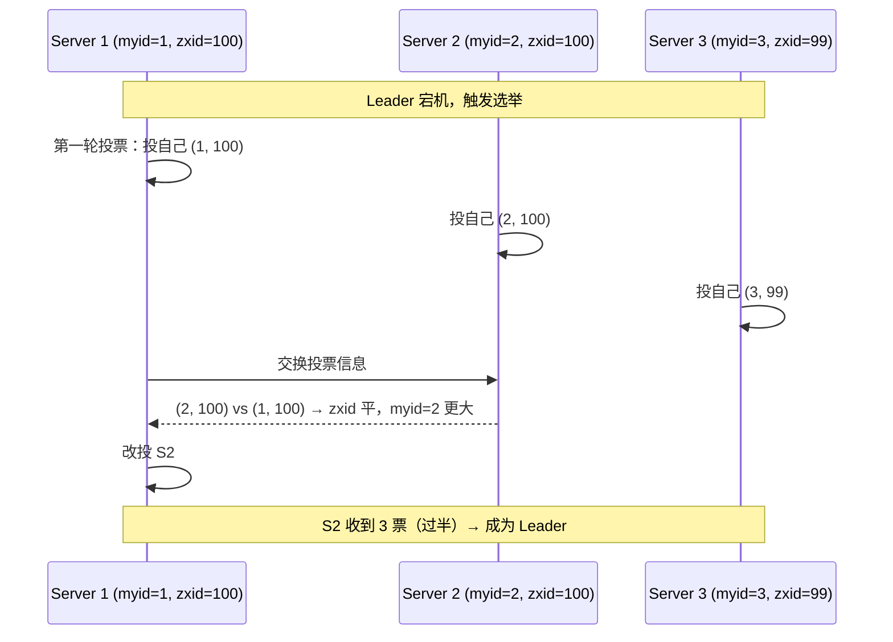
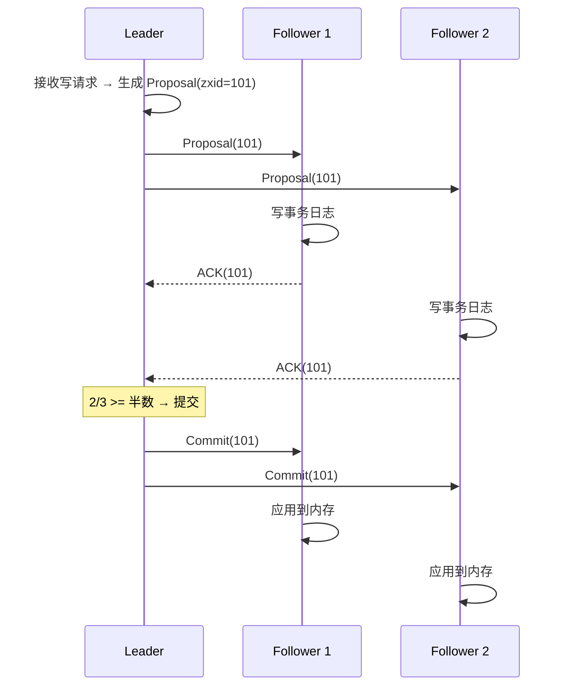

---

# 一、ZAB 协议的两个模式

## 1.1 崩溃恢复（Crash Recovery）

```
触发条件：
  - Leader 宕机 / 网络分区 / 集群刚启动
  
目标：
  1. 选举出新的 Leader
  2. 所有节点同步到一致状态（已提交的不丢、未提交的回滚）
```

## 1.2 消息广播（Message Broadcast）

```
正常运行时：
  Leader 接收客户端写请求
  → 生成 Proposal（带递增 zxid）
  → 广播给所有 Follower
  → Follower 写事务日志 + ACK
  → 过半 ACK → Leader 发 Commit
  → 所有节点应用到内存
```

---

# 二、FLE——ZooKeeper 的 Leader 选举

## 2.1 选举规则

```
每个节点投票：(myid, zxid)

比较规则：
  ① 先比 zxid：zxid 大的优先（数据最新）
  ② zxid 相同比 myid：myid 大的优先（确定性裁决）

结果：数据最新的节点成为 Leader
```

## 2.2 选举过程



## 2.3 FLE 选举轮次

每轮选举增加 `logicalclock`（选举纪元），确保不会混入旧轮投票。节点收到更高逻辑时钟的投票 → 更新自己的时钟 → 重新参与新一轮。

---

# 三、消息广播——两阶段提交变体



**关键设计**：
- Follower 的 ACK 顺序必须和 Proposal 顺序一致（FIFO 队列保证）
- Commit 可以乱序到达（异步应用）

---

# 四、数据同步——新 Leader 如何追齐？

新 Leader 当选后，需要确认所有节点有相同的已提交数据：

```
1. Leader 取最新 zxid（记为 newEpoch）
2. 向所有 Follower 发送 NEWLEADER 包（含 newEpoch）
3. Follower 对比自己的 zxid：
   - zxid <= Leader → 接受，等待同步
   - zxid > Leader → 拒绝（不应该发生，因为 FLE 保证了 zxid 最大者当选）
4. Leader 从自己的事务日志中找到 Follower 的 zxid 之后的所有操作
5. 通过 Proposal + Commit 方式同步给 Follower
6. 同步完成 → 服务可用
```

---

# 五、ZAB vs Raft

| | ZAB（ZK） | Raft（etcd） |
|------|-----------|------------|
| **选举优先级** | zxid > myid | Term + Log Index 更完整 |
| **日志修复** | Leader 从自己日志复制差异 | Leader 强制覆盖 Follower |
| **读一致性** | Follower 可读（sync 保证） | 默认 Leader 读（linearizable） |
| **协议复杂度** | 无正式论文 | 有完整论文和动画 |

*本文参考资料：*
- Neha Narkhede et al.《Kafka: The Definitive Guide》（第 2 版）——第 1-6 章（架构、生产者、消费者、内部机制）
- Apache Kafka 官方文档 - Design 章节: https://kafka.apache.org/documentation/#design
- Apache ZooKeeper 官方文档: https://zookeeper.apache.org/doc/current/
- Flavio P. Junqueira, Benjamin Reed《ZooKeeper: Distributed Process Coordination》
- Linux 内核文档 - sendfile(2) / mmap(2) / Page Cache
- KIP-500: Replace ZooKeeper with a Self-Managed Metadata Quorum (KRaft)
