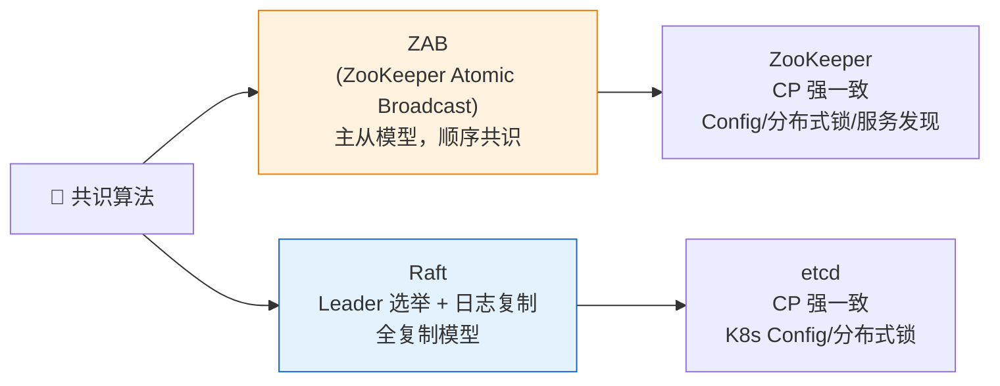
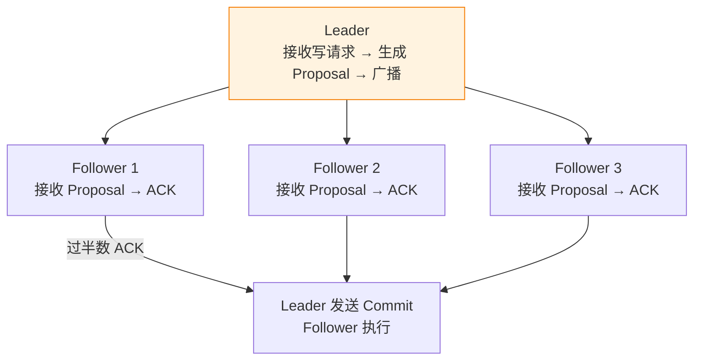
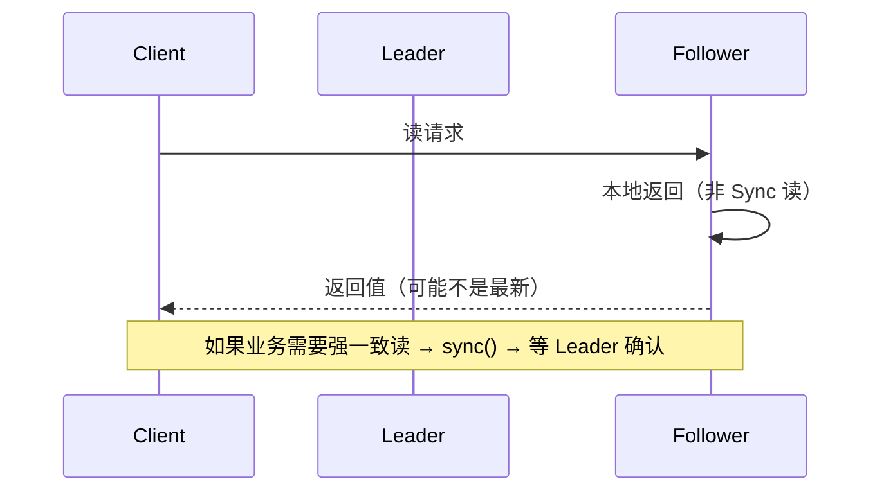

---

# 一、ZAB 与 Raft 的分道扬镳

ZooKeeper 诞生于 2010 年，那时的共识算法只有 Paxos——出了名的难懂。ZooKeeper 团队设计了 **ZAB（ZooKeeper Atomic Broadcast）** 作为自己的共识协议。

etcd 诞生于 2013 年，正好赶上 Raft 的发布。Raft 的设计目标就是"可理解的共识算法"，etcd 团队顺理成章选了它。

两个协议有很多相似之处：都是 Leader-based，都有 Term（ZAB 叫 Epoch），都有 Quorum 提交。但设计哲学和实现细节的差异，导致了它们在工程特性上的不同选择。

---

# 二、主从模型 vs 全复制模型——最本质的区别

## 2.1 ZAB：Follower 不参与投票，只接收 Leader 广播



ZAB 是一个**主从复制协议**封装成的共识算法。写操作必须先到 Leader，由 Leader 广播，Follower 只 ACK 不主动参与。

## 2.2 Raft：Leader 也是复制者，但 Follower 可以成为 Leader

Raft 更强调"平等性"——每个节点在数据上是平等的。Leader 只是临时的角色，任何 Follower 都可以通过选举成为 Leader。

| | ZAB | Raft |
|------|-----|------|
| **模型** | 主从广播 | Leader 复制 |
| **Follower 角色** | 被动接收 | 可以选举成为 Leader |
| **写路径** | 必须经过 Leader | 必须经过 Leader（相同） |
| **读路径** | Leader 或 Follower（sync 后） | 默认 Leader（linearizable read） |

---

# 三、选举机制——为什么 ZK 的选举那么重？

## 3.1 ZooKeeper：FLE（Fast Leader Election）

```
ZK 选主 = 每个节点投票给自己 → 广播 (sid, zxid)
规则：优先选 zxid 最大的（数据最新），zxid 相同选 sid 最大
需要：至少过半节点参与才能完成 → 节点多时选举较慢
```

ZK 选举是**重量级的**——它要求多数节点互相对比 zxid，需要多轮消息交换。这就是为什么 ZK 集群推荐 3 或 5 个节点，不宜更多。

## 3.2 etcd/Raft：随机超时

```
每个节点随机 150ms-300ms 的超时 → 先超时的发起 RequestVote
如果 Candidate 日志不比 Follower 旧 → Follower 投票
```

选举轻量——轮次少，逻辑简单。但随机超时意味着**选主时间不可预测**（虽然通常几十毫秒内完成）。

| | ZK (FLE) | etcd (Raft) |
|------|----------|------------|
| **选举机制** | 基于 zxid 的多轮投票 | 随机超时 + RequestVote |
| **选举速度** | 慢（多轮通信） | 快（通常一轮） |
| **选举开销** | 高 | 低 |
| **适合规模** | 3-5 节点 | 3-7 节点 |

---

# 四、为什么 ZK 坚持主从模型？

## 4.1 ZooKeeper 的读路径



ZK 的 Follower 可以直接处理读请求（不用经过 Leader），这得益于主从模型——Follower 拥有完整数据副本，读操作可以水平扩展。

**代价**：默认读可能返回过期数据（非 Sync 读）。需要 `sync()` 才能保证读到最新。

## 4.2 etcd 的读路径

etcd 默认所有读都经过 Leader（linearizable read），保证读到的一定是最新。代价是 Leader 成为读瓶颈。

> **ZK 选择了主从模型以支持 Follower 读扩展，etcd 选择了 Raft 的全复制模型以保证默认读一致。**

---

# 五、两协议的核心对比

| | ZAB（ZK） | Raft（etcd） |
|------|-----------|------------|
| **模型** | 主从广播 | Leader 复制 |
| **读扩展** | ✅ Follower 可读 | ❌ 默认读 Leader |
| **写路径** | Leader → Quorum ACK → Commit | Leader → AppendEntries → Quorum → Commit |
| **选举** | FLE，更重 | 随机超时，更轻 |
| **成员变更** | 手动或动态配置 | Joint Consensus（更优雅） |
| **可理解性** | 中（无正式论文） | 高（有完整论文+动画） |
| **适用场景** | 配置中心、服务发现、分布式锁 | K8s 配置、服务发现、分布式锁 |

---

# 六、为什么不是"谁对谁错"，而是"适合不同的生态"？

ZK 诞生时没有一个"好用的共识库"。ZAB 是"为了解决 ZooKeeper 的问题而设计"的定制协议，天然耦合 ZooKeeper 的主从架构。

etcd 诞生时 Raft 论文刚发布，etcd 团队可以直接用 Raft，省去了设计自己协议的成本。etcd 还把 Raft 独立成一个 Go 库（`etcd-io/raft`），推动了 Raft 在业界的普及（TiKV、CockroachDB 等都用它）。

> **ZAB 和 Raft 都是正确的共识算法。选 ZK 还是 etcd，和 ZAB 还是 Raft 关系不大——更重要的是：你用 Java 生态还是 Go 生态？你需要 Follower 读扩展吗？你已经有了 ZK 集群吗？**

---

# 七、总结

| 结论 | 说明 |
|------|------|
| **ZAB 是主从广播，Raft 是全复制** | ZK 可以 Follower 读，etcd 默认读 Leader |
| **选举：FLE 重但确定，Raft 快但随机** | ZK 选举开销大，etcd 选举快但不可预测 |
| **没有谁更优，只有谁更合适** | Java 生态→ZK，Go/K8s 生态→etcd |
| **两个都是 CP 系统** | 都牺牲了可用性来保证一致性 |

*本文参考资料：*
- Martin Kleppmann《Designing Data-Intensive Applications》（DDIA）——第 5 章（复制）、第 7 章（事务）、第 8-9 章（分布式系统与共识）
- Diego Ongaro, "In Search of an Understandable Consensus Algorithm (Raft)", 2014: https://raft.github.io/raft.pdf
- Leslie Lamport, "Paxos Made Simple", 2001
- antirez, "Is Redlock safe?", 2016: http://antirez.com/news/101
- Eric Brewer, "CAP Twelve Years Later", 2012
- Daniel Abadi, "PACELC", 2010
- Alibaba Seata 官方文档: https://seata.io/
- Redis 官方文档 - Distributed Locks: https://redis.io/docs/manual/patterns/distributed-locks/
