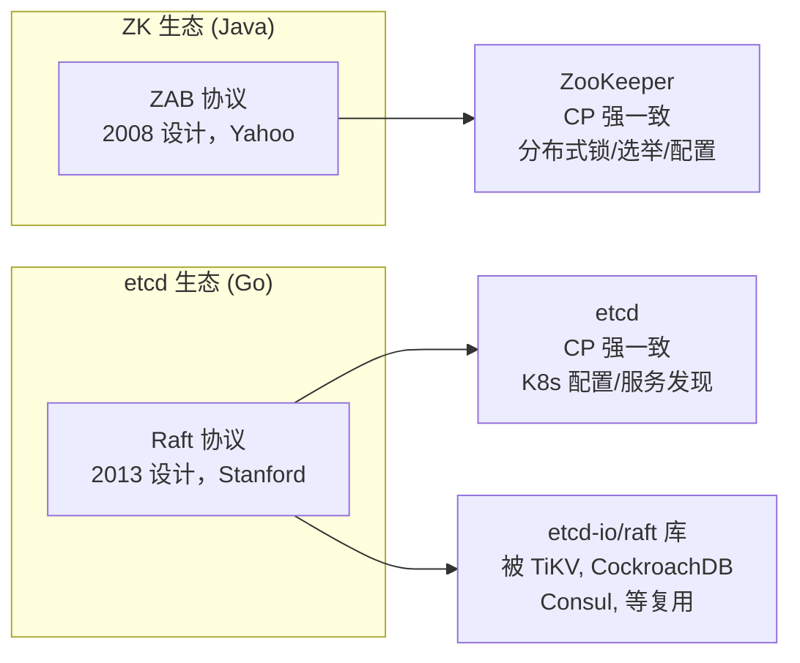
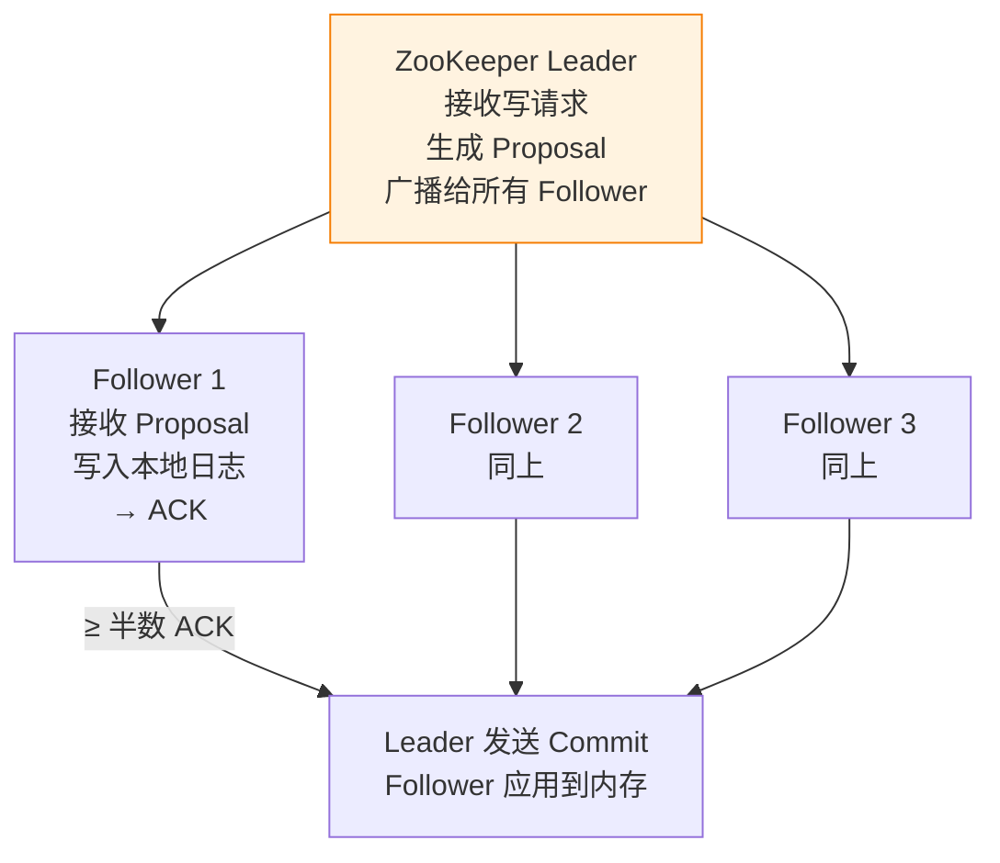

# 一、2008 年的 Yahoo 和 2013 年的 CoreOS——两个时空，两个选择

2008 年，Yahoo 的工程师需要为内部的分布式协调服务选一个共识算法。Paxos 是唯一的选择——但 Paxos 以"难懂"著称，当时没有可以直接引用的 Paxos 库。ZooKeeper 团队决定设计自己的共识协议——**ZAB（ZooKeeper Atomic Broadcast）**。

2013 年，CoreOS 的工程师需要为他们的分布式配置存储选一个共识算法。正好 Diego Ongaro 刚发表了 Raft 论文，附带一个开源的 Go 实现。CoreOS 团队直接用 Raft 构建了 **etcd**。

**这两个时间点决定了两种共识协议在工程世界中的分野。**

理解这个背景很重要：ZAB 不是"不知道 Raft 好所以不用"，而是 **Raft 还不存在**。etcd 不是"嫌弃 Raft 不够好所以自研 ZAB"，而是 **Raft 恰好是最佳时机出现的最合适的方案**。



---

# 二、主从广播 vs Leader 复制——最本质的区别

## 2.1 ZAB（ZooKeeper Atomic Broadcast）

ZAB 是一个**主从模型**封装成的共识协议。Leader 接收写请求 → 生成 Proposal → 广播给 Follower → Follower 收到后 ACK → 半数以上 ACK → Leader 发送 Commit。



**ZAB 的核心特征**：
- Follower 是被动的——不参与写决策，只接收和 ACK
- Leader 负责生成 Proposal（包含 zxid）、广播、收集 ACK、发送 Commit
- Follower 拥有完整的数据副本，可以处理读请求（但可能读到过期数据）

## 2.2 Raft (etcd)

Raft 是一个**全复制模型**——在数据结构上所有节点平等，Leader 只是临时的角色。

Raft 的机制在 [Raft 共识算法图解](/posts/分布式/raft共识算法图解从选主到日志复制/) 中有详细推演。这里只做对比：

| | ZAB（ZK） | Raft（etcd） |
|------|-----------|------------|
| **模型** | 主从广播——Leader 生成 Proposal，Follower ACK | Leader 复制——Leader 发 AppendEntries，Follower 被动追加 |
| **Follower 角色** | 被动（不能成为写发起者） | 平等（可以选举为 Leader） |
| **写路径** | Client → Leader → Proposal → 广播 → ACK → Commit | Client → Leader → AppendEntries → Quorum → Commit（实际类似） |
| **读路径** | Follower 可直接读（不需 Leader） | 默认读 Leader（linearizable read） |
| **读扩展** | ✅ 水平扩展 | ❌ Leader 是瓶颈 |
| **读一致性** | 可能读到过期（需 `sync()` 保证最新） | 保证读到最新（每个读都要向 Quorum 确认 Leader 身份） |

---

# 三、选举机制——FLE 的确定性 vs Raft 的随机性

## 3.1 ZooKeeper 的 FLE（Fast Leader Election）

```
FLE 选主流程：
1. 每个节点投票给自己（sid, zxid）
2. 广播投票给所有节点
3. 收到其他节点的投票后，选择 zxid 最大的节点作为投票对象
   - zxid 相同 → 选 sid 最大
4. 重新广播新的投票
5. 重复直到一个节点获得多数票
```

**FLE 是确定性的**——给定相同的（sid, zxid）分布，选举结果总是相同的。不会出现 Raft 那种"先超时的当选"的不确定性。

**代价**：
- 通常需要**多轮通信**（每个节点收到别人的投票后可能改变自己的投票）
- 每轮都是全网广播（O(N²) 消息）
- 这就是为什么 ZK 推荐 3-5 个节点，不宜更多

## 3.2 Raft 的随机超时

```
Raft 选主流程：
1. Follower 随机 150-300ms 超时
2. 先超时的 → 转 Candidate → 广播 RequestVote
3. 拿到多数票 → 成为 Leader（通常一轮）
```

**Raft 是概率性的**——先超时的当选。通常快（一轮 RTT），但理论上可能多轮（如果选票瓜分）。

| | ZK (FLE) | Raft 选举 |
|------|----------|------------|
| **确定性** | 确定（zxid 大者胜） | 概率（先超时者胜） |
| **轮数** | 通常 2-3 轮 | 通常 1 轮 |
| **消息量** | 多轮全网广播 O(N²) | 一轮广播 O(N) |
| **选举延迟** | 较慢 | 较快 |
| **适合规模** | 3-5 节点 | 3-7 节点 |

---

# 四、读路径——水平扩展 vs 默认强一致

这是 ZK 和 etcd 在**正常运行场景**下最显著的差异（用 [PACELC](/posts/分布式/分布式一致性模型cap不是二分法paclec才是工程指导/) 框架来说，就是 E 分支的选择不同）。

## 4.1 ZooKeeper 的 Follower 读

```
Client → Follower → 本地返回（可能不是最新数据）
```

ZK 的 Follower 拥有完整数据副本，可以直接处理读——不需要经过 Leader。这实现了读操作的**水平扩展**：

- 3 节点 ZK → 2 个 Follower 可以分摊读负载
- 对于读多写少的配置中心场景，这很理想

**代价**：默认读（非 sync 读）可能返回过期数据。如果业务需要强一致读，调用 `sync()` 等待 Leader 确认——但这个等待引入了额外的 RTT。

## 4.2 etcd 的 linearizable read

```
Client → etcd (任意节点) → 转发到 Leader → Leader 向 Quorum 确认自己还是 Leader → 返回
```

etcd 的默认读**经过 Leader 且需要 Quorum 确认 Leader 身份**。保证了读到的绝对是最新——但 Leader 成为瓶颈。

**ZK vs etcd 的读路径对比：**

```
                ZK                              etcd
Client          → Follower (直接返回)           → Leader (Quorum 确认后返回)
延迟            低                              较高
吞吐            可水平扩展                       Leader 瓶颈
一致性          可能读到过期（非 sync）           绝对最新
```

**为什么 ZK 敢让 Follower 读？** 因为 ZK 的主从模型保证了 Follower 拥有完整副本。ZAB 的广播机制确保 Follower 最终会收到所有 Committed Proposal——只是可能晚几个毫秒。

**为什么 etcd 坚持 Leader 读？** Raft 的设计哲学认为，读也要保持线性一致性——"读操作读到的是最近一次写之后的状态"。这在理论上更优雅，但需要 Leader 每次读都要 Quorum 确认。

---

# 五、没有谁对谁错——不同时间点的最优选择

| | ZooKeeper (ZAB) | etcd (Raft) |
|------|-----------|------------|
| **诞生** | 2008，Yahoo 内部 | 2013，CoreOS |
| **设计动机** | 需要一个能用的共识协议（没有现成的） | 有一个"可理解的共识算法"刚发表 |
| **语言生态** | Java | Go |
| **最大优势** | Follower 读扩展 + 成熟稳定 | 可理解性 + etcd-io/raft 库复用 |
| **最大劣势** | ZAB 没有独立论文和库（和 ZK 耦合） | 读都经过 Leader，水平扩展受限 |
| **典型场景** | Java 生态的分布式锁、选举、配置 | K8s 配置存储、TiKV 底层共识 |

**结论**：

- **如果你在 Java 生态，已有 ZK 集群** → 继续用 ZK。它的稳定性和 Follower 读扩展是优势
- **如果你在 Go 生态，或者在做新的分布式系统** → Raft。etcd-io/raft 库让你不用自己实现共识
- **如果你需要极致的一致性保证（读也必须一致）** → etcd/Raft（默认 linearizable read）
- **如果你需要高读吞吐，且能接受毫秒级的读延迟** → ZK（Follower 读）

---

# 六、总结

```
ZAB 和 Raft 都是正确的共识算法。它们的差异不是对错之分，而是：

1. 时间点的差异 —— ZK 诞生时 Raft 还不存在
2. 设计哲学的差异 —— 主从广播（ZAB） vs Leader 全复制（Raft）
3. 读策略的差异 —— Follower 读扩展（ZK） vs 默认 Leader 强一致读（etcd）
```

> 两个算法都保证了：Quorum-based 写提交、Leader 驱动的日志广播、多数派确认的安全语义。理解共识算法，最好的路径是理解 [Raft](/posts/分布式/raft共识算法图解从选主到日志复制/) 再看 ZAB——从"主从共识"的角度重新理解 Raft，比直接看 ZAB 论文更高效。
