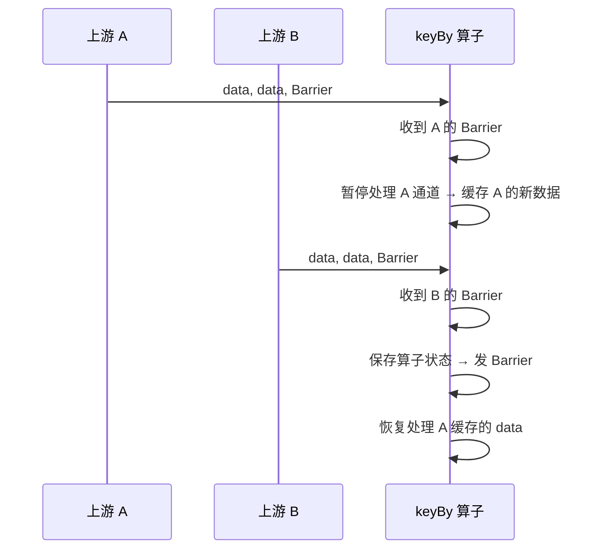
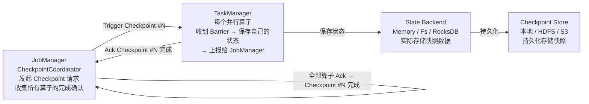
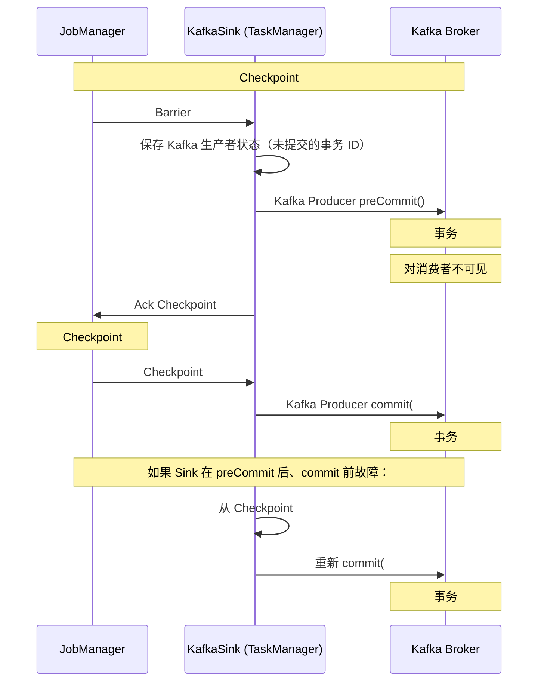

# 历史背景——Flink 为什么重新定义了流处理？

2014 年，Berlin 工业大学的一个研究项目"Stratosphere"被捐献给 Apache 基金会，改名 Apache Flink。当时流处理领域由 Spark Streaming 主导，但 Spark Streaming 有一个很多人没有意识到的问题：**它本质上是微批处理（micro-batch）**——把流切成一个个小批次（batch interval，默认 1 秒），每个批次内部当离线批处理来做。这导致了从数据到达 Spark 到被输出的**端到端延迟至少是秒级**。

Flink 的核心理念是：**流的本质不是"每秒切一次"，而是"数据一到达就处理"**。这个理念体现在架构的每一个角落——基于 Chandy-Lamport 算法的分布式快照、事件时间驱动的 Watermark 机制、毫秒级的低延迟 Checkpoint。2019 年阿里收购 Flink 母公司 Data Artisans 后，Flink 在国内流处理领域的市占率爆炸式增长。今天，Flink 面试题已经从"Flink 是什么"变成了"Checkpoint 的 Barrier 对齐怎么做的"——本文覆盖这个深度的全部知识点。

---

# 一、Flink vs Spark Streaming：流批的根本分歧

## 1.1 执行模型的本质差异

```
Spark Streaming（微批处理）：
  数据进入 → 攒够一个 batch interval（1 秒）→ 把这个 batch 当离线批处理
  → 端到端延迟 ≥ batch interval（最少 1 秒）
  → 本质：用批处理引擎模拟流处理

Flink（真流处理）：
  数据进入 → 立即处理 → 立即输出
  → 端到端延迟 = 实际计算时间（毫秒级）
  → 本质：流处理是第一公民，批处理是"有限流"的特例
```

## 1.2 流批统一——Flink 1.12+ 的终极形态

Flink DataStream API（有界流）和 DataSet API（批处理）在 1.12 之后统一为 DataStream API——批处理本质上就是"数据源有终点的流处理"：

```java
// 流处理（无界流）
env.addSource(new FlinkKafkaConsumer<>(...))   // Kafka 源源不断
   .keyBy(...)
   .window(TumblingEventTimeWindows.of(Time.seconds(5)))
   .reduce(...)
   .addSink(...);

// 批处理（有界流——同一个 API）
env.readTextFile("hdfs://data/*.log")           // 文件读完即终止
   .keyBy(...)
   .window(...)
   .reduce(...)
   .print();
// 同一套 API，只是数据源不同——这就是"流批统一"
```

## 1.3 四个执行图的层级

```
StreamGraph (用户 API 层面)
  → 每个算子是一个 node，每个 DataStream 连接是 edge
  
JobGraph (优化后，提交给 JobManager)
  → 把能串在一起的算子合并为 OperatorChain（减少线程切换和网络开销）
  → JobVertex = 合并后的一串算子
  → 例如：Source → map → filter 可以链化成一条 JobVertex

ExecutionGraph (JobManager 调度执行)
  → 每个 JobVertex 拆成多个并行度的 ExecutionVertex
  → 例如：map 算子并行度=4 → 4 个 ExecutionVertex

物理执行计划 (TaskManager 实际部署)
  → 每个 ExecutionVertex 对应一个 Task
  → TaskManager 上的 Slot 承载多个 Task
```

---

# 二、Checkpoint——Flink Exactly-Once 的核心

## 2.1 Chandy-Lamport 算法的白话解释

1985 年，Chandy 和 Lamport 发明了"分布式快照"算法。它的核心思想是：**不需要暂停整个系统来做快照**，而是通过插入一个特殊的"标记"在数据流中传递，让每个算子看到这个标记时给自己拍个快照。

Flink 给这个标记起的名字叫 **Checkpoint Barrier**。

```
正常数据流：
  Source → [1,2,3,4,5,6,7,8...] → map → keyBy → window → Sink

插入 Checkpoint Barrier（简化）：
  Source → [1,2,Barrier#3,3,4,Barrier#4...] → map → keyBy → window → Sink

当 map 收到 Barrier#3 → 暂停处理 Barrier#3 之后的数据 → 保存自己的状态
  → 把 Barrier#3 传递给 keyBy → keyBy 也保存状态 → ... → Sink 也保存状态
  → 所有算子都对 Barrier#3 保存了状态 → Checkpoint#3 完成！
```

## 2.2 Barrier 对齐——多上游算子的棘手场景

`keyBy` 之后，一个算子可能同时接收多个上游的数据流。每个上游的 Barrier 到达时间不同：

```
上游 A: [data... Barrier#5 data...]
上游 B: [data... data... data... Barrier#5]

keyBy 这个算子面对的困境：
  A 的 Barrier#5 先到了 → keyBy 暂停处理 A 后面的数据（缓存 A 发来的新数据）
  → 继续正常处理 B 没有 Barrier 的数据（因为 B 的 Barrier#5 还没到）
  → B 的 Barrier#5 也到了 → 对齐完成 → keyBy 做快照 → 把 Barrier#5 发给下游
  → 恢复处理 A 之前缓存的数据

这个暂停处理 = "Barrier 对齐"
```



**Exactly-Once 的代价**：在 Barrier 对齐期间，A 的数据被暂时缓存，不处理——增加了 A 通道的延迟。这就是为什么 Flink 有"Barrier 对齐反压"的说法——如果 Checkpoint 间隔太短，对齐的频率太高，数据在通道的缓存中堆积，吞吐下降。

**At-Least-Once 模式——不对齐**：对延迟极敏感的场景可以关闭 Barrier 对齐。算子收到任何一个上游的 Barrier 就立刻做快照，不等其他上游。这样没有"缓存堆积"的延迟，但快照包含了未对齐的中间状态——故障恢复时可能重复消费一部分数据（At-Least-Once 语义）。

## 2.3 Checkpoint 的四大组件



**Checkpoint 流程的精确时序**：

```
1. JM 的 CheckpointCoordinator 在所有 Source 中注入 Barrier#N
2. Barrier#N 随数据流向下游传播
3. 每个算子收到 Barrier#N → 触发 Checkpoint：
   a. 在 STATE 中保存当前算子的状态快照
   b. 将 Barrier#N 发送给下游
   c. 向 JM Ack
4. JM 收到所有算子的 Ack → Checkpoint#N 标记为"已完成"
5. 故障恢复时，所有算子从最近一次已完成的 Checkpoint 恢复状态
```

## 2.4 增量 Checkpoint——RocksDB 的"只存变了的部分"

默认的 FsStateBackend 每次 Checkpoint 存全量数据。对于状态很大的作业（如表 Join 状态 > 10GB），全量保存不可接受。

RocksDB 增量 Checkpoint 解决了这个问题：

```
第一次 Checkpoint（全量）：
  RocksDB 的所有 SST 文件 → 存入 Checkpoint 存储 (如 10GB)

第二次 Checkpoint（增量）：
  RocksDB 新生成的 SST 文件（自上次 Checkpoint 以来的变更）→ 只存这些新增文件
  → 可能只有 100MB！

恢复时：
  Flink 从最近的增量 Checkpoint 加上上一次的全量 Checkpoint 重建完整状态
```

## 2.5 Savepoint vs Checkpoint

| | Checkpoint | Savepoint |
|------|-----------|----------|
| **触发方式** | Flink 自动（按时间间隔） | 用户手动触发（`bin/flink savepoint`） |
| **存储格式** | RocksDB 增量（内部格式） | 规范的自包含格式 |
| **保留策略** | 过期后自动清理 | 永久保留，用户手动删除 |
| **用途** | **故障恢复**（Flink 自动回退到最近的 Checkpoint） | **运维**（升级 Flink 版本、调整并行度、A/B 测试） |
| **可否更改并行度** | ❌ 通常不能（绑定了并行度） | ✅ 可以（用 `-p` 参数修改后恢复） |

---

# 三、Watermark——乱序世界的"时钟"

## 3.1 为什么需要 Watermark？

流处理中最棘手的问题是"数据可能晚到"。典型的移动端场景：用户在 10:00:00 点击一个按钮，手机立刻生成事件（event_time=10:00:00），但手机恰好在隧道里没信号——这个事件在网络恢复后（10:05:00）才发到 Kafka，被 Flink 消费。此时 Flink 的系统时钟是 10:05:00，但事件本身应该在 10:00:00 被统计。

```
系统时间 vs 事件时间：
  系统时间 (Processing Time)：Flink 收到这条数据的时间 = 10:05:00
  事件时间 (Event Time)：事件实际发生的时间      = 10:00:00

  如果用系统时间开窗 → 这条数据进入 10:05:00 的窗口 → 统计错误！
  如果用事件时间开窗 → 这条数据正确进入 10:00:00 的窗口 → 需要 Watermark 来判断"10:00 这个窗口什么时候可以关了"
```

## 3.2 Watermark 的生成与传播

Watermark 是 Flink 告诉每个算子"事件时间已经推进到了 T 时刻，T 之前的数据应该都到了"的一种机制：

```java
// 策略 1：固定延迟 Watermark（最常用）
WatermarkStrategy.<Event>forBoundedOutOfOrderness(Duration.ofSeconds(5))
    .withTimestampAssigner((event, timestamp) -> event.getEventTime());

// 含义：
// Watermark = 当前收到的最大事件时间 - 5 秒
// 如果 Watermark 推进到了 10:05:00 → 说明 10:00:00 及之前的事件"应该都到了"
// → 可以关闭结束时间 ≤ 10:00:00 的窗口
```

```
Watermark 在多并行度下的传播：
  Source[1]: event_time max=10:01:00 → Watermark=10:00:55 (max - 5s)
  Source[2]: event_time max=10:02:30 → Watermark=10:02:25
  Source[3]: event_time max=10:00:30 → Watermark=10:00:25

  下游 keyBy 算子收到三个 Watermark：
  → 取最小值！min(10:00:55, 10:02:25, 10:00:25) = 10:00:25
  → 所有上游中最慢的那个决定了整体进度
  → 这就是为什么一个慢的 partition 会拖慢所有窗口的输出
```

## 3.3 乱序处理的三重保障

```java
WatermarkStrategy.<Event>forBoundedOutOfOrderness(Duration.ofSeconds(5))  // 第一重：推迟 Watermark
    .withIdleness(Duration.ofMinutes(1))                                   // 第二重：空闲源检测
    .withTimestampAssigner(...);
```

**第一重：延迟 Watermark**（`forBoundedOutOfOrderness`）。Watermark 比最大事件时间延迟 5 秒，允许 5 秒以内的乱序数据。

**第二重：空闲源检测**（`withIdleness`）。如果某个 Kafka partition 长时间没有数据（1 分钟），Flink 不再考虑它的 Watermark——避免空闲 partition 拖慢全体的窗口计算。

**第三重：侧输出迟到数据**（`allowedLateness + sideOutputLateData`）。延迟超过最大容忍窗口的数据直接丢弃到侧输出流，不影响主流的窗口计算：

```java
DataStream<Event> mainStream = stream
    .keyBy(Event::getKey)
    .window(TumblingEventTimeWindows.of(Time.minutes(1)))
    .allowedLateness(Time.minutes(2))     // 窗口触发后还允许 2 分钟的迟到数据
    .sideOutputLateData(lateTag)           // 2 分钟后仍迟到的 → 侧输出
    .aggregate(...);

// 从侧输出流取出被丢弃的数据，做独立处理（如写入死信队列）
DataStream<Event> lateStream = mainStream.getSideOutput(lateTag);
```

---

# 四、Exactly-Once——Checkpoint + 两阶段提交

## 4.1 Exactly-Once 的两层含义

Exactly-Once 在 Flink 中是**分层**保证的：

```
第一层：Flink 内部的 Exactly-Once（算子状态）
  → 由 Checkpoint 机制保证，故障恢复时状态回滚到最近成功的 Checkpoint

第二层：端到端 Exactly-Once（Source → Flink → Sink）
  → 需要 Source 支持重放（Kafka 可以重置 offset）
  → 需要 Sink 支持事务（Kafka 的事务生产者、HDFS 的 rename）
  → 由 TwoPhaseCommitSinkFunction 机制保证
```

## 4.2 两阶段提交——Sink 端的 Exactly-Once

以 Kafka Sink 的两阶段提交为例（FlinkKafkaProducer）：



**两阶段提交的关键步骤**：

```
① preCommit（准备阶段）：
   Sink 把当前未提交的事务（transaction ID + 部分数据）保存到 Checkpoint 中
   → Checkpoint 完成后，事务数据被持久化

② commit（提交阶段）：  
   只有 Checkpoint 成功（所有算子 Ack）后，Sink 才真正 Commit 事务
   → 如果提交前故障 → 从 Checkpoint 恢复 → 重放未提交的事务 → 最终只提交一次

③ abort（回滚阶段）：
   Checkpoint 失败（某个算子没 Ack）→ 本次事务 abort → 数据不写
```

## 4.3 Exactly-Once 不是免费的

```
代价 1：延迟增加
  Sink 必须等到 Checkpoint 完成才提交 → 数据输出延迟至少一个 Checkpoint 间隔
  → Checkpoint 间隔设 10s = 数据输出延迟 ≥ 10s

代价 2：事务性依赖
  Source 必须支持 offset 重置（Kafka ✓）
  Sink 必须支持事务（Kafka ✓, HDFS ✓, MySQL ✗）
  → MySQL Sink 如何实现 Exactly-Once？
    答：通常用幂等写入（UPSERT）+ 唯一键，而不是两阶段提交

代价 3：Checkpoint 开销
  每次 Checkpoint 生成分布式快照 + 屏障对齐 + 状态复制
  → 大规模作业中 Checkpoint 本身消耗 5-15% 的吞吐
```

---

# 五、状态管理与状态后端

## 5.1 两种状态类型

```java
// KeyedState：每个 key 独立的状态分片
// KeyedState 与 KeyedStream 绑定，按 key 自动分布到不同算子实例
stream.keyBy(Event::getUserId)
    .process(new KeyedProcessFunction<String, Event, Result>() {
        // ValueState：每个 key 的单值状态
        private ValueState<Integer> counter;
        
        // ListState：每个 key 的列表状态
        private ListState<Event> buffer;
        
        // MapState：每个 key 的 Map 状态
        private MapState<String, Long> stats;
        
        @Override
        public void open(Configuration parameters) {
            StateTtlConfig ttlConfig = StateTtlConfig
                .newBuilder(Time.hours(24))        // 24 小时 TTL
                .setUpdateType(StateTtlConfig.UpdateType.OnCreateAndWrite)
                .setStateVisibility(StateTtlConfig.StateVisibility.NeverReturnExpired)
                .build();
                
            ValueStateDescriptor<Integer> descriptor = 
                new ValueStateDescriptor<>("counter", Integer.class);
            descriptor.enableTimeToLive(ttlConfig);
            counter = getRuntimeContext().getState(descriptor);
        }
    });

// OperatorState：整个算子实例的状态（不分 key）
// 通常用在 Source 中记录消费进度（如 Kafka offset）
```

## 5.2 三种 State Backend 对比

| | HashMapStateBackend (原 Memory) | EmbeddedRocksDBStateBackend |
|------|-------------------------------|---------------------------|
| **存储位置** | JVM 堆内存 | RocksDB 本地磁盘 + 内存缓存 |
| **支持的状态大小** | < 10MB（受 JVM Heap 限制） | **TB 级**（本地磁盘 + 远程 Checkpoint） |
| **读写性能** | 极快（内存直接读写） | 中等（磁盘 + 序列化/反序列化） |
| **Checkpoint 方式** | 全量（每次存所有状态） | **增量**（只存变了的 SST 文件），也可以全量 |
| **适用** | 小状态 + 低延迟 | **大状态 + 生产环境** |
| **GC 影响** | 状态大 → GC 压力大 → 可能卡住 | 无 GC 压力（状态不在堆中） |

```bash
# 开启 RocksDB 增量 Checkpoint
state.backend: rocksdb
state.backend.incremental: true  # 只存变化的 SST 文件，大状态场景必开

# 开启 RocksDB 本地恢复
state.backend.local-recovery: true
# 故障恢复时优先从本地磁盘恢复，少从远程下载 → 恢复时间从分钟降到秒
```

## 5.3 状态 TTL——防止无限膨胀

```java
StateTtlConfig ttlConfig = StateTtlConfig
    .newBuilder(Time.days(7))                          // 7 天过期
    .setUpdateType(StateTtlConfig.UpdateType.OnCreateAndWrite)  // 创建和写入时重置 TTL
    .setStateVisibility(StateTtlConfig.StateVisibility.NeverReturnExpired)  // 过期的状态不可见
    .cleanupInRocksdbCompactFilter(1000)                // RocksDB 压缩时清理过期状态
    .build();
// TTL 在 Checkpoint 中也会被保存 → 恢复后 TTL 继续计时
```

**没有 TTL → 状态无限增长 → 磁盘满 → Checkpoint 超时 → 作业失败**。生产环境必须在所有带状态的算子中设置 TTL。

---

# 六、反压机制与内存管理

## 6.1 Flink 的信控（Credit-Based Flow Control）

Flink 的反压不是"丢掉快的"或"阻塞慢的"，而是通过信用（Credit）机制逐级传导：

```
下游 sink 处理慢了：
  → sink 不再向上游 map 发信用（credit）
  → map 缓冲满了 → 不再向 Source 发信用
  → Source 缓冲满了 → 降低从 Kafka 拉取的速度
  → 反压逐级向上游传导，最终 Source 降低消费速度

整个过程没有丢数据、没有线程阻塞——只是降低了 Source 的消费速率
```

## 6.2 内存管理——自己的内存自己做主

Flink 1.10+ 不在 JVM 堆中管理网络缓冲——而是用**堆外内存（off-heap）+ 自己的序列化框架**：

```
Flink 的内存片区：

┌───────────────── Total Process Memory ─────────────────┐
│                                                          │
│  ┌────────────┐  ┌──────────────┐  ┌─────────────────┐ │
│  │ JVM Heap   │  │ Direct       │  │ Metaspace +     │ │
│  │ (用户状态)  │  │ Memory       │  │ JVM Overhead    │ │
│  │            │  │ (网络缓冲     │  │                 │ │
│  │            │  │ +RocksDB)    │  │                 │ │
│  └────────────┘  └──────────────┘  └─────────────────┘ │
│                                                          │
└──────────────────────────────────────────────────────────┘

为什么用堆外内存做网络缓冲？
  → 不受 GC 影响
  → 数据在堆外传递 → 不需要从堆拷贝到堆外再传给网络栈
  → 内存由 Flink 自己管理（基于 credit 分配和回收）
```

---

# 七、总结

| 机制 | 解决的问题 | 核心原理 |
|------|----------|---------|
| **Checkpoint** | 故障恢复 | Chandy-Lamport 分布式快照 + Barrier 对齐 |
| **Exactly-Once** | 数据不丢不重 | Checkpoint + 两阶段提交（Sink 事务） |
| **Watermark** | 乱序数据处理 | 事件时间 vs 处理时间 + 最大延迟容忍 |
| **State TTL** | 状态无限膨胀 | 过期清理 + RocksDB 压缩过滤 |
| **增量 Checkpoint** | 大状态作业的 Checkpoint 开销 | 只存 RocksDB 变更的 SST 文件 |
| **反压** | 下游慢时不丢数据 | Credit-Based Flow Control 逐级传导 |

# 延伸阅读

**Do——动手验证：**
- 用 DataGen → keyBy → window → 自定义 Sink 写一个 WordCount，在 Flink UI 的 Checkpoints 标签页观察每次 Checkpoint 的大小和耗时
- 开启 `allowedLateness` + `sideOutputLateData`，人为构造 30 秒延迟的数据，观察主流和侧输出流的分流情况
- 开启 RocksDB + `state.backend.incremental: true`，用 `df -h` 观察 RocksDB 本地目录的增量 Checkpoint 大小变化

**Todo——深入方向：**
- Flink 的 Unaligned Checkpoint（Flink 1.11+）——放弃 Barrier 对齐，把"正在传输中的 buffer 数据"也拍入快照
- Flink SQL 的流表二象性——Dynamic Table + Changelog Stream 的抽象
- Flink CDC 的核心原理——如何基于 binlog 去做全量 + 增量一体化同步

*本文参考资料：*
- Apache Flink 官方文档: https://nightlies.apache.org/flink/flink-docs-stable/
- Tzu-Li (Gordon) Tai, "Flink Checkpointing Deep Dive" (Flink Forward 2017)
- Fabian Hueske & Vasiliki Kalavri《Stream Processing with Apache Flink》
- Apache Flink Improvement Proposal (FLIP) 系列——Checkpoint / Watermark / State TTL 的设计文档
