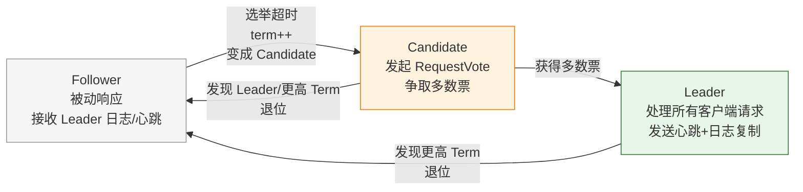
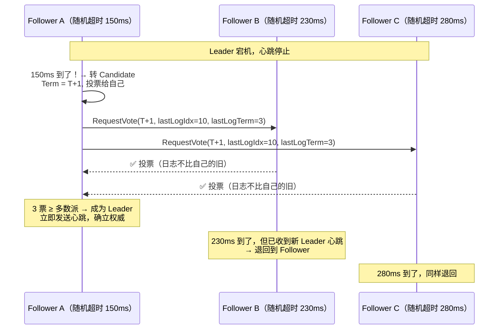
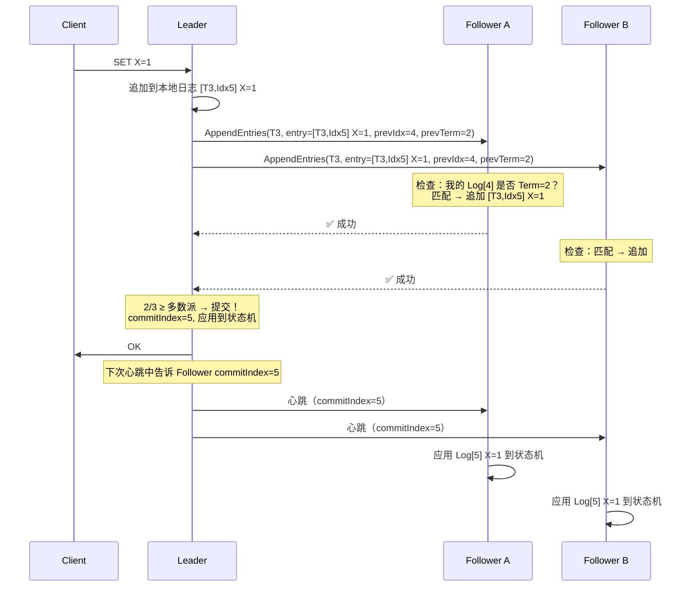
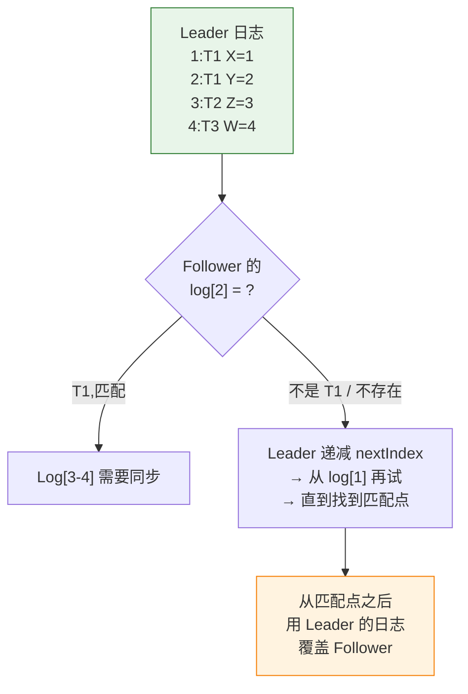

# 一、为什么共识算法是最难的分布式问题？

五个节点、网络可能分区、节点可能崩溃重启、时钟可能有偏差。在这样的环境下，让所有节点对"谁是主""日志顺序是什么"达成一致——这就是共识问题。

1978 年，这个问题被 Leslie Lamport 第一次形式化定义。1989 年，他用希腊寓言"Paxos"描述了解决方案——但 Paxos 以"难懂"著称，以至于 Lamport 在 2001 年又写了一篇 _Paxos Made Simple_ 来"重新解释"自己的算法。

2013 年，Diego Ongaro 在他的博士论文中提出了 **Raft**。Raft 的核心创新不是算法效率，而是**可理解性**：把一个复杂的共识问题拆成三个独立的子问题——选主、日志复制、安全保证。

> Raft 是"为教学而设计"的共识算法。理解了 Raft，Paxos 和 ZAB 也都可以通过"对比 Raft"来理解。

---

# 二、三种角色——Follower → Candidate → Leader



**Term（任期）**——Raft 的逻辑时钟：

- 每次新选举，Term 自增 1
- 每个节点持久化 `currentTerm`
- 所有 RPC 都携带 `term` 字段
- 如果一个节点收到带有更高 `term` 的 RPC → 更新自己的 `term` → 退回到 Follower

Term 保证了**时间的有序性**：即使各节点的物理时钟不一致，Term 提供了一种"谁更新、谁更旧"的全局判定标准。

---

# 三、Leader 选举——随机超时为什么是天才设计？

## 3.1 选举触发



## 3.2 如果随机超时不随机？

这是 Raft 最容易被低估的设计决策。假设所有 Follower 的超时都是**固定的 150ms**：

```
T0: Leader 宕机
T150ms: 所有 4 个 Follower 同时超时 → 4 个 Candidate 同时竞选
       → 选票被瓜分 → 没人拿到多数 → 等下一轮
T300ms: 所有 Follower 再次同时超时 → 再次瓜分 → 死循环
```

Raft 把选举超时设为 **150ms + random(0, 150ms)**。这个 150ms 的范围确保了**几乎总有一个 Follower 先超时**，它在其他 Follower 超时之前就已经完成了选举并发送了心跳——后面的 Follower 收到心跳后直接退回。

**工程启示**：Raft 教会我们，分布式系统中的"不确定"可以是一种设计工具。不是消除随机性，而是利用随机性。

## 3.3 投票规则——为什么能保证新 Leader 包含所有已提交日志？

```java
// Follower 的投票逻辑（伪代码）
boolean shouldVote(Candidate c) {
    if (c.term < currentTerm) return false;          // 你的任期过期了
    if (alreadyVotedInThisTerm) return false;        // 已经投过了
    
    // 关键规则：Candidate 的日志必须不比我的旧
    int myLastTerm  = lastLogEntry.term;
    int myLastIndex = lastLogEntry.index;
    
    if (c.lastLogTerm > myLastTerm) return true;      // Candidate 的 Term 更新
    if (c.lastLogTerm == myLastTerm && c.lastLogIndex >= myLastIndex) return true;
    return false;  // Candidate 的日志比我的旧 → 拒绝！
}
```

**这个规则保证了什么？**

"已提交"意味着至少被多数派节点复制了（取得了 Quorum）。Candidate 需要拿到多数派选票才能成为 Leader。这两个"多数派"必然有交集——所以新 Leader 一定持有所有已提交的日志。

---

# 四、日志复制——AppendEntries 如何让所有节点对齐？

## 4.1 正常复制流程



**关键点**：Leader 提交后，Follower 不是立刻知道的——它们在下一次心跳（或 AppendEntries）中通过 `commitIndex` 字段得知哪些日志被提交了。

## 4.2 日志冲突修复——为什么是 Leader 强制覆盖？



**为什么要 Leader 强制覆盖？**

在 Raft 的设计中，Leader 的日志是真理——因为它代表了已提交（或将被提交）的数据。Follower 的冲突日志要么是未提交的旧日志（在旧 Leader 上追加但未提交），要么是孤立的日志（在一个最终失败的 Candidate 上追加的）。

**这个设计不残酷吗？** Follower 可能有自己的独立日志，强制性覆盖是不是太粗暴？Raft 的回答是：如果 Follower 的日志和 Leader 冲突，说明那些冲突日志从未被提交（否则 Follower 不会投票给这个 Leader——见 3.3 节）。既然未被提交，覆盖它是安全的。

---

# 五、安全性——已提交的日志永不丢失

## 5.1 提交限制：只提交当前 Term 的日志

这是 Raft 最微妙的安全规则：

> Leader 只能通过提交自己 Term 内的日志来间接提交之前 Term 的日志。它**不能主动提交之前 Term 的日志**。

**为什么？** 考虑这个序列：

```
Term 2: Leader S1 复制 [T2,X=1] 到多数派 → 日志已复制但未提交 → S1 挂了

Term 3: S5 成为 Leader（它也有 [T2,X=1]）
        S5 复制 [T3,Y=2] 自己有，但还没到多数派 → S5 也挂了

如果 S5 在它 Term 内主动提交了 [T2,X=1]（虽然它是 T2 的日志）：
  → [T2,X=1] 被提交
  → S5 挂了
  → Term 4: 新的 Leader 可能没有 [T2,X=1]！
  → 已经提交的日志被覆盖 → 违反安全性！

正确的做法：
  S5 不应该提交 [T2,X=1]
  而是提交 [T3,Y=2]（自己 Term 的日志）
  → [T3,Y=2] 提交时，[T2,X=1] 被间接提交（因为它在 S5 的日志中，且排在 Y=2 前面）
  → 新 Leader 要赢得选举，必须有比 S5 更新的日志
  → 因为 [T3,Y=2] 已提交到多数派，新 Leader 必然有 [T3,Y=2]
  → 有了 [T3,Y=2]，前面的 [T2,X=1] 也必然有
```

这就是"**只提交当前 Term 日志**"规则的证明逻辑——它防止了已提交日志在 Leader 切换时意外丢失。

---

# 六、Raft 在生产中的四种实现对比

| 实现 | 语言 | 应用场景 | 特点 |
|------|------|---------|------|
| **etcd Raft** | Go | etcd、Kubernetes 配置存储 | 最成熟的 Raft 独立库，被 TiKV、CockroachDB 使用 |
| **Multi-Raft (TiKV)** | Rust | TiDB 的分布式存储层 | 每个 Region（数据分片）一个 Raft 组，支持成千上万个 Raft 组并行 |
| **KRaft (Kafka)** | Java | Kafka 3.3+ 替代 ZooKeeper | Kafka 自研的 Raft 实现，专门优化日志复制（因为 Kafka 本身就是日志系统） |
| **Hashicorp Raft** | Go | Consul、Nomad、Vault | HashiCorp 的 Raft 实现，与 etcd Raft 同源但偏存储优化 |

---

# 七、亲手推演——理解 Raft 的最快方式

如果你真的想"吃透" Raft，不只看图——亲手做这两道题：

**习题 1：选票瓜分后的恢复。**

5 节点集群，Term 1 的 Leader 宕机。Follower A 超时 160ms（Term 2），Follower B 和 C 超时 170ms（Term 2）。A 从 B/C/D 能拿到几票？（B 和 C 自己也是 Candidate，Term 相同，但按照投票规则，一个 Term 内只能投一票——且 B/C 会投给自己。）推演最终谁是 Leader。

**习题 2：日志冲突修复的索引推演。**

```
Leader:  [1,1] [1,2] [2,3] [2,4] [3,5]
Follower: [1,1] [1,2] [2,3] [1,4] [1,5]
```

Leader 第一次发 AppendEntries 给 Follower，`prevIdx=5`。Follower 检查 log[5] 的 term：Leader 说是 Term 3，但 Follower 的 log[5] 是 Term 1 → 不匹配 → 拒绝。Leader 递减 nextIndex 到 4 → 检查 log[4] 的 term → 又不匹配 → 减到 3 → 匹配！→ 从 log[4] 开始覆盖发送。

**亲手推演这两个场景，你对 Raft 的理解会从"看懂了"变成"能实现"。**

---

# 八、总结

Raft 的精髓不是算法细节，而是**分解问题的方式**：

1. **选主**（谁说了算？）→ 随机超时 + 日志新旧判定
2. **日志复制**（怎么对齐？）→ AppendEntries + Leader 强制覆盖
3. **安全**（怎么保证不丢？）→ 投票规则 + 提交限制

三个子问题解耦后，每个子问题都可以独立理解和验证。这才是 Raft 比 Paxos 更"可理解"的根本原因——不是 Raft 更简单，而是 Raft 把复杂性封装在了子问题的边界之内。

> 延伸阅读：[CAP 与共识——ZooKeeper 选 ZAB 而 etcd 选 Raft](/posts/分布式/cap与共识为什么zookeeper选zab而etcd选raft/) 对比了两个生产级共识实现的设计取舍。
