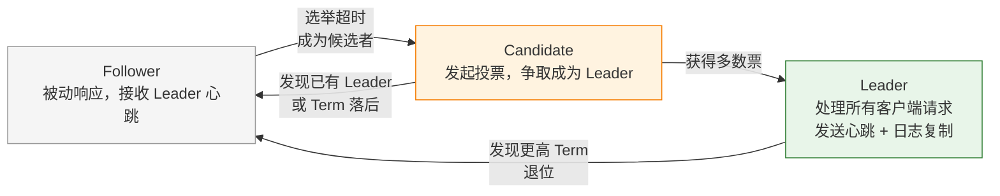
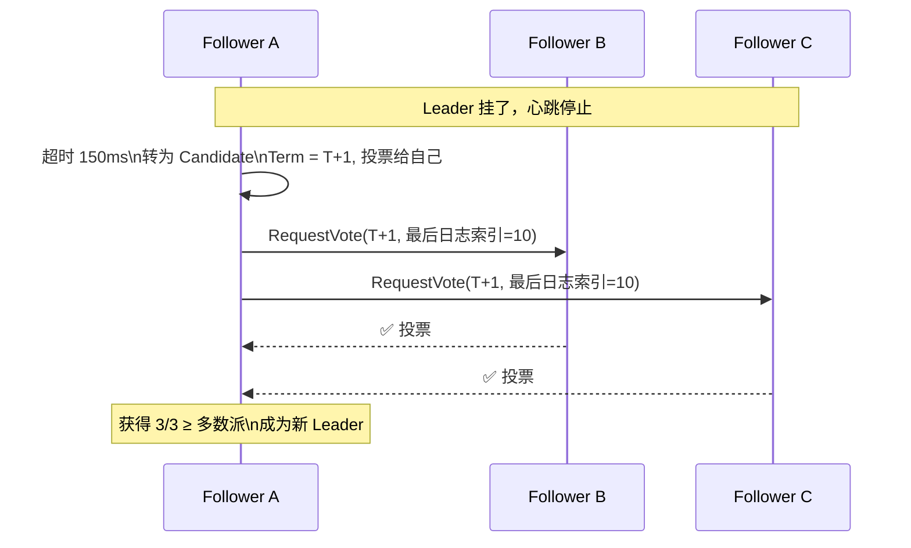
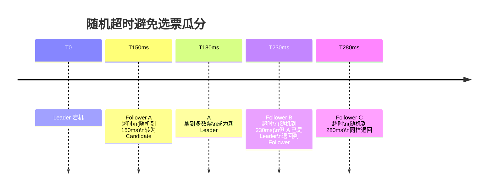
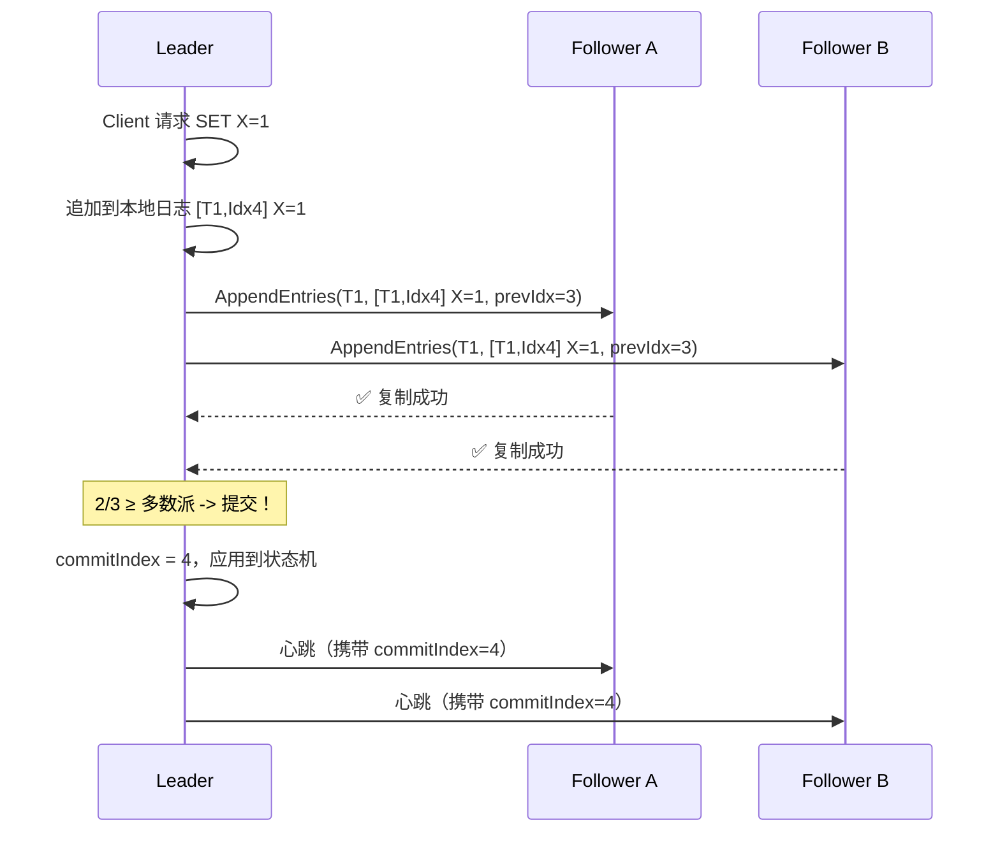
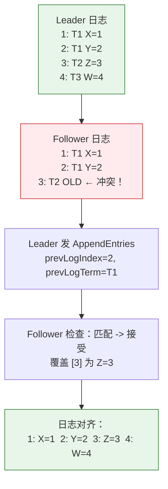
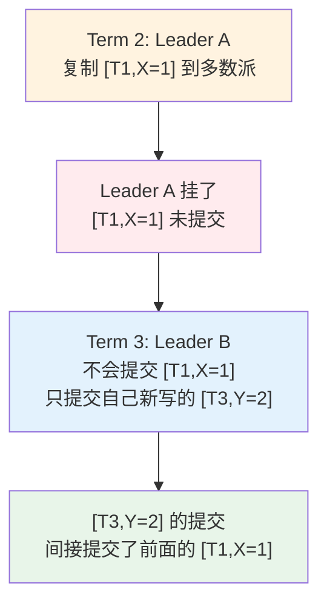
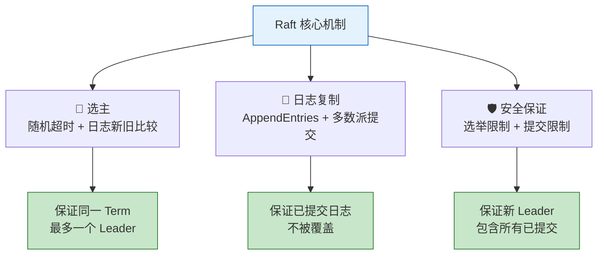

---

# 一、为什么需要共识算法？

## 1.1 单点写入的困局

```
传统主从：Client → Master (写入) → Slave (只读)
Master 挂了怎么办？→ 人工切主 → 数据可能丢失
```

**共识算法要解决的核心问题**：一组机器在没有"上帝视角"的情况下，对"谁是主""日志顺序是什么"达成一致——即使部分节点故障、网络分区。

## 1.2 为什么是 Raft？

Paxos 是第一个共识算法，但出了名的"难懂"。Raft 在 2013 年被 Diego Ongaro 提出，核心卖点就是**可理解性**：

> 把共识拆成独立子问题：选主 → 日志复制 → 安全保证。每个子问题都相对简单。

---

# 二、Raft 基础：节点的三种角色



| 角色 | 职责 | 数量 |
|------|------|------|
| **Leader** | 处理所有写请求，发送心跳，复制日志 | 同一 Term 最多 1 个 |
| **Follower** | 接收 Leader 的心跳和日志，不主动发请求 | 其余所有节点 |
| **Candidate** | 选举超时后发起投票 | 临时状态，选举结束即退出 |

**Term（任期）** 是 Raft 的逻辑时钟：每次新选举，Term +1。每个节点记录 `currentTerm`，通信时附带——这是判断"谁更新"的核心依据。

---

# 三、Leader 选举——谁说了算？

## 3.1 选举触发



## 3.2 随机超时——Raft 的优雅设计

如果所有 Follower 同时超时 → 多个 Candidate 同时竞选 → 瓜分选票 → 没人拿到多数 → 无限循环。Raft 的解法极其简单：

> **每个节点的选举超时时间随机化（150ms ~ 300ms）。**



## 3.3 投票规则：谁的日志更新，谁有资格当 Leader

Follower 收到 `RequestVote` 后，不是无脑投票的：

```
if (candidate.term < currentTerm) → 拒绝（你过时了）
if (已经投过票了) → 拒绝（一个 Term 只能投一票）
if (candidate 的最后日志比我的旧) → 拒绝（你的数据没我新）
否则 → 投票
```

**日志新旧判断**：先比 Term（大的新），Term 相同比 Index（大的新）。确保新 Leader 一定包含所有已提交的日志。

---

# 四、日志复制——所有节点怎么变成一模一样？

## 4.1 AppendEntries 正常流程



**关键点**：

- **提交 = 复制到多数派 + Leader 提交**。只有 Leader 知道自己提交了；Follower 通过心跳得知 commitIndex。
- **Leader 从不删除自己的日志**。Leader 只会追加，Follower 的冲突日志会被 Leader 覆盖。

## 4.2 日志冲突修复



**修复过程**：Leader 递减 `nextIndex` → 直到找到 Follower 日志匹配的位置 → 从那里开始覆盖发送。

---

# 五、安全性——防止"已提交的日志被覆盖"

## 5.1 选举限制

Raft 最重要的安全规则：

> **Candidate 的日志如果比某个 Follower 旧，该 Follower 不能投票给它。**

这确保了：**新 Leader 一定包含所有已提交日志**。因为"已提交"意味着复制到了多数派，而 Candidate 必须获得多数派选票——两者必然有交集。

## 5.2 提交限制：Leader 只能提交当前 Term 的日志



**为什么？** 如果 Leader B 直接提交 [T1,X=1]（不是自己写的），万一它又挂了，下一个 Leader C 可能没有这条日志 → 已提交日志被覆盖 → 违反安全性。

---

# 六、成员变更——集群扩缩容怎么做？

**问题**：从 3 节点扩到 5 节点，新旧配置的多数派不同 → 可能在同一 Term 选出两个 Leader。

**Raft 解法**：**Joint Consensus（联合共识）**——过渡期内，决策需要新旧两个配置的多数派同时同意。

```
阶段 1：Leader 发送 C_old,new（新旧配置联合）
阶段 2：C_old,new 提交后，Leader 发送 C_new（只新配置）
阶段 3：C_new 提交后，只有新配置节点参与共识
```

> 这个过渡期保证了：任何时候都不会有两个不相交的多数派。

---

# 七、Raft vs Multi-Paxos

| | Raft | Multi-Paxos |
|------|------|------------|
| **可理解性** | ⭐⭐⭐⭐⭐ 专为教学设计 | ⭐ 公认难懂 |
| **Leader 选举** | 随机超时 + 多数票 | 隐含在 Prepare 阶段 |
| **日志修复** | Leader 强制覆盖 Follower | 更灵活但复杂 |
| **成员变更** | Joint Consensus | 多种变体 |
| **生产实现** | etcd, TiKV, Consul, Kafka(KRaft) | Chubby, Spanner |

---

# 八、Raft 在生产中的应用

| 项目 | 用途 | Raft 角色 |
|------|------|-----------|
| **etcd** | Kubernetes 配置中心 | 3/5 节点 Raft 集群 |
| **TiKV** | TiDB 分布式存储 | Multi-Raft（每个 Region 一个 Raft 组） |
| **Kafka KRaft** | 替代 ZooKeeper | 元数据共识 |
| **Consul** | 服务发现 | Raft 管理状态 |

---

# 九、总结



> **Raft 的精髓不在于算法复杂，而在于分解问题的方式——把分布式一致性的魔鬼拆成三个可理解的独立模块。** 理解了 Raft，就理解了分布式系统的核心思维方式。

---

*参考资料：*
- *Diego Ongaro, "In Search of an Understandable Consensus Algorithm" (2014)*
- *Raft 官网动画: https://raft.github.io/*
- *etcd Raft 库: https://github.com/etcd-io/raft*

*本文参考资料：*
- Martin Kleppmann《Designing Data-Intensive Applications》（DDIA）——第 5 章（复制）、第 7 章（事务）、第 8-9 章（分布式系统与共识）
- Diego Ongaro, "In Search of an Understandable Consensus Algorithm (Raft)", 2014: https://raft.github.io/raft.pdf
- Leslie Lamport, "Paxos Made Simple", 2001
- antirez, "Is Redlock safe?", 2016: http://antirez.com/news/101
- Eric Brewer, "CAP Twelve Years Later", 2012
- Daniel Abadi, "PACELC", 2010
- Alibaba Seata 官方文档: https://seata.io/
- Redis 官方文档 - Distributed Locks: https://redis.io/docs/manual/patterns/distributed-locks/
