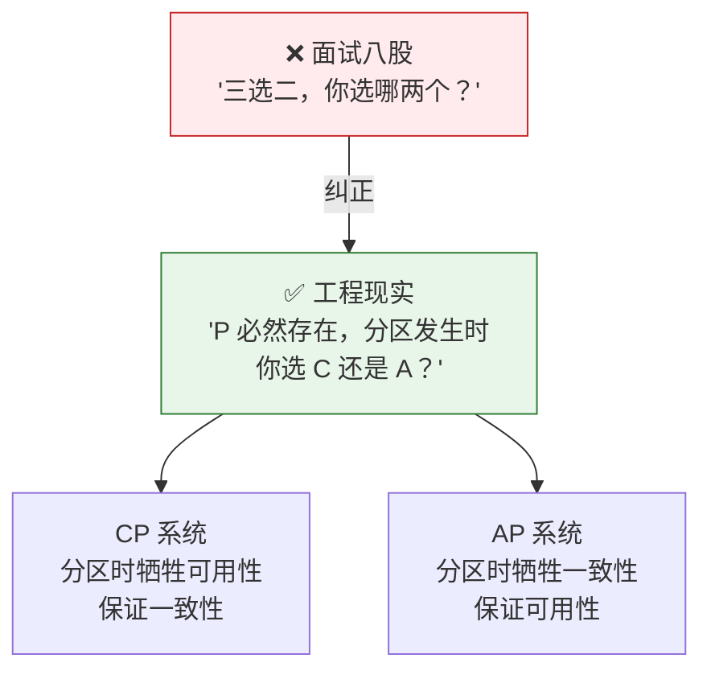
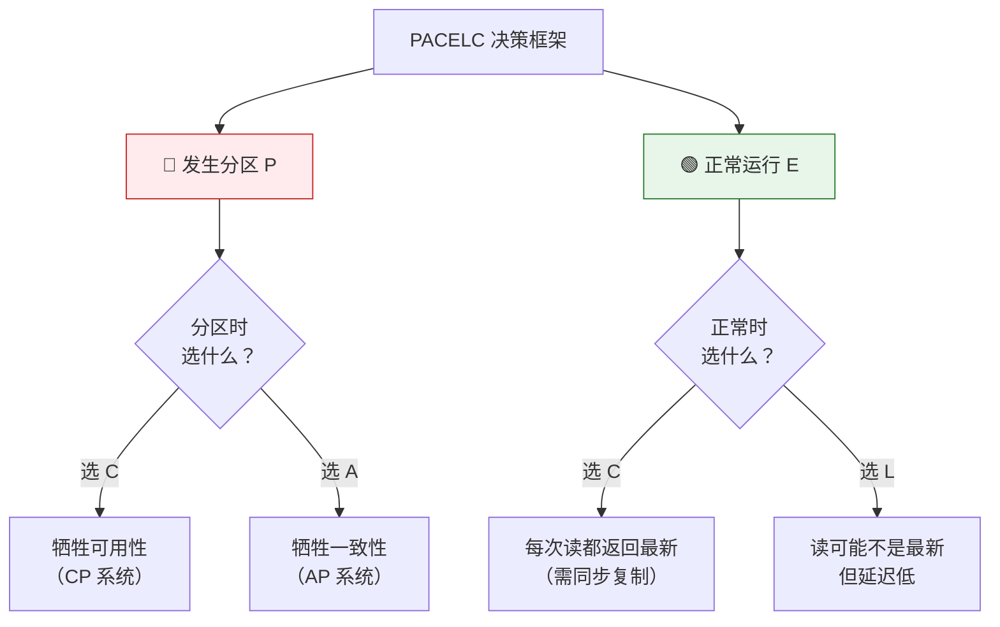
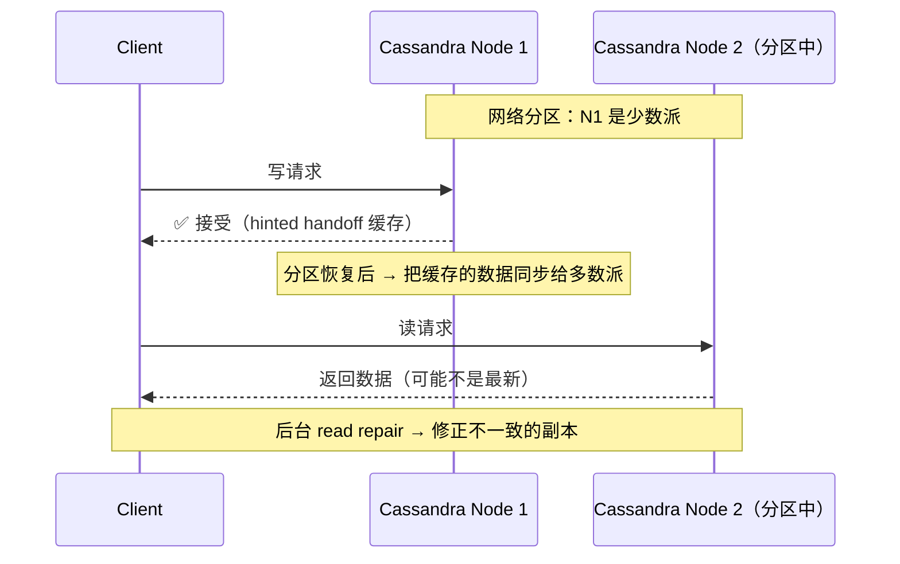
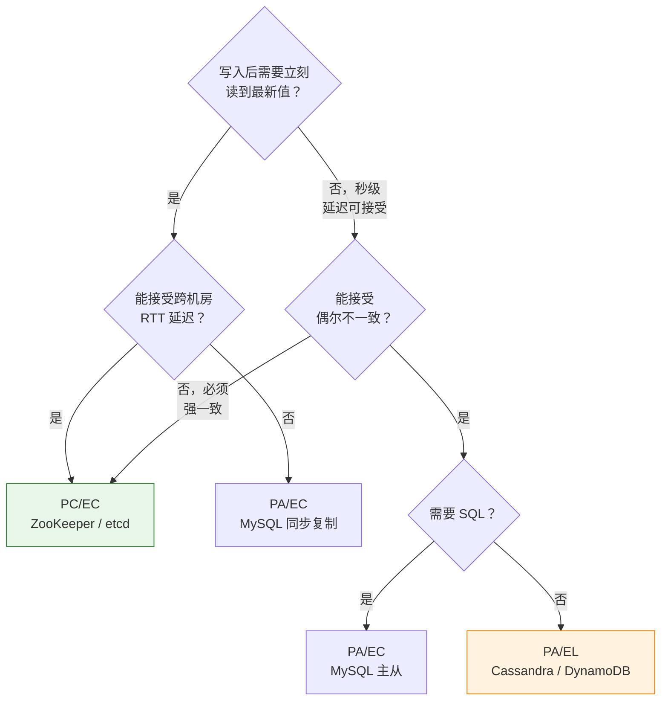

# 一、"CAP 只能三选二"——一个传播最广的面试八股

**这个说法是错误的。** 不是"三选二"，因为 P 根本没得选。

2000 年，Eric Brewer 在 ACM PODC 会议上做了一个演讲，提出了后来被称为"CAP 猜想"的观察：

> 一个分布式系统最多只能同时满足一致性（Consistency）、可用性（Availability）和分区容忍（Partition Tolerance）中的两个。

注意当时的措辞——不是定理，是**猜想**。Brewer 自己也没有提供严格证明。但业界记住了"三选二"这个简洁的公式，并开始在各种面试和架构评审中频繁引用。

## 1.1 2002 年，猜想变成定理

两年后，MIT 的 Seth Gilbert 和 Nancy Lynch 发表了 _Brewer's Conjecture and the Feasibility of Consistent, Available, Partition-Tolerant Web Services_，用形式化方法证明了 CAP 是一个**定理**。

但他们的证明同时揭示了一个被广泛忽略的细节：**P 不是系统可以"选择不要"的。**

> 在异步网络模型中，消息可能无限延迟但不丢失。在这种模型下，任何分布式系统都无法同时满足安全（一致性）和活性（可用性）。

翻译成人话：只要你的系统在网络上跑（而不是一台机器上的共享内存），分区就**可能**发生。你可能不想要 P，但你甩不掉它。

## 1.2 2012 年，Brewer 自己出来纠正

12 年后，Brewer 在 _CAP Twelve Years Later_ 中反思：

> "The '2 of 3' formulation was always misleading because it tended to oversimplify the tensions among properties."
>
> "三选二的表述一直是误导性的，因为它过度简化了三个属性之间的张力。"

他澄清了三个关键点：

1. **P 不是可选的**——分区的可能性始终存在，你只能选择分区**发生时**的策略
2. **C 和 A 不是二值的**——它们是一个连续的谱系，不是"有"或"没有"
3. **正常运行时不需做取舍**——只有在发生分区时才需要在 C 和 A 之间做选择



---

# 二、一致性的光谱——从强到弱，不是"有"或"没有"

CAP 中的 "C" 特指**线性一致性**（linearizability）——最强的一致性模型。但工程中常用的一致性级别是一个光谱：


| 一致性级别 | 定义 | 举例 | 
|-----------|------|------|
| **线性一致性** | 所有操作看起来在某个全局时间点原子执行 | ZooKeeper、etcd（默认读） |
| **顺序一致性** | 每个客户端的操作顺序被保留，但不同客户端之间可能看到不同的全局序 | ZooKeeper 的 Follower 读（非 sync） |
| **因果一致性** | 有因果关系的写操作在所有副本上有相同顺序 | MongoDB 的 causally consistent session |
| **最终一致性** | 如果没有新的写操作，最终所有副本一致 | Cassandra、DynamoDB、DNS |
| **读己之写** | 至少自己的写操作自己能立刻读到 | 大多数主从数据库的写主读主 |

**工程启示**：当你的业务说"我们需要强一致性"，先问："你说的'强'是哪一级？"——很可能线性一致性是过度保证，因果一致性或顺序一致性已经足够。

---

# 三、PACELC——CAP 缺失的那一半

## 3.1 CAP 的盲区

CAP 只回答了"分区时怎么办"。但另一个同样重要的问题被忽略了：**正常运行时怎么办？**

Yale 教授 Daniel Abadi 在 2010 年指出：

> CAP 忽略了正常运行时一致性与延迟的权衡。一个没有发生分区的系统仍然需要在"每个读都看到最新数据"（一致性）和"读尽可能快"（低延迟）之间做选择。

他提出了 PACELC：

```
if Partition (P):
    选 Availability 还是 Consistency？
else (E):  ← ← ← CAP 没覆盖的部分！
    选 Latency (低延迟) 还是 Consistency (一致性)？
```



## 3.2 这是对所有系统的完整分类

| 系统 | 分区时 | 正常时 | PACELC 类型 |
|------|--------|--------|-----------|
| **ZooKeeper / etcd** | 选 C（拒绝少数派请求） | 选 C（Leader 读，强一致） | **PC/EC** |
| **Cassandra / DynamoDB** | 选 A（所有节点继续服务） | 选 L（读任意副本，低延迟） | **PA/EL** |
| **MongoDB 主从** | 选 A（主挂了从可读） | 选 C（默认读写主） | **PA/EC** |
| **MySQL 主从** | 选 A（从库可读） | 选 C（写主读主） | **PA/EC** |

**PC/EC**（ZK 型）：任何时候都选一致性。适合分布式锁、配置中心、选举——一致性错了整个系统的行为都错。

**PA/EL**（Cassandra 型）：任何时候都选低延迟/高可用。适合用户画像、推荐日志——丢几条数据影响远小于服务中断。

**PA/EC**（MySQL 主从型）：分区时宁可牺牲一致性保证服务可用，正常时尽量保证一致性——但不需要最严格的一致性（主从下从库有复制延迟，读主才能 C）。

---

# 四、真实系统的设计取舍——从 PACELC 视角看

## 4.1 ZooKeeper 为什么选 PC/EC？

ZooKeeper 的设计目标——分布式锁、Leader 选举、配置管理——有一个共同特征：**一致性出错，整个系统的行为都错。**

一个分布式锁如果因为不一致被两个客户端同时获取 → 临界区被并发执行 → 数据损坏。ZooKeeper 的选择是：分区时，少数派节点**拒绝服务**——宁可不可用，不能不一致。

## 4.2 Cassandra 为什么选 PA/EL？

Cassandra 是 Amazon Dynamo 的开源实现。Amazon 的需求是购物车——用户添加商品到购物车的请求**必须成功**（即使后台有一致性问题，稍后修复即可）。

> "宁可购物车里多一个面包，也不让用户加不进购物车。"

Cassandra 在分区时让所有节点继续接受写入，冲突通过**读修复**（read repair）和**提示移交**（hinted handoff）后续解决。这是一个经典的 PA/EL 选择。



---

# 五、工程选型——别背八股，问对问题

当架构师说"我们需要 CAP 中的 CP"时，你应该追问三个问题：

**1. 你的一致性是什么级别？**

- 线性一致（需要 Leader 读）→ ZK、etcd
- 因果一致（只要相关操作有序）→ MongoDB causal session
- 最终一致（秒级延迟可接受）→ MySQL 主从、Cassandra

**2. 你的不可用窗口容忍多长？**

- 不能容忍任何不可用 → 必须 AP
- 可以等几秒等 Leader 恢复 → CP 可接受

**3. 正常运行时的延迟要求是什么？**

- 可以接受跨机房 RTT → 选 C（强一致读）
- 必须低延迟（< 1ms）→ 选 L（本地副本读）



---

# 六、总结

```
CAP 的真相：

1. P 不是可选的 —— 分区可能性始终存在
2. 选的是分区时的策略，不是全时段的属性
3. C 和 A 是连续光谱，不是开关
4. 正常运行时也需要在 C 和 L 之间选 —— 这就是 PACELC
```

**结论**：
- **不要背"ZooKeeper 是 CP、Cassandra 是 AP"的八股**。追问：在什么情况下？怎么体现的？代价是什么？
- **用 PACELC 作为选型框架**。每个系统有分区时（P 分支）和正常时（E 分支）两个决策维度。
- **一致性不是越强越好**。每升一级一致性，代价是延迟、吞吐或可用性的下降。找到业务的最低一致性需求，用那个级别。

> 延伸阅读：PACELC 的 E 分支选择直接影响了 [分布式事务方案](/posts/分布式/分布式事务方案全景2pctccsaga本地消息表/) 的选型——2PC 是 PC/EC 的极端，本地消息表是 PA/EL 的实用版本。
