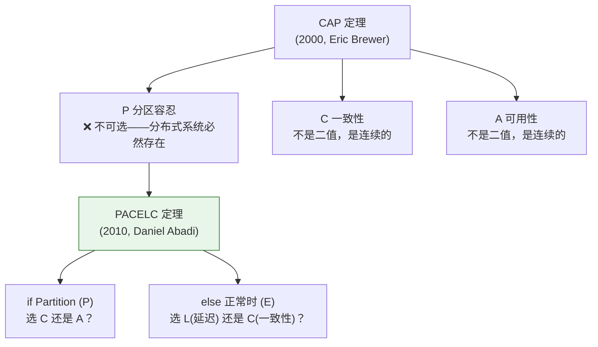
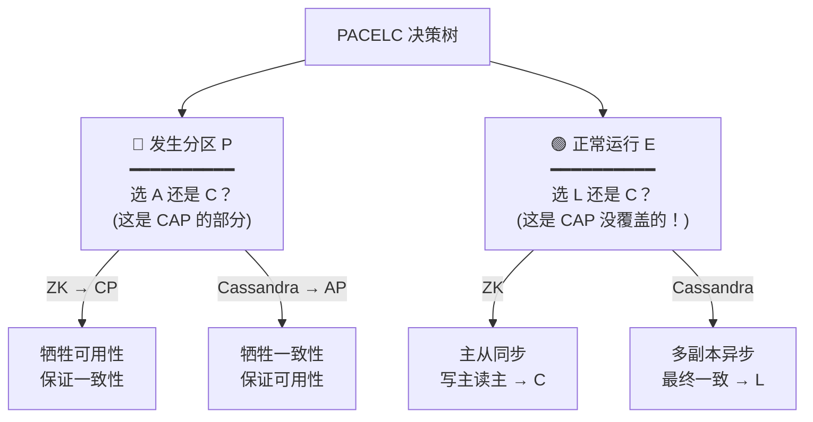
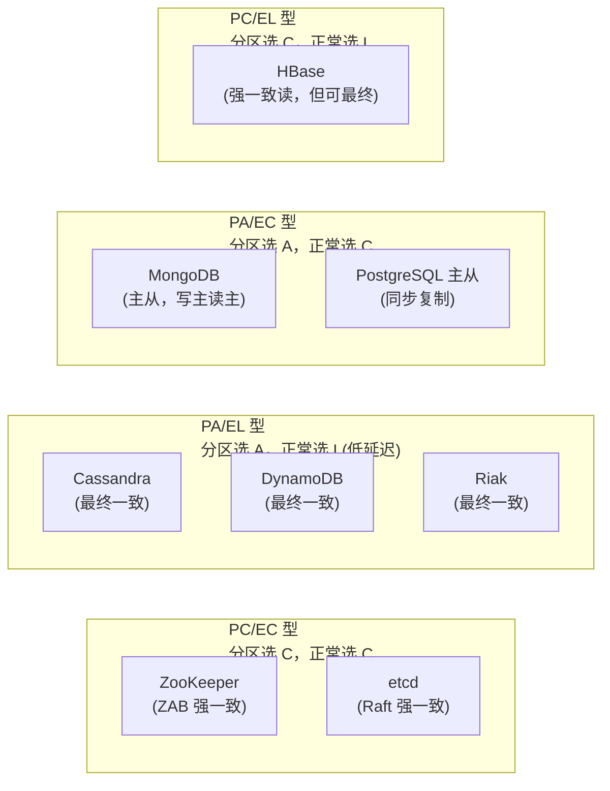
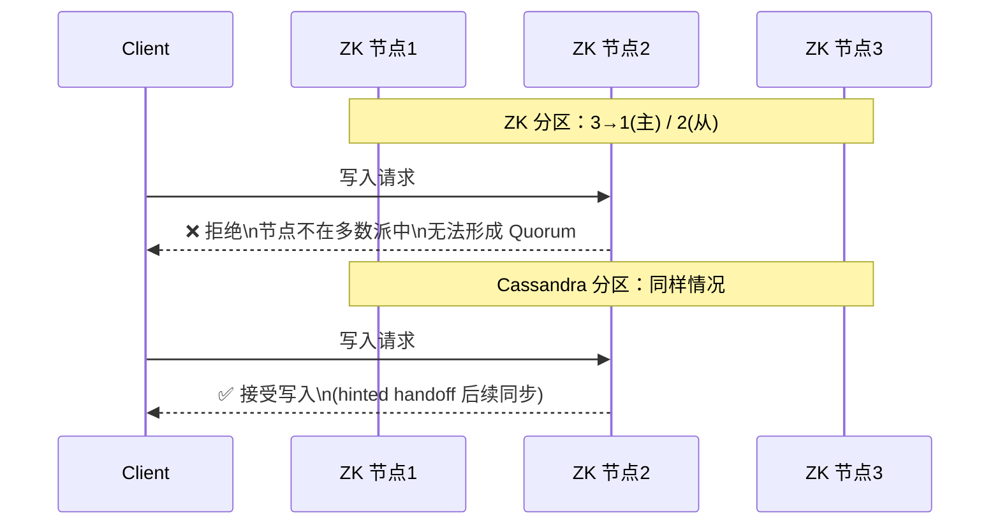

---

# 一、CAP 被误解了多少？

## 1.1 "三选二"是错的

面试八股："CAP 只能同时满足两个"→ 错误。

**P（分区容忍）不是可选的**——分布式系统的网络分区是必然发生的。当你只有"两选一"的空间时，P 已经占了坑。你能选的只有：**分区发生时，是优先一致性（CP）还是可用性（AP）。**

## 1.2 C 不是"有一致性"或"没有一致性"

一致性和可用性都是**连续的谱系**：

```
强一致 ←—————— 顺序一致 —————— 因果一致 —————— 最终一致 ——————→ 无保证
（写入后立刻读到）（同一客户端有序）（有因果关系的写有序）（延迟后一致）
```

**CAP 里说的"C"特指线性一致性（最强的一种），不是"任何形式的一致性"。**

---

# 二、PACELC——CAP 的工程修正版

Daniel Abadi 在 2010 年提出 PACELC：

> **if Partition (P):** 选 Availability 还是 Consistency？
> **else (E):** 选 Latency 还是 Consistency？



---

# 三、主流系统的 PACELC 分类



| 系统 | 分区时 | 正常时 | 类型 |
|------|--------|--------|------|
| **ZooKeeper / etcd** | C（牺牲可用） | C（强一致读） | PC/EC |
| **Cassandra / DynamoDB** | A（牺牲一致） | L（最终一致，低延迟） | PA/EL |
| **MongoDB (主从)** | A | C（读写主） | PA/EC |
| **HBase** | C | L | PC/EL |

---

# 四、为什么 ZK 是 CP 而 Cassandra 是 AP？

**ZooKeeper（CP）**：发生分区时，少数派节点拒绝服务。"宁可不可用，不能不一致。"

**Cassandra（AP）**：发生分区时，所有节点继续接受写入。"宁可数据暂时冲突，不能服务中断。"（冲突由读修复和 Hinted Handoff 后续解决）



---

# 五、工程选型指南

| 场景 | 选型 | PACELC 类型 |
|------|------|-----------|
| 配置中心、服务发现、分布式锁 | **ZK / etcd** | PC/EC |
| 用户画像、推荐数据、日志 | **Cassandra / DynamoDB** | PA/EL |
| 订单、交易记录 | **MySQL 主从 / MongoDB** | PA/EC 或 PC/EC |
| 短时缓存、Session | **Redis 主从** | PA/EL |

> **一致性不是越强越好，延迟也不是越低越好。PACELC 的价值在于让你明确：在不同场景下，你愿意在哪一侧做让步。**

---

# 六、总结

1. **P 不是可选的**——分区必然发生，CAP 本质是在 C 和 A 之间做取舍
2. **C 不是二值的**——强一致到最终一致是一个光谱
3. **PACELC 比 CAP 更实用**——它把"正常运行时"的权衡也纳入了决策框架
4. **选型不是背八股**——理解你的业务到底需要多强的一致性，再对着 PACELC 选

*本文参考资料：*
- Martin Kleppmann《Designing Data-Intensive Applications》（DDIA）——第 5 章（复制）、第 7 章（事务）、第 8-9 章（分布式系统与共识）
- Diego Ongaro, "In Search of an Understandable Consensus Algorithm (Raft)", 2014: https://raft.github.io/raft.pdf
- Leslie Lamport, "Paxos Made Simple", 2001
- antirez, "Is Redlock safe?", 2016: http://antirez.com/news/101
- Eric Brewer, "CAP Twelve Years Later", 2012
- Daniel Abadi, "PACELC", 2010
- Alibaba Seata 官方文档: https://seata.io/
- Redis 官方文档 - Distributed Locks: https://redis.io/docs/manual/patterns/distributed-locks/
