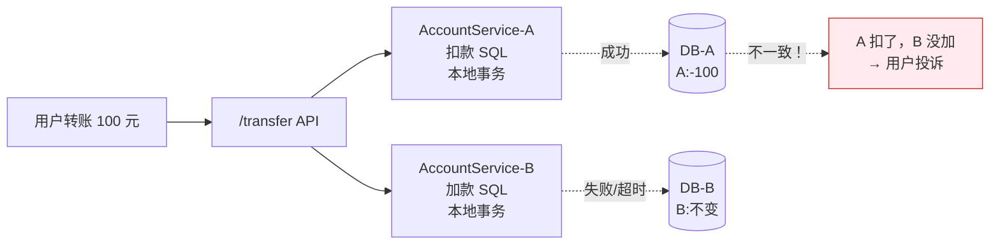
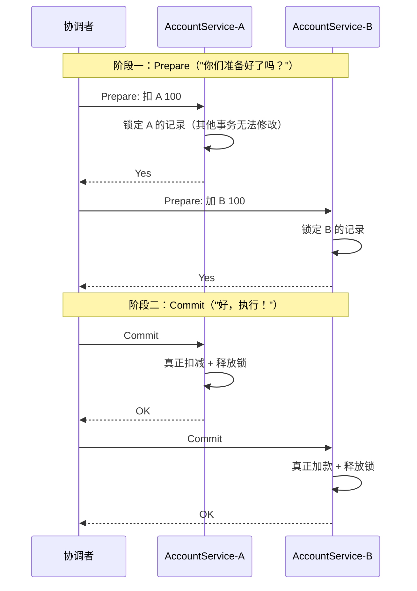
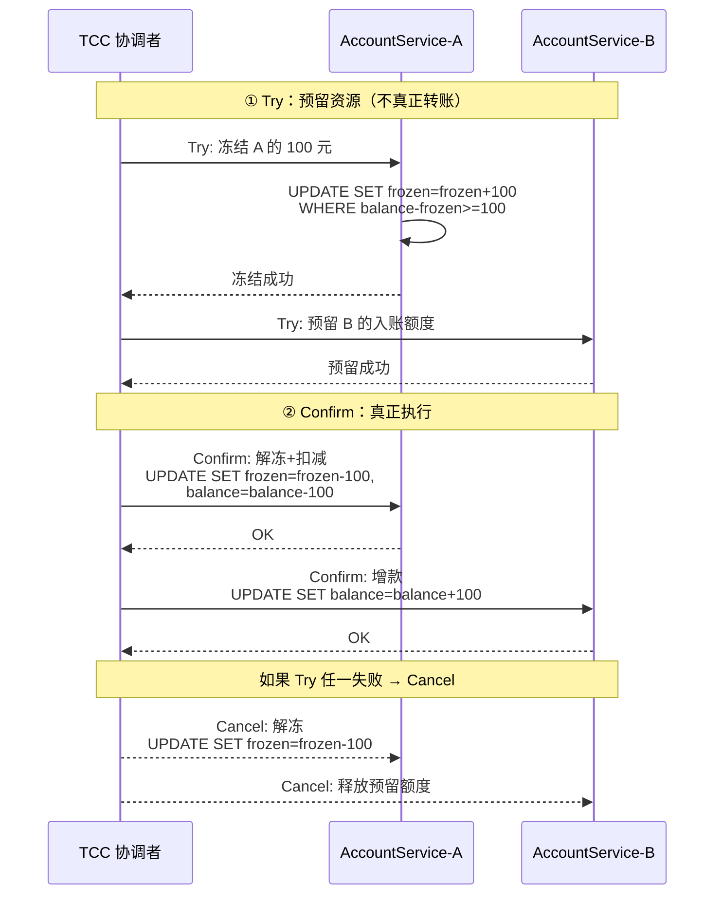
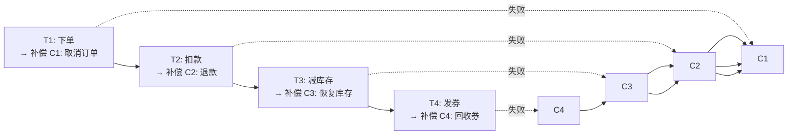
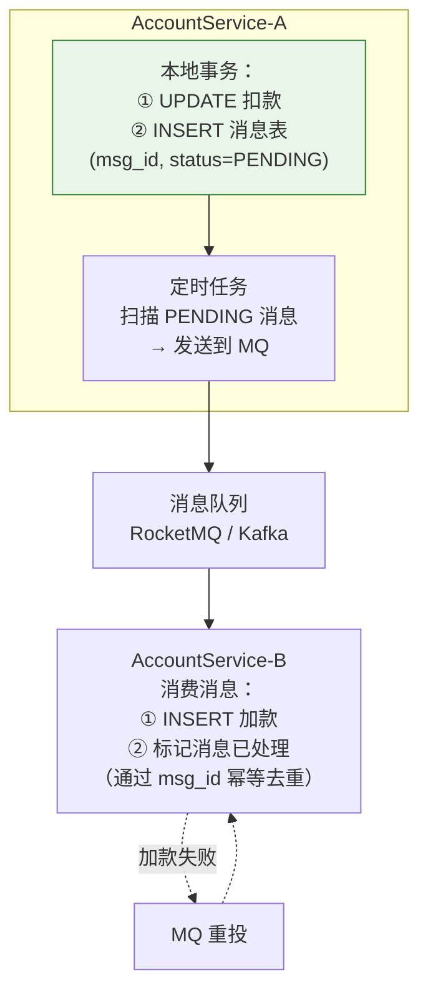
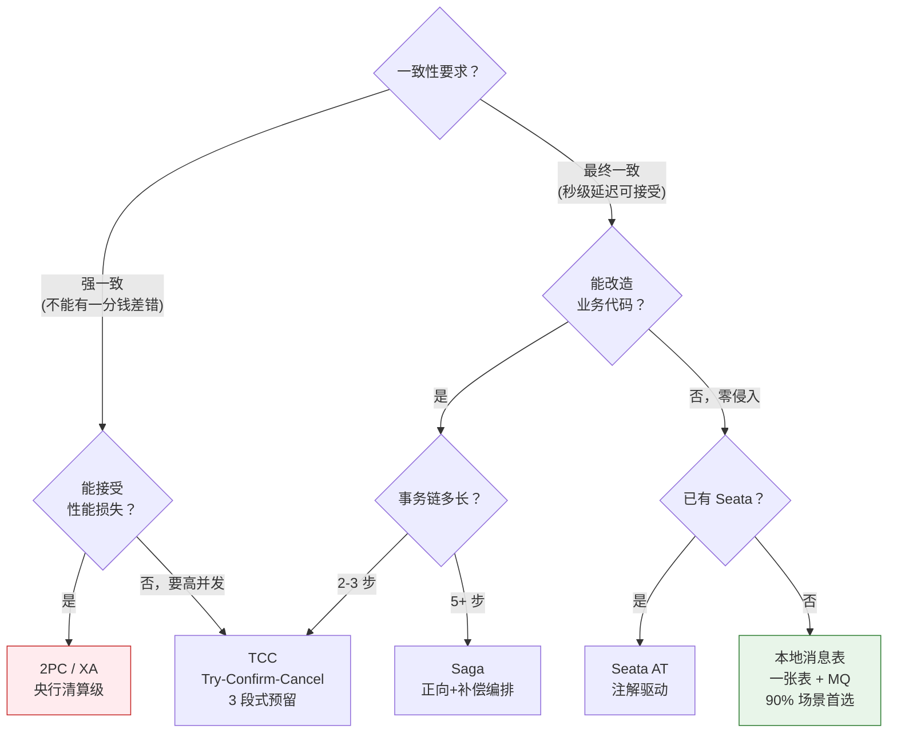

# 一、一个转账请求，两个数据库——分布式事务的起源

假设你正在做一个支付系统。`AccountService-A` 管理 A 的账户（数据库 A），`AccountService-B` 管理 B 的账户（数据库 B）。

**单体时代**，这个转账只需要一个本地事务：

```sql
BEGIN;
UPDATE account SET balance = balance - 100 WHERE user = 'A';
UPDATE account SET balance = balance + 100 WHERE user = 'B';
COMMIT;
```

数据库保证原子性：要么两个 UPDATE 全部生效，要么全部回滚。一句话搞定。

**微服务时代**，数据库被拆开了：

```
AccountService-A.debit('A', 100)    → 数据库 A，本地事务
AccountService-B.credit('B', 100)   → 数据库 B，本地事务
```

两个服务的本地事务各自提交成功或失败。如果 A 扣了 100，但 B 加款时网络超时了——钱已经在 A 的数据库里扣掉了，B 却没加上。这就是分布式事务要解决的根本问题。



---

# 二、方案评判框架——选型前先问三个问题

在展开具体方案之前，先建立评判标准。面对一个分布式事务方案，问三个问题：

| 维度 | 问题 | 转账场景要求 |
|------|------|------------|
| **一致性** | 方案提供什么级别的一致性保证？ | 最终一致性可接受。强一致当然更好，但代价是什么？ |
| **性能代价** | 方案引入多少额外延迟？在什么并发下退化？ | 转账不是高频操作，但"锁住余额"的时间必须短 |
| **侵入性** | 业务代码要改多少？要不要引入新中间件？ | 越小越好——多一个中间件多一个故障点 |

---

# 三、2PC/XA——强一致的理想与现实的代价

## 3.1 两阶段提交



## 3.2 三个致命问题

**问题 1：锁持有时间长**

从 Prepare 到 Commit，A 和 B 的记录全程被锁定。如果网络抖动，整个过程可能持续数百毫秒。在这期间，任何其他需要操作 A 或 B 账户余额的事务都会被阻塞。

```
时间线（2PC 视角）：
T0: 协调者发 Prepare
T1: A 完成 Prepare（A 的记录被锁）
T2: B 完成 Prepare（B 的记录被锁）
T3: 协调者发 Commit
T4: A 完成 Commit（A 的锁释放）
T5: B 完成 Commit（B 的锁释放）

从 T1 到 T5，A 的记录被锁了整整 4 个 RTT。对于 10ms 的 RTT → 40ms 锁持。可接受。
对于 100ms 的 RTT → 400ms 锁持。不可接受。
```

**问题 2：协调者单点故障**

如果 TM 在发了 Commit 给 A 之后、发 Commit 给 B 之前崩溃了，会发生什么？

- A 已经提交了（扣了 100）
- B 还在等待（余额没变）
- 恢复后 TM 能重新发 Commit 给 B 吗？不一定——TM 的日志可能还没持久化

**问题 3：回滚的不确定性**

如果 B 回复了 No（加款失败），A 已经 Prepare 了。A 能被回滚吗？在 XA 协议下可以（A 还没 Commit）。但如果 TM 在发 Rollback 之前又挂了，A 的资源一直锁着。

## 3.3 适用场景

2PC 的这三个问题决定了它的适用面极窄：**只有央行清算级别、绝对不可容忍差错的场景**才考虑 XA。常见的微服务转账绝不应该用 XA。

---

# 四、TCC——把分布式事务拆成 "预留→确认→取消"

## 4.1 核心思路

既然数据库层的 2PC 锁太重，那就把"锁"从数据库层提到**业务层**，用业务语义实现"预留资源"。

**TCC = Try（预留）→ Confirm（确认）→ Cancel（释放）**



## 4.2 代码形态

```java
public class AccountTccService {
    
    // —— Try：冻结 ——
    public boolean tryDebit(String accountId, BigDecimal amount) {
        // 关键：WHERE 条件确保余额足够，并发安全
        return jdbc.update(
            "UPDATE account SET frozen = frozen + ? " +
            "WHERE account_id = ? AND balance - frozen >= ?",
            amount, accountId, amount
        ) > 0;
    }
    
    // —— Confirm：真正扣减 ——
    public boolean confirmDebit(String accountId, BigDecimal amount) {
        return jdbc.update(
            "UPDATE account SET frozen = frozen - ?, balance = balance - ? " +
            "WHERE account_id = ?",
            amount, amount, accountId
        ) > 0;
    }
    
    // —— Cancel：解冻 ——
    public boolean cancelDebit(String accountId, BigDecimal amount) {
        return jdbc.update(
            "UPDATE account SET frozen = frozen - ? WHERE account_id = ?",
            amount, accountId
        ) > 0;
    }
}
```

## 4.3 Cancel 失败的兜底——TCC 的阿喀琉斯之踵

`Confirm` 和 `Cancel` 都可能失败。**TCC 的核心约束：Confirm 和 Cancel 必须是幂等的，支持重试。**

```java
// 协调者的重试逻辑
public void confirmWithRetry(String txnId) {
    int retries = 0;
    while (retries < MAX_RETRIES) {
        try {
            accountService.confirmDebit(accountId, amount);
            return;  // 成功
        } catch (Exception e) {
            retries++;
            if (retries == MAX_RETRIES) {
                // 最终失败 → 人工介入 + 告警
                alertService.alert("TCC Confirm 失败, txnId=" + txnId);
            }
        }
    }
}
```

**但有一个隐蔽的 bug**：如果 `confirmDebit` 实际执行成功了（数据库已扣款），但网络超时导致调用方收到异常 → 调用方重试 → 又扣一次。这就是为什么 `confirmDebit` 必须通过 txnId 幂等去重。

## 4.4 TCC 的优缺点

| 维度 | 评价 |
|------|------|
| **一致性** | 较强（Try 阶段预留资源，Confirm 才真扣） |
| **性能** | 好（无数据库锁，只有业务层的乐观并发控制） |
| **侵入性** | **高**——每个接口要写 Try/Confirm/Cancel 三套方法 |
| **运维** | Cancel 失败需要重试+告警+人工对账 |

---

# 五、Saga——长事务的编排者

TCC 适合 2-3 步的短事务。当业务流程更长时（下单→支付→减库存→通知物流→发优惠券，5 步+），TCC 的三段式太重了。Saga 的选择是：**只写正向操作和补偿操作，不写 "预留" 步骤**。



**和 TCC 的核心区别**：Saga 的补偿是**异步的**。T4 失败 → 触发 C4 → C3 → C2 → C1，每一步都可能需要几秒甚至几分钟。在补偿执行期间，系统处于"部分回滚"的中间状态——这是 Saga 接受的设计代价。

| | TCC | Saga |
|------|-----|------|
| **步骤数** | 适合 2-3 步 | 适合 3-10+ 步 |
| **回滚方式** | Cancel（即时释放预留） | 补偿（异步逆序执行） |
| **中间状态** | 尽量不可见（Try 预留） | **可见**——用户可能在"退款中" |
| **实现** | 每步 3 个接口 | 每步 2 个接口（正向+补偿） |

---

# 六、本地消息表——阿里内部使用最多的方案

## 6.1 一个 INSERT 解决分布式事务

**核心思想**：把"扣款"和"通知 B 加款"这两个操作，通过**一张本地消息表**解耦。



## 6.2 关键设计点

```sql
-- AccountService-A 的本地事务（同库同连接，原子性保证）
BEGIN;
UPDATE account SET balance = balance - 100 
WHERE account_id = 'A' AND balance >= 100;

-- 扣款和写消息在同一个事务中 → 要么都做，要么都不做
INSERT INTO outbox_message (msg_id, topic, payload, status, create_time)
VALUES ('msg_001', 'transfer', '{"from":"A","to":"B","amount":100}', 'PENDING', NOW());

COMMIT;
```

**为什么这能保证最终一致性？**

1. 扣款和写消息是同一个本地事务 → 原子性
2. 定时任务扫描 `PENDING` 消息 → 发送到 MQ → 发送失败？下次扫描继续
3. MQ 投递给 B → B 通过 `msg_id` 幂等去重 → 重复投递不会重复加款
4. B 加款成功后更新消息状态 → 定时任务下次跳过

**阿里内部大量使用这个方案**，因为它：
- 零框架依赖——一张表 + 一个 MQ
- 业务代码只加了一句 `INSERT INTO outbox_message`
- 可靠性极高——定时扫描 + MQ 重投 = 双重保障

## 6.3 缺点与应对

| 缺点 | 应对 |
|------|------|
| **延时较高**（定时扫描间隔 + MQ 延迟） | 大多数转账场景秒级最终一致可接受 |
| **消息重复投递** | 消费端通过 `msg_id` 幂等去重 |
| **MQ 不可用时消息堆积** | 本地消息表的 `PENDING` 消息不会丢，MQ 恢复后继续发送 |

---

# 七、Seata AT——零侵入的代价

Seata AT 是阿里开源的分布式事务框架。它的最大卖点：**业务代码零侵入**。

```java
@GlobalTransactional  // ← 只需一个注解
public void transfer(String from, String to, BigDecimal amount) {
    accountService.debit(from, amount);   // 正常写 SQL
    accountService.credit(to, amount);    // 正常写 SQL
    // Seata 在底层自动做：
    // 1. 解析每条 UPDATE 的 before_image 和 after_image
    // 2. 生成反向 UNDO SQL
    // 3. 一阶段提交 + 二阶段回滚时执行 UNDO SQL
}
```

**代价**：每次写操作多存储两份数据镜像（before/after），性能损耗约 10%~20%，且依赖数据库的 UNDO 日志表。

**什么样的场景适合 Seata？** 已经有微服务、不想改业务代码、能接受 10%~20% 性能下降。但如果服务是新写的，本地消息表的实现成本不比集成 Seata 高——而且没有框架依赖。

---

# 八、五种方案选型速查



| 方案 | 一致性 | 性能 | 侵入性 | 转账推荐 |
|------|--------|------|--------|---------|
| **2PC/XA** | 强 | 差（锁持长） | 低 | ⭐⭐ 仅央行级 |
| **TCC** | 较强 | 好 | **高**（3 套接口） | ⭐⭐⭐⭐ 对一致性极敏感 |
| **Saga** | 最终 | 好 | 中 | ⭐⭐⭐ 长事务链 |
| **本地消息表** | 最终 | 好 | **低** | ⭐⭐⭐⭐⭐ **首选** |
| **Seata AT** | 较强 | 中（-15%） | 极低 | ⭐⭐⭐ 不想改代码 |

---

# 九、三条实战铁律

**铁律 1：消费端必须幂等。** 不管用什么方案，加款操作必须通过唯一 ID（`msg_id` / `txn_id`）去重。重复消费不是 bug，是分布式系统的常态。

**铁律 2：对账是最后防线。** 每天凌晨跑对账任务——A 扣了 B 没加的：补上。A 没扣 B 加了的：冲正。对账脚本是用 SQL 写的最终一致性方案，它比任何框架都可靠。

**铁律 3：不要迷信强一致。** 分布式世界里，最终一致性是工程最优解。如果你发现自己花了大量精力追求强一致，退一步问：业务真的需要吗？如果用户能容忍 1 秒的余额延迟，你就没必要为强一致付出 3 倍的代码复杂度。

---

# 十、总结

分布式事务的演进史本质上是**从数据库锁 → 业务锁 → 异步解耦**的降级之路。每一步"降级"都是在接受一个更弱的一致性保证，换取更好的性能和更低的侵入性。关键在于搞清楚你的业务到底需要多强的一致性——而不是默认选最强的。

> 本地消息表解决 90% 的分布式事务需求。TCC 留给对一致性有极致要求的场景。2PC 能不用就不用。消费端幂等 + 对账 = 工程上最可靠的双重保险。
