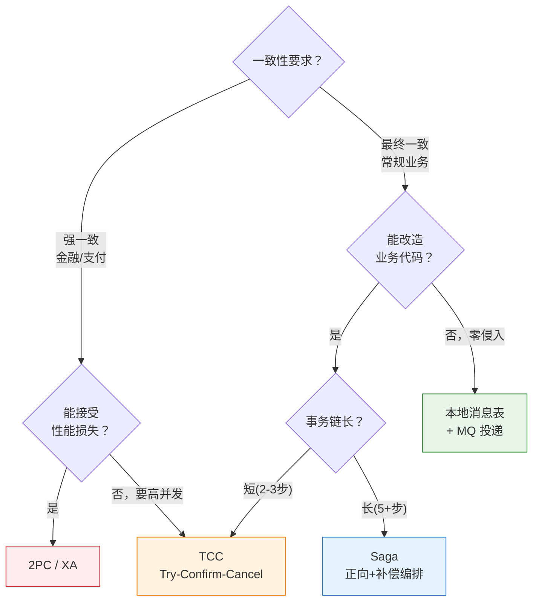
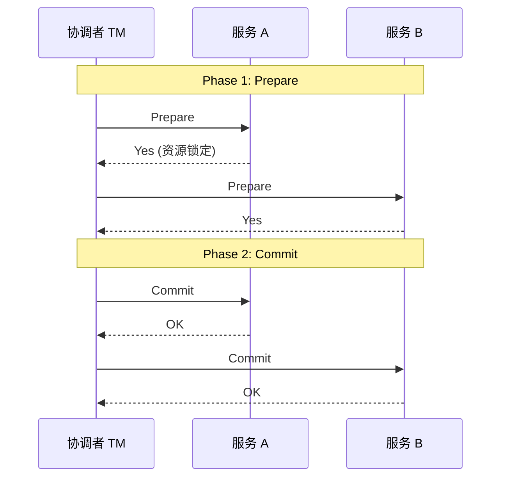
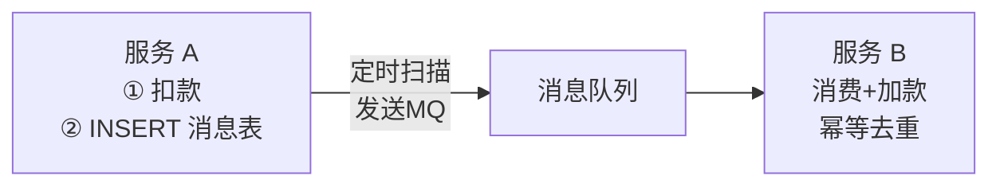

---

# 一、2PC / XA——强一致性的巅峰与代价

## 1.1 两阶段提交



## 1.2 致命伤

- Prepare 期间资源锁定，并发度极低
- 协调者单点故障 → 所有参与者阻塞
- 部分 Commit 失败 → 需人工介入
- **适用场景极窄**：只有央行清算级别的强一致需求

---

# 二、TCC——业务层的 2PC

## 2.1 Try-Confirm-Cancel

```
Try:     冻结资源（余额不变，冻结额度+100）
Confirm: 真正执行（解冻+扣减）
Cancel:  释放冻结（解冻+退回）
```

**优点**：无锁、高性能、业务可控。**缺点**：每个接口写 3 个方法，Cancel 失败要重试。

## 2.2 适用场景

账户扣减、库存锁定、优惠券核销——**涉及"冻结-确认-释放"三段式语义的场景**。

---

# 三、Saga——长事务的编排者

## 3.1 核心思想

```
正向：T1 → T2 → T3 → T4
补偿：C1 ← C2 ← C3 ← C4  （逆序回滚）
```

T3 失败 → 执行 C2 → 执行 C1。每个服务的补偿要幂等。

## 3.2 协调 vs 编排

| | 协调型 Saga | 编排型 Saga |
|------|------------|------------|
| 控制流 | 集中式 Saga 编排器 | 事件驱动，服务间直接通信 |
| 耦合度 | 编排器知晓所有服务 | 服务只知道自己的事件 |
| 可观测性 | 编排器能看全貌 | 需要分布式追踪 |

**适用**：订单流程（下单→支付→发货→签收）、跨部门审批流。

---

# 四、本地消息表——最简单的最终一致性

## 4.1 架构



**核心**：扣款和写入消息表在同一个本地事务中（同库同连接）。然后定时任务扫描未发送的消息投递 MQ。

## 4.2 为什么是工程首选？

- 零框架依赖——一张表 + MQ 搞定
- 业务代码只加一句 `INSERT INTO msg_table`
- 消费端幂等（通过消息 ID 去重）
- **阿里内部大量使用**

---

# 五、Seata AT——零侵入的 2PC 变体

```java
@GlobalTransactional  // 一个注解，零侵入
public void transfer(String from, String to, BigDecimal amt) {
    accountService.debit(from, amt);
    accountService.credit(to, amt);
}
```

底层自动生成 Undo SQL：`UPDATE → before_image`，回滚时执行反向 SQL。**代价**：依赖 UNDO 日志，性能有 10%~20% 损耗。

---

# 六、四种方案速查

| 方案 | 一致性 | 性能 | 复杂度 | 推荐度 |
|------|--------|------|--------|--------|
| **2PC/XA** | 强 | ⭐ | 低 | ⭐⭐ |
| **TCC** | 较强 | ⭐⭐⭐⭐ | 高 | ⭐⭐⭐⭐ |
| **Saga** | 最终 | ⭐⭐⭐⭐ | 中 | ⭐⭐⭐ |
| **本地消息表** | 最终 | ⭐⭐⭐ | 低 | ⭐⭐⭐⭐⭐ |
| **Seata AT** | 较强 | ⭐⭐ | 低 | ⭐⭐⭐ |

---

# 七、总结

> **本地消息表解决 90% 的分布式事务需求。TCC 留给对一致性有极致要求的场景。2PC 能不用就不用。** 再加上消费端幂等 + 对账任务，就是工程上最可靠的分布式事务三板斧。

*本文参考资料：*
- Martin Kleppmann《Designing Data-Intensive Applications》（DDIA）——第 5 章（复制）、第 7 章（事务）、第 8-9 章（分布式系统与共识）
- Diego Ongaro, "In Search of an Understandable Consensus Algorithm (Raft)", 2014: https://raft.github.io/raft.pdf
- Leslie Lamport, "Paxos Made Simple", 2001
- antirez, "Is Redlock safe?", 2016: http://antirez.com/news/101
- Eric Brewer, "CAP Twelve Years Later", 2012
- Daniel Abadi, "PACELC", 2010
- Alibaba Seata 官方文档: https://seata.io/
- Redis 官方文档 - Distributed Locks: https://redis.io/docs/manual/patterns/distributed-locks/
