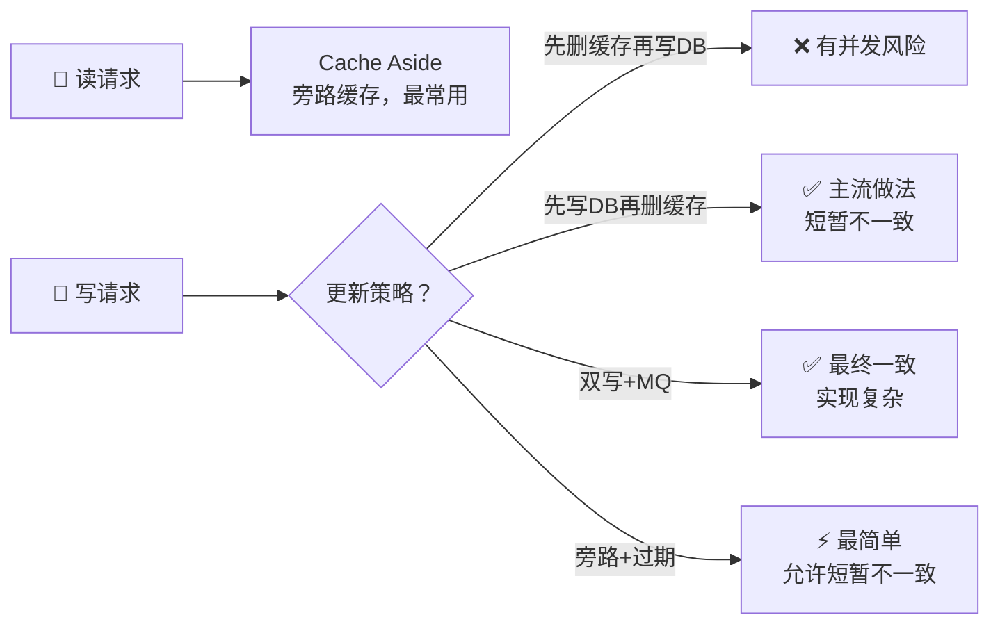
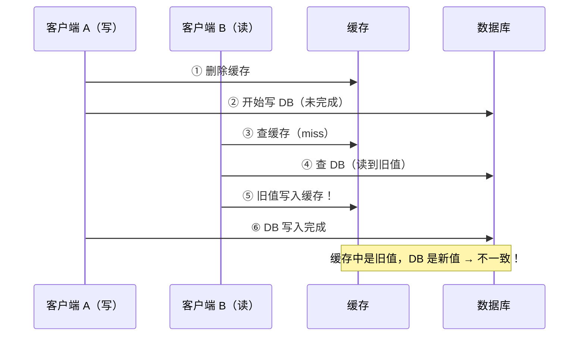
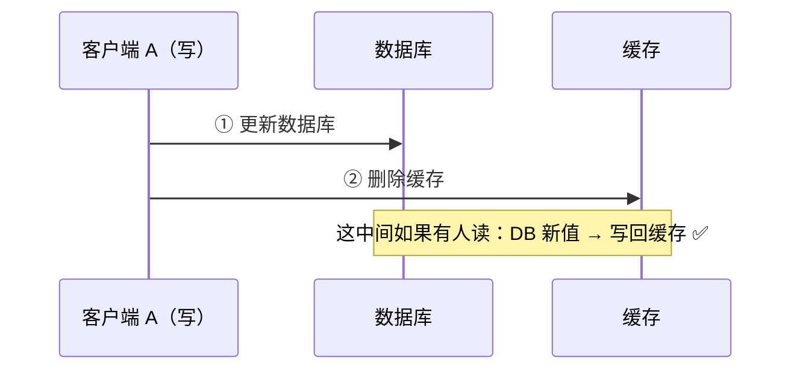
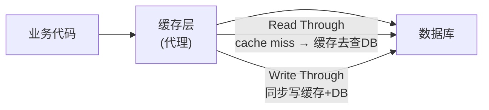
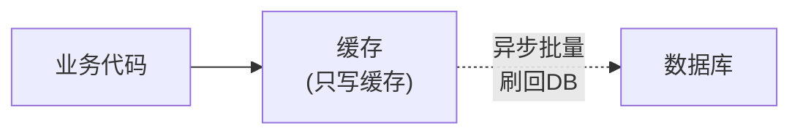

---

# 一、为什么有缓存一致性这个问题？

**问题的本质**：一份数据存了两个地方（数据库 + 缓存），对它们的写操作不是原子的。

```
理想：DB 和 Cache 始终一致
现实：任何先写一个后写另一个的方案，中间都有一段时间不一致
```

**工程态度**：接受短暂不一致，保证最终一致。

---

# 二、Cache Aside（旁路缓存）——最主流方案

## 2.1 读流程

```
读请求 → 查缓存 → 命中：返回
                 → 未命中：查 DB → 写入缓存 → 返回
```

## 2.2 写流程——为什么先删缓存后写 DB 有 Bug？



**正确的写法：先更新 DB，再删除缓存。**



## 2.3 删除缓存失败的兜底——延迟双删

```java
public void updateWithRetry(String key, Object value) {
    db.update(value);
    redis.del(key);
    
    // 异步延迟再删一次（兜底删除失败）
    scheduler.schedule(() -> {
        redis.del(key);
    }, 500, TimeUnit.MILLISECONDS);
}
```

**更可靠的方案：订阅 MySQL binlog，异步更新/删除缓存。**

---

# 三、Read/Write Through（缓存代理模式）

缓存层承担"数据库代理"角色，业务只和缓存打交道：



**优点**：业务代码简单。**缺点**：缓存层承担了同步写 DB 的压力，写入延迟高。

---

# 四、Write Behind（异步回写）



**优点**：写入极快（只写缓存）。**缺点**：缓存挂了数据全丢。仅适合非关键数据（如浏览量计数）。

---

# 五、四种方案对比

| 方案 | 写延迟 | 一致性 | 复杂度 | 适用场景 |
|------|--------|--------|--------|----------|
| **Cache Aside** | 低 | 最终一致 | ⭐⭐ | 通用场景，90% 首选 |
| **Read/Write Through** | 中 | 强/最终 | ⭐⭐⭐ | 缓存中间件（如 Redis + 自定义代理） |
| **Write Behind** | 极低 | 弱 | ⭐⭐⭐ | 非关键数据（计数器） |
| **Binlog 订阅** | 低 | 最终一致 | ⭐⭐⭐⭐ | 对一致性要求高 |

---

# 六、总结

> **Cache Aside + 先写 DB 再删缓存 + Binlog 兜底**是业界标配。缓存一致性没有银弹，只有根据业务接受的不一致窗口选择合适的兜底策略。
