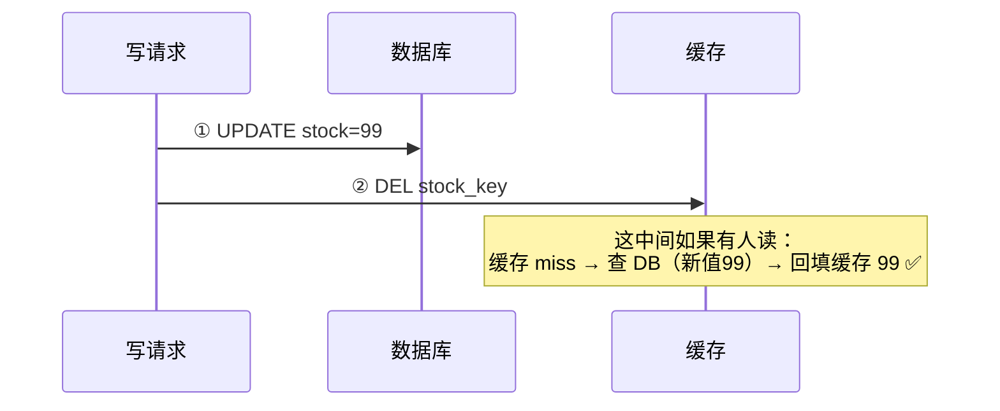
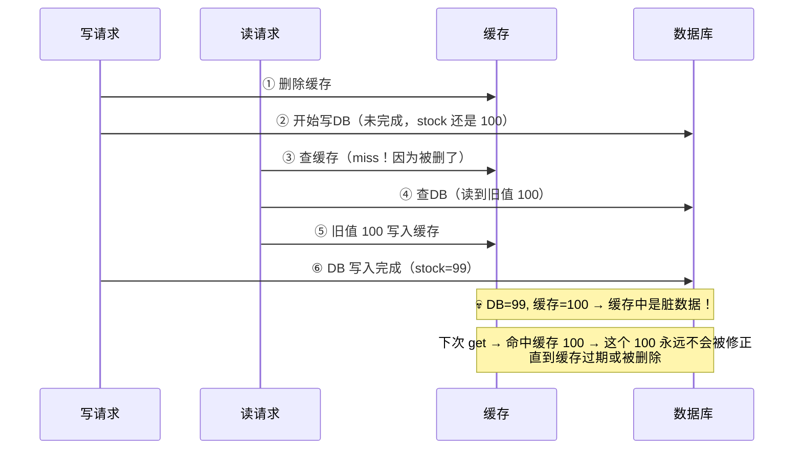
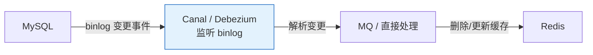

# 一、一份数据两个副本——不一致的根源

这是一个每天都在发生的故事：

```
用户下单 → 扣减库存 → 更新数据库 → 更新缓存
                              ↓                ↓
                          DB: stock=99    Cache: stock=99
                               ✅              ✅

另一个请求 → 读库存 → 先查缓存 → 返回 99 → ✅

但是：
更新 DB 成功 → 更新缓存时 Redis 超时 → Cache: stock=100（旧值）
→ 下一个读请求 → 缓存命中 → 返回 100 → 超卖！💀
```

**根本原因**：数据库和缓存是两个独立的存储系统。对它们的写操作**不是原子的**。任何"先写一个再写另一个"的方案，中间都有一段时间数据不一致。

**工程态度**：接受短暂不一致，保证最终一致。关键是设计好**"最终"的路径**——数据最终靠什么修复？

---

# 二、Cache Aside（旁路缓存）——最主流的方案

## 2.1 读：缓存 miss → 查 DB → 回填

```
读请求 → 查缓存
  → 命中：返回 ✅
  → 未命中：查 DB → 写入缓存 → 返回 ✅
```

## 2.2 写：先写 DB，再删缓存——几乎是对的



**为什么不是"先删缓存再写 DB"？** 因为存在一个并发 Bug：



这个 Bug 的关键在于：**读请求在写请求完成之前读到了旧值，并把它写入了缓存——而之后缓存不会被自动清除。**

## 2.3 删除缓存失败的兜底——延迟双删

即使"先写 DB 再删缓存"是对的，删除操作本身也可能失败（Redis 超时、网络闪断）：

```java
public void updateWithRetry(String key, Object value) {
    // 主路径：先写 DB，再删缓存
    db.update(value);
    redis.del(key);  // 这行可能失败！
    
    // 兜底：异步延迟再删一次
    scheduler.schedule(() -> {
        redis.del(key);  // 500ms 后再试一次
    }, 500, TimeUnit.MILLISECONDS);
}
```

**为什么延迟？** 等待可能的并发读请求"写完旧值到缓存"的时间窗口。延迟时间应该大于最大的数据库主从复制延迟。

**更好的兜底：订阅 MySQL binlog**



**优点**：binlog 是数据库自己的持久化机制，不会丢数据。Canal 伪装成 MySQL 从库订阅 binlog，收到表的变更事件后异步更新/删除缓存。这比延迟双删更可靠——因为 binlog 保证有序、不丢。

---

# 三、Read/Write Through——缓存代理模式

```
业务层 → 缓存代理 → 缓存
              ↓
             数据库
```

业务代码**只和缓存代理交互**，缓存代理内部负责和数据库的同步：

- **Read Through**：缓存 miss → 缓存代理去查 DB → 回填缓存 → 返回
- **Write Through**：业务写缓存 → 缓存代理同步写 DB → 返回

**优点**：业务代码极简，缓存和 DB 的交互被封装。

**缺点**：
- Write Through 是**同步写 DB** → 写入延迟 = 缓存延迟 + DB 延迟，吞吐受限
- 缓存代理本身成为关键路径上的新增组件 → 如果代理挂了，所有缓存操作都不可用

**适用场景**：缓存中间件（如 Tair、Redis Cluster 的自建代理层）中的透明缓存。

---

# 四、Write Behind（异步回写）——看起来最快，死也最快


**优点**：写入极快——业务只写缓存，批量异步刷 DB。理论上数据库的写频率可以降低 10-100 倍。

**缺点**：
- **缓存宕机 = 数据全部丢失**（还没刷到 DB 的变更灰飞烟灭）
- 异步刷 DB 的顺序可能与写缓存的顺序不同（堆积时的乱序风险）
- 只适合**允许丢少量数据的非核心场景**，如：页面浏览量、点赞数、在线人数

---

# 五、四种方案基准对比

| 方案 | 写延迟 | 读延迟 | 一致性 | 数据丢失风险 | 复杂度 | 适用 |
|------|--------|--------|--------|------------|--------|------|
| **Cache Aside** | 低（DB+删缓存） | 低（命中）/ 中（miss） | 最终一致 | 低（DB 是源） | ⭐⭐ | **通用首选** |
| **Read/Write Through** | 中（同步写 DB） | 低 | 强/最终 | 低 | ⭐⭐⭐ | 缓存中间件 |
| **Write Behind** | **极低** | 低 | 弱 | **高**（缓存宕=丢） | ⭐⭐⭐⭐ | 浏览量、点赞 |
| **Cache Aside + Binlog 兜底** | 低 | 低 | 最终一致 | 极低 | ⭐⭐⭐ | 对一致性要求高 |

---

# 六、正确姿势——三层兜底

**第一层：Cache Aside（先写 DB 再删缓存）**  
正常情况下的快速路径。90% 的写操作走这层就够了。

**第二层：延迟双删 / 异步重试**  
删除缓存失败时，调度一个异步任务 500ms 后重试。覆盖短暂的网络闪断和 Redis 超时。

**第三层：Binlog 订阅（Canal / Debezium）**  
异步监听 DB 的 binlog 变更，解析后更新/删除缓存。这是最终一道防线——即使前两层都失败了，binlog 消费者最终会把缓存修好。

```java
// 三层兜底的实现框架
public void updateStock(String productId, int newStock) {
    // 1. 先写 DB
    db.update("UPDATE product SET stock = ? WHERE id = ?", newStock, productId);
    
    // 2. 尝试删除缓存
    try {
        redis.del("stock:" + productId);
    } catch (Exception e) {
        // 3. 删除失败 → 异步重试
        retryQueue.offer(new CacheDeleteTask(productId, 0));
    }
}

// 4. Binlog 消费者——最终防线
// 监听 product 表的 UPDATE → 拿到 productId → redis.del("stock:" + productId)
// 即使上面的删除失败了，binlog 消费者在秒级之后会执行
```

---

# 七、总结

> **缓存一致性没有银弹。我们的选择不是"完美的方案"，而是"三层兜底后，不一致窗口小到业务可以接受"。**

三层兜底策略：
1. **Cache Aside 先写 DB 再删缓存**——正常路径
2. **异步重试删除**——暂时的网络闪断
3. **Binlog 订阅删除**——兜底，保证最终一致

一致性强度和复杂度的关系：
- 需要极致的一致性 → 不要缓存（直接读 DB）
- 能接受短暂不一致 → Cache Aside + 延迟双删
- 能接受较长时间不一致 → Cache Aside + 缓存过期时间
