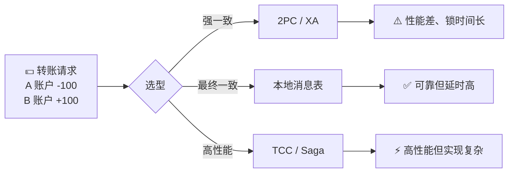
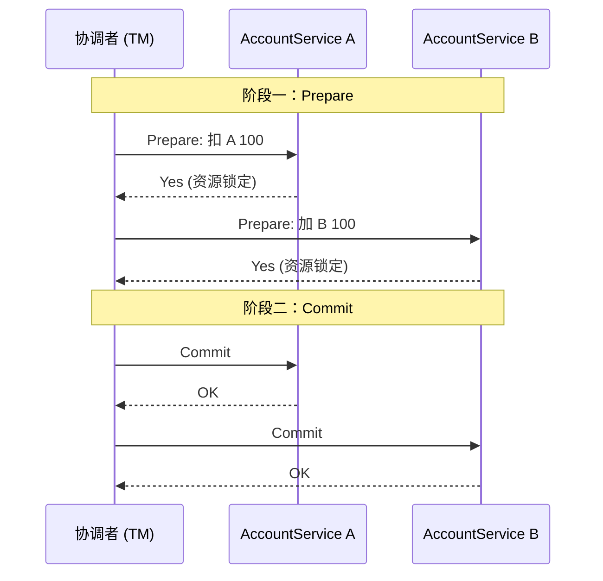
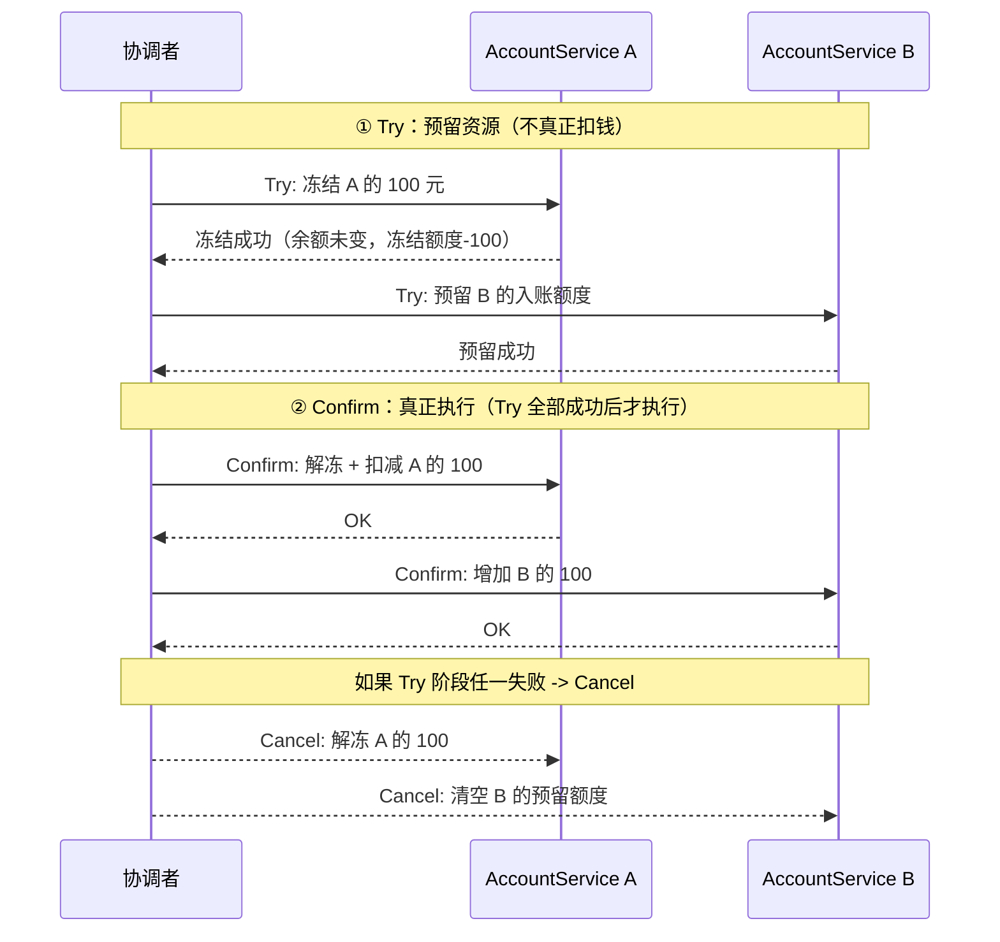
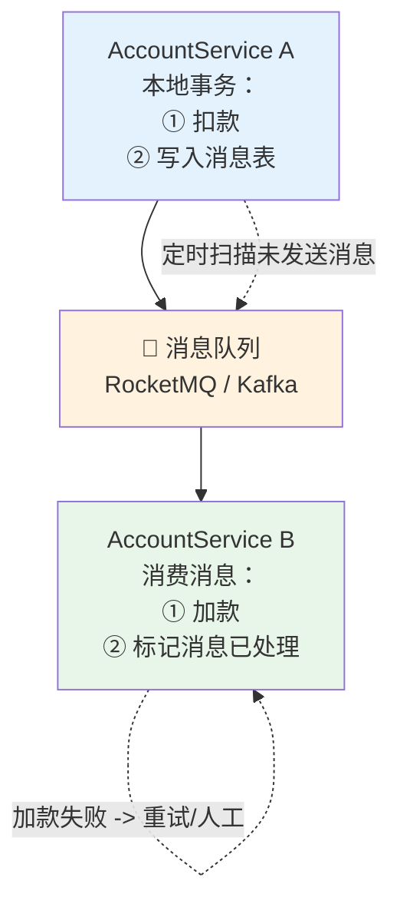
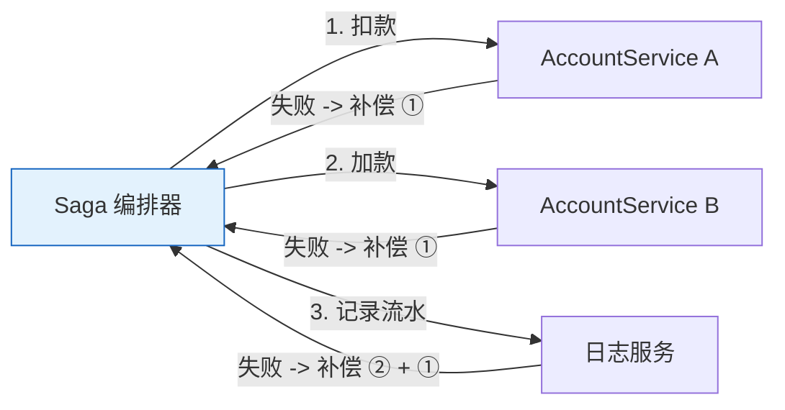
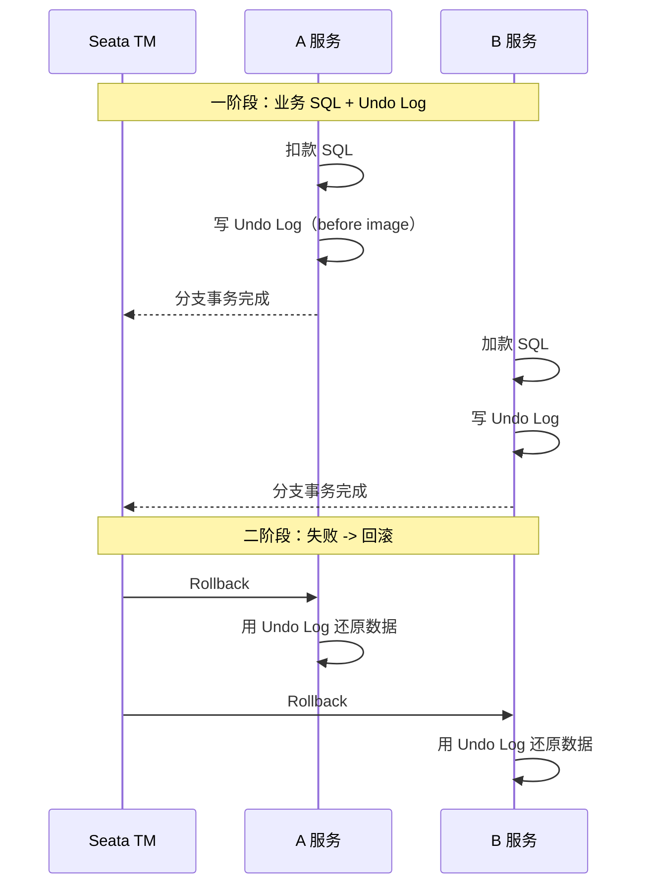
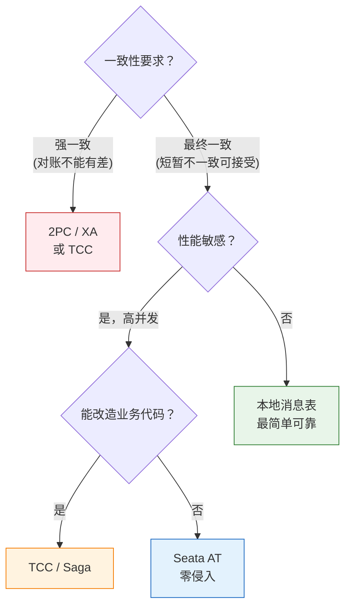

---

# 一、转账场景——分布式事务的终极考题

## 1.1 一个转账拆成两个服务

```
用户发起转账 100 元，A 账户扣 100，B 账户加 100

单体时代：
  BEGIN TX → UPDATE account SET balance = balance - 100 WHERE id = 'A'
           → UPDATE account SET balance = balance + 100 WHERE id = 'B'
           → COMMIT

微服务时代：
  AccountService.debit('A', 100)   ← 一个服务，一个数据库
  AccountService.credit('B', 100)  ← 另一个服务，另一个数据库
```

**核心矛盾**：两个服务的本地事务各自成功或失败，但需要一个全局协调者保证"要么都成功，要么都回滚"。

## 1.2 分布式事务的三种语义

| 语义 | 含义 | 转账场景要求 |
|------|------|------------|
| **原子性** | 扣款和加款要么都做，要么都不做 | ✅ 必须 |
| **一致性** | A 扣了 100，B 必须加 100（不能多也不能少） | ✅ 必须 |
| **隔离性** | 转账过程中其他请求看不到中间态 | ⚠️ 视业务而定 |
| **持久性** | 转账完成后数据不丢失 | ✅ 必须 |

---

# 二、方案一：2PC / XA——强一致的代价

## 2.1 两阶段提交流程



## 2.2 致命弱点

- **锁时间太长**：Prepare 阶段锁定数据库资源，Commit 之前不能释放 → 并发性能差
- **单点故障**：协调者挂了，所有参与者阻塞等待
- **部分 Commit 失败**：A 已提交，B 提交失败 → 需要人工介入
- **不适合微服务**：要求参与者数据库支持 XA 协议（MySQL 支持但性能堪忧）

> **结论**：转账场景用 2PC 太重。只有在必须强一致的金融核心系统（如央行清算）才考虑 XA。

---

# 三、方案二：TCC（Try-Confirm-Cancel）——业务层补偿

## 3.1 核心思想

把一次转账拆成三个操作：**Try（预留资源）→ Confirm（确认）→ Cancel（释放资源）**。



## 3.2 TCC 的代码形态

```java
public class TransferTcc {
    // Try：冻结
    public boolean tryDebit(String accountId, BigDecimal amount) {
        // UPDATE account SET frozen = frozen + amount 
        // WHERE id = ? AND balance - frozen >= amount
        return affectedRows > 0;
    }
    
    // Confirm：真正扣减
    public boolean confirmDebit(String accountId, BigDecimal amount) {
        // UPDATE account SET frozen = frozen - amount, balance = balance - amount
        return true;
    }
    
    // Cancel：解冻
    public boolean cancelDebit(String accountId, BigDecimal amount) {
        // UPDATE account SET frozen = frozen - amount
        return true;
    }
}
```

**优点**：无锁、高性能、业务可控。**缺点**：每个接口要写三个方法，代码量大；Cancel 失败需要重试/人工处理。

---

# 四、方案三：本地消息表 + 最终一致性

## 4.1 核心架构



## 4.2 实现步骤

| 步骤 | 操作 | 保证 |
|------|------|------|
| **①** | A 服务开启本地事务：扣减余额 + 插入一条消息（状态=PENDING） | 同库同事务，原子性保证 |
| **②** | 定时任务扫描 PENDING 消息，发送到 MQ | 发送失败则下次重试 |
| **③** | B 服务消费消息，加款后标记消息为 DONE | 消费幂等（通过消息 ID 去重） |
| **④** | B 服务加款失败 → MQ 重投 → 再次消费 | 最大努力通知 |

**优点**：实现简单，依赖少（只需要一个 MQ + 一张表），阿里内部大量使用。**缺点**：延时较高（秒级），不是强一致。

---

# 五、方案四：Saga——长事务的编排者

## 5.1 协调型 Saga



**Saga 的本质**：把一个大事务拆成一系列本地事务 T1, T2, T3...，每个 Ti 都有一个对应的补偿操作 Ci。如果 Tk 失败，从 C(k-1) 开始逆序执行补偿。

## 5.2 Saga vs TCC

| | TCC | Saga |
|------|-----|------|
| **设计理念** | Try-Confirm-Cancel 三段式 | 正向操作 + 补偿逆序回滚 |
| **一致性** | 较强（Try 阶段预留资源） | 最终一致（补偿异步执行） |
| **实现复杂度** | 高（每个操作 3 个接口） | 中（1 正向 + 1 补偿） |
| **适用场景** | 资金冻结/扣减 | 订单流程、物流、跨服务编排 |

---

# 六、方案五：Seata AT——无侵入的 2PC

## 6.1 Seata AT 模式

Seata AT 是阿里开源的分布式事务框架，**对业务代码零侵入**：

```java
@GlobalTransactional  // ← 只需这一个注解
public void transfer(String from, String to, BigDecimal amount) {
    accountService.debit(from, amount);   // 正常扣款
    accountService.credit(to, amount);    // 正常加款
}
```

Seata 在底层做了两件事：



**优点**：业务代码无感，像本地事务一样写。**缺点**：依赖数据库 UNDO 日志，性能有损耗。

---

# 七、选型决策



| 方案 | 一致性 | 性能 | 复杂度 | 转账场景推荐度 |
|------|--------|------|--------|--------------|
| **2PC/XA** | 强 | ⭐ | 低 | ⭐⭐ |
| **TCC** | 较强 | ⭐⭐⭐⭐ | 高 | ⭐⭐⭐⭐ |
| **本地消息表** | 最终 | ⭐⭐⭐ | 低 | ⭐⭐⭐⭐⭐ |
| **Saga** | 最终 | ⭐⭐⭐⭐ | 中 | ⭐⭐⭐ |
| **Seata AT** | 较强 | ⭐⭐ | 低 | ⭐⭐⭐ |

---

# 八、总结

> **对 90% 的转账场景，本地消息表 + 最终一致性就够了。TCC 留给对一致性有极致要求的场景。2PC 能不用就不用。**

三条实战铁律：

1. **消费端必须幂等**：不管用哪种方案，B 服务的加款操作必须通过唯一 ID 去重
2. **对账是最后防线**：每天跑对账任务，A 扣了 B 没加的——补上；A 没扣 B 加了的——冲正
3. **不要迷信强一致**：分布式世界里，最终一致性是工程最优解

---

*参考资料：*
- *Seata 官方文档: https://seata.io/*
- *Hector Garcia-Molina, "Sagas" (1987)*
- *阿里分布式事务实践*
