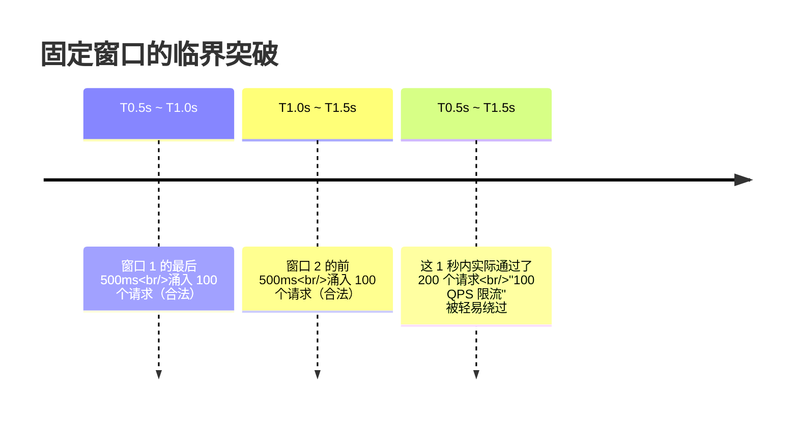
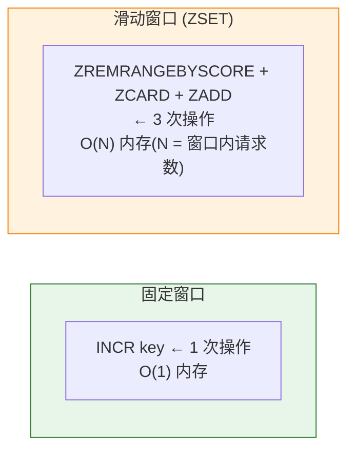
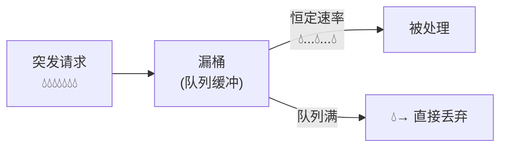
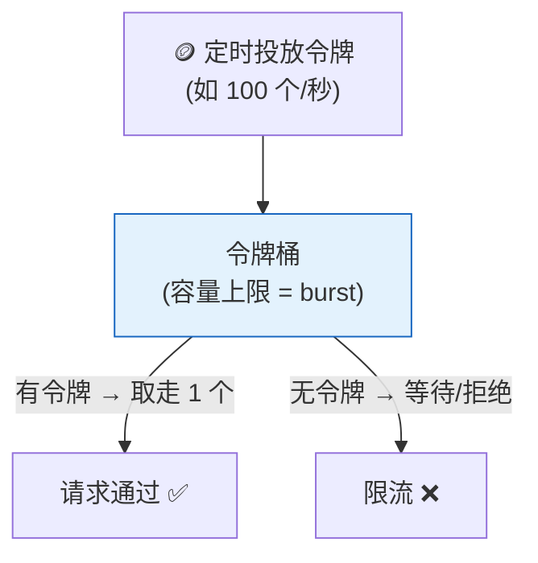

# 一、限流保护的是谁？

限流不是一个功能，是一道防线。它保护的是：

- **下游服务**：数据库连接池、第三方 API 的 QPS 配额
- **系统本身**：防止流量尖峰把 CPU/内存打满
- **其他用户**：一个用户的恶意高频请求不应影响其他用户

**限流的本质**：在请求到达系统之前，拒绝超出系统容量的部分。不是让系统处理得更快，而是让系统不被压垮。

---

# 二、固定窗口计数器——最简单，但有一个致命 Bug

## 2.1 原理

```
窗口 = 1 秒，上限 = 100

第 1 秒（00:00.000 ~ 00:01.000）：计数器从 0 开始
  → 第 101 个请求到达时计数器已到 100 → 被拒
  
第 2 秒（00:01.000）：计数器归零 → 重新计数
```

Redis 一行命令实现：

```
INCR rate_limit:user:123:2026-07-27:10:00:15
EXPIRE rate_limit:user:123:2026-07-27:10:00:15 1
```

key 的粒度精确到秒。用 `INCR` 做原子计数，用 `EXPIRE` 自动清理。

## 2.2 临界突发的致命 Bug



**为什么这是 Bug？** 每个窗口独立计数，两个窗口的边界处完全没有记忆。窗口 1 的尾巴和窗口 2 的头加起来——1 秒内通过了 200 个请求。对于"保护数据库连接池"这种场景，200 QPS 的瞬时流量足以把连接池打满。

---

# 三、滑动窗口——用空间换精度

## 3.1 核心思想

不以"整秒"为窗口边界，而是**以当前时间为终点，向前看一个窗口长度**。窗口随着时间不断滑动。

```
固定窗口：[0.0-1.0), [1.0-2.0), [2.0-3.0)...  ← 有边界间隙
滑动窗口：(now-1s, now]                          ← 始终以 now 为终点
```

## 3.2 Redis ZSET 实现

```java
public boolean isAllowed(String key, int limit, int windowSeconds) {
    long now = System.currentTimeMillis();
    long windowStart = now - windowSeconds * 1000;
    
    // ① 删除窗口外的旧请求记录
    redis.zremrangeByScore(key, 0, windowStart);
    
    // ② 统计当前窗口内的请求数
    long count = redis.zcard(key);
    
    if (count < limit) {
        // ③ 记录本次请求
        redis.zadd(key, now, UUID.randomUUID().toString());
        redis.expire(key, windowSeconds);  // 自动清理
        return true;
    }
    return false;  // 超过限制，拒绝
}
```

**ZSET 方案的优势**：每个请求都保留了精确的时间戳，窗口边界不再是"整秒切"，而是"当前时间的 1 秒前"。临界问题被解决。

**ZSET 方案的代价**：
- 每个请求都要 `zremrangeByScore`（清理旧记录）+ `zcard`（统计）+ `zadd`（记录）= 三次 Redis 操作
- ZSET 的内存占用比计数器（一个 key 一个整数）高得多
- 高 QPS 下 ZSET 操作可能成为 Redis CPU 瓶颈



---

# 四、漏桶（Leaky Bucket）——流量整形，强制均匀



**核心特征**：无论请求到达的速率多高，离开漏桶的速率是恒定的。如果桶满了（队列满了），新请求被直接丢弃。

**适用场景**：**保护脆弱的单点资源**——如数据库连接池（只能承受 500 QPS）、第三方 API（合约规定 100 QPS）。强制平滑流量，不给下游资源带来尖峰。

**为什么令牌桶在大多数场景下更好？** 漏桶不允许突发。即使下游当前完全空闲、能处理更多请求，漏桶也一样慢悠悠地放。对于大多数在线服务（需要快速响应突发的用户请求），这是不可接受的。

---

# 五、令牌桶（Token Bucket）——标准答案

## 5.1 核心机制



**两个参数**：
- **rate**（令牌投放速率）：如 100/s = 每 10ms 生成一个令牌
- **burst**（桶容量）：如 200 个令牌——允许的最大突发量

**为什么允许突发？** 假设正常 QPS=100，但系统偶尔有短暂的空闲期（如凌晨 3:00~3:05 没有任何请求）。令牌桶在这段空闲期积累了 100×300 = 30000 个令牌（受 burst 上限限制），当流量恢复时，前 burst 个请求可以立即通过，不需要等待令牌生成。

```
场景：
rate=100/s, burst=200

T0: 桶里有 200 个令牌（之前空闲期积累的）
T0~T0.1s: 突发 200 个请求 → 瞬间取完 200 个令牌 → 全部通过 ✅
T0.1s+: 令牌以 100/s 速率恢复 → 后续请求按 100 QPS 通过
```

**这就是令牌桶比漏桶好的地方**：允许合理的流量突发，但平均速率仍然被限制。

## 5.2 Guava RateLimiter 源码分析

```java
// Guava RateLimiter.create(100.0) 默认是 SmoothBursty
// 每秒生成 100 个令牌，桶容量 = 1 秒的量（即可以存储 1 秒的令牌）

RateLimiter limiter = RateLimiter.create(100.0);  // 100 QPS

// acquire() → 阻塞直到有令牌可用
double waitSeconds = limiter.acquire();   // 返回等待时间
limiter.acquire(10);                       // 获取 10 个令牌

// tryAcquire() → 非阻塞，拿不到就返回 false
if (limiter.tryAcquire(100, TimeUnit.MILLISECONDS)) {
    doWork();  // 拿到令牌
} else {
    reject();  // 限流
}
```

**SmoothBursty 的令牌桶容量 = maxBurstSeconds × rate**，`maxBurstSeconds` 默认 1.0 秒。所以 `RateLimiter.create(100)` 的桶容量 = 100 个令牌（允许 1 秒的突发量）。

**如果要限制突发**——使用 `SmoothWarmingUp`：

```java
// SmoothWarmingUp：冷启动模式，令牌生成速率从低到高逐渐增加
// 适合"刚启动的系统需要预热"的场景
RateLimiter limiter = RateLimiter.create(100,  // 稳态速率 100 QPS
                                          3,    // 预热时间 3s
                                          TimeUnit.SECONDS);
// 前 3 秒：令牌生成速率从 0 慢慢升到 100 QPS
// 3 秒后：正常的 100 QPS
```

---

# 六、单机限流 vs 分布式限流——架构差异

| 维度 | 单机限流 (Guava) | 分布式限流 (Redis/Sentinel) |
|------|----------------|--------------------------|
| **精度** | 精确（本地内存计数） | 近似（跨网络的 Redis 操作有延迟） |
| **可靠性** | 进程重启丢失 | Redis 持久化，数据不丢 |
| **延迟** | 极低（内存操作） | 较高（至少 1 次 Redis RTT） |
| **适用** | 单实例保护、本地资源 | 集群统一限流、全局限流配额 |

**Sentinel（阿里开源）的分布式限流**结合了两者的优势：先本地限流（快速），再定期向 Sentinel Dashboard 上报和同步配额（全局限流）。

---

# 七、生产配置指南

```java
// 1. API 网关：全局限流 → Redis 滑动窗口
//    每个用户 100 次/秒，每个 IP 1000 次/秒
redis.execute("CL.THROTTLE user:api:" + userId + " 100 100 1");
// 参数：max_burst=100, rate=100/s, window=1s (Redis Stack 的限流模块)

// 2. 数据库连接保护 → 令牌桶 (Guava RateLimiter)
//    不管外面 QPS 多高，放给数据库的不超过 500
private final RateLimiter dbLimiter = RateLimiter.create(500);
public Result query(String sql) {
    dbLimiter.acquire();  // 阻塞式限流
    return jdbc.query(sql);
}

// 3. 秒杀/抢购 → Sentinel 分布式限流
//    "每个用户只能抢 1 次" + "总库存 10000"
//    本地限流 + 分布式同步
```

---

# 八、总结

| 算法 | 突发处理 | 平滑性 | 内存开销 | 典型场景 |
|------|----------|--------|---------|---------|
| **固定窗口** | ❌ 临界双倍 | 差 | 极低 | 粗糙的计数（不推荐生产用） |
| **滑动窗口** | ✅ 精确 | 好 | 中（ZSET） | API 限流（需要精确计数） |
| **漏桶** | ❌ 禁止突发 | **极好** | 低 | 保护数据库、第三方 API |
| **令牌桶** | ✅ 允许突发 | 好 | 低 | **通用首选**（Guava/Sentinel） |

> **令牌桶是限流的标准答案。但答案不是一成不变的——保护数据库用漏桶更安全，用户级 API 限流用滑动窗口更精确。理解每种算法"为什么这样设计"，才能在场景变化时做出正确的选择。**
