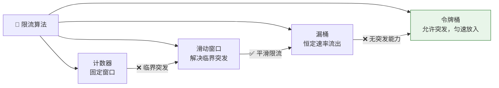
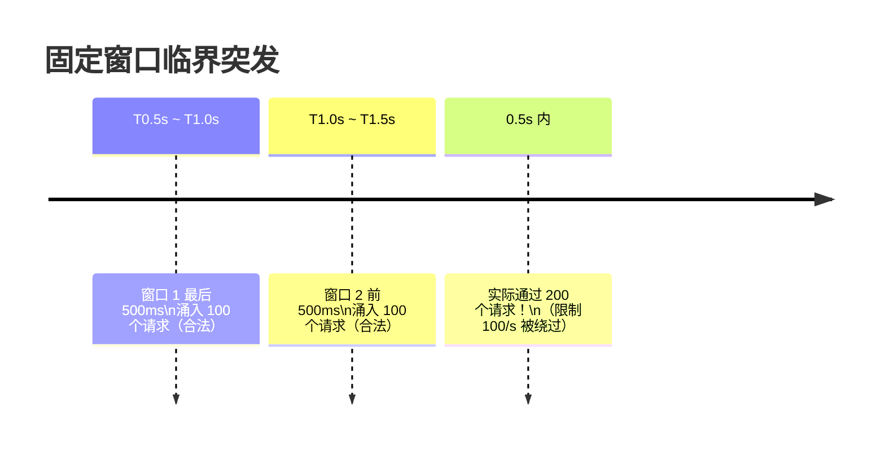
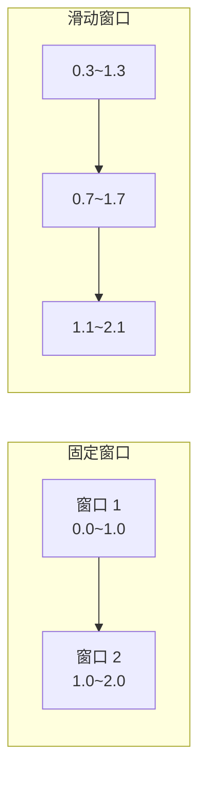
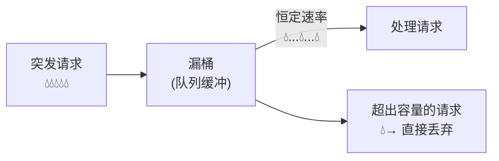
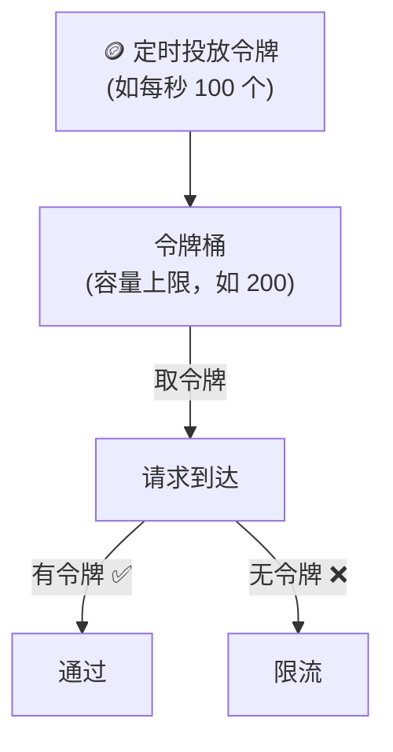

---

# 一、固定窗口计数器——最简单但有 Bug

## 1.1 实现

```
窗口 = 1 秒，上限 = 100
第 0.0s ~ 1.0s：计数 0→100，第 101 个请求被拒
第 1.0s：计数器归零，新窗口开始
```

**Redis 实现一行命令**：
```
INCR rate:user:123:2026-06-28-10:00:15
EXPIRE rate:user:123:2026-06-28-10:00:15 1
```

## 1.2 临界突发的致命 Bug



> 两个窗口的边界处，0.5 秒内通过了 200 个请求。"限流 100/s"变成了一句空话。

---

# 二、滑动窗口——解决临界问题

## 2.1 核心思想

不再按"整秒"切窗口，而是**以当前时间为终点，向前看一个窗口长度**。



## 2.2 Redis 实现（ZSET）

```java
public boolean isAllowed(String userId, int limit, int windowSec) {
    long now = System.currentTimeMillis();
    long windowStart = now - windowSec * 1000;
    
    String key = "rate:" + userId;
    // 删除窗口外的旧记录
    redis.zremrangeByScore(key, 0, windowStart);
    // 统计窗口内的请求数
    long count = redis.zcard(key);
    
    if (count < limit) {
        redis.zadd(key, now, UUID.randomUUID().toString());
        redis.expire(key, windowSec);
        return true;
    }
    return false;
}
```

**代价**：每个请求都要写 ZSET（`zadd`），内存和 CPU 开销比固定窗口高。

---

# 三、漏桶（Leaky Bucket）——恒定速率



**特点**：
- 流出速率恒定（强整形能力）
- 突发流量被削平
- **缺点**：即使下游能处理更多，也不允许突发

**适用**：需要严格平滑流量的场景（如保护数据库连接池）。

---

# 四、令牌桶（Token Bucket）——标准答案

## 4.1 核心机制



**两个关键参数**：
- **rate**：令牌投放速率（如 100/s）
- **burst**：桶容量（如 200）——允许的最大突发量

## 4.2 令牌桶能处理突发

```
正常：每秒 100 个令牌，用完即止
突发前：桶里攒了 200 个令牌（系统空闲时积累的）
突发来：200+ 请求瞬间取完 200 个令牌 → 全部通过！
之后：继续按 100/s 速率投放
```

> 这就是令牌桶比漏桶灵活的地方——**允许合理的突发，同时限制平均速率**。

## 4.3 Guava RateLimiter 用法

```java
RateLimiter limiter = RateLimiter.create(100.0);  // 100 QPS

// 阻塞获取
limiter.acquire();  // 没令牌就等

// 非阻塞
if (limiter.tryAcquire(100, TimeUnit.MILLISECONDS)) {
    doWork();
} else {
    // 被限流
}
```

---

# 五、四种算法对比

| 算法 | 突发处理 | 平滑性 | 实现复杂度 | 典型场景 |
|------|----------|--------|-----------|----------|
| **固定窗口** | ❌ 临界突发 | 差 | ⭐ | 简单计数场景 |
| **滑动窗口** | ✅ 精确 | 好 | ⭐⭐ | API 限流 |
| **漏桶** | ❌ 不允许 | 极好 | ⭐⭐ | 保护下游（DB） |
| **令牌桶** | ✅ 允许 | 好 | ⭐⭐ | **通用首选** |

---

# 六、总结

> **令牌桶是限流算法的标准答案——允许合理突发，限制平均速率。滑动窗口解决计数精度，漏桶解决强整形需求。工程上 90% 的场景一块 Guava RateLimiter 就够。**

*本文参考资料：*
- Martin Kleppmann《Designing Data-Intensive Applications》（DDIA）——第 5 章（复制）、第 7 章（事务）、第 8-9 章（分布式系统与共识）
- Diego Ongaro, "In Search of an Understandable Consensus Algorithm (Raft)", 2014: https://raft.github.io/raft.pdf
- Leslie Lamport, "Paxos Made Simple", 2001
- antirez, "Is Redlock safe?", 2016: http://antirez.com/news/101
- Eric Brewer, "CAP Twelve Years Later", 2012
- Daniel Abadi, "PACELC", 2010
- Alibaba Seata 官方文档: https://seata.io/
- Redis 官方文档 - Distributed Locks: https://redis.io/docs/manual/patterns/distributed-locks/
