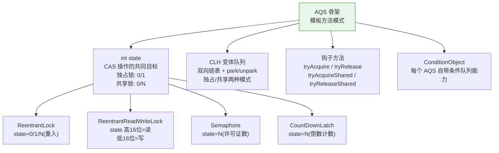
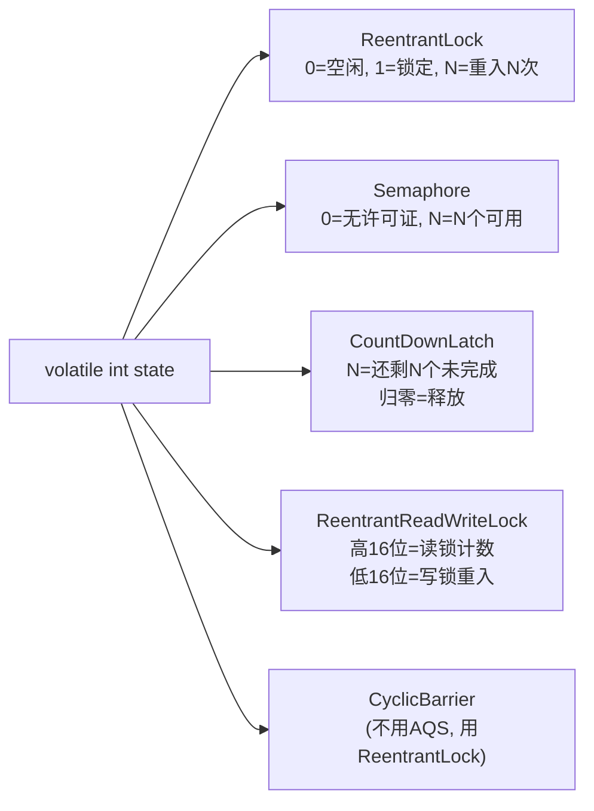
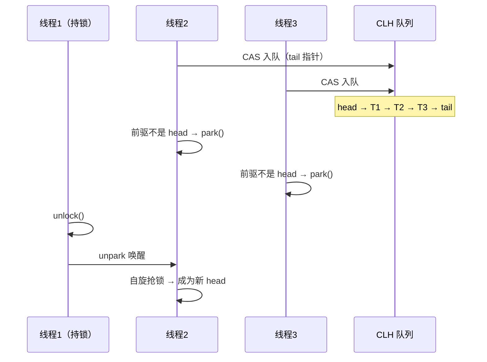
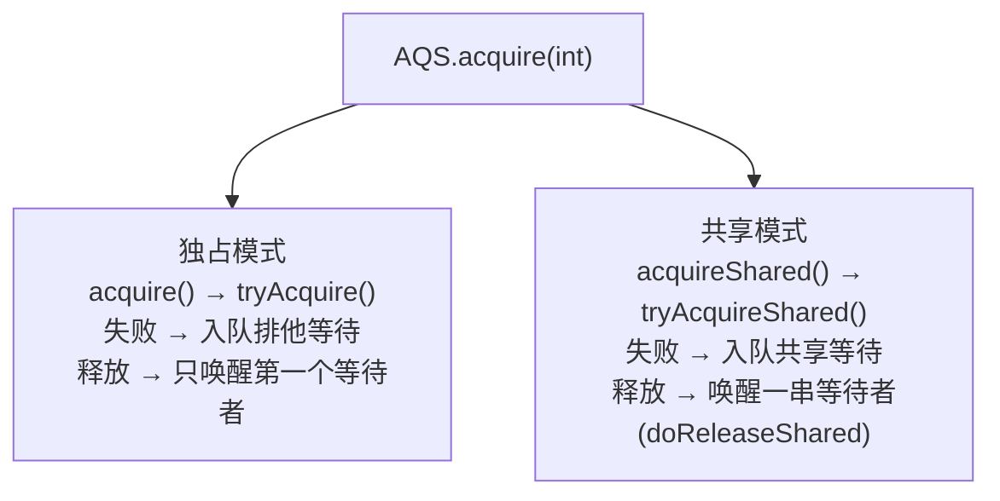

---

# 一、AQS 的本质——模板方法模式的极致应用

```java
// AQS 定义了"怎么排队和唤醒"（框架方法，不可覆盖）
public final void acquire(int arg) {
    if (!tryAcquire(arg) &&          // ← 这步留给子类实现
        acquireQueued(addWaiter(...), arg))
        selfInterrupt();
}

// 子类只实现"怎么判断能不能拿/放"
protected boolean tryAcquire(int arg) {
    throw new UnsupportedOperationException(); // ← 留给子类
}
```

| AQS 提供的（框架） | 子类实现的（钩子） |
|---------------------|-------------------|
| `acquire()` 排队+park | `tryAcquire()` 判断能拿吗 |
| `release()` 唤醒队首 | `tryRelease()` 判断能放吗 |
| `acquireShared()` 共享模式 | `tryAcquireShared()` |
| `CLH 队列维护` | `isHeldExclusively()` |
| `ConditionObject` | — |

---

# 二、state —— 一把锁的"灵魂数字"

所有并发工具共享同一个 `volatile int state`，但赋予它截然不同的含义：



**核心操作**：`compareAndSetState(expect, update)` —— 所有工具的"抢锁"最后都落到这个 CAS 上。

---

# 三、CLH 队列的妙处——无锁入队 + 自旋 + park



**为什么是 CLH 变体？**
- 入队只需 CAS tail 指针（无锁）
- 前驱通知后继（只 unpark 一个，避免惊群）
- 双向链表支持超时取消（prev 指针用于前驱唤醒后继）

---

# 四、独占与共享——同一套骨架，两种模式

```java
// 独占模式（ReentrantLock）
acquire(1);           // 只有一个线程能拿到
release(1);

// 共享模式（Semaphore, CountDownLatch）
acquireShared(1);     // 多个线程可以同时拿
releaseShared(1);     // 释放后唤醒一串等待者
```



---

# 五、AQS 的"不完美"——为什么 CyclicBarrier 不用它？

AQS 独占模式天然适合"一个线程争一个资源"。但 CyclicBarrier 是"N 个线程等 N 个线程"——不是"争"而是"互等"。用 AQS 实现反而更复杂，所以 CyclicBarrier 直接用 `ReentrantLock + Condition`。

---

# 六、总结

| 问题 | 答案 |
|------|------|
| **为什么全基于 AQS？** | 排队、唤醒、超时、取消是通用难题，AQS 一次性解决好 |
| **state 为什么是 int？** | CAS 只能原子操作 32/64 位，int 是最简载体 |
| **CLH 为什么选变体？** | 原版 CLH 自旋消耗 CPU，变体加 park/unpark 省 CPU |
| **Condition 为什么在 AQS 里？** | Condition 的等待→CLH转移 必须感知同步队列，拆不出来 |

*本文参考资料：*
- Brian Goetz et al.《Java Concurrency in Practice》——第 3-5 章（共享与组合对象）、第 6-8 章（任务执行与线程池）、第 11-12 章（性能与可伸缩性）
- Doug Lea, "The java.util.concurrent Synchronizer Framework"（AQS 论文）, 2004
- Java Language Specification, Chapter 17: Threads and Locks（JMM）: https://docs.oracle.com/javase/specs/jls/se17/html/jls-17.html
- JSR-133 FAQ: https://www.cs.umd.edu/~pugh/java/memoryModel/jsr-133-faq.html
- OpenJDK 源码: java.util.concurrent 包（AbstractQueuedSynchronizer / ThreadPoolExecutor / ReentrantLock 等）
