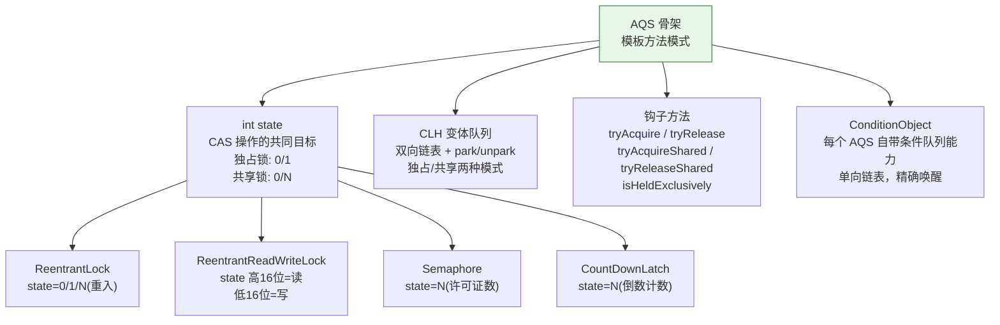
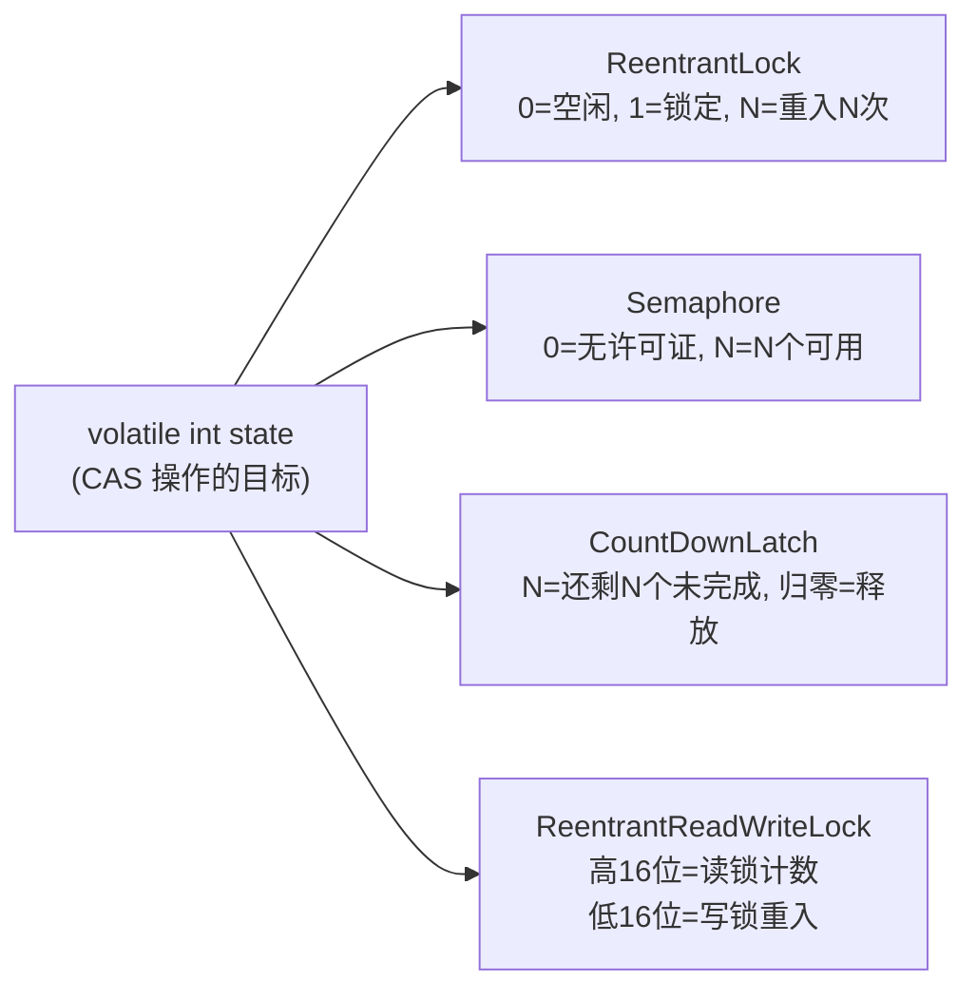
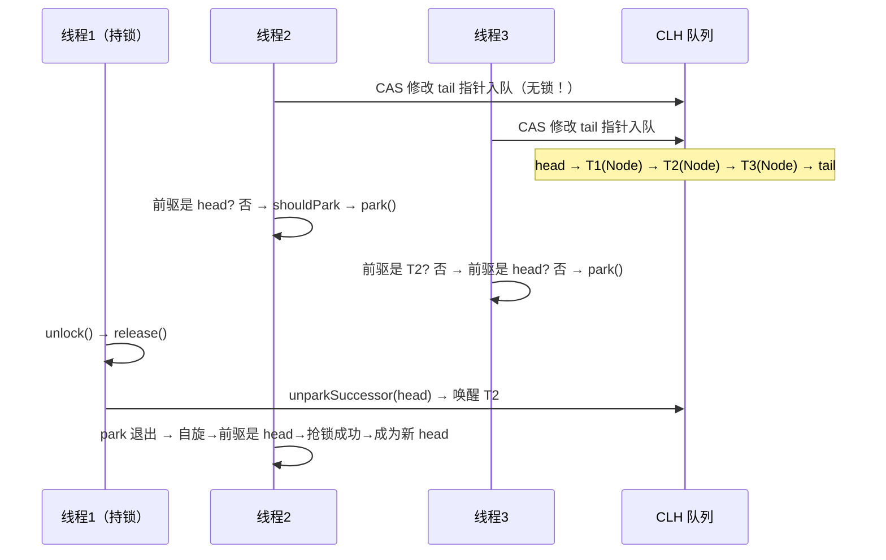
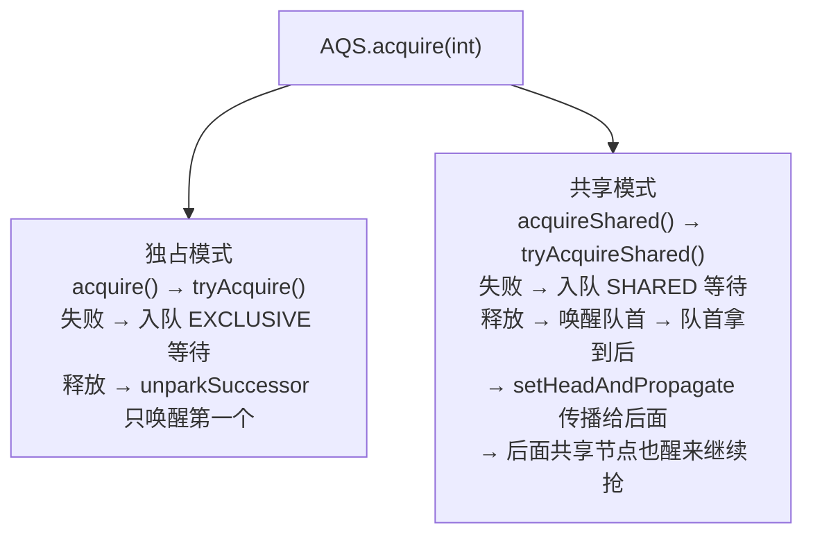

# 历史背景——Doug Lea 为什么需要一个"框架"？

2002 年，JSR-166（Java 并发工具包）的专家组成员 Doug Lea 面对一个棘手的问题。Java 1.4 的并发原语只有 `synchronized` + `wait/notify`，这份工具箱太简陋了——他想加入 `ReentrantLock`、`Semaphore`、`CountDownLatch`、`FutureTask` 等更灵活的并发工具。

如果每个工具都从零实现，代码量巨大且有大量重复逻辑：（1）线程排队管理（谁先等谁后等）、（2）阻塞和唤醒（park/unpark）、（3）超时和取消（等一会不等了怎么办）、（4）条件等待（wait 在特定条件上）。这些是所有同步器共同面临的问题。

Doug Lea 的解决方案在 2004 年的论文 **"The java.util.concurrent Synchronizer Framework"** 中完整阐述：提取一个抽象骨架类 `AbstractQueuedSynchronizer`（AQS），把所有"排队、阻塞、唤醒、超时"的通用复杂性封装好，子类只需要实现"能不能拿"和"能不能放"的决策逻辑。

这就是为什么 `ReentrantLock`、`Semaphore`、`CountDownLatch`、`ReentrantReadWriteLock`、`CyclicBarrier`（间接）都"长在 AQS 上"——不是巧合，而是刻意的框架设计。理解了 AQS 骨架的四根支柱，你就理解了 Java 并发工具包的设计基因。



---

# 一、AQS 的本质——模板方法模式

## 1.1 What：AQS 是什么？

AQS 是一个 **FIFO 双向队列 + int 状态变量** 的组合体。它提供了一套完整的"谁排队、谁唤醒、谁超时"的框架逻辑，然后把"能不能获得锁"这个决策抛给子类来完成。

```java
// AQS.acquire() —— 框架方法（final，不可覆盖）
public final void acquire(int arg) {
    if (!tryAcquire(arg) &&                          // ① 子类判断"能拿吗"
        acquireQueued(addWaiter(Node.EXCLUSIVE), arg)) // ② 不能拿→排队→park
        selfInterrupt();                              // ③ 被唤醒后恢复中断状态
}

// tryAcquire() —— 钩子方法（子类必须实现）
protected boolean tryAcquire(int arg) {
    throw new UnsupportedOperationException();  // 默认抛异常，强制子类覆盖
}
```

## 1.2 Why：为什么这样分？

| AQS 提供的（框架，final，子类不能改） | 子类实现的（钩子，必须覆盖） |
|--------------------------------------|---------------------------|
| `acquire()` —— 排队 + park + 响应中断 | `tryAcquire()` —— 判断"我能拿吗" |
| `release()` —— 唤醒队首节点 | `tryRelease()` —— 判断"我能放吗" |
| `acquireShared()` —— 共享模式排队 | `tryAcquireShared()` —— 还有剩余许可吗 |
| `CLH 队列维护`（入队/出队/取消/CAS） | `isHeldExclusively()` —— 当前线程是否独占 |
| `ConditionObject`（条件等待/唤醒） | — |

**分离的价值**：Doug Lea 把并发控制中最困难的部分（无锁队列、park/unpark 调度、超时处理、中断传播）**一次性写好并彻底测试**。每个同步器子类只需要关注一个简单问题："state 值满足什么条件时我能通过？" 这就是为什么 `ReentrantLock` 的核心代码不到 200 行——因为排队、唤醒、取消队列的逻辑全在 AQS 里。

---

# 二、state —— 一把锁的"灵魂数字"

## 2.1 What：state 为什么是 int？

所有并发工具共享同一个 `volatile int state`，但赋予它截然不同的语义：



**为什么是 `int` 而不是 `long`？** CAS 在 32 位 JVM 上只能原子操作 32 位的数据。如果 state 用 `long`，在 32 位平台上需要两次 CAS 才能完成操作——失去了原子性。`int` 是最小公分母，同时 `volatile int` 保证了跨线程可见性。

## 2.2 How：state 的 CAS 操作

```java
// AQS 中对 state 的三个原子操作
protected final boolean compareAndSetState(int expect, int update) {
    // 底层调用 Unsafe.compareAndSwapInt → CPU 的 CMPXCHG 指令
    return U.compareAndSetInt(this, STATE, expect, update);
}

protected final int getState()  { return state; }           // volatile 读
protected final void setState(int newState) { state = newState; } // volatile 写（仅在持锁时用）
```

**所有并发工具的"抢锁"最后都落到这个 CAS 上**。

```java
// ReentrantLock.NonfairSync.lock() —— 最内层
final void lock() {
    if (compareAndSetState(0, 1))       // ← 就是这个 CAS！
        setExclusiveOwnerThread(Thread.currentThread());
    else
        acquire(1);
}
```

---

# 三、CLH 队列——无锁入队 + 自旋 + park

## 3.1 What：CLH 队列是什么？

CLH 队列（Craig, Landin, and Hagersten，1993 年的论文）原本是一个自旋锁队列——每个线程在**前驱节点**上自旋。AQS 改造了它：

- 原版 CLH：每个节点在前驱节点上自旋等待（消耗 CPU）
- AQS CLH 变体：只有前驱是 head 时才自旋几次，否则 **park() 挂起**（省 CPU）



## 3.2 How：关键源码片段

```java
// addWaiter —— 入队（无锁 CAS）
private Node addWaiter(Node mode) {
    Node node = new Node(mode);
    for (;;) {
        Node oldTail = tail;
        if (oldTail != null) {
            node.setPrevRelaxed(oldTail);     // 先连 prev
            if (compareAndSetTail(oldTail, node)) {  // CAS 改 tail！
                oldTail.next = node;           // 再连 next
                return node;
            }
        } else {
            initializeSyncQueue();  // 队列为空 → 初始化
        }
    }
}

// acquireQueued —— 排队 + 自旋 + park
final boolean acquireQueued(final Node node, int arg) {
    boolean interrupted = false;
    for (;;) {
        final Node p = node.predecessor();
        if (p == head && tryAcquire(arg)) {  // 前驱是 head 且抢到了
            setHead(node);                    // 自己变成 head
            p.next = null;  // help GC
            return interrupted;
        }
        // 前驱不是 head 或抢不到 → 判断是否需要 park
        if (shouldParkAfterFailedAcquire(p, node) && parkAndCheckInterrupt())
            interrupted = true;  // 记录中断状态，park 被 unpark 唤醒后继续循环
    }
}
```

**`shouldParkAfterFailedAcquire` 的微妙逻辑**：

```java
private static boolean shouldParkAfterFailedAcquire(Node pred, Node node) {
    int ws = pred.waitStatus;
    if (ws == Node.SIGNAL)       // 前驱已经承诺"我释放时通知你"
        return true;              // → 可以安心 park
    if (ws > 0) {                // 前驱被取消了 → 跳过它
        do {
            node.prev = pred = pred.prev;
        } while (pred.waitStatus > 0);
        pred.next = node;        // 重新链接
    } else {
        pred.compareAndSetWaitStatus(ws, Node.SIGNAL); // 让前驱承诺通知
    }
    return false;
}
```

**关键设计**：没有用一个集中的"等待队列管理器"。每个节点自己把自己挂到 tail 上（CAS 操作），每个节点自己检查前驱的状态决定是否 park。所有的队列操作都是**分布式**的——没有中心锁。

---

# 四、独占与共享——同一套骨架，两种传播模式

## 4.1 What：独占和共享的区别

```java
// 独占模式（ReentrantLock）
// 只有一个线程能拿到锁，释放时只唤醒队首第一个等待者
acquire(1);           // 拿不到就排队（EXCLUSIVE 模式）
release(1);           // 释放 → unparkSuccessor 只唤醒 head 后的第一个节点

// 共享模式（Semaphore, CountDownLatch）
// 多个线程可以同时持有，释放时唤醒一串等待者
acquireShared(1);     // 拿不到就排队（SHARED 模式）
releaseShared(1);     // 释放 → doReleaseShared 唤醒队首 → 队首如果发现还有许可
                      //   → setHeadAndPropagate 继续唤醒后面的共享节点
```

## 4.2 Why：共享模式的"传播"机制



```java
// 共享模式释放的传播逻辑（极度精简的伪代码）
private void doReleaseShared() {
    for (;;) {
        Node h = head;
        if (h != null && h != tail) {
            int ws = h.waitStatus;
            if (ws == Node.SIGNAL) {
                if (!h.compareAndSetWaitStatus(Node.SIGNAL, 0)) continue;
                unparkSuccessor(h);  // 唤醒队首
            }
        }
        if (h == head) break;  // 如果 head 没变（被唤醒的节点还没成为新 head）→ 退出
        // 如果 head 变了 → 说明被唤醒者获得了锁并成为了新 head → 继续循环 → 继续传播！
    }
}
```

这就是 CountDownLatch 归零后能一次性唤醒所有 `await()` 线程的底层原因——共享模式的传播链。

---

# 五、为什么 CyclicBarrier 不用 AQS？

AQS 独占模式天然适合"一个线程争一个资源"的场景。但 CyclicBarrier 是"N 个线程等 N 个线程"——不是"争"而是"互等"，核心逻辑是"**计数器递增到 parties 后全员释放，然后重置计数器**"——这套语义用 AQS 的 `state` 加减逻辑实现反而比直接用 `ReentrantLock + Condition` 更复杂。所以 Doug Lea 选择了一个更简单的方案：一把 `ReentrantLock` 保护计数器 + 一个 `Condition` 做全员等待和唤醒。

**工具选择的原则**：如果你的场景是"争资源"（一个资源 N 个想用）→ AQS 独占/共享模式；如果是"互等"（N 个互相等到齐）→ `ReentrantLock + Condition` 更直接。

---

# 六、总结

| 问题 | 答案 |
|------|------|
| **为什么 JDK 并发工具全基于 AQS？** | 排队、唤醒、超时、中断是一套通用难题，AQS 一次性彻底解决 |
| **state 为什么是 int？** | CAS 只能原子操作 32 位（32 位 JVM 上 64 位需两次 CAS） |
| **CLH 为什么选变体而非原版？** | 原版 CLH 自旋消耗 CPU；变体加 park/unpark 省 CPU 且支持超时/取消 |
| **Condition 为什么在 AQS 里？** | Condition 的等待→CLH 转移需要感知同步队列内部状态，拆不出来 |
| **CyclicBarrier 为什么例外？** | "互等"语义用 AQS 实现不如 `Lock+Condition` 简洁 |

# 延伸阅读

**Do——动手验证：**
- 写一个基于 AQS 的简单互斥锁（继承 AQS，覆盖 `tryAcquire`/`tryRelease`），对比与 `ReentrantLock` 的性能
- 用 `jstack <pid>` 观察一个阻塞在 `ReentrantLock.lock()` 上的线程栈——能看到 `park()` 调用（`Unsafe.park`）
- 跟踪 `Semaphore.acquire()` 的源码调用链：`acquire` → `acquireSharedInterruptibly` → `tryAcquireShared` → `doAcquireSharedInterruptibly`

**Todo——深入方向：**
- AQS 的取消逻辑——`cancelAcquire()` 如何处理在队列中等待的线程超时或中断
- `ConditionObject` 的 `awaitNanos()` 超时实现——与 `LockSupport.parkNanos()` 的配合
- `StampedLock`（JDK 8）为什么不用 AQS——读写模式的乐观读需要完全不同的队列设计
- `AbstractQueuedLongSynchronizer`（JDK 6）——用 `long` 替代 `int` state 的 AQS 版本，什么场景需要

*本文参考资料：*
- Doug Lea, "The java.util.concurrent Synchronizer Framework" (AQS 论文), 2004
- Brian Goetz et al.《Java Concurrency in Practice》——第 13-15 章（显式锁与同步器）
- OpenJDK 源码: `java.util.concurrent.locks.AbstractQueuedSynchronizer`
