# 历史背景——为什么需要 CAS？

在 `synchronized` 还是唯一并发控制手段的年代，`i++` 这样的简单操作也需要完整的锁机制来保护。这带来两个问题：**重量级**（即使没竞争也要走内核态 mutex）和**死锁风险**（锁嵌套的顺序稍有不慎就卡死）。

2004 年，JSR-166 的 Doug Lea 在 AQS 论文中提出了一个更轻量的替代方案——**CAS（Compare-And-Swap，比较并交换）**。它不阻塞线程，不需要内核态切换，不依赖锁的排队机制——一条 CPU 指令完成"比较+修改"的原子操作。

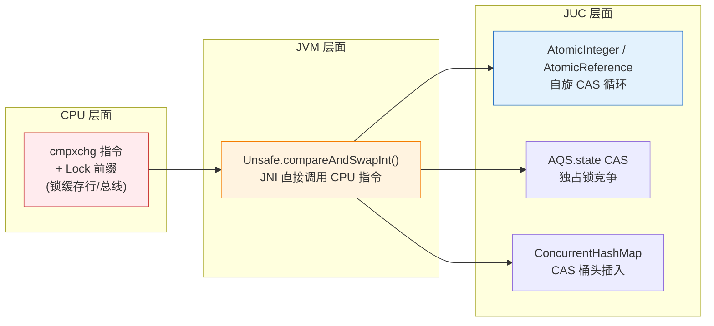

CAS 之于 JUC，就像 MOSFET 之于芯片——它是**最小的原子构件**，所有更复杂的并发工具（锁、队列、容器）最终都依赖它来完成无锁状态变更。

---

# 一、CPU 层面——CAS 到底是什么？

## 1.1 cmpxchg：一条指令完成比较和交换

CAS 的全称是 **Compare-And-Swap**，语义可以浓缩为一行：

```java
// CAS 的语义（实际上这是一条 CPU 指令，不拆分为三步）
boolean cas(int expected, int newValue) {
    if (内存当前值 == expected) {
        内存当前值 = newValue;
        return true;
    }
    return false;
}
```

但在 x86 架构上，这并不是三步 Java 代码——它被编译为一条 CPU 指令：

```asm
; x86 汇编
lock cmpxchg [目标内存地址], 新值
; 含义: 如果 EAX(累加器) == [目标内存地址]
;        则 [目标内存地址] ← 新值, ZF ← 1
;        否则 EAX ← [目标内存地址], ZF ← 0
```

这条指令的原子性由 `LOCK` 前缀保证。Intel 手册中明确定义：

> **LOCK 前缀的效果**：在执行伴随 LOCK 前缀的指令期间，处理器会锁住缓存行（cache line）或总线（bus），确保该内存区域的读-改-写操作对其他处理器不可见，直到操作完成。

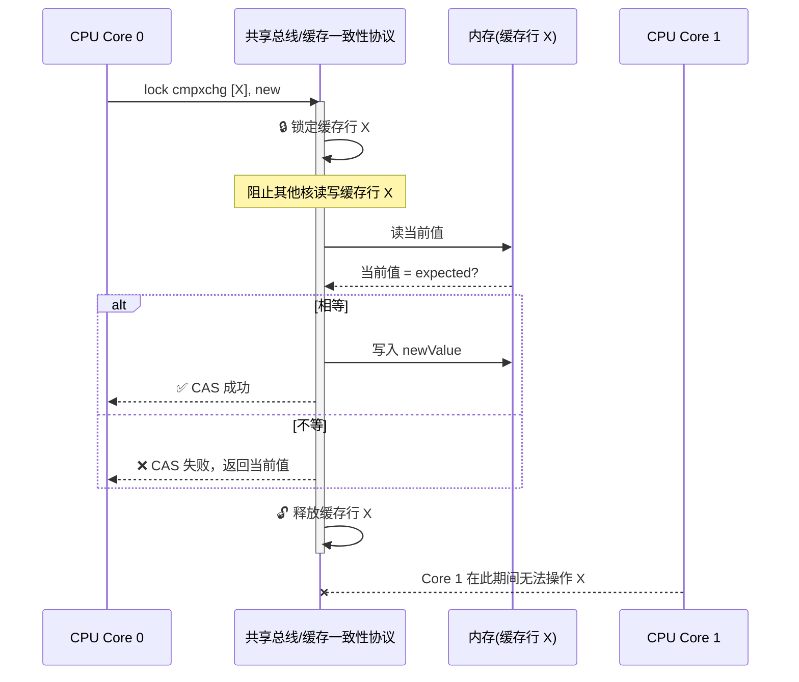

## 1.2 缓存行锁定 vs 总线锁定

现代 CPU 不会真的锁整个总线——那样代价太大。**缓存锁（Cache Locking）** 是更精细的方案：

| 锁类型 | 粒度 | 触发条件 | 代价 |
|---|---|---|---|
| **缓存锁** | 单个缓存行（64 字节） | 操作数在缓存行边界内，MESI 协议可处理 | 低（只影响同缓存行的其他核） |
| **总线锁** | 整个系统总线 | 操作数跨缓存行，或不支持缓存锁的旧 CPU | 高（阻止所有总线通信） |

**关键点**：CAS 的性能瓶颈不在于 CPU 指令本身（`cmpxchg` 只需 1 个 CPU 周期），而在于 **Lock 前缀带来的缓存一致性开销**。当多个核同时对同一缓存行做 CAS 时，缓存行在核之间反复跳跃（cache line bouncing），这才是 CAS 在高竞争下的真实代价。

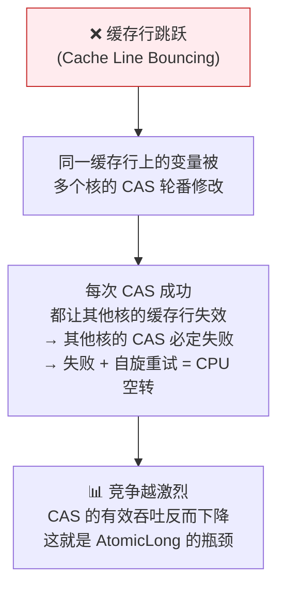

---

# 二、JVM 层面——Unsafe 的魔法

## 2.1 Unsafe：Java 世界的"后门"

Java 语言层面没有指针运算，但 CAS 必须操作内存地址。`sun.misc.Unsafe` 就是这道"后门"——它是一组 `native` 方法，直接通过 JNI 调用 CPU 指令。

```java
// sun.misc.Unsafe (JDK 8/11/17/21 均有，但 Java 9+ 藏在 jdk.unsupported 模块中)
public final class Unsafe {
    // 单例模式
    private static final Unsafe theUnsafe;
    
    // CAS 核心方法
    public final native boolean compareAndSwapInt(
        Object o,      // 目标对象
        long offset,   // 字段在对象中的偏移量
        int expected,  // 期望值
        int x          // 新值
    );
    
    public final native boolean compareAndSwapLong(Object o, long offset, long expected, long x);
    
    // 获取字段偏移量（这是 AtomicInteger 能够定位 value 字段的关键）
    public native long objectFieldOffset(Field f);
}
```

Unsafe 之所以叫 "Unsafe"，因为它绕过所有 Java 安全保障：

- **绕过访问控制**：直接操作 private 字段
- **绕过类型检查**：裸指针操作，错一个偏移量就写到数据结构外
- **绕过 GC**：直接分配/释放堆外内存（`allocateMemory`/`freeMemory`）

但 JUC 框架依赖它——没有 Unsafe，就没有无锁编程。

## 2.2 如何获取字段的偏移量？

```java
// Unsafe 获取字段偏移量 —— AtomicInteger 类初始化的核心步骤
public class AtomicInteger {
    private static final Unsafe unsafe = Unsafe.getUnsafe();
    private static final long valueOffset;  // value 字段的"坐标"
    
    static {
        try {
            valueOffset = unsafe.objectFieldOffset(
                AtomicInteger.class.getDeclaredField("value")
            );
        } catch (Exception ex) {
            throw new Error(ex);
        }
    }
    
    private volatile int value;
    // ...
}
```

`objectFieldOffset` 返回的是 `value` 字段在 `AtomicInteger` 对象内存布局中的**字节偏移量**。有了 `this`（对象引用）+ `valueOffset`（偏移量），Unsafe 就能用 `this + valueOffset` 计算出 `value` 的**绝对内存地址**，然后把地址传给 `cmpxchg` 指令。

---

# 三、AtomicInteger——自旋 CAS 的标准范式

## 3.1 源码剖析

```java
public class AtomicInteger extends Number implements java.io.Serializable {
    private static final Unsafe unsafe = Unsafe.getUnsafe();
    private static final long valueOffset;
    private volatile int value;  // ← volatile 保证可见性
    
    // 自增并返回新值
    public final int incrementAndGet() {
        return unsafe.getAndAddInt(this, valueOffset, 1) + 1;
    }
    
    // Unsafe 中的自旋 CAS 循环
    // JDK 8 源码
    public final int getAndAddInt(Object o, long offset, int delta) {
        int v;
        do {
            v = this.getIntVolatile(o, offset);  // ① 读最新值（volatile 读）
        } while (!this.compareAndSwapInt(o, offset, v, v + delta)); // ② CAS 尝试更新
        return v;                                  // ③ 失败就重试
    }
}
```

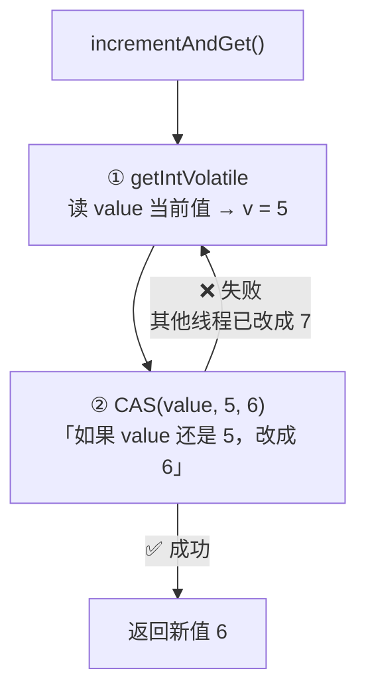

这就是**自旋 CAS 的经典范式**：

1. **原子读**：获取变量的最新值
2. **原子 CAS**：尝试将值从旧值改为新值
3. **自旋重试**：如果 CAS 失败（中间有人改了），重新读最新值再试

## 3.2 自旋多少次才放弃？

`AtomicInteger` 不会放弃——它**无限自旋**。这在低竞争场景没问题（失败率低，很快成功），但在高竞争场景会 CPU 空转。这也是为什么后面要引入 `LongAdder`。

JDK 9+ 的 `compareAndSet` 内部使用了 `@HotSpotIntrinsicCandidate` 注解，HotSpot 会将其内联为**单条 CPU 指令**——无方法调用开销，这得益于 JIT 编译器的 intrinsic 优化。

## 3.3 CAS 的三大问题

| 问题 | 说明 | 典型场景 |
|---|---|---|
| **ABA 问题** | 值从 A→B→A，CAS 检测不到中间变化 | 链表节点的 CAS 操作 |
| **循环开销** | 高竞争下 CAS 反复失败，CPU 空转 | 计数器热点 |
| **只能保证一个变量** | 无法原子地更新多个变量 | 双向链表的 prev/next 同时更新 |

---

# 四、ABA 问题——CAS 的"阿喀琉斯之踵"

## 4.1 什么是 ABA 问题？

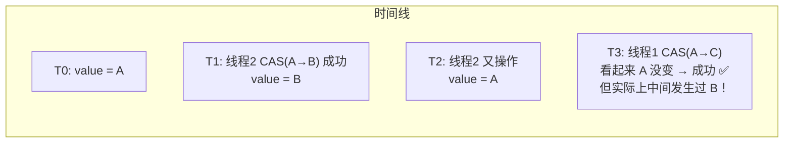

一个经典的 ABA 陷阱场景——**无锁栈的 pop 操作**：

```java
// ❌ 危险的 ABA 示例：无锁栈 pop
class SimpleLockFreeStack<T> {
    AtomicReference<Node<T>> top = new AtomicReference<>();
    
    public T pop() {
        Node<T> oldTop;
        Node<T> newTop;
        do {
            oldTop = top.get();            // ① 读栈顶
            if (oldTop == null) return null;
            newTop = oldTop.next;          // ② 新栈顶 = 原栈顶的下一个节点
        } while (!top.compareAndSet(oldTop, newTop)); // ③ CAS 替换栈顶
        // ⚠️ 问题：oldTop 指向的节点可能已经被其他线程 pop 后重新 push 了
        //    此时 oldTop.next 可能指向已经被释放的内存！
        return oldTop.value;
    }
}
```

**具体攻击场景**：

1. 栈 `A → B → C`（top = A）
2. 线程 1 要 pop，读 oldTop = A，newTop = B
3. 线程 2 连续 pop A、pop B、push A（A 回到了栈顶）
4. 线程 1 的 CAS(A→B) 成功——但它设置 newTop = B 是错的！B 早已不在栈中

## 4.2 AtomicStampedReference——给值加个"版本号"

```java
// ✅ 用版本号解决 ABA
public class AtomicStampedReference<V> {
    // 内部用 Pair 同时存储引用和版本号
    private static class Pair<T> {
        final T reference;
        final int stamp;  // ← 版本号，每次更新 +1
    }
    
    private volatile Pair<V> pair;
    
    public boolean compareAndSet(
        V   expectedReference,   // 期望引用
        V   newReference,        // 新引用
        int expectedStamp,       // 期望版本号
        int newStamp             // 新版本号
    ) {
        Pair<V> current = pair;
        return expectedReference == current.reference &&
               expectedStamp == current.stamp &&
               ((newReference == current.reference && newStamp == current.stamp) ||
                casPair(current, Pair.of(newReference, newStamp)));
    }
}
```

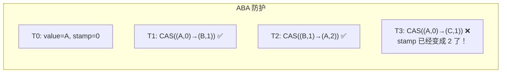

**但注意**：`AtomicStampedReference` 的版本号是 `int`，也会溢出回绕。极端场景下版本号绕一圈回到原值，又会出现 ABA。但在实际系统中，`int` 版本号空间（~21 亿）绕回的概率极低，除非你的系统每秒执行数亿次 CAS 且持续运行很长时间。如果真的担心这个问题，可以用 `AtomicMarkableReference`（只关心"有没有被改过"而不关心次数），但它也只是一个 `boolean` 标记。

---

# 五、LongAdder——突破 CAS 的性能天花板

## 5.1 AtomicLong 为什么慢？

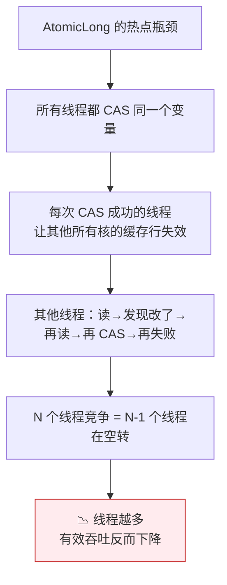

实验数据（8 核机器，每个线程执行 1000 万次 `incrementAndGet`）：

| 线程数 | AtomicLong 吞吐 | LongAdder 吞吐 |
|---|---|---|
| 1 | ~60M ops/s | ~55M ops/s |
| 4 | ~40M ops/s | ~180M ops/s |
| 8 | ~25M ops/s | ~300M ops/s |
| 16 | ~18M ops/s | ~280M ops/s |

AtomicLong **线程越多越慢**，而 LongAdder 基本线性扩展。

## 5.2 核心思想——分段累加

LongAdder 的思路和 ConcurrentHashMap 的 **CounterCell** 一致：**分散热点，各自累加，最后汇总**。

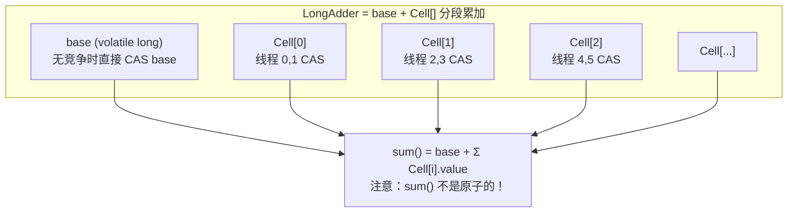

## 5.3 源码关键路径

```java
public class LongAdder extends Striped64 implements Serializable {
    
    // 递增 1
    public void add(long x) {
        Cell[] cs; long b, v; int m; Cell c;
        
        // ① 首先尝试 CAS base（无竞争快速路径）
        if ((cs = cells) != null || !casBase(b = base, b + x)) {
            
            boolean uncontended = true;
            
            // ② 如果 cells 数组还没初始化 → 进 longAccumulate
            // ③ 如果当前线程的槽位为 null → 进 longAccumulate
            // ④ 如果 CAS 槽位失败 → 进 longAccumulate
            if (cs == null || (m = cs.length - 1) < 0 ||
                (c = cs[getProbe() & m]) == null ||
                !(uncontended = c.cas(v = c.value, v + x)))
                longAccumulate(x, null, uncontended);  // 核心：初始化/扩容/重试
        }
    }
    
    // sum() —— 不保证原子性的汇总
    public long sum() {
        Cell[] cs = cells;
        long sum = base;
        if (cs != null) {
            for (Cell c : cs)
                if (c != null)
                    sum += c.value;
        }
        return sum;
    }
}
```

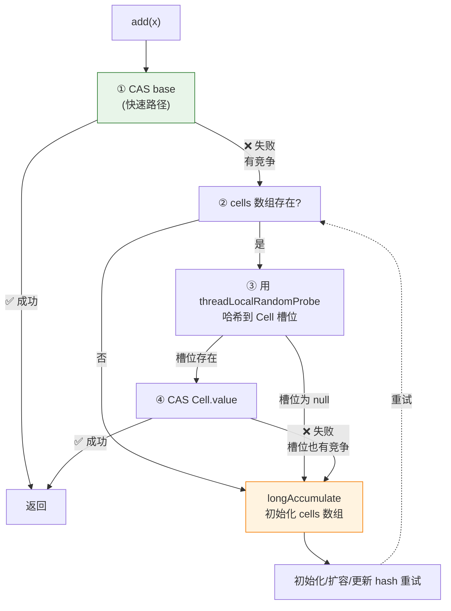

## 5.4 longAccumulate——系统对冲（Systematic Hedging）

`longAccumulate` 是 LongAdder 最复杂的部分，它实现了 Doug Lea 称为 **"Systematic Hedging"** 的策略——在多个维度上对冲竞争风险：

| 策略 | 含义 | 代码体现 |
|---|---|---|
| **扩容对冲** | 槽位竞争激烈 → 扩容数组让更多线程有独立槽位 | `cells.length < CPU 核数 → 扩容 ×2` |
| **再哈希对冲** | 当前槽位有竞争 → 换一个槽位试试 | `advanceProbe()` 更新 hash 种子 |
| **创建对冲** | 槽位为空 → 创建一个新 Cell | `cellsBusy` 作为 CAS 锁创建 Cell |
| **CPU 核数上限** | 最多扩到 CPU 核数（多于核数的线程无法并行） | `NCPU = Runtime.getRuntime().availableProcessors()` |

```java
// Striped64.longAccumulate 简化逻辑
final void longAccumulate(long x, LongBinaryOperator fn, boolean wasUncontended) {
    // ... 无限循环
    for (;;) {
        Cell[] cs; Cell c; int n; long v;
        
        if ((cs = cells) != null && (n = cs.length) > 0) {
            // CASE 1: cells 已存在，处理槽位
            
            if ((c = cs[(n - 1) & h]) == null) {
                // ① 槽位为空 → 创建新 Cell
                if (cellsBusy == 0) {
                    Cell r = new Cell(x);
                    if (cellsBusy == 0 && casCellsBusy()) {
                        // 双重检查后创建
                        cs[(n - 1) & h] = r;
                        cellsBusy = 0;
                        break;
                    }
                }
            }
            else if (!wasUncontended) {
                // ② CAS 失败过一次 → 标记为 contended，下次再失败就扩容
                wasUncontended = true;
            }
            else if (c.cas(v = c.value, (fn == null) ? v + x : fn.applyAsLong(v, x))) {
                // ③ CAS 槽位成功 → 完成
                break;
            }
            else if (n >= NCPU || cells != cs) {
                // ④ 数组已到 CPU 核数上限，或有人在同时扩容 → 重新哈希
                wasUncontended = true;
            }
            else if (!collide) {
                // ⑤ 允许扩容 → 标记 collide，下次冲突就扩容
                collide = true;
            }
            else if (cellsBusy == 0 && casCellsBusy()) {
                // ⑥ 真正扩容：复制到 2 倍大小的新数组
                cs = Arrays.copyOf(cs, n << 1);
                cells = cs;
                cellsBusy = 0;
                collide = false;
                continue;
            }
            h = advanceProbe(h);  // 重新哈希
        }
        // CASE 2: cells 不存在，尝试初始化
        else if (cellsBusy == 0 && cells == cs && casCellsBusy()) {
            // ... 初始化 2 槽位的 cells 数组
        }
        // CASE 3: 所有都失败，最后兜底 CAS base
        else if (casBase(v = base, (fn == null) ? v + x : fn.applyAsLong(v, x)))
            break;
    }
}
```

## 5.5 LongAdder 的代价

| 代价 | 说明 |
|---|---|
| **内存开销** | Cell 数组 + 对齐填充，比 AtomicLong 多 ~10 倍内存 |
| **sum() 不精确** | `sum()` 是 **snapshot**，调用时其他线程可能正在修改 Cell |
| **reset() 不原子** | 无法原子地读并清零 |
| **单线程慢** | 多一次数组查找 + Cell 对象解引用，实测比 AtomicLong 慢 ~5-10% |

**使用原则**：
- 需要**精确值**（如计数器用于扣减库存）→ `AtomicLong`
- 只需要**最终一致**（如统计 QPS、总请求数）→ `LongAdder`
- 线程数少（<4）→ `AtomicLong` 足够
- 线程多（≥8）→ 必用 `LongAdder`

---

# 六、JUC 中的 CAS——无处不在的基石

## 6.1 全景图

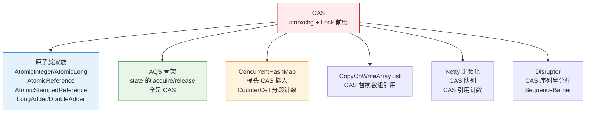

## 6.2 AQS.state 的 CAS

```java
// AQS 中使用 CAS 管理同步状态
public final void acquire(int arg) {
    if (!tryAcquire(arg) &&
        acquireQueued(addWaiter(Node.EXCLUSIVE), arg))
        selfInterrupt();
}

// ReentrantLock.Sync.nonfairTryAcquire
final boolean nonfairTryAcquire(int acquires) {
    final Thread current = Thread.currentThread();
    int c = getState();
    if (c == 0) {
        if (compareAndSetState(0, acquires)) {  // ← CAS 抢占
            setExclusiveOwnerThread(current);
            return true;
        }
    }
    // ... 重入逻辑
}
```

AQS 的 `compareAndSetState` 最终调用的是 `Unsafe.compareAndSwapInt`——和 `AtomicInteger` 完全相同的底层机制。

## 6.3 ConcurrentHashMap 的 CAS 桶头插入

```java
// ConcurrentHashMap.putVal —— JDK 8+
final V putVal(K key, V value, boolean onlyIfAbsent) {
    // ...
    else if ((f = tabAt(tab, i = (n - 1) & hash)) == null) {
        // 桶为空 → CAS 插入头节点
        if (casTabAt(tab, i, null, new Node<K,V>(hash, key, value, null)))
            break;  // CAS 成功，插入完成
        // CAS 失败 → 说明其他线程抢先了，重新循环
    }
    else {
        synchronized (f) {
            // 桶不为空 → 锁住桶头节点，在链表/红黑树上操作
        }
    }
}
```

这就是 CHM 的精妙设计：**桶空时 CAS → 无锁插入；桶不空时 synchronized → 有锁操作**。只有当真的发生哈希冲突时才上锁，绝大多数情况下走无锁路径。

---

# 七、面试追问——你能否串起来讲？

## 7.1 CAS 在 CPU 层面怎么保证原子性？

> Lock 前缀 + cmpxchg 指令。Lock 前缀锁缓存行（不锁总线），MESI 协议保证缓存一致性。其他核在此期间无法操作同一缓存行。

## 7.2 JVM 怎么暴露 CAS 给 Java？

> `Unsafe.compareAndSwapInt(Object o, long offset, int expected, int x)`，通过 JNI 调用 CPU 的 cmpxchg 指令。`objectFieldOffset` 计算字段在对象中的偏移量，拼出绝对内存地址。

## 7.3 CAS 有什么问题？怎么解决？

> **ABA 问题** → `AtomicStampedReference` 加版本号
> **循环开销** → `LongAdder` 分段累加
> **只能原子操作一个变量** → 用锁或者把变量打包成 `Pair`

## 7.4 LongAdder 为什么比 AtomicLong 快？

> 分段累加。AtomicLong 所有线程争一个变量，高竞争下 CAS 反复失败→缓存行跳跃→CPU 空转。LongAdder 将压力分散到 `Cell[]` 数组中，每个线程操作自己的槽位，只有 `sum()` 时才汇总。本质是用**空间和最终一致性换吞吐量**。

## 7.5 LongAdder 的 sum() 为什么不是原子的？

> `sum()` 遍历 `cells` 读每一个 Cell 的值 + base 值累加，这个过程中其他线程可能同时在修改。设计哲学：LongAdder 的语义是"可以最终一致"，不是"必须精确到此刻"。

## 7.6 什么场景下 AtomicLong 比 LongAdder 更好？

> （1）需要精确的瞬时值（如库存扣减）；（2）线程数少（<4）时 AtomicLong 更快且内存更省；（3）需要原子的 `getAndSet`/`compareAndSet` 语义时，LongAdder 不提供这些操作。

---

# 总结

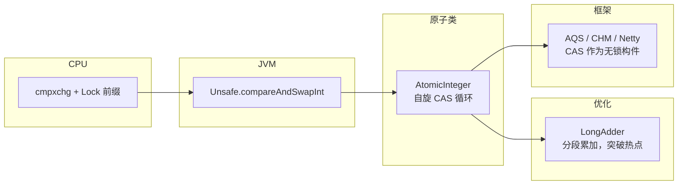

- **CPU 层**：cmpxchg 指令 + Lock 前缀锁缓存行，是 CAS 的物理基础
- **JVM 层**：Unsafe 提供 Java 到 CPU 指令的 JNI 桥梁
- **AtomicInteger**：CAS 的标准范式——原子读 → CAS → 失败就重试
- **LongAdder**：解决高竞争下 CAS 性能衰减的工程方案——空间换吞吐
- **JUC 框架层**：AQS.state、CHM 桶头、Copy-on-Write——所有"无锁化"最终都是 CAS

CAS 是 JUC 的**原子构件**——单个构件的语义很简单，但正是这个足够简单、足够可靠的构件，支撑起了整个 Java 并发编程的世界。
