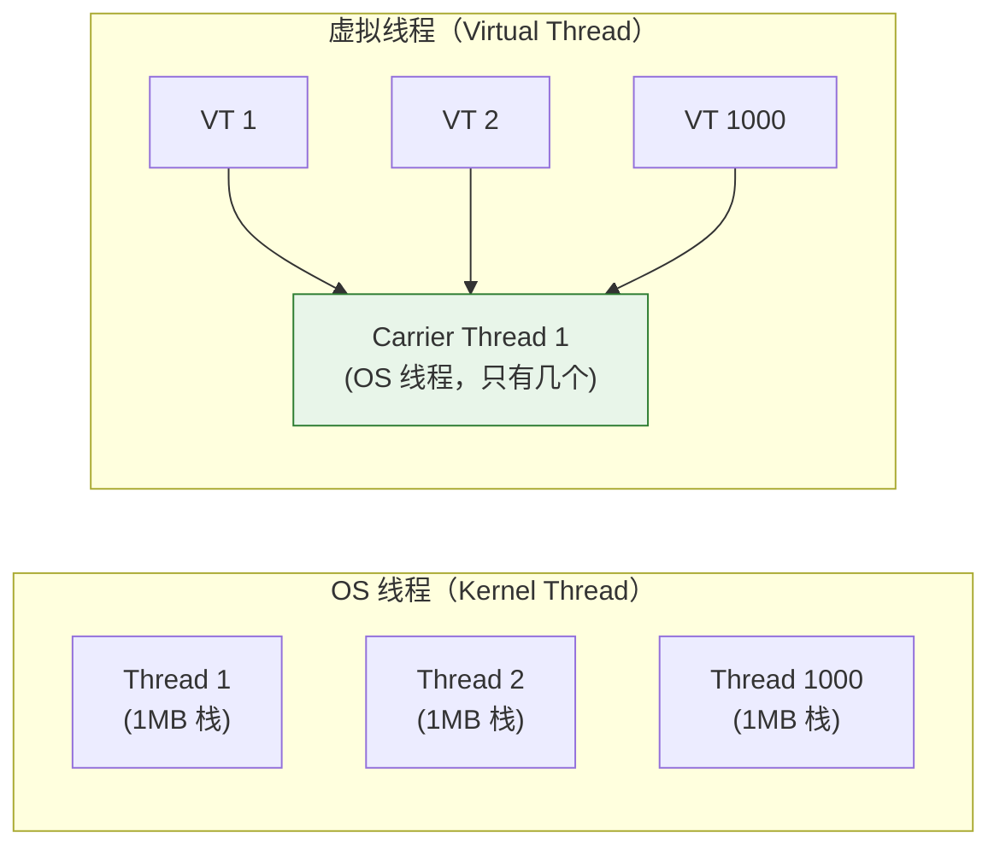

# 历史背景——15 年的"线程池惯性"

2004 年 Java 5 引入 `ThreadPoolExecutor` 时，OS 线程是昂贵的资源——每个线程有独立的栈（默认 1MB）、独立的 OS 调度、创建/销毁需要系统调用。线程池的核心逻辑是：**复用线程，不要频繁创建。** 15 年来这个逻辑被固化成了 Java 后端的肌肉记忆："高并发 → 线程池"。

但线程池的副作用也固化了下来：`ThreadLocal` 泄漏、`submit()` 吞异常、池满了等各种拒绝策略、一个慢任务饿死全池……这些问题的根源不是"线程池写得不好"，而是**线程池的"池化"逻辑被迫和"并发控制"耦合在一起**。

Java 21 的虚拟线程（Virtual Threads，Project Loom）打破了这个前提。当创建 100 万个线程和创建 100 个线程一样便宜时，**线程池"复用线程"的核心价值消失了**。这不是线程池的改进，而是线程池存在理由的消解。

---

# 一、OS 线程 vs 虚拟线程：一个线程的成本对比

## 1.1 OS 线程为什么"贵"？

```
创建一个 OS 线程的真实代价：

 ① 内核资源：OS 为每个线程分配独立的 thread metadata（Linux 中约 2-4KB）
 ② 栈空间：每个线程有预先分配的栈（Java 默认 1MB）→ OS 分配物理页
 ③ 调度开销：OS 调度器管理线程状态 → 线程越多，调度延迟越大
 ④ 上下文切换：保存/恢复寄存器、TLB flush、缓存失效 → ~1-5μs/次

10000 个 OS 线程：
  栈空间 = 10000 × 1MB = 10GB（仅栈空间！）
  上下文切换开销吃掉 30-50% 的 CPU（取决于工作负载）
  → 不现实
```

## 1.2 虚拟线程怎么"省"的？



**四个关键差异**：

```
① 栈不是预分配的
   OS 线程：启动时分配 1MB 栈（物理页实际分配）
   虚拟线程：栈以"栈块（stack chunk）"的对象形式存在堆上
   → 初始只分配几百字节，按需增长
   → 100 万个虚拟线程 ≠ 1TB 内存，而是每个虚拟机线程活跃时需要的实际栈空间

② 调度在 JVM 内
   OS 线程：OS 内核调度（系统调用 + 优先级计算 + 时间片分配）
   虚拟线程：JVM 在用户态调度（mount/unmount 到 Carrier Thread 上）
   → 上下文切换 ≈ 几个 Java 对象的读写，不需要进入内核

③ 阻塞 ≠ OS 线程阻塞
   OS 线程：read() → 内核态 → 线程被 park → OS 调度器标记为 BLOCKED
   虚拟线程：read() → JVM 拦截 → 把虚拟线程从 Carrier 上卸下
         → 释放 Carrier 去执行其他虚拟线程
         → IO 就绪 → JVM 重新把虚拟线程 mount 到可用的 Carrier
   → 虚拟线程的"阻塞"对 OS 来说只是 Carrier 线程继续在跑

④ 创建成本
   OS 线程：malloc 栈 + clone 系统调用 → ~1ms
   虚拟线程：new VirtualThread() → Java 对象分配 → ~1μs
   → 快 1000 倍
```

---

# 二、虚拟线程 vs 线程池：模型对比

## 2.1 传统线程池模型

```java
// 传统：每个请求交给线程池中的一个线程
// 线程池有 200 个线程 → 最多同时处理 200 个请求
// 第 201 个请求排队等线程空闲

ThreadPoolExecutor pool = new ThreadPoolExecutor(
    200, 200, 60L, TimeUnit.SECONDS,
    new LinkedBlockingQueue<>(1000)
);

@GetMapping("/api/data")
public CompletableFuture<Data> getData() {
    // 这个请求占着线程池的一个线程
    // 即使它在等 HTTP 响应，线程也在这空转（BLOCKED on IO）
    return CompletableFuture.supplyAsync(() -> {
        String resp1 = httpClient.get("http://service-a/api");  // 线程 BLOCKED 等 IO
        String resp2 = httpClient.get("http://service-b/api");  // 线程 BLOCKED 等 IO
        return merge(resp1, resp2);
    }, pool);
}
```

**传统线程池的悖论**：池越大 → 同时处理越多请求 → 但 OS 线程调度开销也越大 → 边际收益递减。池越小 → 调度开销小 → 但排队的请求多 → 延迟增加。**池大小是"并发度"和"OS 开销"的权衡——这个权衡在虚拟线程中彻底消失。**

## 2.2 虚拟线程模型

```java
// 虚拟线程：每个请求创建一个虚拟线程
// 10000 个并发请求 = 10000 个虚拟线程 → 完全 OK！
// 没有排队，没有拒绝策略，没有"池满了"

@GetMapping("/api/data")
public Data getData() throws Exception {
    // 虚拟线程在等 IO 时自动从 Carrier 卸载——不浪费 OS 线程资源
    String resp1 = httpClient.get("http://service-a/api");  // VT 被卸载，Carrier 去执行其他 VT
    String resp2 = httpClient.get("http://service-b/api");  // 同上
    return merge(resp1, resp2);
}

// 启用虚拟线程
@Bean
public Executor virtualThreadExecutor() {
    return Executors.newVirtualThreadPerTaskExecutor();
}
```

```java
// Spring Boot 3.2+ 一行启用
// application.properties:
spring.threads.virtual.enabled=true
```

## 2.3 同一个场景的模型对比

```
场景：API 网关，每个请求需要调 3 个后端服务，每个后端平均 50ms

传统模型（200 线程池）：
  200 个线程在同时服务 → 每个线程 BLOCKED 在等后端响应 → OS 看到 200 个线程
  → 第 201 个请求在队列中等待 → 延迟 + 未知
  → 峰值 QPS = 200 / (3 × 50ms) ≈ 1333 QPS（理论上限）

虚拟线程模型：
  并发 10000 个请求 → 10000 个虚拟线程
  → 它们共享 ~10 个 Carrier Thread（OS 线程）
  → 当一个 VT 在等后端响应时，它从 Carrier 卸载 → Carrier 去跑其他 VT
  → 没有队列，没有拒绝策略
  → 峰值 QPS 由后端延迟和网络带宽决定，而不是线程池大小
```

---

# 三、用虚拟线程后还需要线程池吗？

## 3.1 线程池"复用线程"的价值消失了，但"限制并发"的价值还在

这是一个容易误读的点。虚拟线程解决了"复用线程"的需求——因为线程已经便宜到不需要复用了。但并发控制仍然是需要的：**你不能让 10 万个虚拟线程同时去打一个脆弱的数据库**。

```
线程池的双重角色：
  角色 1：复用线程（虚拟线程不需要了 ✗）
  角色 2：控制并发数（仍然需要 ✓）

用虚拟线程后，用 Semaphore 做并发控制，和线程池解耦：
```

```java
public class VirtualThreadWithConcurrencyControl {
    // Semaphore 只负责"最多同时 N 个去调数据库"，不负责线程管理
    private final Semaphore dbSemaphore = new Semaphore(50);
    
    @GetMapping("/api/orders/{id}")
    public Order getOrder(@PathVariable Long id) throws Exception {
        // 这个请求在一个虚拟线程中执行
        // 虚拟线程本身无限，但 Semaphore 限制了"同时访问数据库"的数量
        dbSemaphore.acquire();
        try {
            return orderDao.findById(id);  // 数据库连接池的并发保护
        } finally {
            dbSemaphore.release();
        }
    }
}

// 对比：传统线程池 = 线程复用 + 并发控制耦合在一起
// 虚拟线程 + Semaphore = 线程按需创建 + 并发控制独立管理
```

## 3.2 什么场景下仍然需要线程池？

**场景 1：CPU 密集型任务**

虚拟线程的调度优势在于它能在 IO 阻塞时自动切换——这里"IO 阻塞"是前提。CPU 密集型任务不阻塞，虚拟线程会在 Carrier 上一直跑到完，不给其他虚拟线程让路。

```java
// CPU 密集型：没有 IO 阻塞 → 虚拟线程没有"让路"的机会
// → 仍然需要限制并发线程数 = CPU 核数

ExecutorService pool = Executors.newFixedThreadPool(
    Runtime.getRuntime().availableProcessors()  // 仍然用传统线程池
);

pool.submit(() -> {
    // 加密、压缩、图像处理——这些几乎不阻塞
    heavyEncryption(data);
});
```

**场景 2：被 pin 到 Carrier 的虚拟线程**

虚拟线程中执行 `synchronized` 块时，如果发生 IO 阻塞，**虚拟线程不会从 Carrier 卸载**——它会**pin（钉住）** Carrier 线程。

```java
// ⚠️ 虚拟线程被 pin！
synchronized (this) {
    String resp = httpClient.get("http://api/data");  // IO 阻塞！
    // ↑ 这个虚拟线程被 pin 到 Carrier 上了！Carrier 被阻塞，其他 VT 不能用它！
}

// ✅ 改用 ReentrantLock（不会 pin 虚拟线程）
lock.lock();
try {
    String resp = httpClient.get("http://api/data");  // VT 正常卸载
} finally {
    lock.unlock();
}
```

**为什么 `synchronized` 会 pin？** JVM 的 `synchronized` 实现与 OS 线程绑定（monitor 对象在 native 层），而 `ReentrantLock` 是纯 Java 实现，JVM 可以在 `park/unpark` 时安全地替换虚拟线程的 mount 状态。OpenJDK 正在尝试让 `synchronized` 也不 pin，但在当前版本（Java 21-23）这仍然是一个限制。

**场景 3：需要固定线程数的多线程协作**

`CyclicBarrier`、`Phaser` 等依赖固定线程数等待的工具——虚拟线程的不确定性创建数量让这些工具失去了设计前提。

---

# 四、适用场景速查

| 场景 | 适合虚拟线程？ | 理由 |
|------|:---:|------|
| **HTTP API 服务器** | ✅ 完美 | 大量请求，每个请求大多时间在等 IO（DB/RPC/消息） |
| **API 网关/代理** | ✅ 完美 | 转发请求 = 等后端响应，IO 密集的极致 |
| **数据库批量查询** | ✅ | 大量 SELECT，等待 DB 返回结果 |
| **WebSocket 长连接** | ✅ | 一个连接一个 VT，空闲时不占 Carrier |
| **消息消费 (KafkaMQ)** | ✅ | poll 等消息 → IO 阻塞 → VT 自然让道 |
| **数据加密/压缩** | ❌ | CPU 密集，没有 IO 让路，阻塞其他 VT |
| **图像/视频处理** | ❌ | CPU 密集 |
| **高频交易/低延迟** | ❌ | VT 的堆栈分配和调度有微量开销 |
| **有大量 synchronized 的旧代码** | ⚠️ | 会被 pin，需要先 migrate 到 `ReentrantLock` |

---

# 五、总结

| 问题 | 答案 |
|------|------|
| **虚拟线程后还需要线程池吗？** | "复用线程"的线程池不需要了；"限制并发"用 Semaphore 更清晰 |
| **虚拟线程快了 1000 倍的原理？** | 栈在堆上（按需增长）、调度在 JVM 内（用户态）、阻塞不阻塞 Carrier |
| **什么场景不能用虚拟线程？** | CPU 密集、大量 synchronized pin、低延迟极致要求 |
| **虚拟线程的最大价值？** | **打破了"一个连接一个线程"和"线程池上限"的束缚**——程序员可以写同步代码，享受异步的并发能力 |

# 延伸阅读

**Do——动手验证：**
- 用 `Executors.newVirtualThreadPerTaskExecutor()` 创建 100 万个虚拟线程（每个 sleep 1 秒），用 `jcmd <pid> Thread.dump_to_file` 看 OS 线程数（应该只有 10-20 个 Carrier Thread）
- 对比传统线程池 vs 虚拟线程处理 10000 个并发 HTTP 请求的延迟分布和内存占用
- 用 `-Djdk.tracePinnedThreads=full` 抓出代码中被 pin 的虚拟线程

**Todo——深入方向：**
- 虚拟线程的栈 chunk 的内部结构——`Continuation` 和 `StackChunk` 的 yield/resume 机制
- Structured Concurrency (JEP 453)——"线程组"的生命周期管理
- Scoped Values (JEP 446)——虚拟线程场景下替代 ThreadLocal 的轻量级上下文传递

*本文参考资料：*
- JEP 444: Virtual Threads (Java 21)
- Ron Pressler & Alan Bateman, "Project Loom: Fibers and Continuations for the Java Virtual Machine"
- OpenJDK Wiki: Virtual Threads - Pinned Threads
- Spring Boot 3.2 Release Notes: Virtual Threads Support
