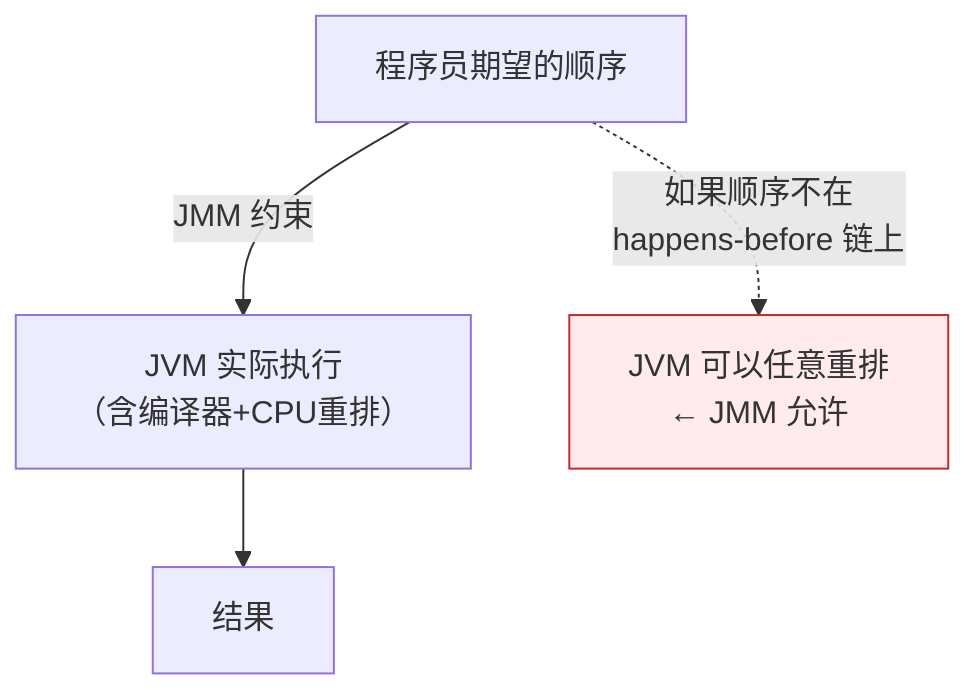

---

# 一、为什么要学 JMM？——一个让所有 Java 程序员困惑的问题

```java
// 这段代码能停吗？
class NeverStop {
    static boolean flag = true;
    public static void main(String[] args) {
        new Thread(() -> {
            while (flag) {}  // 线程 B 读 flag
        }).start();
        Thread.sleep(1000);
        flag = false;  // 线程 A 写 flag
    }
}
```

**答案：在主线程写 `flag = false` 后，线程 B 可能永远看不到这个修改。** 因为：
- 编译器可能把 `while(flag)` 优化成 `if(flag) while(true)`（因为 B 线程内没有修改 flag）
- CPU 缓存中 B 线程的 flag 副本不会主动失效

JMM 的存在就是为了定义：**什么样的并发代码行为是"合法"的，什么样的编译器优化不能做。**

---

# 二、JMM 不是"描述执行顺序"，而是"划定优化边界"



> JMM 的核心思想：只要程序的**同步顺序**满足 happens-before 规则，JVM 可以任意重排非同步的代码——因为重排后的结果对程序员透明。

---

# 三、happens-before —— JMM 的 8 条"安全基线"

## 3.1 程序次序规则（Program Order Rule）

**同一个线程内**，前面的操作 happens-before 后面的操作。

```java
int a = 1;    // ①
int b = 2;    // ② → ① hb ②
// 但 JIT 可以把它们重排为 ②→①，因为单线程看不到区别
```

## 3.2 volatile 变量规则

**对一个 volatile 变量的写，happens-before 后续对这个 volatile 变量的读。**

```java
volatile int v = 0;

// Thread A
v = 1;  // ① volatile 写

// Thread B
int x = v;  // ② volatile 读 → ① hb ②
// B 能看到 v=1，且能看到 A 在写 v 之前的所有操作
```

## 3.3 锁规则

**对一个锁的 unlock，happens-before 后续对同一个锁的 lock。**

```java
synchronized (lock) { x = 1; }  // ① unlock hb ② lock
// Thread B
synchronized (lock) { int r = x; } // r 一定是 1
```

## 3.4 传递性

**A hb B, B hb C → A hb C**

这是最强大的规则——它让 volatile 写+读成为不同线程间的"同步桥梁"。

## 3.5 其余 4 条

| 规则 | 说明 |
|------|------|
| **线程 start** | `t.start()` hb 线程 t 中的任意操作 |
| **线程 join** | 线程 t 的终止 hb `t.join()` 返回 |
| **中断** | 对线程调用 `interrupt()` hb 被中断线程检测到中断 |
| **对象终结** | 构造函数结束 hb `finalize()` 开始 |

---

# 四、happens-before 的"传递性"为什么是性能杀手锏？

```java
// 经典模式：volatile 变量 + 非 volatile 数据
class VolatileBridge {
    int data;          // 非 volatile
    volatile boolean ready = false;
    
    // 写线程
    void writer() {
        data = 42;    // ① 普通写
        ready = true; // ② volatile 写
    }
    
    // 读线程
    void reader() {
        if (ready) {          // ③ volatile 读
            int r = data;     // ④ r 一定 = 42
        }
    }
}
// hb 链：① hb ② (程序次序) + ② hb ③ (volatile) + ③ hb ④ (程序次序)
// → ① hb ④ (传递性) → data 一定可见！
```

> 这就是 volatile 的"附加效果"：不仅 volatile 变量本身可见，**写 volatile 之前的所有操作对读 volatile 之后的所有操作都可见**。

---

# 五、final 域的特殊语义——构造函数安全发布

```java
class SafeObj {
    final int x;
    SafeObj(int v) { x = v; }
}

// final 域保证：只要构造函数正常结束，对象的 final 域值对所有线程可见
// 不需要 synchronized，不需要 volatile
```

> final 的 happens-before：构造函数结束 hb 首次读取 final 域。这是 JMM 对不可变对象的特殊优待。

---

# 六、总结

| 本质 | 说明 |
|------|------|
| JMM 是啥 | 在"程序员直觉"和"编译器优化"之间划一条安全线 |
| happens-before 是啥 | 这条安全线的具体标尺——满足 hb 的操作必须可见且有序 |
| 传递性才是核心 | 一条 volatile 写+读，能传递性地保护所有关联数据 |
| 8 条规则不必死记 | 理解"volatile 和锁是跨线程的同步桥梁"就够了 |

*本文参考资料：*
- Brian Goetz et al.《Java Concurrency in Practice》——第 3-5 章（共享与组合对象）、第 6-8 章（任务执行与线程池）、第 11-12 章（性能与可伸缩性）
- Doug Lea, "The java.util.concurrent Synchronizer Framework"（AQS 论文）, 2004
- Java Language Specification, Chapter 17: Threads and Locks（JMM）: https://docs.oracle.com/javase/specs/jls/se17/html/jls-17.html
- JSR-133 FAQ: https://www.cs.umd.edu/~pugh/java/memoryModel/jsr-133-faq.html
- OpenJDK 源码: java.util.concurrent 包（AbstractQueuedSynchronizer / ThreadPoolExecutor / ReentrantLock 等）
