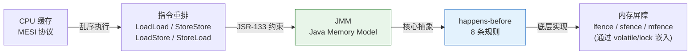

# 历史背景——JSR-133 修复了一个"理论漏洞"

2004 年之前，Java 的内存模型（JMM）存在一个严重问题：**`final` 字段在构造函数执行完之前就可能被其他线程看到**。这意味着你声明为 `final` 的字段，通过 `new` 创建的对象，在多线程环境下读到的是构造函数执行了一半的值——"不可变对象不一定是不可变的"。

JSR-133（Java Memory Model and Thread Specification Revision）是 Java 5 核心修订之一，由 Bill Pugh（找到这个 bug 的人）、Doug Lea 和 Sun 的工程师共同推动。核心目标：**给 final 添加"构造函数安全发布"语义，强化 volatile 的 happens-before 关系，让 double-checked locking 在加了 volatile 后真正有效。**

理解 JMM 的关键认知是：**JMM 不是描述"程序怎么执行"，而是描述"编译器不能做什么"。** 它是一组约束——在满足 happens-before 规则的前提下，JIT 和 CPU 可以任意重排无关代码。JMM 的本质是**给编译器和处理器的优化划定一条"不影响程序员心智模型"的边界。**



---

# 一、为什么需要 JMM？——CPU 的"诚实谎言"

```java
// 这段代码在单线程下完美，多线程呢？
class NeverStop {
    static boolean flag = true;
    public static void main(String[] args) throws InterruptedException {
        new Thread(() -> {
            while (flag) {}  // 线程 B 读 flag
        }).start();
        Thread.sleep(1000);
        flag = false;  // 主线程写 flag
    }
}
```

**答案：线程 B 可能永远看不到 `flag=false`。** 不是"可能"——在 JIT 充分优化后是"确定"会一直循环。三种独立的"谎言"叠加：

1. **编译器重排**：JIT 发现线程 B 从未修改 `flag` → 将 `while(flag)` 优化为 `if(flag) while(true)`——flag 只从内存读一次
2. **CPU 缓存**：主线程写的 `flag=false` 在 CPU A 的 store buffer 里，还没刷到主存
3. **Store Buffer 不可见**：线程 B 运行在 CPU B 上，它的缓存中 `flag` 还是 true

JMM 定义了**在什么条件下，一个线程的写操作对另一个线程的读操作可见**。

---

# 二、硬件层——MESI、Store Buffer 和内存屏障

## 2.1 MESI——CPU 缓存一致性协议

现代多核 CPU 的每个核心有自己的 L1/L2 Cache。MESI 协议保证同一缓存行在各个核心之间的一致性：

| 状态 | 含义 | 可以读到吗 |
|------|------|-----------|
| **M**odified | 只有这一个 CPU 有这个缓存行，且数据被修改了 | 只能自己读 |
| **E**xclusive | 只有这一个 CPU 有，数据和内存一致 | 可以读 |
| **S**hared | 多个 CPU 都有，数据和内存一致 | 可以读 |
| **I**nvalid | 这个缓存行失效了，需要从其他 CPU/内存重新读 | 只能重读 |

MESI 通信需要时间。为了不阻塞指令流水线，CPU 引入了 **Store Buffer**——写操作先丢到 Store Buffer 里，CPU 继续执行后面的指令。这意味着"写"并不会立即对其他 CPU 可见。

## 2.2 四种内存屏障

当程序需要"让写立刻可见"时，需要插入内存屏障指令：

```
LoadLoad  ：Load1; LoadLoad; Load2  → Load1 的数据在 Load2 之前加载完成
StoreStore：Store1; StoreStore; Store2 → Store1 先于 Store2 刷到缓存
LoadStore ：Load1; LoadStore; Store2  → Load1 在 Store2 之前完成
StoreLoad ：Store1; StoreLoad; Load2  → Store1 对所有 CPU 可见后 Load2 才开始（最贵！）
```

`volatile` 变量在 JIT 编译后会嵌入这些屏障：

```java
// volatile 写（简化）：
// ① StoreStore 屏障（保证 volatile 写之前的普通写已刷出）
// ② volatile 写本身
// ③ StoreLoad 屏障（保证后续读能看到这个 volatile 写）

// volatile 读（简化）：
// ① LoadLoad 屏障（保证 volatile 读在后续普通读之前完成）
// ② volatile 读本身
// ③ LoadStore 屏障（保证后续普通写在 volatile 读之后执行）
```

---

# 三、happens-before——JMM 的 8 条"安全基线"

## 3.1 程序次序规则

**同线程内**前面的操作 happens-before 后面的操作。

```java
int a = 1;  // ①
int b = 2;  // ②
// ① hb ② —— 但 JIT 可以把它们重排为 ②→①
// 因为"单线程内看不到区别"，JMM 不要求它们保持原序
```

**JMM 让这条规则"有名无实"是有意为之**——如果强制单线程内所有操作保持原序，JIT 的绝大部分优化（指令调度、寄存器分配、循环展开）都废了。

## 3.2 volatile 规则

**对一个 volatile 变量的写，happens-before 后续对这个 volatile 变量的读。**

```java
volatile int v = 0;

// Thread A
x = 42;    // 普通写
v = 1;     // volatile 写 —— 前面的 StoreStore 屏障保证 x=42 对后续可见

// Thread B
int r = v; // volatile 读 —— 后面的 LoadLoad 屏障保证读到 v=1 后也能看到 x=42
// r == 1 → 一定有 x == 42（传递性保证）
```

## 3.3 锁规则

**对一个锁的 unlock happens-before 后续对同一个锁的 lock。**

```java
// Thread A
synchronized (lock) {
    x = 1;  // ①
}  // ② unlock

// Thread B
synchronized (lock) {  // ③ lock
    int r = x;  // ④
}  // ① hb ② hb ③ hb ④ → r 一定是 1
```

这保证了解锁前线程 A 的所有操作（不只是 x=1，是整个 synchronized 块的任意操作）对加锁后线程 B 可见。

## 3.4 传递性

**A hb B 且 B hb C → A hb C**

这是最强大的一条规则——它让 volatile 可以"桥接"两个线程之间的普通变量。

## 3.5 其余 4 条（速查）

| 规则 | 说明 | 实际意义 |
|------|------|---------|
| **线程 start** | `t.start()` hb 线程 t 中的任意操作 | 主线程 start 前的赋值对子线程可见 |
| **线程 join** | 线程 t 的所有操作 hb `t.join()` 返回 | join 后读子线程的结果保证可见 |
| **中断** | `t.interrupt()` hb 被中断线程检测到中断 | 中断标志的传播有 JMM 保证 |
| **对象终结** | 构造函数结束 hb `finalize()` 开始 | 构造函数的初始化对 GC 线程可见 |

---

# 四、happens-before 的传递性——volatile 为什么能保护普通变量

```java
// 经典模式：volatile 作为"同步桥梁"
class VolatileBridge {
    int data;               // 非 volatile（普通变量！）
    volatile boolean ready = false;
    
    // 写线程
    void writer() {
        data = 42;          // ① 普通写
        ready = true;       // ② volatile 写
    }
    
    // 读线程
    void reader() {
        if (ready) {        // ③ volatile 读
            int r = data;   // ④ data 一定 = 42！
        }
    }
}
// hb 链：
// ① hb ② (程序次序：同线程，普通写在 volatile 写之前)
// ② hb ③ (volatile 规则：对 volatile 的写 hb 后续读)
// ③ hb ④ (程序次序：同线程，volatile 读在普通读之前)
// → ① hb ④ (传递性) → data=42 对读线程一定可见！
```

> **这就是 volatile 的"附加效果"**：不仅 volatile 变量本身可见，**在 volatile 写之前的所有普通写操作，对 volatile 读之后的所有普通读操作，都可见。** 传递性是所有 happens-before 规则中最强大的——它让一个 volatile 变量成为多线程之间的"可见性桥梁"。

## 实际应用：单线程写完→通知多线程读

```java
// 常见模式：一个线程写配置 → 多个线程读
class Config {
    private Map<String, String> config = new HashMap<>();  // 非 volatile
    private volatile int version = 0;                      // volatile 桥梁
    
    // 写线程（只有一个）
    void update(Map<String, String> newConfig) {
        config = newConfig;    // 先写数据
        version++;             // 后改版本号（volatile 写 = 发布！）
    }
    
    // 读线程（多个）
    Map<String, String> getConfig() {
        int v = version;       // 先读版本号（volatile 读 = 订阅！）
        return config;         // 后读数据（保证看到写线程的最新 config）
    }
}
```

---

# 五、final 域的构造函数安全发布——JSR-133 的修复

```java
class SafeObj {
    final int x;
    final int[] arr;  // ⚠️ final 引用指向的对象内容不受保护
    
    SafeObj(int v) {
        x = v;
        arr = new int[]{v, v};  // arr 引用是 final，但 arr 指向的数组内容不是
    }
}
```

**final 域保证**（JSR-133 后）：
1. 构造函数中对 final 域的写入 hb 构造函数结束
2. 构造函数结束 hb 其他线程第一次读该对象的 final 域
3. 条件：构造函数中没有 `this` 逃逸（不能在构造函数中把 `this` 传给其他线程）

```java
// ❌ this 逃逸 → final 安全发布被打破
class UnsafePublish {
    final int x;
    UnsafePublish() {
        SomeGlobal.obj = this;  // ← this 逃逸！其他线程可能在构造函数完成前看到
        x = 42;                  // 此时 x 还没赋值
    }
}
```

---

# 六、双检锁的完整解析——JMM + volatile + synchronized 联用

```java
// ✅ 正确版 DCL（Java 5+）
public class LazySingleton {
    private static volatile LazySingleton instance;  // volatile 是必需的
    
    public static LazySingleton getInstance() {
        if (instance == null) {                    // ① 第一次检查（volatile 读，不加锁）
            synchronized (LazySingleton.class) {    // ② 加锁
                if (instance == null) {            // ③ 第二次检查（持锁，安全）
                    instance = new LazySingleton(); // ④ 构造 + 赋值
                }
            }
        }
        return instance;
    }
}
```

**为什么这两次检查不能少？**

```
第一次检查（锁外）：避免每次调用都加锁（性能优化）
第二次检查（锁内）：防止两个线程同时通过第一次检查后都执行构造
volatile：保证构造函数的初始化在 instance 赋值前完成（禁用 1→3→2 重排）
```

---

# 七、总结

| 本质问题 | 答案 |
|---------|------|
| **JMM 是什么** | 编译器优化和程序员心智模型之间的"安全合同" |
| **happens-before 是什么** | 这份合同的具体条款——满足 hb 的操作保证可见且有序 |
| **传递性为什么是核心** | 它让 volatile 从"保护一个变量"变成"保护一批变量" |
| **8 条怎么记** | volatile 是桥梁、synchronized 是围墙、传递性是放大器、其余 5 条是脚手架 |

# 延伸阅读

**Do——动手验证：**
- 用 `-XX:+UnlockDiagnosticVMOptions -XX:+PrintAssembly` 查看 volatile 写生成的汇编指令中的 `lock` 前缀（x86 上 StoreLoad 用 `lock addl` 实现）
- 用 jcstress 运行 DCL 测试：`java -jar jcstress.jar -t DCLTest`——不加 volatile 的 DCL 会在几百次迭代中就出现错误
- 写一个不遵守 final 安全发布（构造函数中 this 逃逸）的示例，验证多线程下可能读到未初始化的 final 字段

**Todo——深入方向：**
- `VarHandle`（JDK 9+）与 `Unsafe` 的关系——更安全地操作内存屏障
- `acquire` / `release` / `opaque` 三种内存顺序模式的选择指南（替代 volatile 的细粒度方案）
- ARM/PowerPC 弱内存模型下 volatile 的屏障成本——为什么在这些平台上 volatile 比 x86 更贵

*本文参考资料：*
- Java Language Specification, Chapter 17: Threads and Locks
- JSR-133 FAQ: https://www.cs.umd.edu/~pugh/java/memoryModel/jsr-133-faq.html
- Brian Goetz et al.《Java Concurrency in Practice》——第 16 章（Java 内存模型）
- Aleksey Shipilёv, "Java Memory Model Pragmatics" (transcript)
