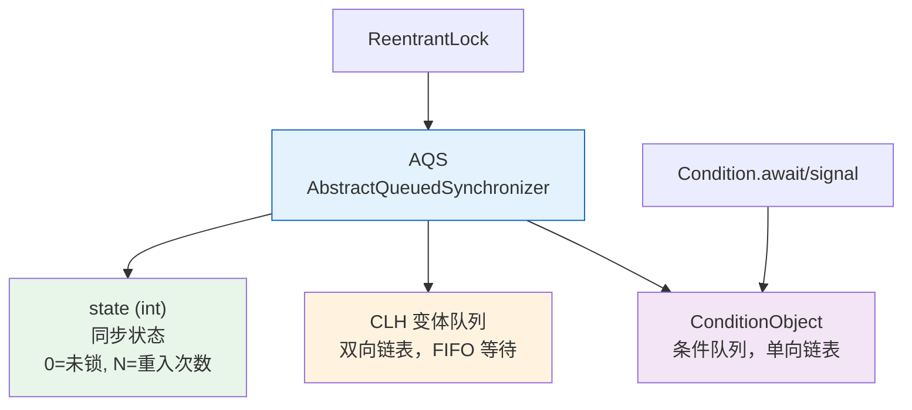
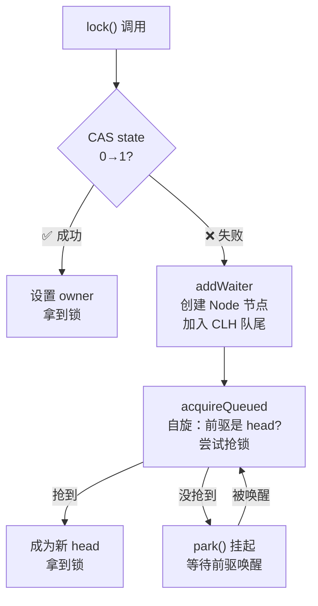
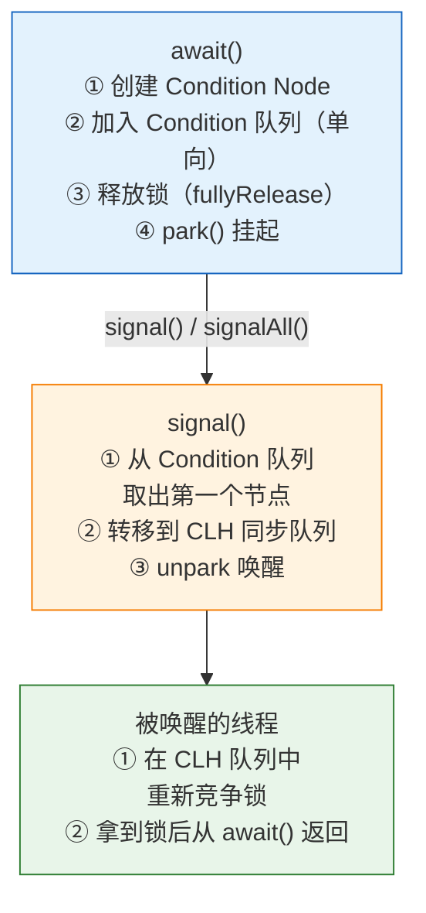

---

# 一、ReentrantLock.lock() —— 从 state=0 到 state=1

## 1.1 非公平锁的快速路径

```java
// ReentrantLock.NonfairSync.lock()
final void lock() {
    if (compareAndSetState(0, 1))      // ① CAS 抢锁
        setExclusiveOwnerThread(Thread.currentThread()); // 成功！
    else
        acquire(1);                     // ② 失败 → 走 AQS 排队
}
```

**关键**：非公平锁上来就 CAS 插队，不管队列里是不是有人先到。这就是"非公平"——新来的可能比排队的先拿到锁。

## 1.2 公平锁的严格排队

```java
// ReentrantLock.FairSync.lock()
final void lock() {
    acquire(1);  // 直接走 AQS，先检查有没有人在排队
}
```

**公平锁的 `tryAcquire` 多了 `hasQueuedPredecessors()` 检查**——队列不为空且自己不是队首 → 放弃 CAS。

## 1.3 AQS.acquire() —— 排队核心

```java
public final void acquire(int arg) {
    if (!tryAcquire(arg) &&                          // ① 再试一次
        acquireQueued(addWaiter(Node.EXCLUSIVE), arg)) // ② 入队+自旋
        selfInterrupt();                              // ③ 响应中断
}
```



## 1.4 ReentrantLock.unlock() —— 唤醒队首

```java
public void unlock() {
    sync.release(1);
}
// AQS.release()
public final boolean release(int arg) {
    if (tryRelease(arg)) {          // state - 1，减到 0 才真正释放
        Node h = head;
        if (h != null && h.waitStatus != 0)
            unparkSuccessor(h);     // 唤醒 CLH 队首的下一个节点
        return true;
    }
    return false;
}
```

**重入怎么处理？** `tryRelease` 用 `state - arg` 减到 0 才 setExclusiveOwnerThread(null)。中间几次 unlock 只是减 state，不释放。

---

# 二、Condition —— 为什么比 wait/notify 强？

## 2.1 synchronized 的 wait/notify 有什么问题？

```java
synchronized (lock) {
    while (!condition) {
        lock.wait();  // 只能 wait 在 lock 对象上
    }
}
lock.notifyAll();  // 只能 notifyAll —— 无法精确唤醒
```

所有条件等在同一把锁上。**notify 无法指定唤醒哪个条件的等待者**，只能全部唤醒 → 大量无效唤醒。

## 2.2 Condition —— 每个条件有独立的等待队列

```java
Lock lock = new ReentrantLock();
Condition notFull  = lock.newCondition();   // "不满"条件
Condition notEmpty = lock.newCondition();   // "不空"条件

// 生产者（不空时唤醒消费者）
notEmpty.signal();   // ← 只唤醒等在 notEmpty 上的线程！

// 消费者（不空时唤醒生产者）
notFull.signal();    // ← 只唤醒等在 notFull 上的线程！
```

## 2.3 await/signal 的底层流转



---

# 三、为什么 Condition 能做精确唤醒而 wait/notify 不行？

**wait/notify**：所有等待线程挂在**同一个对象监视器**的 WaitSet 上，notify 从队列头取一个，notifyAll 全取——**无法区分"为什么等"。**

**Condition**：每个 Condition 维护自己的**独立等待队列**（单向链表）。`notFull.signal()` 只操作 notFull 的队列，不碰 notEmpty 的队列。

> 这就是 `ArrayBlockingQueue` 能用 Condition 实现高效生产者-消费者的原因——pizza 出炉只唤醒等吃的食客，不会唤醒等空位的厨师。

---

# 四、总结

| 概念 | 本质 |
|------|------|
| **state** | 锁的"计数器"——0 空闲，1 锁定，N>1 重入 N 次 |
| **CLH 队列** | 锁竞争的"排队区"——FIFO，park/unpark 切换线程 |
| **Condition 队列** | 条件等待的"候诊室"——每个 Condition 独立一间 |
| **signal 做什么** | 把节点从 Condition 队列**转移**到 CLH 队列 |
| **精确唤醒** | 每个 Condition 有独立的等待队列，绝不错唤 |

*本文参考资料：*
- Brian Goetz et al.《Java Concurrency in Practice》——第 3-5 章（共享与组合对象）、第 6-8 章（任务执行与线程池）、第 11-12 章（性能与可伸缩性）
- Doug Lea, "The java.util.concurrent Synchronizer Framework"（AQS 论文）, 2004
- Java Language Specification, Chapter 17: Threads and Locks（JMM）: https://docs.oracle.com/javase/specs/jls/se17/html/jls-17.html
- JSR-133 FAQ: https://www.cs.umd.edu/~pugh/java/memoryModel/jsr-133-faq.html
- OpenJDK 源码: java.util.concurrent 包（AbstractQueuedSynchronizer / ThreadPoolExecutor / ReentrantLock 等）
