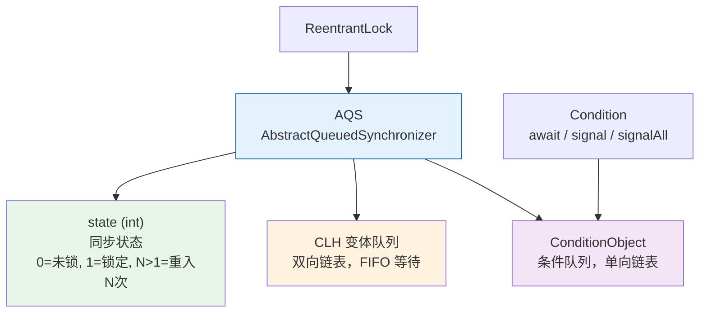
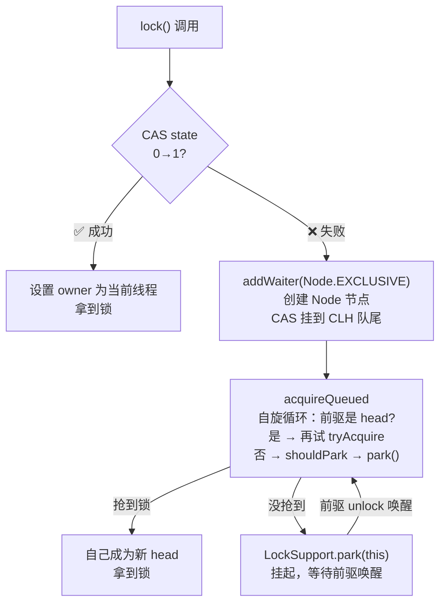
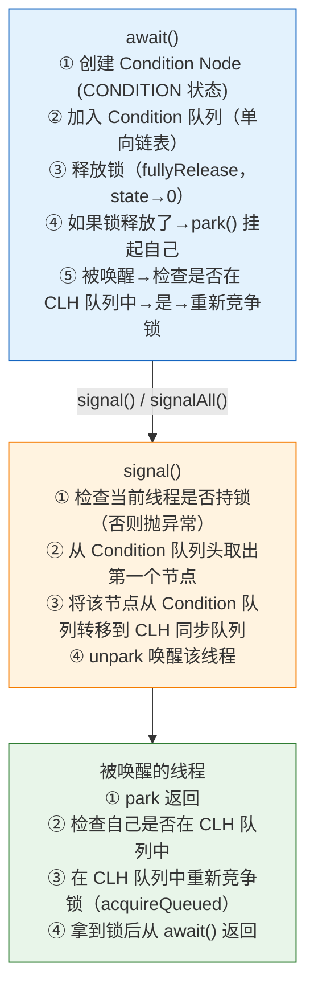

# 历史背景——synchronized 不够用的时候

Java 1.0 只有 `synchronized` 一种锁机制。它的设计很简单：每个对象有一个 monitor，进入 synchronized 块时 `monitorenter`，退出时 `monitorexit`。简单，但在实际使用中存在两个痛点：

1. **无法中断等待**：一个线程在 `synchronized` 块外等锁，你没办法让它"别等了"，只能一直等到天荒地老
2. **只有一个条件队列**：`wait/notify` 只能通知所有等待线程，无法区分"等吃的"和"等空位"的线程

2004 年 JSR-166（Java 5）引入 `ReentrantLock` 和 `Condition`，补上了这两个短板。`ReentrantLock` 支持 `lockInterruptibly()`、`tryLock(timeout)`、公平/非公平模式选择。`Condition` 支持多个独立的条件队列——这正是 `ArrayBlockingQueue` 高效实现生产者-消费者模式的基础。

理解 `ReentrantLock` 的关键在于——它的代码量只有约 200 行，因为**所有排队、阻塞、唤醒的逻辑都在 AQS 里**。你只需要理解 "state 的含义"和"tryAcquire/tryRelease 的判断"，就理解了整个锁。



---

# 一、ReentrantLock.lock()——从 state=0 到 state=1

## 1.1 非公平锁：新来的可以先插队

```java
// ReentrantLock.NonfairSync.lock()
final void lock() {
    if (compareAndSetState(0, 1))      // ① 上来就 CAS 抢！不管队列里有没有人
        setExclusiveOwnerThread(Thread.currentThread()); // 抢到 → 结束
    else
        acquire(1);                     // ② 抢不到 → 走 AQS 标准流程
}

// NonfairSync.tryAcquire()
protected final boolean tryAcquire(int acquires) {
    int c = getState();
    if (c == 0) {
        if (compareAndSetState(0, acquires)) {   // 再次 CAS 抢！依然不检查队列
            setExclusiveOwnerThread(Thread.currentThread());
            return true;
        }
    }
    else if (getExclusiveOwnerThread() == Thread.currentThread()) {
        // 重入：同一个线程再加锁 → state + 1
        setState(c + acquires);
        return true;
    }
    return false;  // 不是当前线程 → 去排队
}
```

**"非公平"的体现**：新来的线程可能比队列里等了一会的线程先拿到锁。`lock()` 和 `tryAcquire()` 两次 CAS 都是抢队列的队首——如果队首刚释放锁、新线程刚好在这一刻 CAS，新来的就插队了。

**为什么默认非公平？** 性能。公平锁每次释放后必须唤醒队首 → 队首被 schedule → 上下文切换 → 才拿到锁。而非公平锁如果正好有线程在执行 `lock()`，它可以正好赶上队首被唤醒但还被 OS schedule 的空档 → 直接拿到锁 → 省一次上下文切换。

## 1.2 公平锁：谁先来谁先拿

```java
// ReentrantLock.FairSync.tryAcquire()
protected final boolean tryAcquire(int acquires) {
    int c = getState();
    if (c == 0) {
        // ⚠️ 关键区别：多了 hasQueuedPredecessors() 检查！
        if (!hasQueuedPredecessors() &&           // 没人在我前面排队？
            compareAndSetState(0, acquires)) {      // 那我才能抢
            setExclusiveOwnerThread(Thread.currentThread());
            return true;
        }
    }
    // ... 重入逻辑同上
}

// AQS.hasQueuedPredecessors()
public final boolean hasQueuedPredecessors() {
    Node h = head, s = head.next;
    // 如果 head.next 为空或 head.next.thread = 当前线程 → 表无人排队或自己是队首
    return h != tail && (s == null || s.thread != Thread.currentThread());
}
```

## 1.3 AQS.acquire()——挂起等待的完整链路

```java
// AQS.acquire() —— 所有 ReentrantLock 最终的排队入口
public final void acquire(int arg) {
    if (!tryAcquire(arg) &&                              // ① 子类再试一次
        acquireQueued(addWaiter(Node.EXCLUSIVE), arg))   // ② 失败→入队→自旋→park
        selfInterrupt();                                  // ③ 恢复中断标记
}
```



## 1.4 ReentrantLock.unlock()——重入计数归零才释放

```java
// ReentrantLock.unlock()
public void unlock() { sync.release(1); }

// AQS.release()
public final boolean release(int arg) {
    if (tryRelease(arg)) {          // 子类判断"可以释放了吗"
        Node h = head;
        if (h != null && h.waitStatus != 0)
            unparkSuccessor(h);     // 唤醒 CLH 队首的下一个等待者
        return true;
    }
    return false;
}

// Sync.tryRelease()
protected final boolean tryRelease(int releases) {
    int c = getState() - releases;    // state - 1
    if (getExclusiveOwnerThread() != Thread.currentThread())
        throw new IllegalMonitorStateException();
    boolean free = (c == 0);          // state 归零 = 完全释放
    if (free) setExclusiveOwnerThread(null);
    setState(c);                      // 更新 state
    return free;
}
```

**重入计数示例**：
```java
ReentrantLock lock = new ReentrantLock();
lock.lock();    // state: 0→1, owner=Thread-A
lock.lock();    // state: 1→2 (重入)
lock.unlock();  // state: 2→1 (还没释放！owner 仍是 Thread-A)
lock.unlock();  // state: 1→0 (归零 → 真正释放 → 唤醒队首)
```

---

# 二、Condition——为什么比 wait/notify 强？

## 2.1 synchronized 的 wait/notify 有什么问题？

```java
// 这是生产者-消费者的最粗糙版本
synchronized (buffer) {
    while (buffer.isEmpty()) {
        buffer.wait();  // 所有线程都在 buffer 对象上等
    }
    // 不管是"等吃的"消费者还是"等空位"的生产者，wait 在同一个对象上
}
buffer.notifyAll();  // 必须唤醒所有人 → 大量无谓的唤醒和检查
```

问题有两个层次：
1. **notify 无法指定唤醒谁**——只能 `notify()`（随机一个）或 `notifyAll()`（全部），无法说"只唤醒一个消费者"
2. **所有条件共用一个等待队列**——生产者在等"不满"，消费者在等"不空"，但全混在同一个 WaitSet 里

## 2.2 Condition：每个条件独立的等待室

```java
Lock lock = new ReentrantLock();
Condition notFull  = lock.newCondition();   // "不满"条件队列
Condition notEmpty = lock.newCondition();   // "不空"条件队列

// 生产者（生产完唤醒消费者）
public void put(Object item) throws InterruptedException {
    lock.lock();
    try {
        while (buffer.isFull()) notFull.await();  // 在 notFull 上等
        buffer.add(item);
        notEmpty.signal();   // ← 只唤醒不在 "notEmpty" 上的消费者！
    } finally { lock.unlock(); }
}

// 消费者（消费完唤醒生产者）
public Object take() throws InterruptedException {
    lock.lock();
    try {
        while (buffer.isEmpty()) notEmpty.await();  // 在 notEmpty 上等
        Object item = buffer.remove();
        notFull.signal();    // ← 只唤醒等在 "notFull" 上的生产者！
        return item;
    } finally { lock.unlock(); }
}
```

## 2.3 await/signal 的底层流转



**关键源码片段**：

```java
// ConditionObject.await()
public final void await() throws InterruptedException {
    Node node = addConditionWaiter();     // ① 创建 CONDITION 节点，加入 Condition 队列尾
    int savedState = fullyRelease(node);  // ② 释放锁（state 全部释放，记录重入次数）
    int interruptMode = 0;
    while (!isOnSyncQueue(node)) {        // ③ 等 signal 把自己转移到 CLH 队列
        LockSupport.park(this);            // ④ park 挂起
        if ((interruptMode = checkInterruptWhileWaiting(node)) != 0)
            break;
    }
    if (acquireQueued(node, savedState) && interruptMode != THROW_IE)
        interruptMode = REINTERRUPT;       // ⑤ 被唤醒后在 CLH 队列中重新竞争锁
    if (interruptMode != 0)
        reportInterruptAfterWait(interruptMode);
}

// ConditionObject.signal()
public final void signal() {
    if (!isHeldExclusively()) throw new IllegalMonitorStateException();  // 必须持锁！
    Node first = firstWaiter;
    if (first != null) doSignal(first);  // 从队首开始转移
}

private void doSignal(Node first) {
    do {
        if ((firstWaiter = first.nextWaiter) == null) lastWaiter = null;
        first.nextWaiter = null;          // 从 Condition 队列中脱离
    } while (!transferForSignal(first) &&  // 转移到 CLH 队列
             (first = firstWaiter) != null);
}
```

## 2.4 为什么 Condition 能做到精确唤醒而 wait/notify 不行？

| | wait/notify | Condition |
|------|-----------|----------|
| **等待队列结构** | 对象监视器的单个 WaitSet | 每个 Condition 独立的单向链表 |
| **队列数量** | 每个对象只有一个 | 一个 Lock 可以创建多个 Condition |
| **唤醒能力** | notifyAll() 全部唤醒 | signal() 只唤醒特定 Condition 队列中的一个 |
| **底层实现** | JVM native（ObjectMonitor） | Java 纯代码（AQS.ConditionObject） |

**核心差异**：`Condition` 把"等待原因"和"等待队列"一一对应——等吃的挂 notEmpty 队列，等空位的挂 notFull 队列。`notFull.signal()` 只 touch notFull 的节点，不碰 notEmpty。

---

# 三、ArrayBlockingQueue 的完整实现——Condition 的经典应用

```java
// ArrayBlockingQueue 的 put/take 精简版
public class ArrayBlockingQueue<E> {
    final Object[] items;
    int count;
    final ReentrantLock lock;
    final Condition notEmpty;  // 消费者等在这里
    final Condition notFull;   // 生产者等在这里
    
    public ArrayBlockingQueue(int capacity) {
        items = new Object[capacity];
        lock = new ReentrantLock();
        notEmpty = lock.newCondition();
        notFull = lock.newCondition();
    }
    
    public void put(E e) throws InterruptedException {
        lock.lock();
        try {
            while (count == items.length)   // 满了 → 等 notFull
                notFull.await();
            enqueue(e);
        } finally { lock.unlock(); }
    }
    
    private void enqueue(E e) {
        items[putIndex] = e;
        if (++putIndex == items.length) putIndex = 0;
        count++;
        notEmpty.signal();  // 放入了一个元素 → 唤醒一个等吃的消费者
    }
    
    public E take() throws InterruptedException {
        lock.lock();
        try {
            while (count == 0)              // 空了 → 等 notEmpty
                notEmpty.await();
            return dequeue();
        } finally { lock.unlock(); }
    }
    
    private E dequeue() {
        E e = (E) items[takeIndex];
        items[takeIndex] = null;
        if (++takeIndex == items.length) takeIndex = 0;
        count--;
        notFull.signal();   // 拿走了一个元素 → 唤醒一个等空位的生产者
        return e;
    }
}
```

**这个实现完美体现了 Condition 的价值**：`notFull` 和 `notEmpty` 两套队列互不干扰。一个生产者在 put 时只唤醒一个消费者，不会唤醒另一个生产者——两个生产者在"谁先放"这个问题上自然由 Lock 决定，不需要 Condition 参与。

---

# 四、总结

| 概念 | 本质 |
|------|------|
| **state** | 锁的计数器——0 空闲，1 锁定，N 重入 N 次（每次 unlock 减 1，归零释放） |
| **公平 vs 非公平** | 非公平不检查队列直接 CAS 抢（高性能），公平先检查 `hasQueuedPredecessors()` |
| **CLH 队列** | 锁竞争等待区——FIFO，非公平锁新来者可以 CAS 抢队首 |
| **Condition 队列** | 条件等待区——每个 Condition 独立单向链表，与 CLH 队列是两个不同结构 |
| **signal 做什么** | 把节点从 Condition 队列**转移**到 CLH 队列的队尾（不是直接唤醒拿到锁！） |
| **精确唤醒** | 每个 Condition 独立队列 → signal 只 touch 本队列 → 不错唤 |

# 延伸阅读

**Do——动手验证：**
- Debug 跟踪 `ReentrantLock.lock()` 的调用栈：确认非公平锁两次 CAS 的路径
- 写一个 `ReentrantLock` + 两个 `Condition` 的 ArrayBlockingQueue 简化版，对比与 JDK `ArrayBlockingQueue` 的实现差异
- `jstack -l <pid>` 看一个持有 `ReentrantLock` 的线程的 `locked ownable synchronizers` 段——可以确认线程持有哪些锁

**Todo——深入方向：**
- `StampedLock` 的乐观读模式——如何在不加锁的情况下保证读一致性
- `ReentrantReadWriteLock` 的读锁降级——为什么读锁不能直接升级为写锁
- `LockSupport.park/unpark` 与 `Object.wait/notify` 的区别——为什么 park 不需要先持锁

*本文参考资料：*
- Doug Lea, "The java.util.concurrent Synchronizer Framework" (2004)
- Brian Goetz et al.《Java Concurrency in Practice》——第 13-14 章
- OpenJDK 源码: `java.util.concurrent.locks.ReentrantLock` / `AbstractQueuedSynchronizer.ConditionObject`
