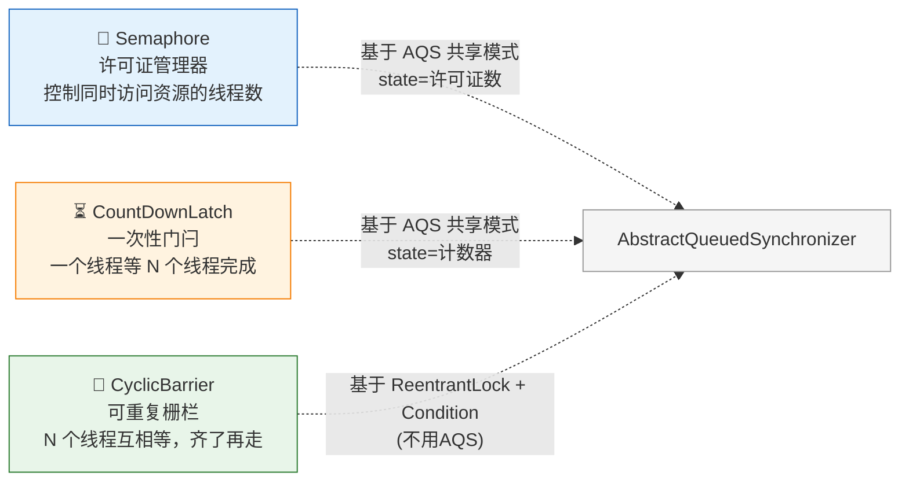
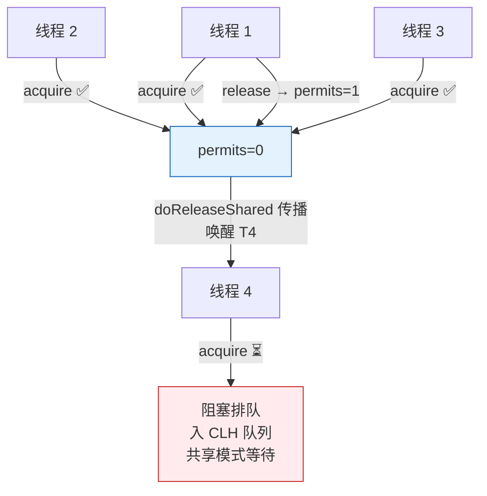
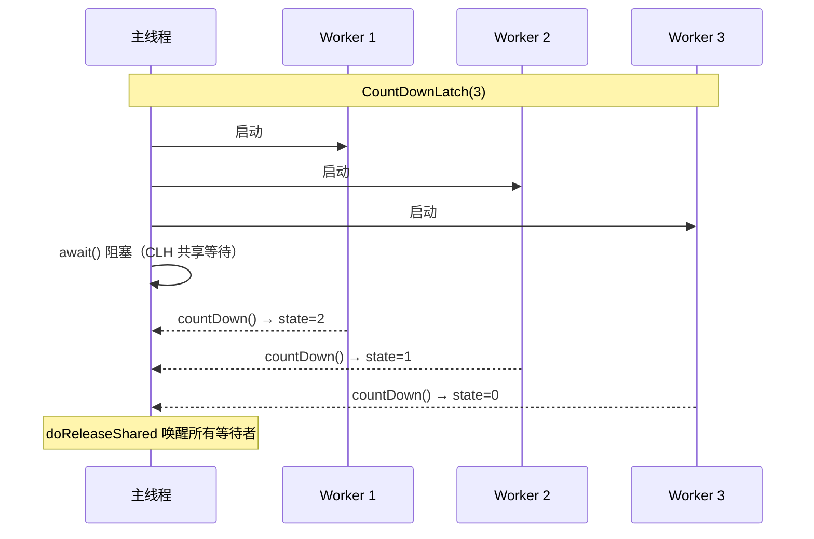

# 历史背景——为什么需要三种"等"？

Java 1.0 只有一种"等"——`synchronized + wait/notify`。一个线程可以等某个条件，另一个线程可以通知它。但这份工具箱缺了三样东西：

1. **控制并发数**——"最多 3 个线程同时访问数据库连接池"
2. **一个等多个完成**——"主线程等 10 个查询线程全部返回"
3. **多个互相等到齐**——"4 个玩家都准备就绪后一起进入下一回合"

这三种场景用 `wait/notify` 都能实现，但代码量都在 50-100 行，而且容易出错。JSR-166 引入了三个专用工具，每个对应一种"等"的模式，底层都基于 AQS。



---

# 一、三句话认识三兄弟

| 工具 | 一句话 | 生活类比 |
|------|--------|----------|
| **Semaphore** | 控制"最多 N 个线程同时访问" | 停车场只有 3 个车位，第 4 辆车等着 |
| **CountDownLatch** | 一个线程等 N 个线程完成任务 | 导游等所有团员到齐再出发 |
| **CyclicBarrier** | N 个线程互相等，凑齐了**一起**执行 | 公司团建：先到的人等其他人，人齐了统一出发，下个景点再等 |

---

# 二、Semaphore——停车场管理员（AQS 共享模式）

## 2.1 What：Semaphore 怎么工作？

Semaphore 基于 AQS 共享模式。`state` = 许可证数。`acquire()` 尝试 CAS 减 1，减到负数就进 CLH 队列等。`release()` CAS 加 1，成功走 `doReleaseShared` 传播唤醒一串等待者。

```java
// 创建一个有 3 个许可证的信号量
Semaphore semaphore = new Semaphore(3);

semaphore.acquire();   // permits: 3 → 2
try {
    doWork();          // 最多 3 个线程同时执行这里
} finally {
    semaphore.release(); // permits: 2 → 3（归还）
}
```



## 2.2 Classic Use Case：简易数据库连接池

```java
public class ConnectionPool {
    private final Semaphore semaphore;
    private final BlockingQueue<Connection> pool;
    
    public ConnectionPool(int size) {
        semaphore = new Semaphore(size);
        pool = new LinkedBlockingQueue<>(size);
        for (int i = 0; i < size; i++) pool.add(createConnection());
    }
    
    public Connection borrow(long timeout, TimeUnit unit) 
            throws InterruptedException {
        if (!semaphore.tryAcquire(timeout, unit))  // 超时等待
            throw new RuntimeException("连接池已满，无法获取连接");
        return pool.poll();  // 一定能拿到，因为 semaphore 保证了至少一个空闲
    }
    
    public void release(Connection conn) {
        pool.offer(conn);
        semaphore.release();  // 归还许可证 → 唤醒等待者
    }
}
```

**关键设计**：semaphore 的 permits = 连接池大小。`borrow()` 先拿许可证再取连接——拿到许可证就保证至少有一个空闲连接。不需要 `null` 检查。

## 2.3 公平 vs 非公平

```java
// 非公平（默认）：新来的 acquire 可能插队到 CLH 队列的队首
new Semaphore(3);

// 公平：多一次 hasQueuedPredecessors() 检查 → FIFO 排队
new Semaphore(3, true);
```

> 非公平吞吐量更高（减少上下文切换），公平模式保证不会饥饿。

---

# 三、CountDownLatch——一次性门闩（AQS 共享模式，不可重置）

## 3.1 What：CountDownLatch 怎么工作？

CountDownLatch 也基于 AQS 共享模式，但**state 只能减少不能增加**。构造函数设 `state=N`。`countDown()` CAS 减 1。减到 0 时 `doReleaseShared` 唤醒所有在 `await()` 的线程。

```java
CountDownLatch latch = new CountDownLatch(3);  // state = 3

// 三个 Worker 线程各自执行：
new Thread(() -> { doWork1(); latch.countDown(); }).start();  // state: 3→2
new Thread(() -> { doWork2(); latch.countDown(); }).start();  // state: 2→1
new Thread(() -> { doWork3(); latch.countDown(); }).start();  // state: 1→0 → 唤醒主线程！

// 主线程等待：
latch.await();  // 阻塞直到 state=0
System.out.println("所有任务完成");
```



## 3.2 Classic Use Case：并行查询归并

```java
public List<Result> parallelQuery(List<String> params) 
        throws InterruptedException {
    
    CountDownLatch latch = new CountDownLatch(params.size());
    List<Result> results = new CopyOnWriteArrayList<>();
    
    for (String param : params) {
        executor.submit(() -> {
            try {
                Result r = queryRemote(param);
                results.add(r);
            } finally {
                latch.countDown();  // 无论如何减一
            }
        });
    }
    
    // 最多等 5 秒，超时返回不完整结果
    if (!latch.await(5, TimeUnit.SECONDS)) {
        log.warn("部分查询未在超时时间完成");
    }
    return results;
}
```

## 3.3 致命限制

> **CountDownLatch 是一次性的。state 归零后不能重置。**

如果需要可重置的 CountDownLatch → CyclicBarrier 或 JDK 7 的 `Phaser`。

---

# 四、CyclicBarrier——可重复的栅栏（ReentrantLock + Condition）

## 4.1 What：CyclicBarrier 怎么工作？

与 Semaphore 和 CountDownLatch 不同，CyclicBarrier **不用 AQS**——它用 `ReentrantLock + Condition`。原因是它的逻辑是"计数递增到 parties 后全员释放并重置"——与 AQS 的 state 减少逻辑不匹配。

```java
// 4 个线程都到齐后自动执行回调，然后大家一起出发
CyclicBarrier barrier = new CyclicBarrier(4, () -> {
    System.out.println("4 人到齐，出发！");
});

// 每个线程执行多轮
executor.submit(() -> {
    for (int round = 0; round < 3; round++) {
        doPhase(round);
        barrier.await();  // 等人齐 → 一起进入下一轮
    }
});
```

```mermaid
sequenceDiagram
    participant T1 as 线程 1
    participant T2 as 线程 2
    participant T3 as 线程 3
    participant CB as CyclicBarrier
    
    Note over T1,CB: 第一轮：parties=3
    
    T1->>CB: await() → count: 0→1，park
    T2->>CB: await() → count: 1→2，park
    T3->>CB: await() → count: 2→3=parties
    Note over CB: 全员释放 + barrierAction + 自动重置 count=0
    
    Note over T1,CB: 第二轮：继续用同一个 CyclicBarrier
    
    T1->>CB: await() → count: 0→1，park
    ...
```

## 4.2 关键源码片段

```java
// CyclicBarrier.await() 的核心逻辑（简化）
private int dowait(boolean timed, long nanos) {
    final ReentrantLock lock = this.lock;
    lock.lock();
    try {
        int index = --count;  // 计数器增加（每来一个线程 count 减 1）
        if (index == 0) {      // 最后一个线程到了！
            final Runnable command = barrierCommand;
            if (command != null) command.run();  // 执行回调
            nextGeneration();    // 唤醒所有等待线程 + 重置 count
            return 0;
        }
        // 还没齐 → 在 trip Condition 上等待
        for (;;) {
            trip.await();  // ← 在 Condition 上等待
            if (g.broken) throw new BrokenBarrierException();
        }
    } finally { lock.unlock(); }
}

private void nextGeneration() {
    trip.signalAll();      // 唤醒所有等待在 trip 上的线程
    count = parties;       // 重置计数器
    generation = new Generation();  // 新"轮次"
}
```

## 4.3 与 CountDownLatch 的本质区别

| | CountDownLatch | CyclicBarrier |
|------|---------------|---------------|
| **计数方向** | 递减（N → 0） | 递增（0 → N→重置） |
| **可重置** | ❌ 一次性 | ✅ await 满后自动重置 |
| **等待关系** | 一个线程等多线程 | 多线程互相等 |
| **回调** | ❌ | ✅ barrierAction（全员到齐时执行） |
| **失败处理** | 一个 countDown 异常不影响其他 | 一个线程中断/超时 → **所有**等待线程抛 `BrokenBarrierException` |
| **底层** | AQS 共享模式 | ReentrantLock + Condition |

## 4.4 CyclicBarrier 的"断栏"——BrokenBarrierException

```java
// 当任何一个 await 超时、中断或抛异常时
// → CyclicBarrier "断栏"（broken）
// → 所有正在等待的线程都收到 BrokenBarrierException
// → barrier 进入 broken 状态 → 所有后续 await 也立即抛异常
// → 需要手动 reset()

try {
    barrier.await(5, TimeUnit.SECONDS);  // 超时等待
} catch (TimeoutException e) {
    // 我这个线程不等了，但其他线程还等在 await 上
    // → barrier 断栏 → 其他线程收到 BrokenBarrierException
    log.warn("超时，barrier 已断栏");
}
```

---

# 五、一眼能懂的选型图

```mermaid
flowchart TD
    Q1{"谁等谁？"}
    
    Q1 -->|"控制\"最多 N 个\"\n同时访问资源"| SEM["🔑 Semaphore\n停车场车位管理\n(AQS 共享模式)"]
    Q1 -->|"一个线程\n等 N 个线程完成"| CDL["⏳ CountDownLatch\n导游等人到齐\n(AQS 共享模式，state 只减不增)"]
    Q1 -->|"N 个线程\n互相等，齐了一起走"| CB["🔄 CyclicBarrier\n团建等人到齐\n(Lock+Condition，可重置)"]
    
    SEM -->|"需要重置？"| SEM_USE["acquire/release 本身就是可重复的"]
    CDL -->|"需要重复使用？"| CDL_USE["❌ 不能 → 用 CyclicBarrier 或 Phaser"]
    CB -->|"一个线程失败？"| CB_USE["⚠️ 全部 BrokenBarrierException\n→ 必须处理"]
```

---

# 六、底层实现速查

| 工具 | 底层 | 核心机制 |
|------|------|---------|
| **Semaphore** | AQS 共享模式 | `state=permits`，acquire CAS 减，release CAS 加 + 传播唤醒 |
| **CountDownLatch** | AQS 共享模式 | `state=count`，countDown CAS 减，归零→doReleaseShared 唤醒全部 |
| **CyclicBarrier** | `ReentrantLock + Condition` | `count` 递增到 `parties`→signalAll→重置 count |

---

# 七、总结

| 口诀 | 工具 | 底层 |
|------|------|------|
| **一个等多个完成** | CountDownLatch | AQS 共享模式，state 只减不增 |
| **多个互相等到齐** | CyclicBarrier | `Lock+Condition`，可重置，断栏全断 |
| **控制最多 N 个并发** | Semaphore | AQS 共享模式，可增可减，公平可选 |

> 三兄弟本质上是 **AQS** 在不同场景下的封装（CyclicBarrier 例外）。理解它们的关键不是背 API，而是理解每种场景下**"谁在等谁、计数器怎么变、能不能重置、一个线程失败会不会影响别人"**这四个问题。

# 延伸阅读

**Do——动手验证：**
- 用 CountDownLatch 实现一个简单的启动门（应用启动时所有服务初始化完成后再接受流量）
- 用 CyclicBarrier 模拟 3 人对战游戏——3 个线程各执行 3 回合，每回合后等人齐
- 用 Semaphore 限制同一个 API 最大并发调用数 = 10（配合线程池使用）

**Todo——深入方向：**
- `Phaser`（JDK 7）——一个可以动态增减参与者数量的 CyclicBarrier 替代品
- `Exchanger`（JDK 5）——两个线程在栅栏点交换数据的工具
- Semaphore 的 `drainPermits()` 和 `reducePermits()` 的底层实现场景

*本文参考资料：*
- Brian Goetz et al.《Java Concurrency in Practice》——第 14 章（构建自定义同步工具）
- Doug Lea, "The java.util.concurrent Synchronizer Framework" (2004)
- OpenJDK 源码: `java.util.concurrent.Semaphore` / `CountDownLatch` / `CyclicBarrier`
