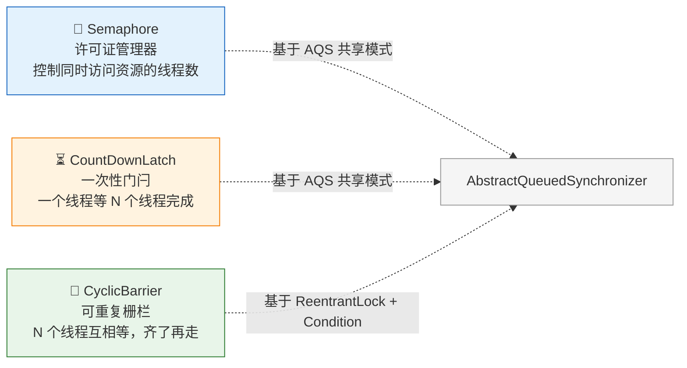
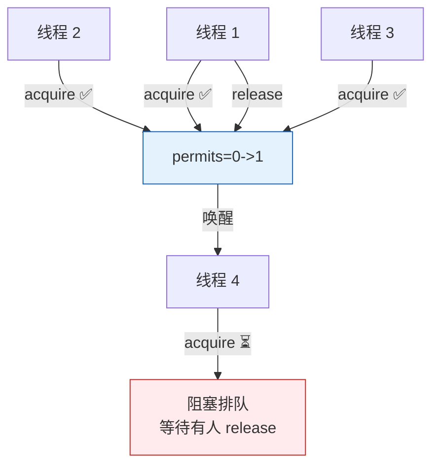
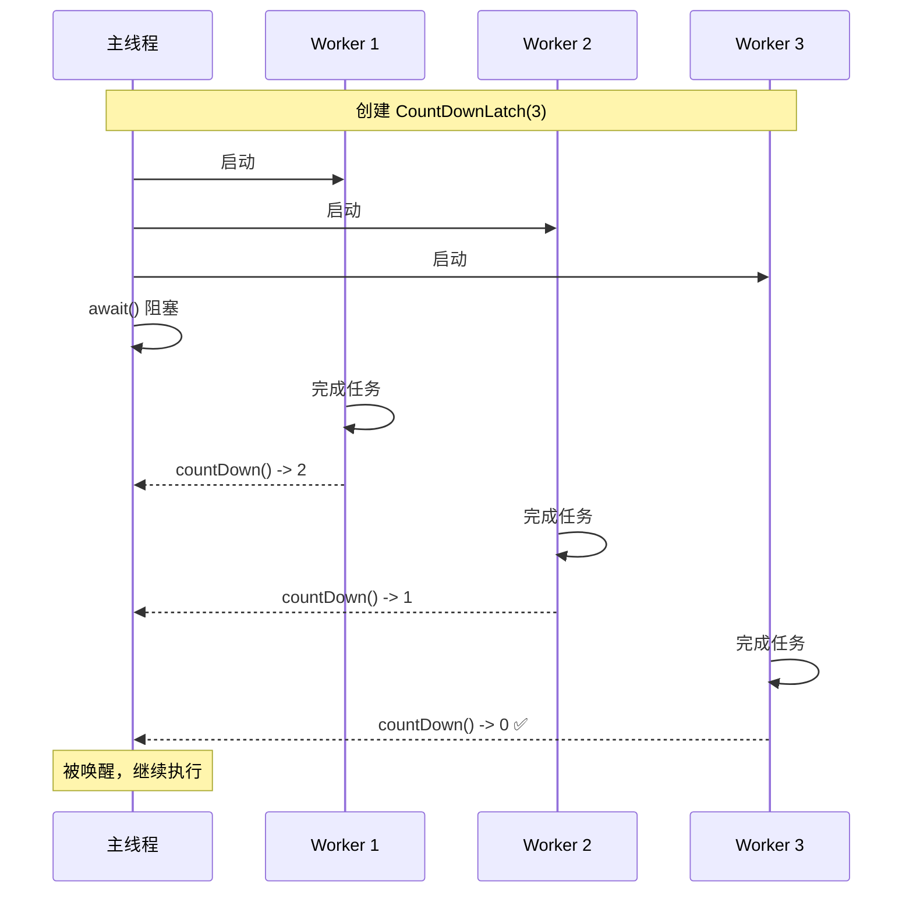
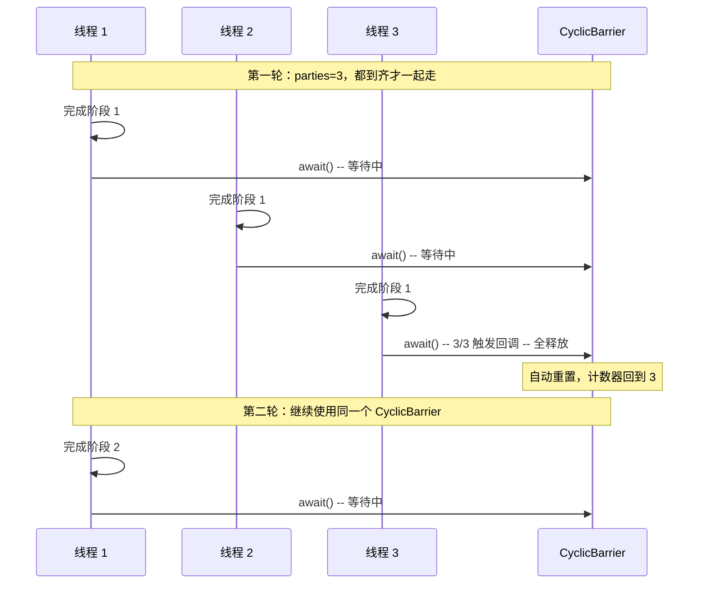

---

# 一、三句话认识三兄弟

| 工具 | 一句话 | 生活类比 |
|------|--------|----------|
| **Semaphore** | 控制"最多 N 个线程同时访问" | 停车场只有 3 个车位，第 4 辆车等着 |
| **CountDownLatch** | 一个线程等 N 个线程完成任务 | 导游等所有团员到齐再出发 |
| **CyclicBarrier** | N 个线程互相等，凑齐了**一起**执行 | 公司团建：先到的人等其他人，人齐了统一出发，到下一个景点再等 |

---

# 二、Semaphore——停车场管理员

## 2.1 核心原理

```java
// 创建一个有 3 个许可证的信号量
Semaphore semaphore = new Semaphore(3);

// 线程获取许可证（acquire 会阻塞直到有许可证）
semaphore.acquire();  // permits: 3 → 2
try {
    // 访问受限资源（如数据库连接池）
    doWork();
} finally {
    semaphore.release();  // permits: 2 → 3（归还）
}
```



## 2.2 经典场景：数据库连接池

```java
public class ConnectionPool {
    private final Semaphore semaphore;
    private final List<Connection> pool;
    
    public ConnectionPool(int size) {
        semaphore = new Semaphore(size);
        pool = new ArrayList<>(size);
        // 初始化 size 个连接
    }
    
    public Connection borrow() throws InterruptedException {
        semaphore.acquire();           // 拿许可证，没空闲就等
        return pool.remove(0);
    }
    
    public void release(Connection conn) {
        pool.add(conn);
        semaphore.release();           // 还许可证，唤醒等待者
    }
}
```

## 2.3 公平模式 vs 非公平模式

```java
// 非公平（默认）：新来的 acquire 可能插队
new Semaphore(3);

// 公平：按 FIFO 顺序排队获取
new Semaphore(3, true);
```

> 非公平模式吞吐量更高（减少上下文切换），公平模式保证不会饥饿。

---

# 三、CountDownLatch——一次性门闩

## 3.1 核心原理

```java
CountDownLatch latch = new CountDownLatch(3);  // 计数器 = 3

// 三个 Worker 线程：
new Thread(() -> {
    doWork1();
    latch.countDown();  // 计数器 3 → 2
}).start();
new Thread(() -> {
    doWork2();
    latch.countDown();  // 2 → 1
}).start();
new Thread(() -> {
    doWork3();
    latch.countDown();  // 1 → 0 → 唤醒主线程！
}).start();

// 主线程等待所有 Worker 完成：
latch.await();  // 阻塞直到计数器归零
System.out.println("所有任务完成，继续执行");
```



## 3.2 经典场景：并行任务归并

```java
public List<Result> parallelQuery(List<String> params) 
        throws InterruptedException {
    
    CountDownLatch latch = new CountDownLatch(params.size());
    List<Result> results = new CopyOnWriteArrayList<>();
    
    for (String param : params) {
        executor.submit(() -> {
            try {
                Result r = queryRemote(param);
                results.add(r);
            } finally {
                latch.countDown();  // 无论如何保证减一
            }
        });
    }
    
    latch.await(5, TimeUnit.SECONDS);  // 最多等 5 秒
    return results;  // 所有线程完成（或超时）
}
```

## 3.3 致命限制

> **CountDownLatch 是一次性的。计数器归零后不能重置。**

如果需要可重置的 CountDownLatch → 用 CyclicBarrier 或者 `Phaser`（JDK 7+）。

---

# 四、CyclicBarrier——可重复的栅栏

## 4.1 核心原理

```java
// 4 个线程都到齐后，自动执行栅栏回调，然后大家一起出发
CyclicBarrier barrier = new CyclicBarrier(4, () -> {
    System.out.println("🎉 4 个人到齐了，出发！");
});

// 每个线程：
new Thread(() -> {
    for (int i = 0; i < 3; i++) {
        doPhase(i);
        barrier.await();  // 等人齐 → 一起进入下一轮
    }
}).start();
```



## 4.2 经典场景：多回合模拟

```java
public class Simulation {
    private final CyclicBarrier barrier;
    
    public Simulation(int playerCount) {
        barrier = new CyclicBarrier(playerCount, () -> {
            System.out.println("回合结束，结算状态...");
        });
    }
    
    public void playRound(Player player) {
        // 每个玩家独立行动
        player.act();
        // 等所有玩家都行动完毕 → 进入下一回合
        barrier.await();
    }
}
```

## 4.3 与 CountDownLatch 的本质区别

| | CountDownLatch | CyclicBarrier |
|------|---------------|---------------|
| **计数方向** | 递减（N → 0） | 递增（0 → N） |
| **可重置** | ❌ 一次性 | ✅ `await()` 满 N 后自动重置 |
| **等待方** | 一个线程等多线程 | 多线程互相等 |
| **回调** | ❌ | ✅ 栅栏动作 barrierAction |
| **失败处理** | 一个线程中断，`await` 可继续减 | 一个线程中断/超时 → 所有等待线程抛 `BrokenBarrierException` |

---

# 五、一眼能懂的对比

```mermaid
flowchart TD
    Q1{"谁等谁？\n控制多少并发？"}
    
    Q1 -->|"控制\"最多 N 个\"\n同时访问资源"| SEM["🔑 用 Semaphore\n停车场车位管理"]
    Q1 -->|"一个线程\n等 N 个线程完成"| CDL["⏳ 用 CountDownLatch\n导游等人到齐"]
    Q1 -->|"N 个线程\n互相等，齐了一起走"| CB["🔄 用 CyclicBarrier\n团建等人到齐"]
    
    SEM -->|"一次性用完？"| SEM_USE["acquire()/release()\n可反复使用"]
    CDL -->|"能重置吗？"| CDL_USE["❌ 不能，一次性\n需重复用 -> CyclicBarrier"]
    CB -->|"有回调吗？"| CB_USE["✅ 栅栏回调\n一个线程挂->全 Broken"]
    
    style SEM fill:#e3f2fd,stroke:#1565c0
    style CDL fill:#fff3e0,stroke:#f57c00
    style CB fill:#e8f5e9,stroke:#2e7d32
```

---

# 六、底层实现速览

| 工具 | 底层 | 核心机制 |
|------|------|---------|
| **Semaphore** | AQS 共享模式 | `state` = 许可证数，`acquire` 尝试 CAS 减，失败入同步队列 |
| **CountDownLatch** | AQS 共享模式 | `state` = 计数，`countDown` CAS 减，归零时唤醒所有等待线程 |
| **CyclicBarrier** | `ReentrantLock` + `Condition` | `count` 递增，到 `parties` 后 `signalAll`，然后重置 |

---

# 七、总结

| 口诀 | 对应 |
|------|------|
| **一个等多个完成** | CountDownLatch |
| **多个互相等到齐** | CyclicBarrier |
| **控制最多 N 个并发** | Semaphore |

> 三兄弟本质上是 **AQS**（AbstractQueuedSynchronizer）在不同场景下的封装。理解它们的关键不是背 API，而是理解每种场景下"谁在等谁、等多久、能不能重复等"的差异。
