# 历史背景——ThreadLocal 解决什么问题？

2004 年 JSR-166 为 Java 引入了 `ThreadLocal`，它的定位从一开始就很明确：**线程级别的变量隔离**。每个线程持有一份独立副本，线程之间互不干扰。

```java
// 经典场景：每个线程的数据库连接
ThreadLocal<Connection> connectionHolder = ThreadLocal.withInitial(() -> {
    return dataSource.getConnection();
});

// Thread-1 拿到的是 Thread-1 的连接
// Thread-2 拿到的是 Thread-2 的连接
// 互不干扰，没有并发问题
Connection conn = connectionHolder.get();
```

这看起来很简单。但 ThreadLocal 之所以成为大厂面试高频考点，是因为它藏着一个精巧又危险的**数据结构嵌套**设计，以及由此引出的**内存泄漏**问题——而网上 90% 对 ThreadLocal 内存泄漏的解释都是错的或不够精确的。

---

# 一、数据结构——三层嵌套的精妙设计

## 1.1 经典误解

很多人以为 ThreadLocal 是一个 `Map<ThreadLocal, Object>` 的全局容器。**不是的。**

真正的结构是：

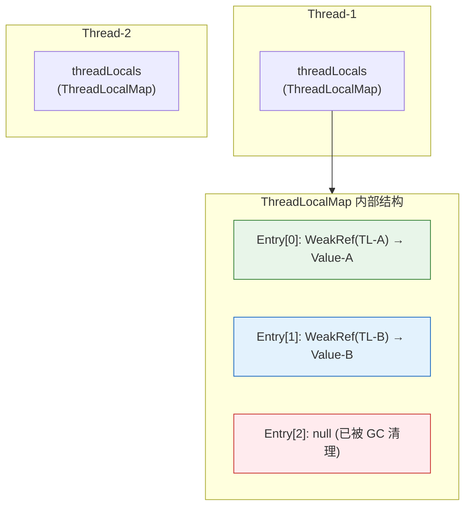

**每个 Thread 对象内部持有一个 `ThreadLocalMap`，ThreadLocalMap 的 Key 是对 ThreadLocal 实例的弱引用，Value 是线程私有的变量副本。**

## 1.2 源码中的三层结构

**第一层：Thread 持有 ThreadLocalMap**

```java
// java.lang.Thread
public class Thread implements Runnable {
    // 每个线程的 ThreadLocal 存储
    ThreadLocal.ThreadLocalMap threadLocals = null;
    
    // 可继承的 ThreadLocal 存储（给子线程用）
    ThreadLocal.ThreadLocalMap inheritableThreadLocals = null;
}
```

**第二层：ThreadLocalMap 是定制化的哈希表**

```java
// java.lang.ThreadLocal.ThreadLocalMap
static class ThreadLocalMap {
    // Entry 数组，初始容量 16，扩容阈值 2/3
    private Entry[] table;
    private int size = 0;
    private int threshold;
    
    // 核心数据结构
    static class Entry extends WeakReference<ThreadLocal<?>> {
        Object value;  // 线程私有的变量值
        
        Entry(ThreadLocal<?> k, Object v) {
            super(k);  // ← 对 ThreadLocal 的弱引用！
            value = v;
        }
    }
}
```

**第三层：Entry 继承 WeakReference——一切矛盾的源头**

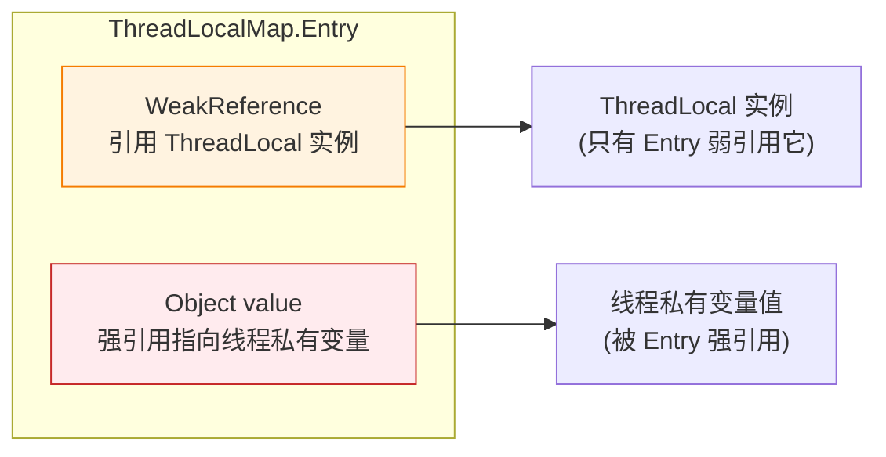

---

# 二、弱引用 Key——是精妙还是埋坑？

## 2.1 为什么 Key 要用弱引用？

先看如果 Key 用**强引用**会怎样：

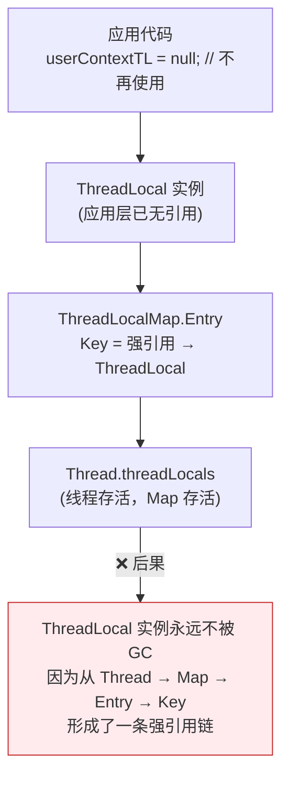

而用**弱引用**：

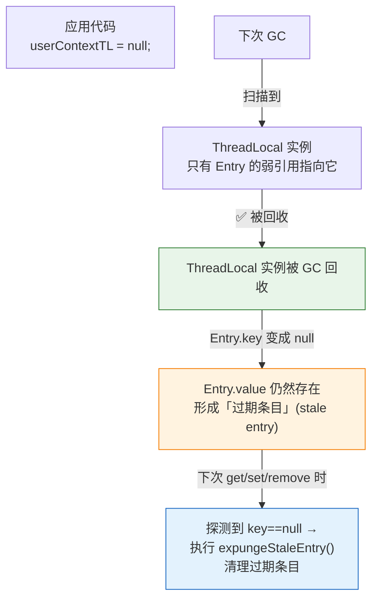

**弱引用的设计意图**：防止 ThreadLocal 实例自身的内存泄漏。当应用代码不再持有 ThreadLocal 引用时，ThreadLocal 实例可以被 GC 回收，而不会因为线程的 ThreadLocalMap 中还存着键而永远存活。

## 2.2 但这埋下了真正的坑——Entry.value 的内存泄漏

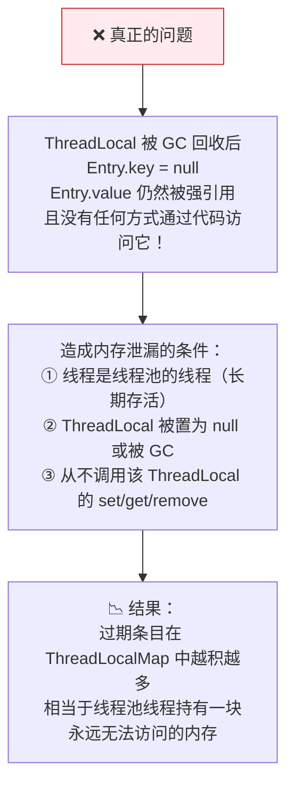

**划重点**：网上很多文章说 "ThreadLocal 的弱引用导致内存泄漏"——**这是错的**。恰恰相反，弱引用是**为了防止** ThreadLocal 实例泄漏。真正的泄漏来源是 **Entry.value 的强引用**——Key 被回收后，Value 无法被访问但也不被回收，形成真正的"孤儿"内存。

---

# 三、set/get/remove——源码全链路

## 3.1 ThreadLocal.set()

```java
// java.lang.ThreadLocal
public void set(T value) {
    Thread t = Thread.currentThread();     // ① 获取当前线程
    ThreadLocalMap map = getMap(t);        // ② 获取线程的 ThreadLocalMap
    if (map != null) {
        map.set(this, value);              // ③ 以 this(ThreadLocal) 为 Key 存入
    } else {
        createMap(t, value);               // ④ 首次 set → 创建 Map
    }
}

ThreadLocalMap getMap(Thread t) {
    return t.threadLocals;  // ← 直接返回 Thread 的成员变量
}
```

**ThreadLocalMap.set() —— 开放地址法探测**

```java
// ThreadLocalMap.set()
private void set(ThreadLocal<?> key, Object value) {
    Entry[] tab = table;  // ← Entry[] 数组，不是链地址法
    
    int i = key.threadLocalHashCode & (len - 1);  // ① 计算哈希槽位
    
    for (Entry e = tab[i]; e != null;              // ② 线性探测
         e = tab[i = nextIndex(i, len)]) {
        
        ThreadLocal<?> k = e.get();
        
        if (k == key) {
            e.value = value;       // CASE A: 找到了 → 更新 value
            return;
        }
        
        if (k == null) {
            replaceStaleEntry(key, value, i);  // CASE B: 遇到过期条目 → 替换
            return;
        }
    }
    
    tab[i] = new Entry(key, value);  // CASE C: 找到空位 → 插入新 Entry
    int sz = ++size;
    
    if (!cleanSomeSlots(i, sz) && sz >= threshold)
        rehash();  // 扩容前先全量清理过期条目
}
```

**为什么用开放地址法而不是 Separate Chaining？**

因为 ThreadLocalMap 的 Key 是弱引用，会"自动消失"。如果使用链地址法，链表中会出现很多 `key==null` 的节点需要遍历清理，线性探测 + 批量清理的效率更高。而且 ThreadLocal 的数量通常很少，开放地址法的缓存友好性更好。

## 3.2 ThreadLocal.get()

```java
// ThreadLocal.get()
public T get() {
    Thread t = Thread.currentThread();
    ThreadLocalMap map = getMap(t);
    if (map != null) {
        ThreadLocalMap.Entry e = map.getEntry(this);  // ① 查找 Entry
        if (e != null) {
            @SuppressWarnings("unchecked")
            T result = (T) e.value;
            return result;                             // ② 命中返回
        }
    }
    return setInitialValue();  // ③ 未命中 → 调用 initialValue() → 存入 → 返回
}
```

**getEntry() —— 线性探测 + 过期条目清理**

```java
// ThreadLocalMap.getEntry()
private Entry getEntry(ThreadLocal<?> key) {
    int i = key.threadLocalHashCode & (table.length - 1);  // ① 直接定位
    Entry e = table[i];
    if (e != null && e.get() == key)
        return e;                        // ② 直接命中 → 返回
    
    else
        return getEntryAfterMiss(key, i, e);  // ③ 未命中 → 线性探测
}

private Entry getEntryAfterMiss(ThreadLocal<?> key, int i, Entry e) {
    Entry[] tab = table;
    
    while (e != null) {
        ThreadLocal<?> k = e.get();
        if (k == key)
            return e;                // 找到目标 → 返回
        if (k == null)
            expungeStaleEntry(i);    // 遇到过期条目 → 彻底清理
        else
            i = nextIndex(i, len);   // 继续探测下一个
        e = tab[i];
    }
    return null;
}
```

**关键发现**：`get()` 在查找过程中，如果遇到 `key==null` 的过期条目，会**自动调用 `expungeStaleEntry()` 清理**。这意味着只要代码持续调用 `get()`，过期的 value 会被自动回收——**但前提是你在用这个 ThreadLocalMap。**

## 3.3 expungeStaleEntry——清理过期条目的"扫地僧"

```java
private int expungeStaleEntry(int staleSlot) {
    Entry[] tab = table;
    
    // ① 清除当前槽位
    tab[staleSlot].value = null;   // ← 解除对 value 的强引用！
    tab[staleSlot] = null;
    size--;
    
    // ② 重新哈希后续元素（直到遇到 null）
    Entry e;
    int i;
    for (i = nextIndex(staleSlot, len);
         (e = tab[i]) != null;
         i = nextIndex(i, len)) {
        
        ThreadLocal<?> k = e.get();
        if (k == null) {
            // 遇到连续过期条目 → 一起清理
            e.value = null;
            tab[i] = null;
            size--;
        } else {
            // 有效条目 → 重新哈希到正确位置
            int h = k.threadLocalHashCode & (len - 1);
            if (h != i) {
                tab[i] = null;
                while (tab[h] != null)
                    h = nextIndex(h, len);
                tab[h] = e;
            }
        }
    }
    return i;
}
```

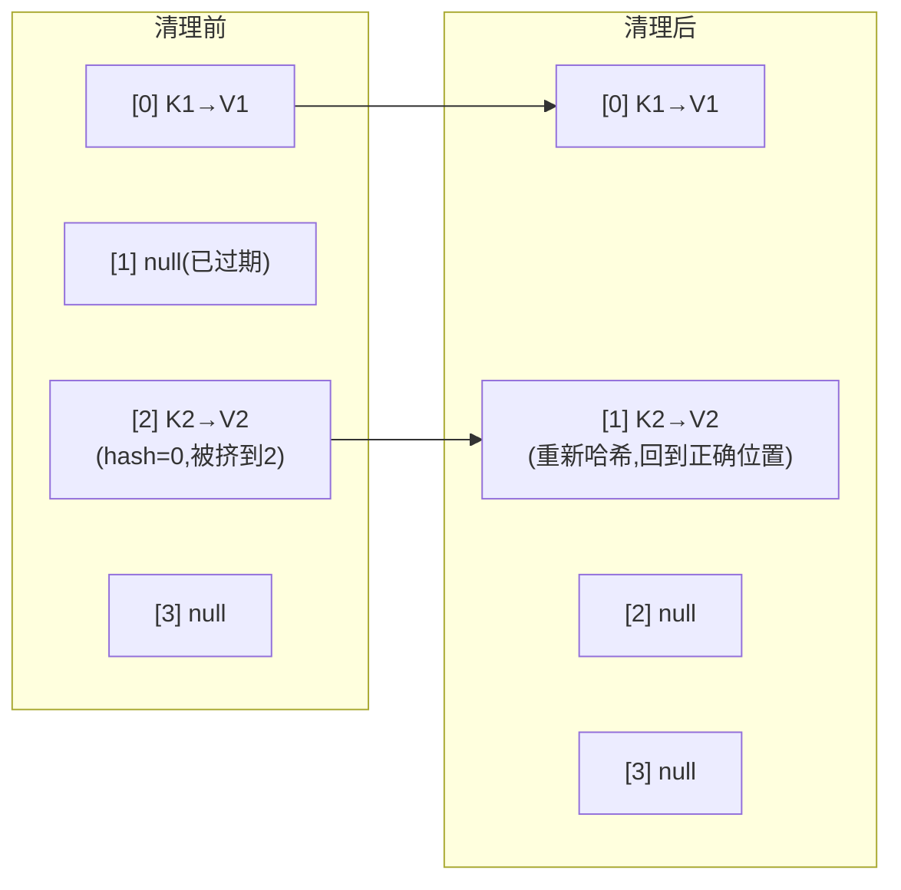

这个方法同时做了两件事：**清理 null key** + **整理哈希表**（把被挤出去的条目移回正确位置）。它被 `set()`、`get()`、`remove()`、`rehash()` 都调用——是 ThreadLocalMap 的自清洁机制。

## 3.4 remove()——你应该永远显式调用

```java
public void remove() {
    ThreadLocalMap m = getMap(Thread.currentThread());
    if (m != null)
        m.remove(this);  // ← 以 this(ThreadLocal) 为 Key 移除
}

// ThreadLocalMap.remove()
private void remove(ThreadLocal<?> key) {
    Entry[] tab = table;
    int i = key.threadLocalHashCode & (len - 1);
    for (Entry e = tab[i]; e != null; e = tab[i = nextIndex(i, len)]) {
        if (e.get() == key) {
            e.clear();                   // ① 清除弱引用 → Key 变为 null
            expungeStaleEntry(i);        // ② 清理 Entry + 整理哈希表
            return;
        }
    }
}
```

**为什么应该显式调用 `remove()`？**

因为 `set()` 和 `get()` 的清理是**启发式**的——只在探测路径上遇到过期条目时才清理。如果线程池中的线程长期不执行该 ThreadLocal 相关的代码，过期条目会一直堆积。

```java
// ✅ 最佳实践
try {
    threadLocal.set(someValue);
    // ... 业务逻辑
} finally {
    threadLocal.remove();  // ← 必须放在 finally 块！
}
```

---

# 四、ThreadLocal 内存泄漏的完整真相

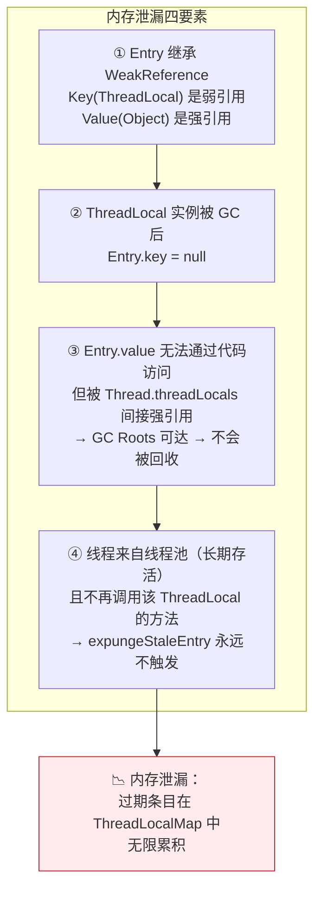

**四个条件缺一不可**：

| 条件 | 如果缺失 |
|---|---|
| 没有弱引用 Key | ThreadLocal 实例本身也会泄漏（更糟） |
| ThreadLocal 没被 GC | Key 存在，value 可以访问和清理 |
| 线程短命（如 Tomcat 每请求一线程） | 线程死亡→Thread→Map→Entry→value 全回收 |
| 主动调用 `remove()` | value 被及时清理，没有泄漏 |

**所以弱引用不是问题，它是解决方案的一部分。真正需要做的，是在线程池场景下始终 `remove()`。**

---

# 五、InheritableThreadLocal——父子线程的"继承"

## 5.1 使用场景

```java
// 父线程设置 traceId
InheritableThreadLocal<String> traceContext = new InheritableThreadLocal<>();
traceContext.set("trace-12345");

// 子线程自动继承
new Thread(() -> {
    System.out.println(traceContext.get());  // → "trace-12345"
}).start();
```

## 5.2 实现原理——在 Thread 构造函数中 Copy-on-Write

```java
// java.lang.Thread.init()
private void init(ThreadGroup g, Runnable target, String name, 
                  long stackSize, AccessControlContext acc,
                  boolean inheritThreadLocals) {
    // ...
    Thread parent = currentThread();
    
    if (inheritThreadLocals && parent.inheritableThreadLocals != null) {
        // ← 关键：在这里把父线程的 inheritableThreadLocals 复制给子线程
        this.inheritableThreadLocals = 
            ThreadLocal.createInheritedMap(parent.inheritableThreadLocals);
    }
    // ...
}

// ThreadLocal.createInheritedMap —— 浅拷贝
static ThreadLocalMap createInheritedMap(ThreadLocalMap parentMap) {
    return new ThreadLocalMap(parentMap);  // ← 遍历 Entry[]，复制每个 Entry
}
```

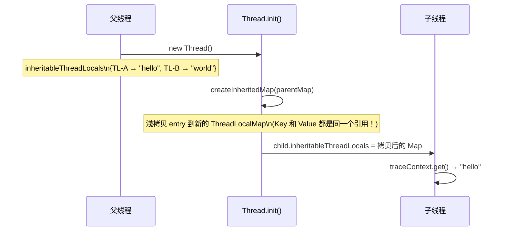

**重点：这是浅拷贝，不是深拷贝。** Key（ThreadLocal 实例）和 Value 都是**同一个引用**。这意味着父子线程对同一个可变对象的修改是**互相可见**的——这不是 bug，而是设计决定：ThreadLocal 的 Value 通常推荐是不可变对象（如 String、traceId），这样浅拷贝就是安全的。

## 5.3 InheritableThreadLocal 的局限性

**核心问题**：拷贝发生在线程**创建时**。线程池的线程是复用的，不会反复调用 `init()`，所以线程池场景下 InheritableThreadLocal **失效**：

```java
// ❌ 线程池场景：子线程拿到的是创建时的值，而非提交任务时的值
ExecutorService pool = Executors.newFixedThreadPool(2);
InheritableThreadLocal<String> ctx = new InheritableThreadLocal<>();

ctx.set("task-1");
pool.submit(() -> System.out.println(ctx.get()));  // → "task-1" (线程尚未创建)

ctx.set("task-2");
pool.submit(() -> System.out.println(ctx.get()));  // → "task-1" (线程已复用！不更新)
```

---

# 六、TransmittableThreadLocal——阿里开源的线程池上下文传递方案

## 6.1 设计思路

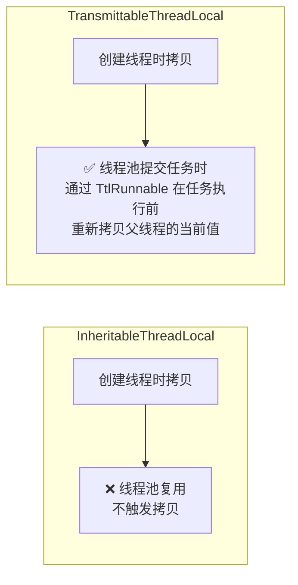

## 6.2 核心实现

```java
// TransmittableThreadLocal (简化版)
public class TransmittableThreadLocal<T> extends InheritableThreadLocal<T> {
    
    // 注册所有 TTL 实例
    private static final InheritableThreadLocal<Map<TransmittableThreadLocal<?>, Object>> holder;
    
    // ① 父线程 set：把值同时写入 holder（用于后续拷贝）
    @Override
    public final void set(T value) {
        super.set(value);   // 写入当前线程的 inheritableThreadLocals
        // ↓ 同时记录到 holder 中（key=this, value=value）
        holder.get().put(this, value);
    }
    
    // ② 任务提交时：snapshot 父线程的所有 TTL 值
    public static Object capture() {
        Map<TransmittableThreadLocal<?>, Object> captured 
            = new HashMap<>(holder.get());  // ← 拍快照！
        return captured;
    }
    
    // ③ 任务执行前：把快照值回灌到当前线程
    public static Object replay(Object captured) {
        @SuppressWarnings("unchecked")
        Map<TransmittableThreadLocal<?>, Object> capturedMap = 
            (Map<TransmittableThreadLocal<?>, Object>) captured;
        
        Map<TransmittableThreadLocal<?>, Object> backup 
            = new HashMap<>(holder.get());  // ← 备份当前线程的状态
        
        for (Map.Entry<TransmittableThreadLocal<?>, Object> e : capturedMap.entrySet()) {
            @SuppressWarnings("unchecked")
            TransmittableThreadLocal<Object> ttl = 
                (TransmittableThreadLocal<Object>) e.getKey();
            ttl.set(e.getValue());  // ← 回灌：把父线程的值写入线程池线程
        }
        
        return backup;  // ← 返回备份，用于任务执行后的恢复
    }
    
    // ④ 任务执行后：恢复线程池线程的原始状态（防止污染后续任务）
    public static void restore(Object backup) {
        // 恢复线程池线程被覆盖前的原始值
    }
}
```

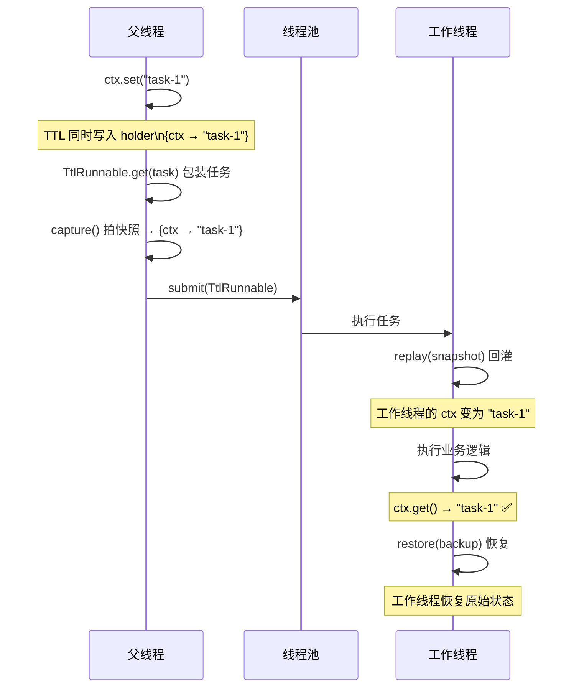

## 6.3 使用方式

```java
// ① 用 TransmittableThreadLocal 替代 ThreadLocal
TransmittableThreadLocal<String> ctx = new TransmittableThreadLocal<>();

// ② 用 TtlExecutors 包装线程池
ExecutorService pool = TtlExecutors.getTtlExecutorService(
    Executors.newFixedThreadPool(4)
);

// ③ 正常使用 — 上下文自动传递
ctx.set("task-1");
pool.submit(() -> System.out.println(ctx.get()));  // → "task-1"  ✅

ctx.set("task-2");
pool.submit(() -> System.out.println(ctx.get()));  // → "task-2"  ✅
```

---

# 七、虚拟线程时代——ScopedValue 替代 ThreadLocal

## 7.1 ThreadLocal 在虚拟线程中的问题

虚拟线程是**极轻量**对象（~几百字节），且**数量可能上百万**。ThreadLocal 在每个线程里存一份副本，虚拟线程场景下：

1. **内存爆炸**：百万虚拟线程 × 每线程 ThreadLocal → 巨大内存开销
2. **线程复用**：虚拟线程挂载/卸载到平台线程，ThreadLocal 状态如何处理？
3. **生命周期**：虚拟线程短暂存在，频繁创建和销毁的 ThreadLocalMap 开销不可忽略

## 7.2 ScopedValue（JEP 446, Java 21 孵化, Java 24 正式）

```java
// ✅ 未来的方式：ScopedValue + StructuredTaskScope
public final class ScopedValue<T> {
    // 值在作用域内绑定，作用域结束时自动清除
}

// 使用示例（Java 21+ 预览功能）
private static final ScopedValue<String> TRACE_ID = ScopedValue.newInstance();

ScopedValue.where(TRACE_ID, "trace-abc")
    .run(() -> {
        // 在这个 scope 内，TRACE_ID 可用
        System.out.println(TRACE_ID.get());  // → "trace-abc"
        
        // 子虚拟线程自动继承
        Thread.startVirtualThread(() -> {
            System.out.println(TRACE_ID.get());  // → "trace-abc"
        });
    });
// ← 离开 scope 后，TRACE_ID 自动不可用
```

**对比 ThreadLocal**：

| 特性 | ThreadLocal | ScopedValue |
|---|---|---|
| 绑定方式 | 线程级全局可变 | Scope 级不可变 |
| 清理 | 必须手动 `remove()` | 离开 Scope 自动清理 |
| 继承 | `InheritableThreadLocal`（Thread.init 时拷贝） | 所有子线程自动继承 |
| 虚拟线程 | 大量线程时内存压力大 | 天然适配（值在栈上传递） |
| 可写性 | 可修改 | 不可变（Immutable） |

---

# 面试追问——串起来讲

## Q1: ThreadLocal 的 Entry 为什么用弱引用？

> 防止 ThreadLocal 实例本身的内存泄漏。如果 Key 是强引用，即使应用代码不再使用 ThreadLocal，只要线程还活着 → Map 还活着 → Key 还活着 → ThreadLocal 实例永远不被 GC。弱引用允许 ThreadLocal 实例被正常回收。

## Q2: ThreadLocal 内存泄漏的根因是什么？

> 不是弱引用！根因是 Entry.value 的**强引用**。ThreadLocal 被 GC 后 Key 变成 null，但 Value 被 Entry 强引用，且从 Thread → Map → Entry → Value 的引用链使得 Value 对于 GC Roots 仍然可达。在线程池场景（线程长期存活）+不调 `remove()` 的组合下，过期条目无限堆积。

## Q3: ThreadLocal.set/get 怎么找到自己的 Entry？

> 开放地址法 + 线性探测。`threadLocalHashCode & (table.length - 1)` 计算初始槽位，如果槽位被占（hash 冲突），就往后线性探测下一个槽位。在探测过程中如果遇到 `key==null` 的过期条目，会触发 `expungeStaleEntry()` 清理。

## Q4: InheritableThreadLocal 在线程池中为什么失效？

> `InheritableThreadLocal` 的拷贝发生在线程 `init()` 时——即 `new Thread()` 的时候。线程池复用已创建的线程，不会再调 `init()`，所以提交新任务时不会更新。`TransmittableThreadLocal` 通过 `TtlRunnable` 在**每次任务执行前**重新拷贝，解决了这个问题。

## Q5: TransmittableThreadLocal 的核心流程？

> `capture()`（拍快照）→ `replay()`（回灌到工作线程）→ 执行任务 → `restore()`（恢复工作线程原值）。`capture()` 发生在**主线程提交任务时**，`replay() + restore()` 发生在**工作线程执行任务前后**。

## Q6: 虚拟线程时代 ThreadLocal 还重要吗？

> ThreadLocal 在平台线程（传统线程池）场景下仍然非常重要和实用。但在虚拟线程场景下，ScopedValue 是更优的选择——不可变、自动清理、自动继承。两者会长期共存：平台线程用 ThreadLocal，虚拟线程用 ScopedValue。

---

# 总结

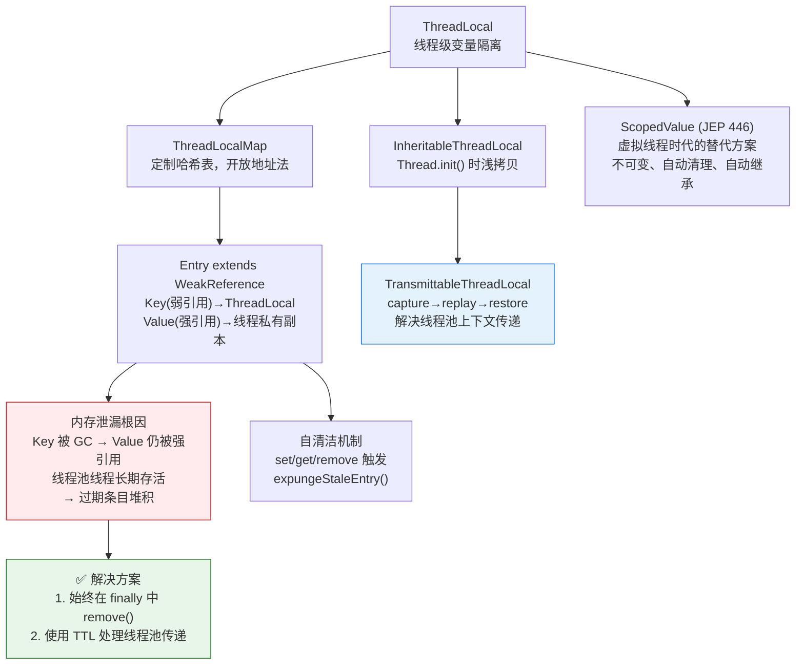

- **数据结构**：Thread 持有 ThreadLocalMap，Entry 的 Key 是弱引用——这个三层嵌套是理解一切的基础
- **弱引用不是坑**：它阻止 ThreadLocal 实例泄漏，但留下了 Value 的强引用泄漏
- **自清洁**：`expungeStaleEntry()` 在 set/get/remove 时被动清理，但不能完全依赖
- **最佳实践**：始终 `try-finally { remove() }`，线程池场景用 TTL
- **未来**：虚拟线程 + ScopedValue 是方向，但 ThreadLocal 在平台线程场景下仍有价值
