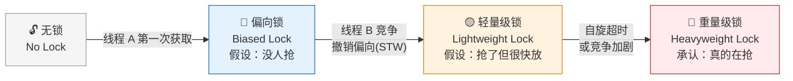
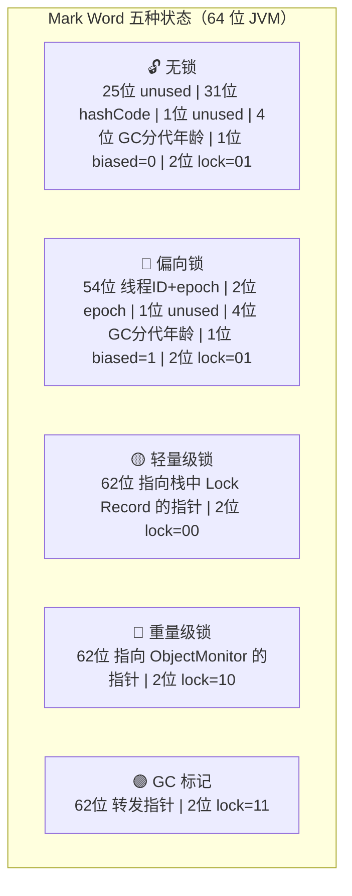
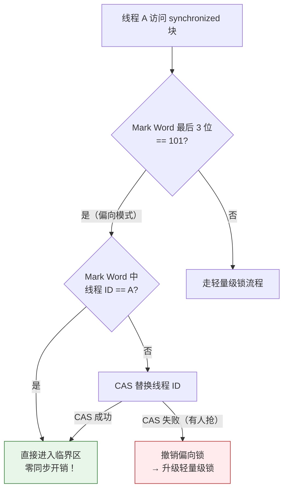
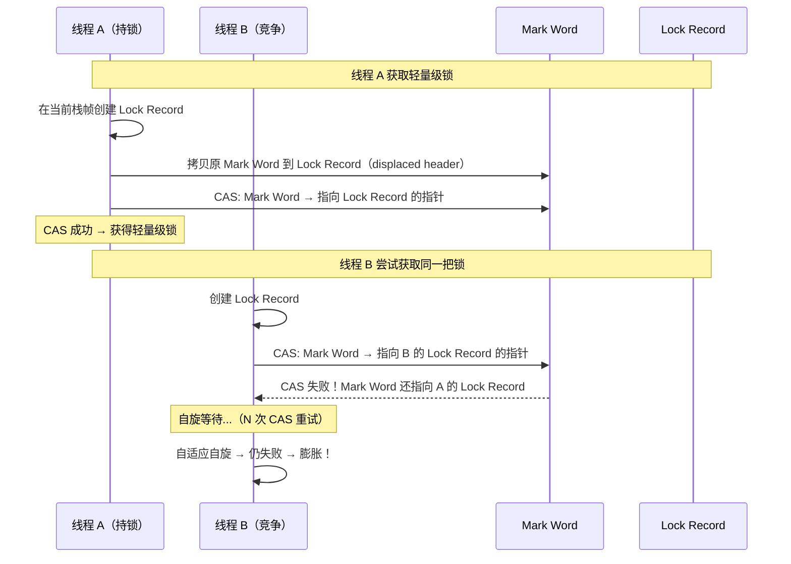
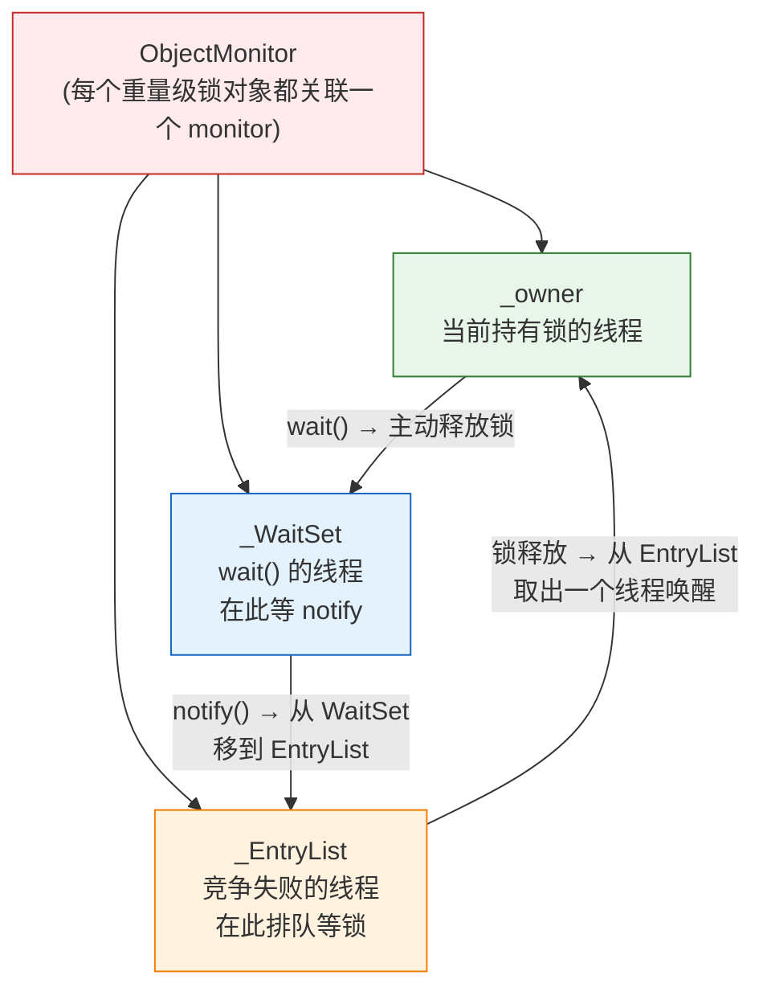
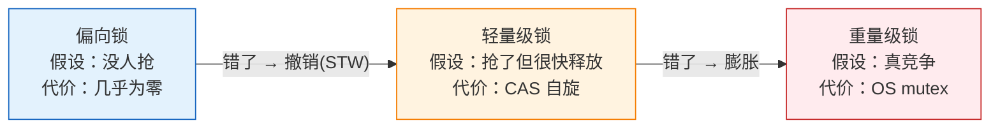

# 历史背景——为什么 JDK 6 要"救活" synchronized？

在 JDK 1.4 时代，`synchronized` 直接被编译为 `monitorenter`/`monitorexit` 指令，每次加锁都涉及 OS 的 mutex 系统调用——**一次没竞争的操作也要用户态↔内核态的切换开销**。那个年代的 Java 程序员口头禅是："synchronized 是重量级的，要用 ConcurrentHashMap 和 ReentrantLock 替代它。"

JDK 6（2006 年）的 "synchronized 优化" 彻底改变了这一局面。HotSpot 团队从 IBM J9 VM 借鉴了**偏向锁**和**轻量级锁**的设计——在 Mark Word 这个小空间里玩出了"锁升级"的魔术：**无锁→偏向锁→轻量级锁→重量级锁，只升级不降级，每一步都是 JVM 对上一步"没竞争"假设被打破后的适应性调整。**

现在 synchronized 在"大部分场景无竞争"的情况下，性能已经非常接近甚至超过 `ReentrantLock`。JDK 7+ 的 `ConcurrentHashMap` 部分内部实现甚至重新用回 synchronized（替代了原来 JDK 5 的 ReentrantLock），因为 JIT 对 synchronized 有特殊的锁消除/锁粗化/锁膨胀的编译优化。



---

# 一、基石：Mark Word——锁信息的物理载体

## 1.1 对象头里藏了什么？

每个 Java 对象在堆上的布局：

```
┌──────────────────┐
│   Mark Word      │ ← 8 字节（64 位）或 4 字节（32 位，压缩指针）
├──────────────────┤
│   Klass Pointer   │ ← 4/8 字节，指向方法区的类元数据
├──────────────────┤
│   实例数据        │ ← 字段值
├──────────────────┤
│   对齐填充        │ ← 补齐到 8 字节的倍数
└──────────────────┘
```

**Mark Word 是锁升级的物理舞台**——同一块 64 位空间，在不同锁状态下存储完全不同的数据结构。

## 1.2 Mark Word 的五种状态



lock 标志位的最后 2 位决定状态：

| biased_lock (1 bit) | lock (2 bits) | 状态 |
|:---:|:---:|------|
| 0 | 01 | 无锁 |
| 1 | 01 | 偏向锁 |
| — | 00 | 轻量级锁 |
| — | 10 | 重量级锁 |
| — | 11 | GC 标记 |

## 1.3 如何观测 Mark Word？

```java
// JOL (Java Object Layout) —— 观测对象布局的利器
// pom.xml: org.openjdk.jol:jol-core:0.17

import org.openjdk.jol.info.ClassLayout;

public class MarkWordViewer {
    public static void main(String[] args) {
        Object obj = new Object();
        // ① 无锁状态
        System.out.println(ClassLayout.parseInstance(obj).toPrintable());
        
        // ② 偏向锁状态
        synchronized (obj) {
            System.out.println("--- 偏向锁 ---");
            System.out.println(ClassLayout.parseInstance(obj).toPrintable());
        }
        
        // ③ 轻量级锁状态（第二个线程竞争触发）
        new Thread(() -> {
            synchronized (obj) {
                System.out.println("--- 轻量级锁/重量级锁 ---");
                System.out.println(ClassLayout.parseInstance(obj).toPrintable());
            }
        }).start();
        Thread.sleep(100);
    }
}
```

JOL 输出示例（无锁状态）：
```
java.lang.Object object internals:
 OFFSET  SIZE   TYPE DESCRIPTION               VALUE
      0     4        (object header)           01 00 00 00 (00000001 ...)  ← lock=01, biased=0
      4     4        (object header)           00 00 00 00 (00000000 ...)
      8     4        (object header)           ...                         ← Klass Pointer
     12     4        (loss due to the next object alignment)                ← 对齐填充
Instance size: 16 bytes
```

---

# 二、偏向锁——"这个锁只属于你"

## 2.1 设计初衷

> 大多数锁**从头到尾只有一个线程访问**。既然没人抢，何必要 CAS 加锁？

偏向锁的核心思想：第一次获取锁时，用 CAS 把**线程 ID 写进 Mark Word**。之后这个线程再获取同一把锁，**只检查 Mark Word 里的线程 ID 是不是自己**——是就直接进，不需要任何同步操作（零开销）。

## 2.2 加锁流程



## 2.3 偏向锁的撤销——最贵的单向操作

偏向锁的撤销**必须**在**全局安全点（Safe Point，所有 Java 线程暂停）**执行：

1. 暂停持有偏向锁的线程
2. 检查原持有者是否还活着（线程是否已退出）
3. 如果活着且还持锁 → Mark Word 改为指向该线程栈中 Lock Record → **升级为轻量级锁**
4. 如果已退出 → **回退到无锁状态**，允许重新偏向
5. 唤醒所有线程

> 偏向锁的撤销成本**远高于**轻量级锁的 CAS。为什么？CAS 只是 CPU 指令（~10ns），而撤销需要 SafePoint（~1000ns+）——所有线程停下来的代价。

**这就是高竞争场景下要关闭偏向锁的原因**：竞争激烈时频繁撤销→开销比传统加锁更大。

## 2.4 批量重偏向与批量撤销

```java
// JVM 的两个自适应阈值
// 单个类的偏向锁撤销次数 ≥ 20  → 批量重偏向（允许该类实例重新允许偏向）
// 批量重偏向后撤销次数 ≥ 40    → 批量撤销（该类所有实例永久禁用偏向锁）

// 为什么要这两个阈值？
// 因为 JVM 判断：如果同一个类的实例频繁撤销偏向 → 说明这个类的锁不是单线程使用的
// → 与其每个实例都经历一遍"偏向→撤销"的循环 → 不如一次全禁掉
```

## 2.5 偏向锁的延迟开启与关闭

```bash
# JVM 启动后 4 秒才启用偏向锁（默认）
# 原因：JVM 启动时大量线程竞争同一把锁（如 ClassLoader 加载类）
#       此时偏向锁会频繁撤销，不如先不开
-XX:BiasedLockingStartupDelay=4000

# 立即启用
-XX:BiasedLockingStartupDelay=0

# 完全关闭（Java 15+ 默认关闭偏向锁！）
-XX:-UseBiasedLocking
# 因为现代微服务 + 线程池场景下，单线程持锁的场景越来越少
```

> **Java 15 默认关闭偏向锁**。因为微服务+线程池场景下，一个锁很少永远只有同一个线程访问。偏向锁的维护成本（SafePoint + 撤销）在当前世代的工作负载下已经超过收益。

---

# 三、轻量级锁——"我先自旋等等看"

## 3.1 核心思想

当偏向锁被撤销（出现第二个线程竞争），锁升级为轻量级锁。轻量级锁的哲学：

> **在多线程交替执行、实际不竞争的场景下，用 CAS 自旋代替 OS mutex。**

它假设：持锁者很快就会释放锁，等待者稍等几个 CPU 周期就够了——不值得调用 OS 的互斥操作。

## 3.2 加锁流程



## 3.3 自适应自旋（Adaptive Spinning）

HotSpot 不固定自旋次数，而是根据**同一把锁的上次自旋结果**动态调整：

- 上次自旋成功（等到了拿锁）→ 这次多自旋几次（值得等）
- 上次自旋失败（直接升级重量级）→ 这次直接升级（不等了）

```
伪代码：
if (adaptive_spin_success_rate[this_lock] > threshold) {
    spin_count = more_spins;
} else {
    spin_count = 0;  // 直接膨胀到重量级
}
```

---

# 四、重量级锁——ObjectMonitor 登场

## 4.1 膨胀触发器

轻量级锁在以下条件下**膨胀**为重量级锁：

| 条件 | 说明 |
|------|------|
| **自旋超时** | 竞争者自旋了足够多轮还拿不到锁 |
| **第三者加入** | 第三个线程也来竞争——轻量级锁不支持多线程等待 |
| **调用 wait()** | `wait/notify/notifyAll` 依赖 ObjectMonitor 的 WaitSet |
| **JVM 安全点** | 某些操作要求全局暂停 |

## 4.2 ObjectMonitor 的内部结构



**三条核心队列**：

| 队列 | 作用 | 线程在这里的状态 |
|------|------|----------------|
| `_EntryList` | 等待获取锁的线程 | BLOCKED（等待锁） |
| `_WaitSet` | 执行 `wait()` 后的线程 | WAITING（等待 notify） |
| `_cxq`（竞争队列） | CAS 入队，后续转入 EntryList | 竞争失败的中间状态 |

## 4.3 重量级锁的开销

```java
// 一次重量级锁的操作涉及：
// 1. monitorenter: OS mutex_lock → 用户态→内核态切换 (~100ns)
// 2. 如果锁被持：线程状态切换 RUNNABLE → BLOCKED → 被 schedule off CPU 
// 3. monitorexit: OS mutex_unlock → 唤醒 EntryList 队首线程 → 上下文切换 (~1-5μs)
// 
// 对比：
// 偏向锁进入：1 次比较指令 (~1ns)
// 轻量级锁进入：1 次 CAS (~10ns)
// 重量级锁进入：上下文切换 (~1000-5000ns)
```

---

# 五、锁降级——一个不存在的操作

**HotSpot 的锁只升级不降级。** 一旦锁从轻量级膨胀到重量级，即使之后再没有竞争，它也在重量级永远停着。

```java
// 这段代码一旦发生重量级竞争：
synchronized (obj) {  // 第一次：偏向→轻量级→重量级
    doWork();
}
// 之后 obj 的锁永远停留在重量级级别
// 即使再也没有竞争，也不会降回轻量级/偏向
```

**为什么 JVM 不降级？** 降级要在 SafePoint 遍历所有栈帧确认"没人持锁、没人等锁"——成本比升级还高。JVM 选择"懒惰"策略：不去降级，等对象被 GC 回收后自然重置。

> 实践启示：**不要过度共享同一把锁。** 一旦被撑到重量级，就永远回不去了。

---

# 六、JIT 的锁优化

## 6.1 锁消除（Lock Elimination）

```java
// 代码中写了 synchronized，但 JIT 分析后认为这段代码不逃逸 → 把锁去掉
public String concat(String a, String b) {
    StringBuffer sb = new StringBuffer();  // StringBuffer 的方法都是 synchronized 的
    sb.append(a);
    sb.append(b);
    return sb.toString();
}
// JIT 检测到 sb 是局部变量，不会逃逸出当前栈帧
// → 没有其他线程能访问 → 去掉所有 append() 的 synchronized！
```

**效果**：`StringBuffer` 在局部变量场景下，性能与 `StringBuilder` 无差异。

## 6.2 锁粗化（Lock Coarsening）

```java
// 连续加锁/解锁同一个对象 → JIT 把多次锁合为一次
for (int i = 0; i < 1000; i++) {
    synchronized (lock) {
        doSmallWork();  // 每次锁的开销 > 实际计算开销
    }
}
// JIT 优化后等价于：
synchronized (lock) {
    for (int i = 0; i < 1000; i++) {
        doSmallWork();  // 一次加锁完成 1000 次操作
    }
}
```

---

# 七、实战建议

| 场景 | 建议 | 原因 |
|------|------|------|
| **线程池处理任务** | 关闭偏向锁 `-XX:-UseBiasedLocking` | 锁竞争频繁，偏向反而增加撤销开销 |
| **Swing / Netty EventLoop** | 保留偏向锁 | 单线程模型下锁基本只有一个线程访问 |
| **局部变量用 StringBuffer** | 不用改成 StringBuilder | JIT 的锁消除会帮你优化掉 |
| **循环内锁** | 拉到循环外 | 避免锁粗化之前的多余开销 |
| **减少锁粒度** | 每把锁管理更少的数据 | 锁升级概率更低 |
| **ConcurrentHashMap > Hashtable** | 分段锁减小锁粒度 | 每段的锁竞争少 → 不易升级到重量级 |

```bash
# 打印偏向锁统计
-XX:+PrintBiasedLockingStatistics

# 查看 JIT 编译日志中的锁优化
-XX:+PrintCompilation -XX:+UnlockDiagnosticVMOptions -XX:+PrintInlining

# 完全关闭偏向锁（Java 15+ 默认已关）
-XX:-UseBiasedLocking
```

---

# 八、总结



> **锁升级的本质是 JVM 在面对未知竞争时，从乐观到悲观的逐步退让。** 偏向锁假设"没人抢"，轻量级锁假设"抢了但很快放手"，重量级锁承认"真的在抢"。每一步升级都伴随着更高的开销，但也都是对上一步假设错误的矫正。理解这个链条，加上 JIT 的锁消除和锁粗化，就能理解为什么今天 synchronized 不再是性能杀手。

# 延伸阅读

**Do——动手观测：**
- 用 JOL 打印一个对象在"无锁→偏向锁→轻量级锁→重量级锁"四个阶段的 Mark Word 值
- 在 `-XX:-UseBiasedLocking` 下对比同一个测试的吞吐量和 SafePoint 次数
- 用 `-XX:+PrintBiasedLockingStatistics` 观察应用的偏向锁撤销频率

**Todo——深入方向：**
- Java 15 废弃偏向锁的原因——`-XX:-UseBiasedLocking` 成为默认的 JEP 374 提案
- `Project Loom` 的虚拟线程对 synchronized 的影响——为什么虚拟线程中 synchronized 需要特殊处理（pinning 问题）
- `VarHandle` 和 `MethodHandles` 的 `acquire`/`release` 语义——更灵活的内存排序控制

*本文参考资料：*
- Brian Goetz et al.《Java Concurrency in Practice》——第 2 章（线程安全）、第 16 章（JMM）
- JEP 374: Deprecate and Disable Biased Locking (Java 15)
- OpenJDK 源码: `hotspot/share/runtime/synchronizer.cpp` — `ObjectSynchronizer::fast_enter()`
- JOL (Java Object Layout): https://github.com/openjdk/jol
