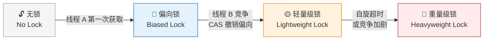
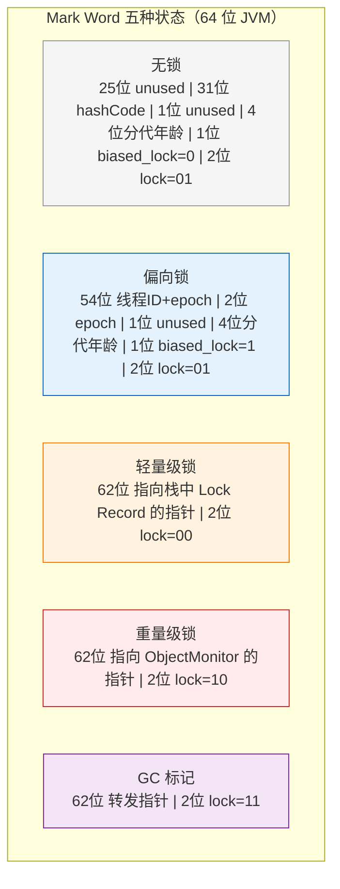
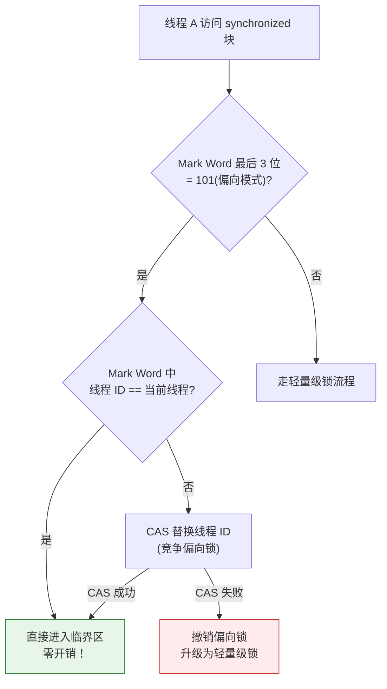
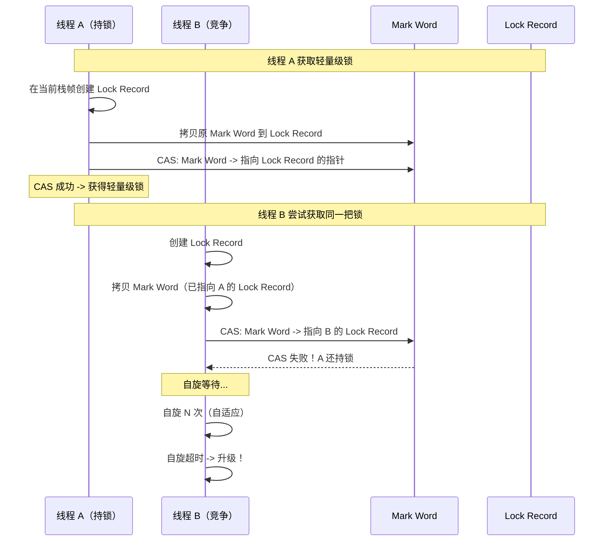
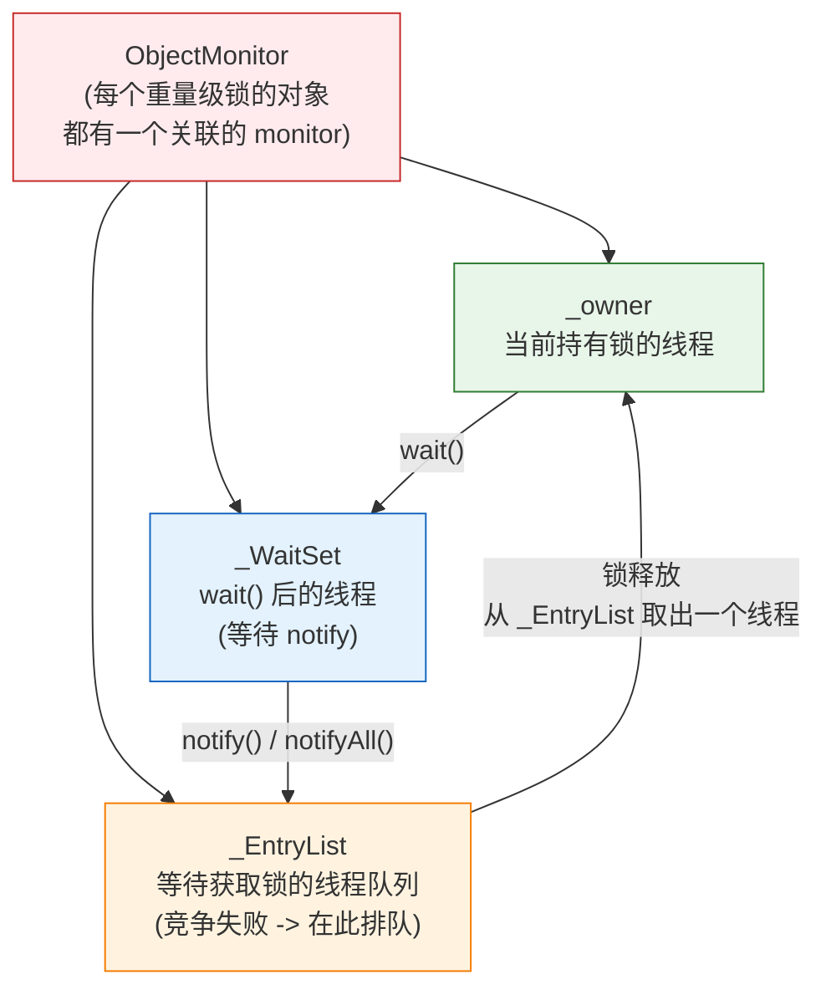
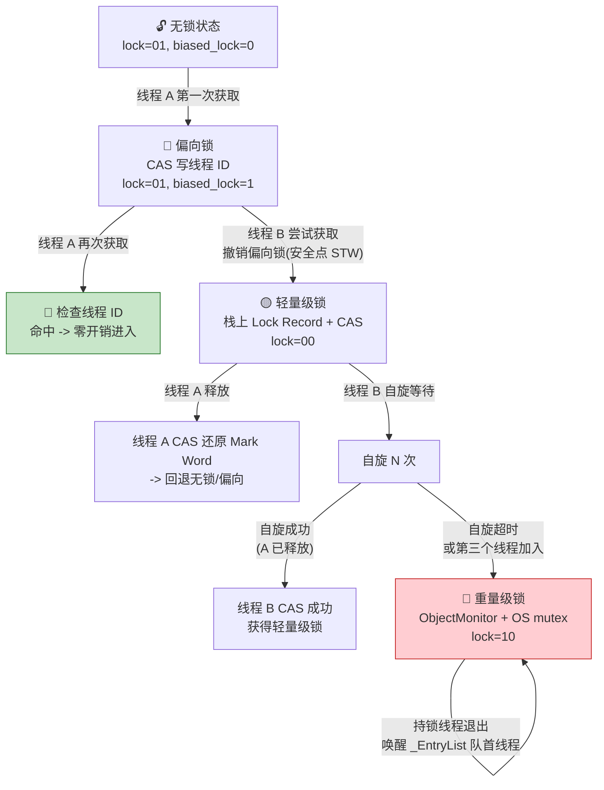
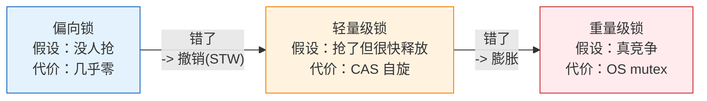

---

# 一、基石：Mark Word——锁信息的物理载体

## 1.1 对象头里藏了什么？

每个 Java 对象在堆上的布局：

```
┌──────────────────┐
│   Mark Word      │ ← 8 字节（64 位）或 4 字节（32 位，压缩指针）
├──────────────────┤
│   Klass Pointer   │ ← 4/8 字节，指向方法区的类元数据
├──────────────────┤
│   实例数据        │ ← 字段值
├──────────────────┤
│   对齐填充        │ ← 补齐到 8 字节的倍数
└──────────────────┘
```

**Mark Word 是锁升级的物理舞台**——同一块 64 位空间，在不同锁状态下存储不同的东西。

## 1.2 Mark Word 的五种状态



**lock 标志位的最后 2 位决定状态**：

| biased_lock | lock | 状态 |
|:---:|:---:|------|
| 0 | 01 | 无锁 |
| 1 | 01 | 偏向锁 |
| — | 00 | 轻量级锁 |
| — | 10 | 重量级锁 |
| — | 11 | GC 标记 |

---

# 二、偏向锁——"这个锁只属于你"

## 2.1 设计初衷

> 大多数锁**从头到尾只有一个线程访问**。既然没人抢，何必要 CAS 加锁？

偏向锁的核心思想：第一次获取锁时，用 CAS 把**线程 ID 写进 Mark Word**。之后这个线程再获取同一把锁，**只检查 Mark Word 里的线程 ID 是不是自己**，是就直接进，不需要任何同步操作。

## 2.2 加锁流程



## 2.3 偏向锁的撤销——最贵的单向操作

偏向锁的撤销必须在**全局安全点**（Safe Point，所有线程暂停）执行：

1. 暂停持有偏向锁的线程
2. 检查原持有者是否还活着
3. 如果活着且还需要锁 → Mark Word 改为指向该线程栈中 Lock Record → **升级为轻量级锁**
4. 如果已退出 → **回退到无锁状态**，允许重新偏向
5. 唤醒所有线程

> 偏向锁的撤销成本**远高于**轻量级锁的 CAS。这就是为什么高竞争场景下要 `-XX:-UseBiasedLocking` 关掉它。

## 2.4 批量重偏向与批量撤销

```
单个偏向锁撤销次数 ≥ 20  → 批量重偏向（重新允许该类实例偏向）
批量重偏向后撤销次数 ≥ 40 → 批量撤销（该类所有实例禁用偏向锁）
```

这两个阈值由 `-XX:BiasedLockingBulkRebiasThreshold` 和 `-XX:BiasedLockingBulkRevokeThreshold` 控制。

## 2.5 偏向锁的延迟开启

```bash
# JVM 启动后 4 秒才启用偏向锁（默认）
-XX:BiasedLockingStartupDelay=4000

# 立即启用
-XX:BiasedLockingStartupDelay=0

# 完全关闭
-XX:-UseBiasedLocking
```

> 为什么延迟？JVM 启动时大量线程竞争同一把锁（如 `ClassLoader` 加载类），此时偏向锁会频繁撤销，得不偿失。

---

# 三、轻量级锁——"我先自旋等等看"

## 3.1 核心思想

当偏向锁被撤销（出现第二个线程竞争），锁升级为轻量级锁。轻量级锁的哲学是：

> **在多线程交替执行、实际不竞争的场景下，用 CAS 自旋代替 OS 互斥。**

## 3.2 加锁流程



## 3.3 自适应自旋（Adaptive Spinning）

HotSpot 不固定自旋次数，而是根据**上次同一把锁的自旋结果**动态调整：

- 上次自旋成功了 → 这次多自旋几次（值得等）
- 上次自旋失败（直接升级重量级锁）→ 这次直接升级（不等了）

```
// 伪代码描述
if (adaptive_spin_success_rate > threshold) {
    spin_count = min(more_spins, max_spin_count);
} else {
    spin_count = 0;  // 直接膨胀
}
```

---

# 四、重量级锁——ObjectMonitor 登场

## 4.1 升级触发器

轻量级锁在以下条件下**膨胀**为重量级锁：

| 触发条件 | 说明 |
|----------|------|
| 自旋超时 | 竞争者自旋了足够久还拿不到锁 |
| 第三者加入 | 第三个线程也来竞争 → 轻量级锁不支持多线程等待 |
| 调用 `wait()` | `wait/notify` 依赖 ObjectMonitor |
| JVM 安全点 | 某些 JVM 操作要求全局暂停 |

## 4.2 ObjectMonitor——重量级锁的物理实现



**三条核心队列**：

| 队列 | 作用 | 进入条件 |
|------|------|---------|
| `_EntryList` | 等待获取锁的线程 | CAS 竞争失败 |
| `_WaitSet` | 执行 `wait()` 后的线程 | 主动释放锁等待通知 |
| `_cxq`（竞争队列） | CAS 失败的线程先入 cxq，再转入 EntryList | 底层实现 |

## 4.3 重量级锁的开销

- **系统调用**：`mutex_lock/unlock` 是内核操作 → 用户态↔内核态切换
- **线程挂起**：等待的线程被 OS 调度挂起，唤醒需要上下文切换
- 一次 `unlock` 后的线程切换**可能比执行临界区本身还慢**

---

# 五、完整升级链路——从生到死一把锁



---

# 六、锁降级——一个不存在的操作

**HotSpot 的锁只升级不降级**。原因：

> 升级容易降级难——降级要在安全点遍历所有栈帧确认没人持锁，成本比升级还高，不值得。

但有一个例外：**偏向锁的批量撤销**可以看作一种"批量降级"——JVM 直接把某个类的所有实例的偏向锁禁掉，下次获取直接走轻量级锁。

这意味着：

```java
// 这段代码一旦发生重量级锁竞争：
synchronized (obj) {  // 第一次：偏向锁 → 轻量级锁 → 重量级锁
    doWork();
}
// 之后 obj 的锁永远停留在重量级级别
// 即使再也没有竞争，也不会降回轻量级/偏向
```

> 实践启示：**不要过度共享同一把锁。** 一旦被撑到重量级，就永远回不去了。

---

# 七、实战建议

## 7.1 什么时候关偏向锁？

```bash
# 明确知道锁会被多线程竞争时，关掉偏向锁
# 避免无意义的偏向→撤销开销
-XX:-UseBiasedLocking
```

适合：线程池处理任务、Web 服务、并发集合内部锁。

## 7.2 什么时候保留偏向锁？

单线程执行路径占主导的场景（如 Swing Event Dispatch Thread、Netty 单线程 EventLoop）。

## 7.3 观测锁状态

```bash
# 打印偏向锁统计
-XX:+PrintBiasedLockingStatistics

# JIT 编译日志中查看锁优化
-XX:+PrintCompilation -XX:+UnlockDiagnosticVMOptions -XX:+PrintInlining
```

## 7.4 代码建议

| 建议 | 理由 |
|------|------|
| **减少锁粒度** | 每把锁竞争少 → 不易升级到重量级 |
| **避免锁内做 IO** | IO 慢 → 持锁时间长 → 竞争加剧 |
| **`StringBuffer` → `StringBuilder`** | 局部变量不需要线程安全，逃逸分析会自动消除锁 |
| **`ConcurrentHashMap` 优于 `Hashtable`** | 分段锁减小锁粒度 |

---

# 八、总结



> **锁升级的本质是 JVM 在面对未知竞争时，从乐观到悲观的逐步退让。** 偏向锁假设"没人抢"，轻量级锁假设"抢了但很快放手"，重量级锁承认"真的在抢"。每一步升级都伴随着更高的开销，但也都是对上一步假设错误的矫正。理解这个链条，就理解了 `synchronized` 从 JDK 1.6 后为什么不再是性能杀手。

---


*本文参考资料：*
- Brian Goetz et al.《Java Concurrency in Practice》——第 3-5 章（共享与组合对象）、第 6-8 章（任务执行与线程池）、第 11-12 章（性能与可伸缩性）
- Doug Lea, "The java.util.concurrent Synchronizer Framework"（AQS 论文）, 2004
- Java Language Specification, Chapter 17: Threads and Locks（JMM）: https://docs.oracle.com/javase/specs/jls/se17/html/jls-17.html
- JSR-133 FAQ: https://www.cs.umd.edu/~pugh/java/memoryModel/jsr-133-faq.html
- OpenJDK 源码: java.util.concurrent 包（AbstractQueuedSynchronizer / ThreadPoolExecutor / ReentrantLock 等）

# 附：JVM 系列索引

| 文章 | 与锁升级的关联 |
|------|-------------|
| [synchronized 锁升级全链路](/posts/jvm/synchronized锁升级全链路——从对象头到重量级锁/) | ← 你在这里 |
| [JIT 编译器的分层编译与内联优化](/posts/jvm/jit编译器的分层编译与内联优化/) | 锁消除是 JIT 的重要优化 |
| [JVM 逃逸分析深度拆解](/posts/jvm/jvm内存模型深度拆解/) | 不逃逸 → 锁消除，无需走升级链路 |
| [类加载机制全景](/posts/jvm/类加载机制全景——双亲委派模型与spi打破委派的设计理由/) | 类元数据在方法区，对象头在堆 |
| [Java 对象全生命周期](/posts/jvm/java对象生命周期/) | Mark Word 伴随对象的整个生命周期 |
| [G1 GC 核心原理](/posts/jvm/g1-gc核心原理：region、satb、mixed-gc全解析/) | 安全点 STW 与偏向锁撤销的关系 |
