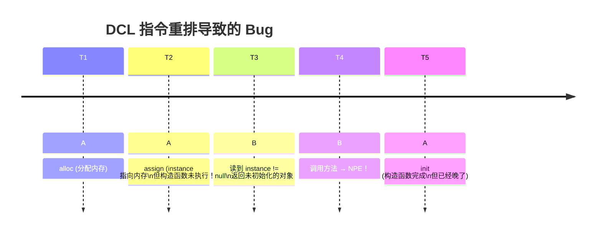

# 一、案发现场——一个"偶尔"报错的双检锁

```java
public class LazySingleton {
    private static LazySingleton instance;  // ⚠️ 没有 volatile
    
    public static LazySingleton getInstance() {
        if (instance == null) {               // ① 第一次检查
            synchronized (LazySingleton.class) {
                if (instance == null) {       // ② 第二次检查
                    instance = new LazySingleton();  // ③ 构造
                }
            }
        }
        return instance;                      // ④ 返回
    }
}
```

**现象**：线上偶尔出现空指针异常，发生概率极低，无法本地复现。

---

# 二、问题根源——构造函数的"可见性剥离"

```java
instance = new LazySingleton();
// 这行代码被 JIT 拆成 3 步伪指令：
// 1. 分配内存                    (alloc)
// 2. 调用构造器初始化             (init)
// 3. 将引用赋给 instance 变量     (assign)
//
// JIT 可能重排成：1 → 3 → 2！
// 线程 A：alloc → assign → （线程切换）
// 线程 B：读 instance != null → 返回半成品对象 → NPE！
```



---

# 三、volatile 是怎么修好它的？

```java
private static volatile LazySingleton instance;  // ← 加 volatile
```

**volatile 的写语义**：对 volatile 变量的写，前面插入 StoreStore 屏障，后面插入 StoreLoad 屏障。**这保证了构造函数完成之前，instance 引用不会被任何线程看到。**

| 操作 | 没有 volatile | 有 volatile |
|------|-------------|-----------|
| 构造 + 赋值 | alloc → assign → init | alloc → init → **StoreStore** → assign |
| 另一个线程读到 instance | 可能读到半成品 | 一定读到完整对象 |

---

# 四、"先 volatile 后锁"到底是什么意思？

```
场景 1：volatile 读在锁外 → 意图：减少锁竞争（如 DCL 的第一次检查）
场景 2：volatile 写在锁内 → 意图：保证锁控制的变量的可见性被后续 volatile 读看到

原则：
- volatile 负责"读可见"（读端优化，避免每次进锁）
- synchronized 负责"写互斥"（写端收敛，保证写入原子性）
```

```java
// ✅ 正确模式：volatile 读（快速路径） + synchronized 写（互斥路径）
volatile boolean state;
synchronized void write() { state = true; }  // 写用锁
void read() { if (state) { ... } }           // 读用 volatile
```

---

# 五、排查工具与经验

| 工具 | 用途 |
|------|------|
| **jcstress** | Java Concurrency Stress tests——专门测 JMM 可见性 Bug |
| **Thread Sanitizer** | JVM 层面检测 data race |
| **-XX:+UnlockDiagnosticVMOptions -XX:+PrintAssembly** | 查看 JIT 生成的指令是否重排 |

---

# 六、总结

> **DCL 不需要 volatile 的前提是——你的 CPU 不乱序、JIT 不重排、JMM 不存在。** 历史证明这三个前提一个都不成立。Java 5 后 JSR-133 修了 JMM，volatile 才真正可靠。现在写 DCL 不加 volatile 是给自己埋雷。

*本文参考资料：*
- Brian Goetz et al.《Java Concurrency in Practice》——第 3-5 章（共享与组合对象）、第 6-8 章（任务执行与线程池）、第 11-12 章（性能与可伸缩性）
- Doug Lea, "The java.util.concurrent Synchronizer Framework"（AQS 论文）, 2004
- Java Language Specification, Chapter 17: Threads and Locks（JMM）: https://docs.oracle.com/javase/specs/jls/se17/html/jls-17.html
- JSR-133 FAQ: https://www.cs.umd.edu/~pugh/java/memoryModel/jsr-133-faq.html
- OpenJDK 源码: java.util.concurrent 包（AbstractQueuedSynchronizer / ThreadPoolExecutor / ReentrantLock 等）
