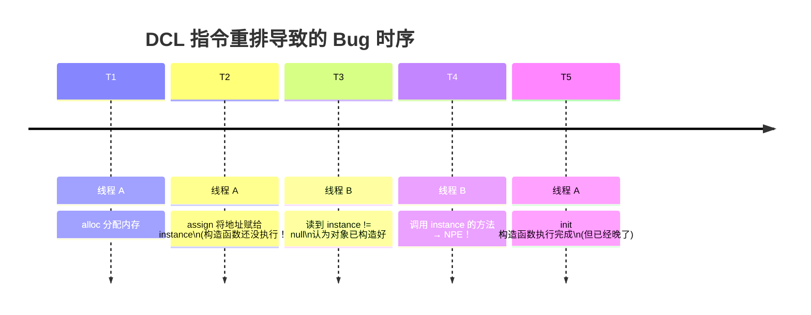

# 历史背景——DCL 怎么就成了"反模式"？

Double-Checked Locking（双检锁）是 1990 年代程序员圈子最流行的单例模式。在 C/C++ 中它工作得很好——因为那时的编译器优化还没这么激进。但当 Java 程序员移植这个模式时，碰到了 Java 内存模型的一个早期漏洞：**Java 1.4 之前，volatile 的语义不够强，无法阻止 DCL 中的重排**。

更尴尬的是，2000 年 Java 社区有一篇著名的文章叫 "Double-Checked Locking is Broken"，作者指出 DCL **从不安全**。这篇文章促使 JSR-133 重新定义了 volatile 的 happens-before 语义——**Java 5 之后，加了 volatile 的 DCL 才真正安全。** 

但 "DCL is broken" 的阴影在 Java 社区流传了太久，以至于 20 年后的今天，很多程序员仍本能地回避 DCL，却不知道 Java 5+ 的 volatile 已经修复了这个问题。本文不只是讲 DCL，而是通过这个案例讲解 **volatile 和锁协同工作的底层逻辑**。

---

# 一、案发现场——一个"偶尔"报错的双检锁

```java
public class LazySingleton {
    private static LazySingleton instance;  // ⚠️ 没有 volatile
    
    public static LazySingleton getInstance() {
        if (instance == null) {               // ① 第一次检查（锁外）
            synchronized (LazySingleton.class) {
                if (instance == null) {       // ② 第二次检查（锁内）
                    instance = new LazySingleton();  // ③ 构造 + 赋值
                }
            }
        }
        return instance;                      // ④ 返回
    }
}
```

**现象**：线上偶尔出现 NPE（在 instance 上调用方法时），概率极低（百万分之几十），无法本地复现。

---

# 二、问题根源——构造函数的"可见性剥离"

```java
instance = new LazySingleton();
// 这一行在 JIT 编译后被拆成 3 条伪指令：
//
// ① alloc     = 分配堆内存（分配对象空间）
// ② init      = 调用构造函数（初始化字段）
// ③ assign    = 将内存地址赋给 instance 变量
//
// 单线程下：① → ② → ③（程序员预期的顺序）
// JIT 可能重排成：① → ③ → ②（CPU/编译器看到的合法重排）
```



**为什么 JIT 允许这种重排？**
从单线程视角看，`alloc → assign → init` 和 `alloc → init → assign` 的结果完全相同——对象构造好了，instance 指向它。JMM 对**没有 happens-before 保护**的操作不保证跨线程可见的顺序——所以在另一个线程看来，instance 可以在构造函数完成前就"浮出水面"。

---

# 三、volatile 是怎么修好 JIT 的？

```java
private static volatile LazySingleton instance;  // ← 加 volatile
```

**volatile 写的 JIT 行为**：插入 StoreStore 和 StoreLoad 内存屏障，保证 volatile 写之前的操作（包括构造函数的 init）**在 volatile 写被其他 CPU 看到之前一定已经完成**。

| 操作 | 不加 volatile | 加 volatile |
|------|-------------|-----------|
| **指令顺序** | alloc → assign → init | alloc → init → StoreStore → assign → StoreLoad |
| **另一个线程读到 instance 后** | 可能读到半成品对象 | 一定读到完整对象（init 一定在 assign 之前完成） |

```java
// volatile 写的底层实现（简化描述）
// volatile 写 = 普通写 + 内存屏障
// ① StoreStore 屏障：禁止 volatile 写之前的普通写被重排到之后
//    → 保证构造函数初始化在 instance 赋值前完成
// ② volatile 写本身（将引用赋给 instance 变量）
// ③ StoreLoad 屏障：禁止 volatile 写被重排到后续读之后
//    → 保证 instance 的赋值对其他 CPU 立即可见

// volatile 读的底层实现（简化描述）
// ① LoadLoad 屏障：保证 volatile 读先于后续普通读
//    → 先读 instance，确认非 null 后才读 instance 的字段
// ② volatile 读本身
```

---

# 四、"先 volatile 后锁"到底是什么意思？

"先 volatile 后锁"（或者反过来）指的是 **volatile 和 synchronized 在同一个并发场景中如何分工**：

```
场景 1：volatile 读在锁外（DCL 模式）
  意图：用 volatile 读做"快速路径"——大多数情况下 instance 已经初始化
        volatile 读不需要加锁，性能极高
        volatile 读发现 null → 才进入同步块做安全初始化

场景 2：volatile 写在锁内 / volatile 读在锁外
  意图：锁保证写的互斥（只有一个线程初始化）
        volatile 保证初始化后的可见性（其他线程不用加锁就能看到）
```

```java
// ✅ 完整版 DCL：volatile 负责"读可见"，synchronized 负责"写互斥"
class LazySingleton {
    private static volatile LazySingleton instance;
    
    public static LazySingleton getInstance() {
        // 步骤 1: volatile 读——快速路径，>99.9% 的调用走这里
        if (instance == null) {
            // 步骤 2: synchronized——互斥路径，只有初始化时才进来
            synchronized (LazySingleton.class) {
                // 步骤 3: 第二次检查——可能两个线程同时到达步骤 2
                if (instance == null) {
                    instance = new LazySingleton();  // volatile 写
                }
            }
        }
        return instance;  // volatile 读
    }
}
```

**分工原理**：
- **synchronized** 保证**只有一个线程**执行 `instance = new LazySingleton()`——写互斥
- **volatile** 保证这个写完成后，**所有后续线程**的 volatile 读都能看到完整的对象——读可见

---

# 五、volatile 不止 DCL 一个用法

## 5.1 状态标志——替代锁

```java
// 场景：一个线程设置标志，其余线程读取标志做判断
class Worker {
    volatile boolean running = true;  // ← 不用 synchronized！
    
    void stop()    { running = false; }          // 一个线程写
    void runLoop() { while (running) doWork(); } // 多个线程读
}
// 这里不需要 synchronized → 因为写和读之间不需要互斥
// volatile 保证 stop() 中 running=false 对所有 runLoop 线程可见
```

## 5.2 状态机——锁内写 + 锁外 volatile 读

```java
class ServiceState {
    private volatile State state = State.INIT;  // volatile 保护读可见
    
    synchronized void transition(State to) {     // 锁保护写互斥
        if (state.canTransitionTo(to)) state = to;
    }
    
    State currentState() { return state; }       // 无需锁，volatile 读
}
```

---

# 六、排查工具与经验

| 工具 | 用途 | 使用场景 |
|------|------|---------|
| **jcstress** | Java Concurrency Stress tests——专门测 JMM 可见性 | POC 阶段验证你的并发代码在极端条件下是否安全 |
| **JOL** | Java Object Layout——查看对象内存布局 | 理解对象头/Mark Word/字段对齐 |
| **`-XX:+PrintAssembly`** | 查看 JIT 生成的汇编指令 | 确认 volatile 写是否生成了 `lock addl` 屏障指令 |
| **Thread Sanitizer (TSan)** | JVM 级别检测 data race | 在 C1 编译模式结合 JVM debug build 使用 |

```bash
# jcstress 测试 DCL 的示例
# 运行后 jcstress 会在几百次迭代中抓到不加 volatile 的 DCL 的错误结果
java -jar jcstress.jar -t DCLTest
```

---

# 七、总结

| 概念 | 关键认识 |
|------|---------|
| **DCL 不安全的前提** | Java 1.4 之前，不加 volatile 的 DCL 不安全（指令重排） |
| **DCL 安全的前提** | Java 5+，**加了 volatile 后是安全的**——volatile 的 StoreStore 屏障阻止了 init→assign 重排 |
| **volatile 解决什么** | "跨线程可见性"——保证写操作对后续读操作可见 |
| **volatile 不解决什么** | "原子性"——volatile 不能替代 `i++` 中的互斥 |
| **volatile + synchronized** | volatile 管"读可见"，synchronized 管"写互斥" |

# 延伸阅读

**Do——动手验证：**
- 用 jcstress 分别测加 volatile 和不加 volatile 的 DCL，对比错误率
- 在 x86 上用 `-XX:+PrintAssembly` 观察 volatile 写后的 `lock addl` 指令（StoreLoad 屏障在 x86 上的实现）
- 写一个构造函数逃逸（`this` 暴露）的例子，用 JOL 观察其他线程是否读到了未初始化的 final 字段

**Todo——深入方向：**
- `VarHandle.releaseFence()` 和 `acquireFence()` 如何提供比 volatile 更细粒度的内存顺序控制
- `AtomicInteger`（也是 volatile）的 `lazySet()` —— 一种"最终可见"的轻量级写
- ARM/PowerPC 弱内存模型上的 volatile 成本——StoreLoad 屏障是昂贵的 `dmb` 指令

*本文参考资料：*
- Bill Pugh, "The 'Double-Checked Locking is Broken' Declaration" (2000)
- JSR-133 FAQ: https://www.cs.umd.edu/~pugh/java/memoryModel/jsr-133-faq.html
- Brian Goetz et al.《Java Concurrency in Practice》——第 16 章（JMM）、第 3 章（安全发布）
- Aleksey Shipilёv, "Safe Publication and Safe Initialization in Java"
