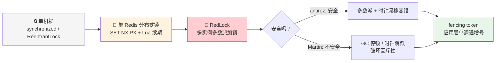
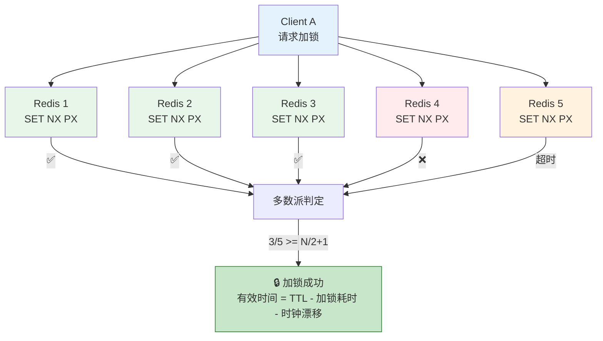
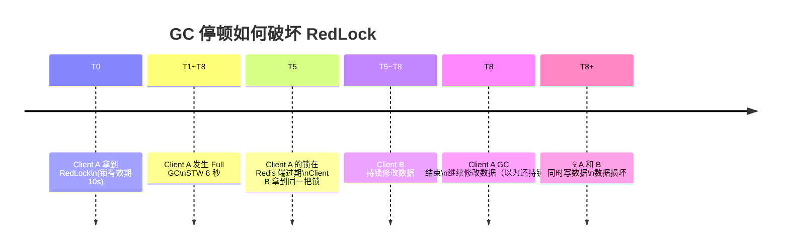
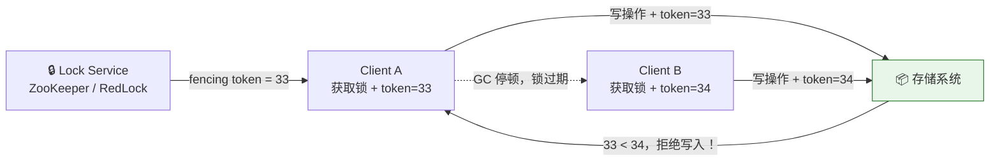
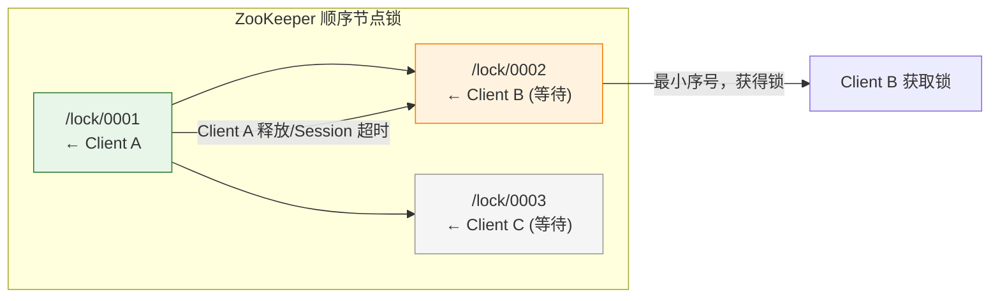
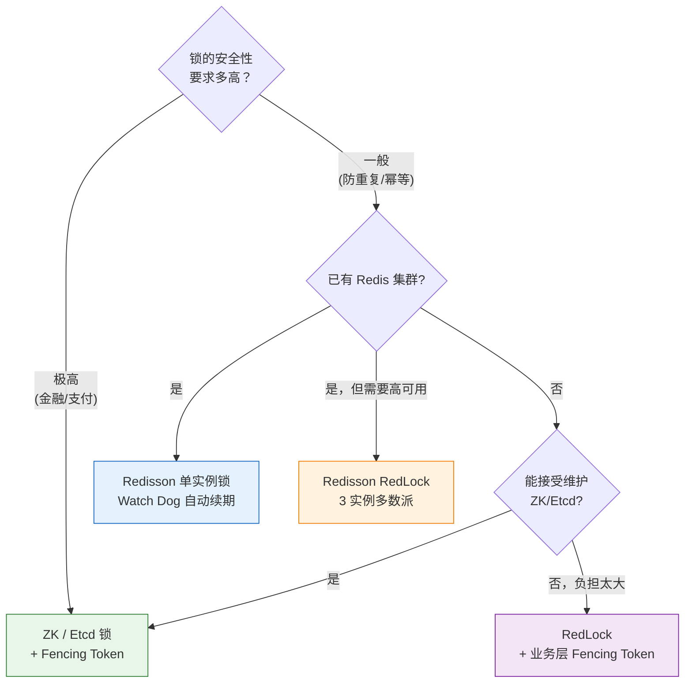

---

# 一、为什么需要分布式锁？

## 1.1 单机锁的边界

```java
// 单机：一把 synchronized 搞定
synchronized (this) {
    deductStock(); // 扣库存
}
```

部署一台机器 → 没问题。部署 3 台机器 → 三个 JVM 各锁各的，库存被超卖。

**分布式锁要解决的问题**：在多个进程/节点之间，保证同一时刻只有一个线程执行某段临界区代码。

## 1.2 分布式锁的及格线

一把合格的分布式锁至少要满足三点：

| 属性 | 含义 |
|------|------|
| **互斥性** | 任意时刻只有一个客户端能持有锁 |
| **无死锁** | 锁一定会被释放（即使客户端崩溃） |
| **容错性** | 锁服务本身不能是单点故障 |

---

# 二、单实例 Redis 分布式锁——入门姿势

## 2.1 加锁与解锁

```
SET lock_key unique_value NX PX 30000
```

- `NX`：键不存在时才写入（Not eXists，互斥）
- `PX 30000`：30 秒后自动过期（防死锁）
- `unique_value`：每个客户端生成自己的 UUID，解锁时校验

```java
// Redisson 单实例锁（最简用法）
RLock lock = redisson.getLock("order:123");
try {
    lock.lock(30, TimeUnit.SECONDS);  // 自动续期
    deductStock();
} finally {
    lock.unlock();
}
```

## 2.2 隐藏的三个坑

**坑一：锁过期了，业务还没跑完**

```
时间线：
T0 ─────── T20(锁过期) ─────── T25(业务完成，unlock)
               ↑ 锁已被另一个客户端获取！
```

Redisson 的解决方案：**Watch Dog（看门狗）**——后台线程每 10 秒续期，直到 `unlock`。

**坑二：主从切换丢锁**

```
Client A 在 Master 加锁成功
→ Master 挂了，数据还没同步到 Slave
→ Slave 晋升为新 Master，但没有 A 的锁记录
→ Client B 在新 Master 上拿锁成功
→ A 和 B 同时认为自己持有锁 💀
```

这是单实例 Redis 锁的**致命缺陷**——无法在故障转移时保证互斥。

**坑三：时钟跳跃**

Redis 的 `PEXPIRE` 依赖服务器时钟。如果 Redis 节点的系统时钟发生跳跃（NTP 校正、闰秒、虚拟机挂起），锁的过期时间可能瞬间失效。

---

# 三、RedLock 算法——antirez 的答案

## 3.1 核心思想

Redis 作者 antirez 在 2016 年提出了 RedLock 算法：

> **在 N 个独立的 Redis 实例上分别加锁，拿到超过半数（N/2+1）即为成功。**



## 3.2 算法步骤

| 步骤 | 操作 |
|------|------|
| ① | 获取当前时间（毫秒） |
| ② | **顺序**向 N 个 Redis 实例发起 SET NX PX，设置短超时（远小于锁 TTL） |
| ③ | 统计成功数：拿到 N/2+1 个成功 → 加锁成功 |
| ④ | 有效时间 = 锁 TTL - 加锁总耗时 - 时钟漂移修正 |
| ⑤ | 如果失败 → 向所有实例发送 unlock（即使未加锁的也发，best-effort） |

## 3.3 为什么多数派能解决问题？

单实例的痛点是主从切换丢锁。RedLock 的 5 个实例**没有主从关系**——它们是 5 个完全独立的 Redis，部署在不同机器上：

- 一个实例挂掉不影响其他实例
- 同时拿到多数派锁的概率极低
- 就算有实例重启，只要没有超过半数同时丢失数据，锁就不会被冲突获取

## 3.4 Redisson 的 RedLock 实现

```java
// 构建 3 个独立的 Redis 连接
RLock lock1 = redissonClient1.getLock("lock");
RLock lock2 = redissonClient2.getLock("lock");
RLock lock3 = redissonClient3.getLock("lock");

// 组装 RedLock
RedissonRedLock redLock = new RedissonRedLock(lock1, lock2, lock3);

try {
    // 尝试加锁，最多等 100ms，锁有效期 10s
    boolean locked = redLock.tryLock(100, 10000, TimeUnit.MILLISECONDS);
    if (locked) {
        doBusiness();
    }
} finally {
    redLock.unlock();
}
```

---

# 四、Martin Kleppmann 的炮轰——RedLock 不安全

## 4.1 攻击点一：GC 停顿破坏互斥性

分布式系统大神 Martin Kleppmann（《设计数据密集型应用》作者）在 2016 年发表文章 *"How to do distributed locking"*，直指 RedLock 的软肋：



> 锁的有效期在 Redis 端正常流逝，但客户端进程被 GC 冻结了 8 秒，根本不知道锁已过期。

RedLock 的锁有效期**只防护 Redis 端**，不防护客户端 GC。一旦客户端发生长时间 GC 停顿，锁在 Redis 端过期，其他客户端就能获取同一把锁，互斥性被打破。

## 4.2 攻击点二：时钟跳跃

RedLock 的算法步骤 ④ 有一个"时钟漂移修正"——如果 Redis 节点的时钟发生跳跃：

- **时钟突然跳到未来**：锁的过期时间比预期更早到达 → 锁提前过期 → 互斥性破坏
- **时钟突然跳到过去**：锁的有效期比预期更长 → 可能导致死锁问题

尽管 antirez 认为合理的 NTP 配置能将漂移控制在 ms 级别，但虚拟化环境（VM 暂停、容器迁移、宿主机时钟漂移）和闰秒事件都是真实存在的风险。

## 4.3 Martin 的解决方案：Fencing Token

Martin 认为，分布式锁本身无法保证互斥。正确姿势是：

> **存储系统自己验证持有者身份，拒绝过期持有者的写操作。**



**Fencing Token 的本质**：把互斥性的保证从锁服务转移到存储系统。存储系统记录最后成功写入的 token 值，拒绝比它更小的 token。即使客户端 GC 后"复活"，它的过期 token 也无法写入。

---

# 五、antirez 的反驳

antirez 对 Martin 的批评做出了长篇回应。核心论点：

## 5.1 GC 停顿不是锁的问题

> "如果你的系统有长达数秒的 GC 停顿，那么不管用什么锁方案，系统都不可靠。GC 停顿的问题应该在 GC 层面解决，而不是让锁算法来背锅。"

antirez 认为：
- 长时间的 GC 停顿本身是系统故障，在那段时间内，系统已经不参与共识
- RedLock 的设计前提是**系统基本正常运行**，时钟漂移在合理范围内
- 要求锁算法防御 GC 停顿和时钟跳跃，就像要求一把门锁防御推土机

## 5.2 Fencing Token 是通用解法，不限于锁

antirez 同意 Fencing Token 是好方案，但指出：
- Fencing Token 是**应用层的通用机制**，无论用什么锁都要做
- 它不能证明 RedLock 本身不安全——它只是在存储层面加了一道保险
- 如果存储不支持 Fencing Token，RedLock 依然是**工程上最好的选择**

## 5.3 各方妥协后的共识

经过激烈争论，社区基本上形成了以下共识：

| 共识 | 内容 |
|------|------|
| **RedLock 在正常情况下是安全的** | 只要客户端不 GC 停顿、时钟不剧烈漂移 |
| **RedLock 无法防御所有极端故障** | GC 长停顿、时钟跳跃 = 互斥性可能被打破 |
| **Fencing Token 是终极方案** | 如果能改存储层逻辑，Fencing Token 是最强保证 |
| **实用主义优先** | 大多数业务的锁需求（如防订单重复），RedLock 足够 |

---

# 六、ZooKeeper 分布式锁——另一种哲学

ZooKeeper 的锁方案天然免疫 RedLock 的部分问题：



| 特性 | RedLock (Redis) | ZooKeeper 锁 |
|------|----------------|-------------|
| **互斥保证** | 依赖多数派 + 时钟假设 | CP 共识强保证 |
| **死锁防护** | TTL 过期 | Session 心跳，断开自动释放 |
| **GC 停顿** | 锁可能过期 → 其他客户端获取 | 心跳超时 → 释放锁，不会同时持锁 |
| **性能** | 高（内存 DB） | 中等（写磁盘 + 共识） |
| **运维成本** | Redis 已在用，多部署几台 | 需要维护 ZK 集群 |
| **锁顺序** | 无 | 顺序节点支持公平锁 |

---

# 七、生产环境选型建议



**实战建议**：

1. **90% 场景**：单实例 Redis 锁 + Redisson Watch Dog + 合理 TTL → 够用
2. **需要高可用的锁**：RedLock 3 实例多数派（不用 5 台，3 台够）
3. **锁保护的操作必须幂等**：即使锁失效，重复执行也不产生副作用
4. **如果能改存储层**：加 Fencing Token，让存储层拒绝过期请求
5. **对安全性极度敏感**：用 ZooKeeper / Etcd，不用 Redis

---

# 八、总结

> **RedLock 的安全性争论的本质，是工程师和学者对"够好"的定义不同。antirez 从工程实践出发，认为极端故障不该由锁算法兜底。Martin 从分布式系统理论出发，认为算法不能有任何假设漏洞。**

在真实的生产环境中：
- **RedLock 对大多数场景是够用的**——极端 GC 停顿和时钟跳跃的概率远低于 Redis 实例崩溃
- **没有完美的分布式锁**——只有"足够好的锁"和"用错了地方的锁"
- **锁 + 幂等 + Fencing Token** — 三道防线才是最终的正确答案

---

*参考文献：*
- *antirez, "Is Redlock safe?" (2016)*
- *Martin Kleppmann, "How to do distributed locking" (2016)*
- *Redisson 官方文档: https://github.com/redisson/redisson/wiki*
