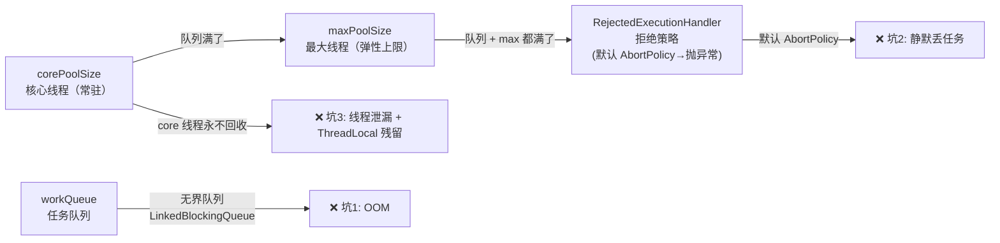

# 历史背景——线程池为什么是"隐形杀手"？

2004 年 JSR-166 引入 `ThreadPoolExecutor` 时，设计的初衷非常明确：**复用线程，避免频繁创建/销毁的系统开销**。这个初衷决定了 ThreadPoolExecutor 的行为模型——core 线程永不回收（除非你主动设置）、任务优先排队而非创建新线程、拒绝策略默认直接抛异常。

20 年后的今天，这个行为模型在微服务架构的线程池应用场景中产生了大量"不符合直觉"的行为。最典型的伤害是无界队列 + 异步任务 = OOM 定时炸弹——因为 `Executors.newFixedThreadPool()` 和 `newCachedThreadPool()` 这些"方便工厂"默认使用了无界队列，而这个行为在 JavaDoc 中只有一行小字的说明。

本文的 6 个坑都来自真实生产事故。每个坑的背后都有一个 `ThreadPoolExecutor` 参数在作祟——理解这 7 个参数的含义，才能从"猜为什么 OOM"变成"早知道会 OOM"。



---

# 一、ThreadPoolExecutor 的 7 参数模型

在进入坑之前，先理解这 7 个参数控制了什么：

```java
ThreadPoolExecutor(int corePoolSize,    // 常驻线程数（即使空闲也保持运行）
                   int maxPoolSize,      // 最大线程数（弹性上限）
                   long keepAliveTime,   // 非 core 线程空闲回收时间
                   TimeUnit unit,        // keepAliveTime 的单位
                   BlockingQueue<Runnable> workQueue,  // 任务排队队列
                   ThreadFactory threadFactory,         // 线程创建工厂（给线程起名字！）
                   RejectedExecutionHandler handler)    // 队列满 + 线程满时的策略
```

## 执行流程——一个新任务来到时发生了什么？

```java
// ThreadPoolExecutor.execute() 的决策流程（简化源码）
public void execute(Runnable command) {
    // ① 运行中的线程 < corePoolSize → 直接创建新线程（即使有空闲线程可用）
    if (workerCountOf(c) < corePoolSize) {
        if (addWorker(command, true)) return;  // true = core 线程
    }
    // ② 核心线程满了 → 尝试入队
    if (isRunning(c) && workQueue.offer(command)) {
        // 入队成功 → 任务等待执行
        // 二次检查线程池状态（防止并发关闭）
    }
    // ③ 队列也满了 → 尝试创建非核心线程（上限 maxPoolSize）
    else if (!addWorker(command, false))  // false = 非 core 线程
        // ④ maxPoolSize 也满了 → 走拒绝策略
        reject(command);
}
```

**关键认知**：任务**优先排队，其次创建线程**。只有当队列满了才会创建新的非核心线程。这意味着如果你用的队列是无界的，maxPoolSize 永远不会被用到。

---

# 坑一：无界队列 + 异步任务 = OOM 定时炸弹

```java
// 💀 这段代码是 OOM 炸弹
ExecutorService pool = Executors.newFixedThreadPool(10);
// 等价于：
new ThreadPoolExecutor(10, 10, 0L, TimeUnit.MILLISECONDS,
    new LinkedBlockingQueue<>());  // ← 无界队列！默认容量 = Integer.MAX_VALUE
```

**事故现场**：上游服务突然发了 10000 个任务，10 个线程在跑，剩下 9990 个全在 `LinkedBlockingQueue` 里排队。每个任务持有 2MB 的数据上下文 → 9990 × 2MB ≈ 20GB → GC 死活回不来 → OOM。

**✅ 正确做法**：显式指定有界队列 + 合适的拒绝策略。

```java
ThreadPoolExecutor pool = new ThreadPoolExecutor(
    10, 20,                           // core=10, max=20
    60L, TimeUnit.SECONDS,
    new LinkedBlockingQueue<>(100),   // ← 有界队列！最多 100 个任务排队
    new ThreadPoolExecutor.CallerRunsPolicy()  // 反压：让调用方自己执行
);
// 容量 = max 20 个在执行 + 100 个在队列 = 最多 120 个并发任务
// 第 121 个任务来 → 拒绝策略 → CallerRunsPolicy → 调用方线程自己执行
// → 调用方线程被占用 → 没法继续提交 → 自然反压
```

---

# 坑二：拒绝策略默认为 AbortPolicy——线上静默丢任务

```java
// ThreadPoolExecutor 默认的 4 个拒绝策略
AbortPolicy         → throw new RejectedExecutionException();  // 任务丢失！调用方收到异常
CallerRunsPolicy    → 调用方线程自己执行这个任务               // 反压机制
DiscardPolicy       → 静默丢弃任务，没有任何提示               // 最危险！
DiscardOldestPolicy → 丢弃队列中最老的任务，腾出空位插入新任务   // "假装不丢"
```

**选型建议**：

| 场景 | 推荐策略 | 原因 |
|------|---------|------|
| **核心业务（订单/支付）** | `CallerRunsPolicy` | 反压，宁可慢不能丢 |
| **日志/埋点** | `DiscardPolicy` + 监控报警 | 丢了不影响主流程，但要知道丢了 |
| **批量处理** | `AbortPolicy` + 上层重试 | 让调用方感知失败并决定是否重试 |

```java
// 自定义拒绝策略 + 监控
ThreadPoolExecutor pool = new ThreadPoolExecutor(..., 
    (r, executor) -> {
        metrics.recordRejection();  // 记录被拒绝的任务数
        log.warn("Task rejected, pool size={}, queue size={}", 
                 executor.getPoolSize(), executor.getQueue().size());
        // 放到一个备用队列，后台线程重试
        retryQueue.offer(r);
    }
);
```

---

# 坑三：core 线程永不回收 + ThreadLocal = 内存泄漏

```java
// corePoolSize=5, maxPoolSize=20, keepAliveTime=60s
// 突发流量：扩容到 20 个线程 → 流量回落 → 15 个超过 60s 空闲被回收
// 但 core 的五次线程永驻！
// 每个 core 线程持有 ThreadLocal → GC roots → 内存永远收不回来
```

**✅ 让 core 线程也能超时回收**：

```java
pool.allowCoreThreadTimeOut(true);
// 设置后 core 线程在 keepAliveTime 过期后也一样回收
// 适合：流量有明显波峰波谷的场景（如定时任务批量执行后长期空闲）
```

---

# 坑四：线程池里用 ThreadLocal——值"串线"

```java
ThreadLocal<User> currentUser = new ThreadLocal<>();

pool.execute(() -> {
    currentUser.set(userA);  // 线程 T1 的 ThreadLocal 设了 userA
    doWork();
    // ⚠️ 没有 remove()！
});  // T1 归还给池

pool.execute(() -> {
    User u = currentUser.get();  // T1 复用了！拿到的还是 userA 的残留值 💀
    // 这个用户的请求被关联到了上一个用户的身份！
});
```

**根因**：线程池复用线程，在线程的 ThreadLocalMap 没清理的情况下，下一个任务就可能读到上一个任务的残留数据。

**✅ 正确做法**：

```java
pool.execute(() -> {
    try {
        currentUser.set(user);
        doWork();
    } finally {
        currentUser.remove();  // ← 必须清理！
    }
});
```

**或使用更安全的 `TransmittableThreadLocal`（阿里开源）**——它自动追踪线程池中的 ThreadLocal 传递，支持父子线程间传递和在池化线程执行后自动清理。

---

# 坑五：`submit()` 吞了异常

```java
pool.submit(() -> {
    throw new RuntimeException("炸了");  // 没人看到这个异常！
});
// submit() 返回 Future，异常被包装在 Future 中
// 如果不调用 Future.get() → 这个异常就永远被吞了
```

**✅ 两种修复方式**：

```java
// 方式一：用 execute() 替代 submit() —— 未捕获异常直接抛到 UncaughtExceptionHandler
pool.execute(() -> {
    throw new RuntimeException("炸了");  // → 线程的 UncaughtExceptionHandler 处理
});

// 方式二：如果必须用 submit → 必须 get()
Future<?> f = pool.submit(task);
try {
    f.get();  // 这里会抛出 ExecutionException（包装了 RuntimeException）
} catch (ExecutionException e) {
    throw new RuntimeException(e.getCause());  // 拿到真正的异常
}

// 方式三：全局兜底——给线程池的线程设置 UncaughtExceptionHandler
pool.setThreadFactory(r -> {
    Thread t = new Thread(r);
    t.setUncaughtExceptionHandler((thread, ex) -> {
        log.error("Uncaught in pool thread {}: {}", thread.getName(), ex.getMessage());
    });
    return t;
});
```

---

# 坑六：线程池隔离不足——一个慢任务饿死全池

```java
// 💀 全站共用一个线程池
pool.execute(orderTask);   // 订单处理（核心业务）
pool.execute(exportTask);  // 报表导出（慢，一次可能跑几分钟）
// → 导出任务占满所有线程 → 订单全堵在队列中 → 用户下单超时
```

**✅ 按任务类型隔离线程池**：

```java
// 不同类型的任务走不同的线程池
ThreadPoolExecutor corePool   = new ThreadPoolExecutor(10, 20, ...); // 核心业务
ThreadPoolExecutor exportPool = new ThreadPoolExecutor(2, 4, ...);    // 导出/报表
ThreadPoolExecutor notifyPool = new ThreadPoolExecutor(5, 10, ...);   // 通知/推送

// 原则：
// 1. 关键路径和耗时任务分离
// 2. 每个池都有自己的有界队列和拒绝策略
// 3. 考虑物理隔离（不同服务的线程池）
```

---

# 七、线程池参数公式——不是银弹，但是起点

**IO 密集型**（数据库查询、RPC 调用、文件 IO）：
```
线程数 ≈ CPU 核数 × 2 到 CPU 核数 × 10
      ≈ CPU 核数 × (1 + 平均 IO 等待时间 / 平均 CPU 计算时间)
```

**CPU 密集型**（加密、压缩、图形计算）：
```
线程数 ≈ CPU 核数 + 1
```

**混合型**（大多数 Java Web 应用）：
```
核心线程 ≈ CPU 核数 × 2
最大线程 ≈ CPU 核数 × 5
队列容量 ≈ 100-500（反压）
```

> **这些公式只是起点，不是精准答案。** 最终参数需要在生产环境用真实流量压测确定。关键是：**有界队列 + CallerRunsPolicy 反压 + 监控池的使用率**。

---

# 八、监控——没监控的线程池就是在盲飞

```java
// 核心监控指标
ScheduledExecutorService monitor = Executors.newSingleThreadScheduledExecutor();
monitor.scheduleAtFixedRate(() -> {
    metrics.gauge("pool.active",     pool.getActiveCount());    // 正在执行任务的线程数
    metrics.gauge("pool.pool_size",  pool.getPoolSize());       // 当前池中线程总数
    metrics.gauge("pool.core_size",  pool.getCorePoolSize());   // 核心线程数
    metrics.gauge("pool.max_size",   pool.getMaximumPoolSize()); // 最大线程数
    metrics.gauge("pool.queue_size", pool.getQueue().size());    // 队列中等待的任务数
    metrics.gauge("pool.queue_remaining", pool.getQueue().remainingCapacity()); // 队列剩余容量
    metrics.gauge("pool.completed",  pool.getCompletedTaskCount()); // 已完成任务数
    metrics.gauge("pool.rejected",   rejectedCount.get());      // 被拒绝的任务数
    
    // 告警规则：
    // - active == max → 池满了，可能需要扩容
    // - queue.remaining < 10% → 队列快满了，即将触发拒绝
    // - rejected > 0 → 有任务被拒绝，需要排查
}, 10, 10, TimeUnit.SECONDS);
```

---

# 九、总结

| 坑 | 根因 | 一句话避开 |
|------|------|-----------|
| **OOM** | 无界队列 + 异步堆任务 | `LinkedBlockingQueue` 必须指定容量 |
| **丢任务** | 拒绝策略默认 AbortPolicy | 核心业务用 `CallerRunsPolicy` 反压 |
| **内存泄漏** | core 线程不回收 + ThreadLocal 不清理 | `allowCoreThreadTimeOut(true)` + `finally { remove() }` |
| **ThreadLocal 串线** | 线程复用 + 没清理 | `finally { threadLocal.remove() }` |
| **吞异常** | `submit()` 不 `get()` | 用 `execute()` 或必须 `get()` + UncaughtExceptionHandler |
| **饿死** | 全站共用一个线程池 | 按业务类型隔离线程池 |

# 延伸阅读

**Do——动手验证：**
- 创建一个无界队列的线程池，循环提交 100 万个任务，观察 GC 日志和 heap dump
- 写一个 `CallerRunsPolicy` 的 demo：故意让队列变满，观察主线程自己执行任务时的日志
- 用 JProfiler 或 VisualVM 观察正在运行的 ThreadPoolExecutor 的线程状态（RUNNABLE vs WAITING）

**Todo——深入方向：**
- `ForkJoinPool` 与 `ThreadPoolExecutor` 的区别——工作窃取（work-stealing）算法的适用场景
- `ScheduledThreadPoolExecutor` 的 `DelayedWorkQueue` 堆实现原理
- Java 21 虚拟线程（Virtual Thread）对线程池设计的颠覆——用虚拟线程后还需要线程池吗？

*本文参考资料：*
- Brian Goetz et al.《Java Concurrency in Practice》——第 6-8 章（任务执行与线程池）
- Doug Lea, "The java.util.concurrent Synchronizer Framework" (2004)
- OpenJDK 源码: `java.util.concurrent.ThreadPoolExecutor`
- Alibaba TransmittableThreadLocal: https://github.com/alibaba/transmittable-thread-local
