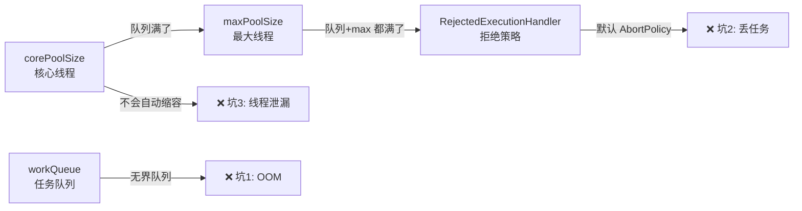

---

# 坑一：无界队列 + 异步任务 = OOM 定时炸弹

```java
// 💀 这段代码是 OOM 炸弹
ExecutorService pool = Executors.newFixedThreadPool(10);
// 等价于：
new ThreadPoolExecutor(10, 10, 0L, TimeUnit.MILLISECONDS,
    new LinkedBlockingQueue<>());  // ← 无界队列！
```

`LinkedBlockingQueue` 默认容量 `Integer.MAX_VALUE`。如果上游突发 1000 个任务，队列里堆 990 个等待，每个任务持有几 MB 数据 → OOM。

**✅ 正确做法**：显式指定队列容量。

```java
new ThreadPoolExecutor(
    10, 20, 60L, TimeUnit.SECONDS,
    new LinkedBlockingQueue<>(100),  // ← 有界队列
    new ThreadPoolExecutor.CallerRunsPolicy()  // 反压给调用方
);
```

---

# 坑二：拒绝策略默认为 AbortPolicy —— 线上静默丢任务

```java
// ThreadPoolExecutor 默认的 4 个拒绝策略
AbortPolicy         // → 抛 RejectedExecutionException（任务丢了）
CallerRunsPolicy    // → 调用方线程自己执行（反压）
DiscardPolicy       // → 静默丢弃（最危险！）
DiscardOldestPolicy // → 丢弃队首最老任务
```

**✅ 建议**：
- **IO 密集型**：`CallerRunsPolicy`（反压，控制流速）
- **日志/埋点**：`DiscardPolicy`（丢了不影响主流程）
- **任务必须有监控**：告警+埋点，知道被拒绝了多少

---

# 坑三：线程池不会自动缩容 —— 内存泄漏

```java
// corePoolSize=5, maxPoolSize=20, keepAliveTime=60s
// → 突发流量：扩容到 20 个线程
// → 流量回落：10 个超过 60s 空闲被回收（keepAliveTime），但 core 线程 5 个永驻！
// → 每个 core 线程持有 ThreadLocal → GC 不掉 → 内存泄漏
```

**✅ 让 core 线程也能超时回收**：

```java
pool.allowCoreThreadTimeOut(true);
```

---

# 坑四：线程池里用 ThreadLocal —— 值"串线"

```java
ThreadLocal<User> currentUser = new ThreadLocal<>();

pool.execute(() -> {
    currentUser.set(userA);  // 线程 T1 设置
    // ... 
});  // T1 归还池

pool.execute(() -> {
    User u = currentUser.get();  // T1 复用了，读到 userA！💀
});
```

线程池复用线程 → ThreadLocal 没清理 → 下一个任务读到了上一个任务的值。

**✅ 正确做法**：`execute` 任务结尾 `finally { threadLocal.remove(); }` 或者改用 `TransmittableThreadLocal`（阿里开源）。

---

# 坑五：`submit()` 吞异常

```java
pool.submit(() -> {
    throw new RuntimeException("炸了");  // 没人看到
});
// ← submit 把异常包装成 Future，不 get() 就永远不会抛出
```

**✅ Fix**：

```java
Future<?> f = pool.submit(task);
try { f.get(); }  // 拿到异常
// 或直接用 execute() —— 未捕获异常会交给 UncaughtExceptionHandler
```

---

# 坑六：线程池隔离不足 —— 一个慢任务饿死全池

```java
// 全站共用一个线程池
pool.execute(orderTask);   // 订单处理
pool.execute(exportTask);  // 报表导出（慢）
// → 导出任务占满所有线程 → 订单全堵
```

**✅ 按任务类型隔离线程池**：

```java
ThreadPoolExecutor orderPool  = new ThreadPoolExecutor(...);  // 订单
ThreadPoolExecutor exportPool = new ThreadPoolExecutor(2, 4, ...); // 导出
```

---

# 七参数口诀

```
corePoolSize：常驻线程
maxPoolSize： 弹性上限
keepAliveTime：空闲回收时间
unit：时间单位
workQueue：缓存队列（有界！）
threadFactory：线程工厂（给线程起名字，方便排查）
handler：拒绝策略（首选 CallerRuns 反压）
```

---

# 总结

| 坑 | 一句话避开 |
|------|-----------|
| OOM | 队列必须指定容量，不用无界队列 |
| 丢任务 | 拒绝策略首选 CallerRunsPolicy |
| 内存泄漏 | `allowCoreThreadTimeOut(true)` |
| ThreadLocal 串线 | `finally { remove() }` |
| 吞异常 | `execute()` 不用 `submit()` 不 `get()` |
| 饿死 | 按业务隔离线程池 |

*本文参考资料：*
- Brian Goetz et al.《Java Concurrency in Practice》——第 3-5 章（共享与组合对象）、第 6-8 章（任务执行与线程池）、第 11-12 章（性能与可伸缩性）
- Doug Lea, "The java.util.concurrent Synchronizer Framework"（AQS 论文）, 2004
- Java Language Specification, Chapter 17: Threads and Locks（JMM）: https://docs.oracle.com/javase/specs/jls/se17/html/jls-17.html
- JSR-133 FAQ: https://www.cs.umd.edu/~pugh/java/memoryModel/jsr-133-faq.html
- OpenJDK 源码: java.util.concurrent 包（AbstractQueuedSynchronizer / ThreadPoolExecutor / ReentrantLock 等）
