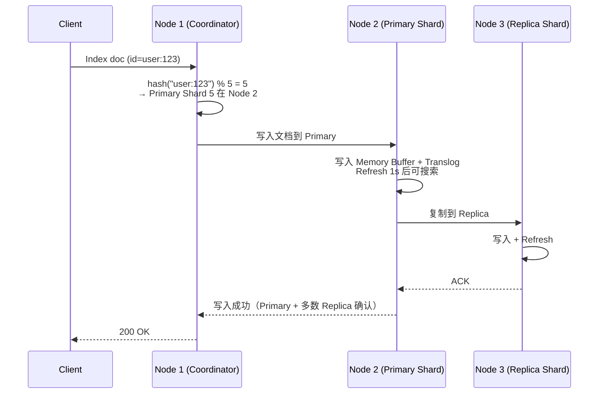

# 历史背景——Shay Banon 给妻子写了个食谱搜索

2010 年，Shay Banon 的妻子在学习烹饪，需要一个搜索菜谱的工具。他基于 Apache Lucene 写了一个"让 Lucene 更容易用"的包装，起名 Elasticsearch。这个"食谱搜索"后来变成了全球最广泛使用的搜索引擎——从 GitHub 的代码搜索到 Netflix 的推荐服务，到 Uber 的司机匹配。

理解 ES 的关键在于：**它本质上是一个分布式的 Lucene 包装器。** 所有数据的存储、索引、查询都由 Lucene 完成，ES 负责把 Lucene 的实例（Shard）分布到多台机器上，并管理它们之间的复制和协调。所以学 ES 分两层——先理解 Lucene 的倒排索引和段合并，再理解 ES 的分片和集群。

---

# 一、Lucene 核心——倒排索引不是"把文档倒过来"

## 1.1 倒排索引的结构

```
正排索引：文档 → 词   （"文档1 包含哪些词"）
倒排索引：词 → 文档   （"这个词出现在哪些文档里"）

ES 的倒排索引在 Lucene 中的实现结构：

┌──────────────────────────────────────┐
│ Term Index（词项索引）                 │
│ 用 FST (Finite State Transducer)    │
│ 快速定位 → Term Dictionary           │
│ "java" → 指向 Dictionary 的某个位置   │
└──────────────┬───────────────────────┘
               ↓
┌──────────────────────────────────────┐
│ Term Dictionary（词项字典）            │
│ 所有词项有序排列                      │
│ java → Posting List 的位置            │
│ 虚拟 → Posting List 的位置            │
│ 线程 → Posting List 的位置            │
└──────────────┬───────────────────────┘
               ↓
┌──────────────────────────────────────┐
│ Posting List（倒排表）                 │
│ java → [doc1, doc3, doc5, doc7]     │
│        - doc1: TF=2, positions=[3,7]  │
│        - doc3: TF=1, positions=[12]   │
└──────────────────────────────────────┘
```

**一个搜索的执行过程**：

```
搜索："Java 虚拟线程"（分词：["java", "虚拟", "线程"]）

① Tokenizer 分词 → ["java", "虚拟", "线程"]
② 在 Term Index → Term Dictionary 中找到每个词
③ 读取各自的 Posting List：
     "java" → [doc1, doc3, doc7]
     "虚拟" → [doc1, doc4]
     "线程" → [doc1, doc3, doc7]
④ 取交集 → doc1 包含所有三个词 → doc1 是最匹配的
⑤ 对每个匹配的 doc，用 BM25 计算相关性评分
⑥ 按评分排序返回
```

## 1.2 Near Real-Time——写入的数据为什么不是"立刻可搜"？

```
ES 写入的三级延迟：

① 写入 → Memory Buffer（内存，不可搜索）
② Refresh（默认每 1 秒一次）→ Memory Buffer → 新的 Segment（磁盘+内存）→ 可搜索
   → 这就是 ES 是"近实时"而不是"实时"的原因——最多 1 秒的延迟
   → 1 秒刷新间隔是 ES 对"写入可见性"和"IO 性能"的权衡

③ Translog（事务日志）→ 写入 Memory Buffer 的同时写 Translog
   → 保证数据不丢——即使 ES 进程在 Refresh 之前崩溃
   → Translog 每 5 秒 fsync（或每次写操作 fsync，取决于 index.translog.durability）
   
④ Flush（默认每 30 分钟或 Translog > 512MB）→ 执行 Full Commit
   → Memory Buffer → Segment → fsync 到磁盘
   → 清空 Translog
   → 这是"数据真正持久化到磁盘不丢"的保证
```

## 1.3 段合并——小碎片太多会慢

```
每 Refresh 一次 = 创建 1 个新 Segment
太多 Segment = 搜索时需要遍历更多文件 = 搜索慢

ES 后台自动 Merge：
  10 个小 Segment (每个 5MB) → Merge → 1 个大 Segment (50MB) → 删除 10 个小 Segment
  
Merge 的策略（TieredMergePolicy）：
  把大小相似的 Segment 合并在一起
  避免"一个大 Segment 和一堆小 Segment 合并浪费 IO"
  
Merge 期间会消耗 IO 和 CPU → 生产环境通常避免在业务高峰期手动 Force Merge
```

---

# 二、BM25 评分——为什么能替代 TF-IDF

## 2.1 TF-IDF 在搜索中的两个问题

```
TF-IDF 的公式：Score = TF(词频) × IDF(逆文档频率)

问题 1：词频不设上限
  文档 A："Java" 出现 100 次
  文档 B："Java" 出现 1 次
  → TF-IDF 认为 A 比 B 相关 100 倍
  → 但实际上出现 20 次和出现 100 次的差距远小于 5 倍

问题 2：长文档"占便宜"
  300 页的书里 "Java" 出现了 5 次
  3 页的博客里 "Java" 出现了 5 次
  → TF-IDF 认为它们对 "Java" 的相关度一样
  → 但显然博客内容更聚焦
```

## 2.2 BM25 的两个改进

**改进 1：词频饱和**

```
BM25 的词频因子：
  TF / (TF + k1 × (1 - b + b × docLength / avgDocLength))

  k1：控制词频饱和速度（默认 1.2）
  
  效果：词频从 1 → 2，相关度增长 50%
        词频从 20 → 100，相关度增长不到 5%
        → 不再有"复制粘贴 100 次排第一"的问题
```

**改进 2：文档长度归一化**

```
  b：控制文档长度影响（默认 0.75，b=0 忽略文档长度，b=1 完全按长度缩放）
  
  效果：超长文档中的 "Java" → 加权稍低（被稀释了）
        短文档中的 "Java" → 加权稍高（更聚焦）
        → 自动补偿文档长短差异
```

**面试追问：BM25 和 TF-IDF 什么时候结果一样？** k1 趋近于无穷，b=0 → BM25 退化到 TF-IDF。

---

# 三、分片与集群——数据怎么分布

## 3.1 Shard 路由与写入流程

```
一个 ES 索引（Index）= 多个 Primary Shard，每个 Primary Shard 可以有 0-N 个 Replica

数据怎么决定写入哪个分片？
  shard = hash(_id) % primary_shard_count

例：_id = "user:123" → hash("user:123") = 12345 → 12345 % 5 = 5
  → 这条文档路由到 Primary Shard 5

Primary Shard 数在索引创建后**不可更改**（因为 hash % N 的 N 变了会改变所有数据的分片位置）
Replica 数可以随时改（因为 Primary → Replica 的复制是独立于分片分布的）
```



## 3.2 脑裂——多数派原则

```
网络分区——3 个 Node 的集群：
  Node 1 ← 网络不通 → Node 2 和 Node 3 通信正常
  
  如果没有多数派保护：
    Node 1："我选自己为 Master" → Master 1
    Node 2/3："我们选 Node 2 为 Master" → Master 2
    → 两个 Master！客户端可能写 A 也可能写 B → 数据不一致
  
  ES 的保护：discovery.seed_hosts + minimum_master_nodes

  minimum_master_nodes = N/2 + 1（3 节点 → 2）
  Node 1 想成为 Master → 需要 2 票（自己 + 1 个其他节点）
  → Node 1 得不到 2 票 → 不能成为 Master
  → Node 2 得到自己和 Node 3 的 2 票 → 成为 Master → 集群只有一个 Master
```

---

# 四、Query vs Filter——"需要评分"和"不需要评分"的正确选择

| | Query | Filter |
|------|-------|--------|
| **是否评分** | ✅ 相关度评分（去算哪个文档更匹配） | ❌ 不评分（只看"匹配/不匹配"） |
| **是否缓存** | ❌ 不缓存查询结果 | ✅ **自动缓存**（ES 缓存 Filter 的位集结果） |
| **适用** | 全文搜索、"最相关的排前面" | 精确匹配、"只看状态=active 的订单" |

```json
// ✅ 好的：全文搜索用 Query，过滤用 Filter
{
  "query": {
    "bool": {
      "must": [
        { "match": { "title": "Java 虚拟线程" } }     ← Query（需要相关性评分）
      ],
      "filter": [
        { "term": { "status": "published" } },          ← Filter（无需评分，缓存）
        { "range": { "created_at": { "gte": "2025-01-01" } } }
      ]
    }
  }
}
```

---

# 五、总结

| 概念 | 一句话 | 核心数据 |
|------|--------|---------|
| **倒排索引** | 词 → 文档列表，搜索 O(词项数) | Term Dictionary + FST + Posting List |
| **BM25** | 词频饱和 + 文档长度归一化 | k1=1.2, b=0.75（默认） |
| **Near Real-Time** | 写入 1 秒后可搜索 | Refresh 间隔 = 1s |
| **Segment Merge** | 自动合并小碎片，提升搜索速度 | 后台自动，不阻塞搜索 |
| **Shard 路由** | `hash(_id) % primary_shard_count` | Primary 数不可改 |
| **脑裂防护** | 多数派选举 | `N/2 + 1` |

# 延伸阅读

**Do——动手验证：**
- `GET /my-index/_stats?filter_path=**.segments` 查看当前索引的 Segment 数量和大小
- `GET /my-index/_search?explain=true` 看 BM25 对某条文档的具体评分计算
- `POST /my-index/_forcemerge?max_num_segments=1` 做一次全量 Merge 并观察搜索性能变化

**Todo——深入方向：**
- ES 的写入一致性——`wait_for_active_shards` 与 Quorum 写入
- Doc Values 与列存储——排序和聚合为什么快
- 分布式搜索的两个阶段——Query Phase（查哪些文档） + Fetch Phase（取那些文档的完整内容）

*本文参考资料：*
- Elasticsearch 官方文档: The Definitive Guide / Index Modules / Search
- BM25 论文: "The Probabilistic Relevance Framework: BM25 and Beyond" (Robertson & Zaragoza, 2009)
- Apache Lucene 文档: Index File Formats / Scoring
