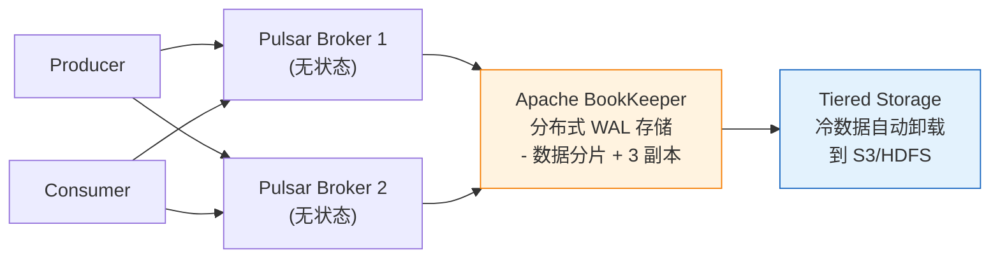

# 历史背景——阿里为什么需要 RocketMQ？

2011 年，阿里的电商平台碰到了 Kafka 在当时版本（0.7/0.8）的几个局限：**不支持事务消息**（扣库存+创建订单需要原子性）、**不支持任意时间的延时消息**（订单 30 分钟未支付自动取消）、**消费重试和死信队列**需要额外的外部组件。

阿里自研了 RocketMQ（前身 MetaQ）来解决这些"电商交易场景下的刚性需求"。它并不是比 Kafka 更"快"，而是比 Kafka 更"可靠"——牺牲少量吞吐换取消息的强保证。这是 RocketMQ 在设计上和 Kafka 最根本的分歧。

Apache Pulsar（2016 年从 Yahoo 开源）则在架构层面做了更激进的改变——**把消息的计算（Broker）和存储（BookKeeper）彻底分离**。这个设计让 Broker 可以秒级弹扩，存储可以独立扩缩，冷数据可以自动下沉到 S3。

---

# 一、RocketMQ ——可靠性的终极诠释

## 1.1 事务消息——让"本地操作 + 发消息"是原子的

```
场景：用户下单（扣库存 + 创建订单 + 发"订单已创建"消息给积分系统）

传统的问题：
  BEGIN TRANSACTION;
    INSERT INTO orders ...   -- 本地操作
    INSERT INTO inventory ... -- 本地操作
  COMMIT;
  kafka.send(orderCreatedEvent);  -- 发 MQ
  → 如果 COMMIT 成功但 kafka.send() 失败 → 订单已创建，但积分系统不知道
  → 如果 kafka.send() 成功但网络故障 → 积分系统收到消息，但 COMMIT 实际失败了
```

**RocketMQ 事务消息——解决"本地事务和发消息的原子性"**：

```
① 生产者发送 half 消息 到 RocketMQ
   → 此时消息在 MQ 中存在，但对 Consumer 不可见

② 生产者执行本地事务
   BEGIN TRANSACTION;
     INSERT INTO orders ...
     INSERT INTO inventory ...
   COMMIT;
   
   如果 COMMIT 成功 → ③ commit half 消息 → Consumer 可见
   如果 COMMIT 失败 → ③ rollback half 消息 → Consumer 永远看不到

④ 如果生产者宕机/网络故障，RocketMQ 没收到 commit/rollback
   → Broker 定时回查：向生产者发"事务状态回查请求"
   → 生产者收到回查 → 检查本地事务状态（如查订单表确认订单是否创建）→ 告诉 Broker commit/rollback
```

```java
// RocketMQ 事务消息生产者
TransactionMQProducer producer = new TransactionMQProducer("order-group");
producer.setTransactionListener(new TransactionListener() {
    @Override
    public LocalTransactionState executeLocalTransaction(Message msg, Object arg) {
        // 执行本地事务（创建订单 + 扣库存）
        try {
            orderService.createOrder(arg);
            return LocalTransactionState.COMMIT_MESSAGE;
        } catch (Exception e) {
            return LocalTransactionState.ROLLBACK_MESSAGE;
        }
    }
    
    @Override
    public LocalTransactionState checkLocalTransaction(MessageExt msg) {
        // Broker 回查：检查本地事务状态
        String orderId = msg.getKeys();
        Order order = orderDao.findById(orderId);
        if (order != null) return LocalTransactionState.COMMIT_MESSAGE;
        return LocalTransactionState.ROLLBACK_MESSAGE;
    }
});
```

## 1.2 延时消息——"30 分钟未支付，自动取消订单"

```
Kafka 没有原生延时消息 → 需要外部定时任务或 Redis keyspace notification

RocketMQ 原生支持 18 个延迟级别：
  message.setDelayTimeLevel(3);  // 3 = 延迟 10 秒
  // 1s/5s/10s/30s/1m/2m/3m/4m/5m/6m/7m/8m/9m/10m/20m/30m/1h/2h

原理：Producer 发送延迟消息 → 写入 SYSTEM_TOPIC（非用户 Topic）
     → Broker 有定时任务扫描 → 到期后转存到真实 Topic → Consumer 可见
```

## 1.3 消费重试与死信队列

```
Kafka：消费失败后，Consumer 需要自己处理重试（手动 seek 或者降级到另一个 topic）
RocketMQ：消费失败 → Broker 自动延迟重试（1s/5s/10s/30s/1m...→ 逐渐延长）
          → 超过最大重试次数（默认 16 次）→ 消息进 DLQ（死信队列）
          → 人工查看 DLQ 中的消息，决定丢弃/修正/重发
```

## 1.4 RocketMQ vs Kafka 差异速查

| | Kafka | RocketMQ |
|------|-------|----------|
| **设计起源** | LinkedIn 日志流（大数据管道） | 阿里交易消息（可靠、低延迟） |
| **吞吐量** | 极高（百万/s，Page Cache + 零拷贝） | 高（十万/s） |
| **延迟** | 批量攒发送，微秒→百毫秒 | 低延迟（微秒-毫秒，支持单个发送） |
| **事务消息** | Exactly-Once 语义（Kafka Streams 的事务生产者） | **原生事务消息**（half + 回查 + commit） |
| **延时消息** | 不支持 | **原生支持** 18 个延迟级别 |
| **顺序消息** | 分区内有序（consumer 端需要自己做顺序处理） | 全局有序/分区有序（消费者端不需要额外保证） |
| **消费重试** | 需要 Consumer 自己实现 | **自动重试 + DLQ** |
| **适用** | 日志/埋点/大数据管道（超高吞吐） | 交易/订单（事务消息、重试、延迟） |

---

# 二、Pulsar ——存算分离的 MQ

## 2.1 架构创新——Broker 不存数据

```
传统 MQ（Kafka/RocketMQ）：
  Broker = 计算（路由消息 + 处理请求）+ 存储（数据落盘 + 副本复制）
  → 扩容时 Broker 不仅要能"接收更多消息"，还要"存更多数据"
  → 数据倾斜时，扩容 Broker 并不能立刻解决热分区的问题

Pulsar：
  Broker（计算层）= 只管路由、协议解析、消费者派发 → 无状态
  BookKeeper（存储层）= 只管存数据、做副本 → 独立扩缩
  
  → Broker 不存数据 → 可以秒级弹扩/弹缩（不需要搬数据！）
  → 数据分布在 BookKeeper 上 → 存储独立扩缩
  → Broker 层挂了 → 换个新 Broker 即可（数据在 BookKeeper 上）
```



## 2.2 分层存储——冷数据自动下沉到 S3

```
Pulsar 可以配置"热数据保留 3 天，冷数据自动归档到 S3"：

  broker.conf:
    managedLedgerOffloadAutoTriggerSizeThresholdBytes=1GB
    managedLedgerOffloadDeletionLagMs=259200000  # 3 天
    
  效果：
    - 最近 3 天的消息在 BookKeeper 上（SSD，快速访问）
    - 3 天前的消息自动卸载到 S3（检查存储，低成本）
    - Consumer 可以消费历史数据 → Pulsar 自动从 S3 加载
    
  这和 Kafka 的数据生命周期理念完全不同：
    Kafka 删掉旧数据（retention 过期删除）
    Pulsar 保留所有数据，只是把冷数据移到便宜的存储上
```

## 2.3 Pulsar 的其他特性

```
多租户：一个 Pulsar 集群支持多个 Tenant（租户），每个 Tenant 有独立的 namespace 和认证
  → 适合"公司内部 MQ 平台"——不同团队共用同一套 Pulsar 集群

Geo-Replication（跨地域复制）：
  北京集群的 Topic → 自动异步复制到新加坡集群
  → 适合全球化部署（亚洲/欧洲/美洲各自消费本地的 Pulsar，数据自动跨地域同步）
```

---

# 三、MQ 选型矩阵

| 场景 | 推荐 MQ | 理由 |
|------|--------|------|
| **日志/埋点/大数据管道（超高吞吐）** | **Kafka** | 顺序写 + Page Cache + sendfile 零拷贝，TB 级日志流处理 |
| **交易/订单（事务消息 + 重试保证）** | **RocketMQ** | 原生事务消息 + 消费自动重试 + 死信队列 |
| **存算分离/多租户/冷热分层** | **Pulsar** | Broker 无状态 + 存储独立扩缩 + 自动分层卸载 S3 |
| **低延迟灵活路由（<10ms）** | **RabbitMQ** | Exchange 灵活路由（direct/topic/fanout），Erlang 原生低延迟 |
| **事件溯源/流处理（Kafka Streams）** | **Kafka** | 流表二象性 + RocksDB 状态存储 + Exactly-Once |
| **定时/延时消息** | **RocketMQ** / **Pulsar** | 原生延时消息，不需要外部定时调度组件 |

---

# 四、总结

| 维度 | Kafka | RocketMQ | Pulsar |
|------|-------|----------|--------|
| **核心创新** | 日志流抽象 + 零拷贝 | 事务消息 + 延时消息 + 自动重试 | 存算分离 + 分层存储 |
| **存储架构** | Broker 内嵌存储 | Broker 内嵌存储 + CommitLog | Broker → BookKeeper（分离） |
| **存算伸缩** | 耦合 | 耦合 | **独立伸缩** |
| **事务消息** | Exactly-Once（Kafka Streams） | **原生（half 回查）** | Exactly-Once |
| **延时消息** | ❌ | ✅ 18 级 | ✅ |
| **自动重试** | ❌ | ✅ + DLQ | ✅ + DLQ |
| **适用** | 日志/大数据管道 | 交易/订单 | 多租户/全球化 |

# 延伸阅读

**Do——动手验证：**
- RocketMQ Docker Compose 部署→跑事务消息示例→故意让生产者宕机→观察 Broker 的事务回查
- Pulsar Standalone（`bin/pulsar standalone`）→创建一个 Topic，配置 Offload 到本地文件系统，观察分层存储的效果

**Todo——深入方向：**
- Kafka 的 KRaft 模式（去掉 ZooKeeper）与 RocketMQ 的 DLedger（Raft 实现）的对比
- Pulsar 的 BookKeeper——Ledger 的副本协议与 Quorum 写入
- RabbitMQ 的 Flow Control——基于信用的生产者反压机制

*本文参考资料：*
- RocketMQ 官方文档: Transaction Message / Delay Message
- Pulsar 官方文档: Architecture / Tiered Storage
- Apache Pulsar 论文: "Pulsar: a distributed pub-sub platform" (2019)
