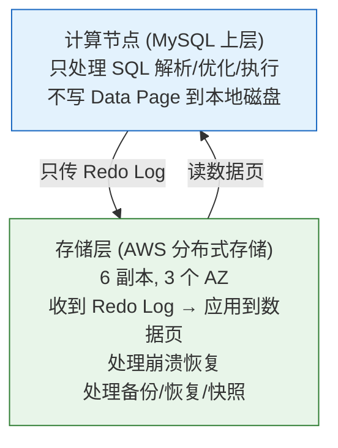

# 历史背景——单机 MySQL 撑不住之后的两条路

2010 年代，当单机 MySQL 的数据量超过 TB、QPS 超过数万时，工程师面临两种抉择：

**路线 A——分库分表（Sharding）**：在业务层把一个大表切成 N 个小表，应用代码感知路由规则。这条路你熟悉——复杂、需要改写 DAO、跨分片 JOIN 基本不可用。

**路线 B——让数据库自己处理分布式**：应用代码不变，数据库内部自动把数据分散到多个节点。这条路是 NewSQL 的理念——Google Spanner（2012）是鼻祖，TiDB（2015）和 CockroachDB（2015）是开源继承者。

Aurora（2014）走了第三条路：**不改 MySQL 的代码模型，而是改 MySQL 的存储架构。** Aurora 复用了 MySQL 的上层（SQL 解析/优化器/执行器），但把底层存储引擎替换成了 AWS 自研的分布式存储系统。对应用来说它就是 MySQL（同样的协议/同样的 SQL），底层怎么存数据是 Aurora 的事。

两条路的核心分歧在于：**TiDB 在 SQL 层做了分布式（应用看到的是一个可以水平扩展的 MySQL），Aurora 在存储层做了分布式（应用看到的是一个"永远不累"的单机 MySQL）。**

---

# 一、TiDB 三层架构——存算分离的 NewSQL 路线

## 1.1 三层分离

```
┌─────────────────────────────────────────────┐
│          TiDB Server（SQL 层，无状态）         │
│  → 接收 MySQL 协议请求                         │
│  → 解析 SQL → 生成分布式执行计划                 │
│  → 把 "SELECT * FROM t WHERE id=1"          │
│    翻译为 "从 TiKV 的 Region 123 找到 key=t_1_1"│
│  → 每个 TiDB 节点是对等的，可以水平扩展            │
└───────────┬──────────┬──────────────────────┘
            │          │
┌───────────┴──┐  ┌────┴───────────────────────┐
│  TiKV Node 1 │  │  TiKV Node 2               │
│  (存储层)     │  │  (存储层)                    │
│              │  │                             │
│  数据按 Range │  │  数据按 Range 分片            │
│  分片为 Region│  │  每个 Region 有 3 个 Raft 副本│
│  基于 Raft   │  │  RocksDB 存实际键值对          │
│  做 HA       │  │                             │
└──────────────┘  └─────────────────────────────┘
            │          │
┌───────────┴──────────┴──────────────────────┐
│          PD（Placement Driver）              │
│  → 元数据管理：哪个 Region 在哪个 Node 上       │
│  → 调度决策：负载不均 → 迁移 Region           │
│  → Timestamp Oracle：分配全局单调递增的时间戳    │
└─────────────────────────────────────────────┘
```

## 1.2 TiKV 的核心设计——Raft + MVCC + RocksDB

**Raft 做数据强一致**：

```
每个 Region（默认 96MB，可配）是一个 Raft Group
  3 个副本分布在 3 个不同的 Node 上
  Leader 处理读写请求（写入走 Raft 日志提交到多数派）
  Follower 被动同步

Node 1 宕机 → PD 检测到心跳超时 → 指挥 Region 的剩余副本选新 Leader
→ 新 Leader 在 Node 2 上 → 客户端自动发现新的 Leader 位置
```

**MVCC 做多版本**：

```
TiKV 在 Key 后拼接 Timestamp 来存储多版本：
  实际存的 Key = "user_123_name" + "@" + timestamp
  读取时 TiDB 传入"快照时间戳" → TiKV 返回 ≤ 该时间戳的最新版本
  
  GC 后台删除旧版本（时间戳早于 safe_point 的版本——safe_point 是"当前所有活跃事务的最小 start_ts"）
```

**Percolator 分布式事务**——不是 2PC，是 Google Percolator 的改进版：

```
场景：转账——从 A 扣 100，给 B 加 100

Percolator 事务流程：
  ① TiDB 从 PD 获取全局时间戳 start_ts = 100
  ② Prewrite（预写）：
     对每行，在 TiKV 上写入锁（lock column）+ 数据（data column）
     锁记录：{key, primary_lock=true, start_ts=100}
     数据记录：{key, value, start_ts=100}
     → TiKV 检查是否有冲突（同一行的最新提交时间戳 > start_ts → 冲突 → 回滚）
  ③ TiDB 从 PD 获取 commit_ts = 105
  ④ Commit（提交）：
     写入 commit 记录（write column）：{key, commit_ts=105, start_ts=100}
     → 这一步只需要在 Primary Key 上判断是否成功
     → 成功 → 所有行算提交；失败 → 回滚
     后台上清理锁

和传统 2PC 的核心差异：
  - 没有集中的 Coordinator——每个事务由 TiDB Server 自己驱动
  - 持久化在数据节点上（TiKV 的 CF_LOCK/CF_WRITE）
  - 只需要 Primary Key 的提交状态来判断事务最终命运
```

---

# 二、Aurora——不改 MySQL 的"神"，改它的"形"

## 2.1 Aurora 的核心创新：只传 Redo Log

```
传统 MySQL 的主从复制：
  Master 提交事务：
    写 Redo Log（InnoDB）→ 写 Binlog（Server 层）→ 写 Data Page（可能异步）
    传 Binlog 给 Slave → Slave 回放 → 数据和 Master 对齐

传统 MySQL 存储计算紧耦合的问题：
  写一个事务 = 在本地磁盘上写 Redo Log + 写 Binlog + 写 Data Page
  → 磁盘满了 → 无法写 → 扩容只能用更大的磁盘/实例
  → 网络传输的是完整的 Data Page（16KB）

Aurora 的核心改变：
  SQL 引擎（计算层）= MySQL 上层（不写 Data Page 到本地磁盘！）
  存储层 = AWS 专门的分布式存储（6 个副本，分布在 3 个 AZ）
  计算层只把 Redo Log 发到存储层！
  → 网络传输从"16KB Data Page"变成"几百字节 Redo Log"→ 降低 10-100 倍
```



**存储层怎么处理 Redo Log？**

```
存储节点收到 Redo Log 后：
  ① 写入 Hot Log Buffer（内存）→ 给计算层回 ACK（提交确认！）
     → 6 个副本中 4 个确认（跨 3 个 AZ，每个 AZ 至少 1 个确认）→ 事务提交
     → 这就是 Aurora 的 Quorum 写入——不需要全部 6 副本都写完

  ② 异步把 Redo Log 组织成数据页的新版本（Page 的"时间点版本链"）
     → 读请求如果需要的页版本还没生成 → 存储层可以"现场生成"
     → 读不需要等所有页都更新好

  ③ 后台把 Redo Log 压缩/归档到 S3（长期存储，用于 PITR，Point-in-Time Recovery）
```

**对比传统 MySQL 的主从复制**：
- 传统 MySQL：Master 传 Binlog（几百字节）→ Slave 上的 SQL Thread 逐条回放 → 慢且可能有延迟
- Aurora：计算层只传 Redo Log → 存储层处理一切 → **计算节点故障 → 秒级切换**（因为新的计算节点只需要接收到原节点的 Redo Log 流即可恢复）

## 2.2 TiDB vs Aurora——设计哲学的分歧

| | TiDB | Aurora |
|------|------|--------|
| **对应用来说** | 兼容 MySQL 协议，但底层是 KV 存储 | **就是** MySQL（同样的引擎，只是存储层被替换了） |
| **分布式方式** | SQL 层水平扩展（TiDB Server 多副本） | **SQL 层是单机**（一个 Aurora 实例 = 一个 MySQL，不能写多副本） |
| **写扩展** | 多 Region 多 Leader 并行写 | 只能写一个 Primary 节点 |
| **读扩展** | 所有 TiKV 节点可读 | 最多 15 个 Read Replica |
| **存储** | TiKV + RocksDB（Raft 管理 3 副本） | AWS 分布式存储（6 副本跨 3 个 AZ） |
| **一致性** | Raft 多数派 + MVCC + Percolator 事务 | Quorum 写入 + Redo Log 恢复 |
| **运维复杂度** | 中高（三层组件 + 需要调优 Region/GC/Raft） | **低**（AWS 完全托管，不可见内部细节） |
| **水平扩展** | **能**（加节点即可 → 数据自动 rebalance） | **不能**（只能升配实例规格或加 Read Replica） |
| **适用数据量** | TB-PB（能水平扩展） | TB（单实例限制，依靠存储层自动扩展） |

**选型核心判断**：

```
你的数据量能超过单机 MySQL 的存储上限吗？
  → 是 → TiDB（或 CockroachDB）
  → 否 → 你需要分布式事务而不仅仅是存储扩展？
          → 是 → TiDB
          → 否 → Aurora（更简单、兼容性更好）
```

---

# 三、总结

| 概念 | TiDB | Aurora |
|------|------|--------|
| **路线** | NewSQL——重新实现一个水平扩展的 MySQL | 云原生——改造 MySQL 的存储架构 |
| **SQL 层** | TiDB Server，可水平扩展 | MySQL 引擎，单机 |
| **存储层** | TiKV + RocksDB + Raft | AWS 分布式存储 + Quorum |
| **水平扩展** | 能 | 不能 |
| **运维复杂度** | 中高 | 低（托管服务） |
| **核心创新** | Percolator 事务 + Raft 强一致 | 只传 Redo Log——网络传输降低 10-100 倍 |

# 延伸阅读

**Do——动手验证：**
- 用 TiDB Playground（`tiup playground`）一键启动本地 TiDB 集群，`mysql -P 4000` 直接连上用
- 在 Aurora 控制台看 Writer 节点的 Redo Log 吞吐量（CloudWatch 指标 `VolumeWriteIOPS`）
- 对比 TiDB 的 `ANALYZE TABLE` 和 MySQL 的统计信息更新的差异

**Todo——深入方向：**
- TiFlash——TiDB 的列存储引擎，HTAP 场景下 OLTP→OLAP 数据同步
- CockroachDB vs TiDB——同源的 Spanner 继承者，设计差异（CockroachDB 用 Range Lease 而非 Raft Leader 做读服务）
- Spanner 的 TrueTime——Google 如何用原子钟+GPS 做全球分布式事务的提交时间戳

*本文参考资料：*
- TiDB 官方文档: Architecture / TiKV
- AWS Aurora 论文: "Amazon Aurora: Design Considerations for High Throughput Cloud-Native Relational Databases" (SIGMOD 2017)
- Google Spanner 论文: "Spanner: Google's Globally-Distributed Database" (OSDI 2012)
