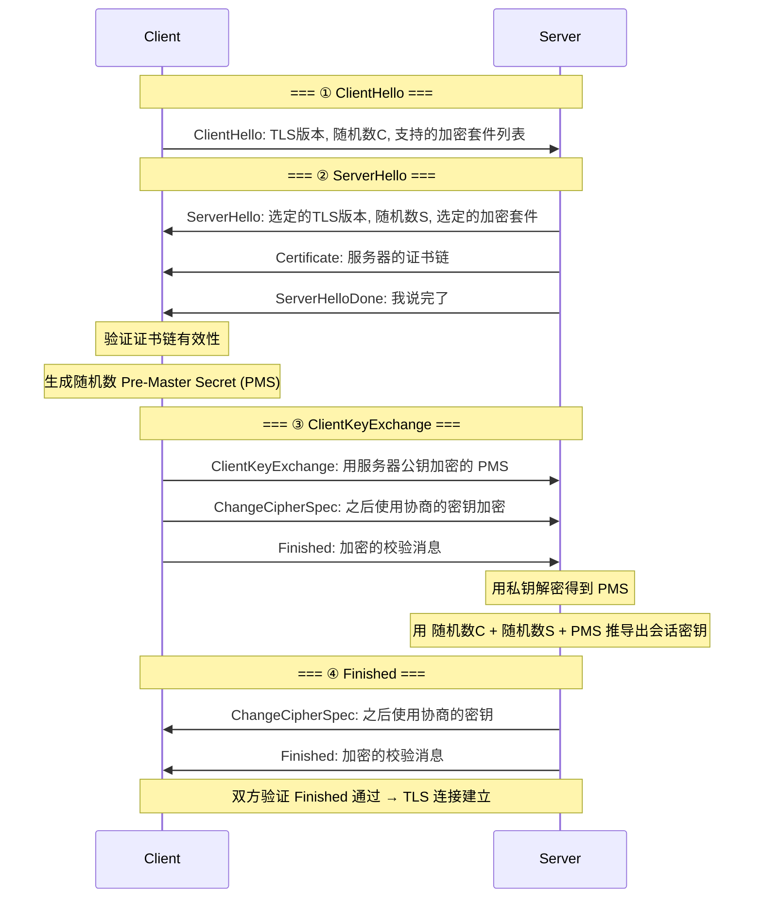

# 历史背景——从 Plain HTTP 到 HTTPS Everywhere

1994 年，Netscape 发明了 SSL（Secure Sockets Layer）。当时互联网的威胁模型还很简单——主要是防止信用卡号在传输中被窃听。SSL 1.0 从未公开发布（因为漏洞太多），SSL 2.0（1995）是第一个公开发行的版本。但它的安全性仍然堪忧，SSL 3.0（1996）做了彻底重写。1999 年，IETF 接管了 SSL 并将其改名为 TLS 1.0。

**HTTPS = HTTP over TLS**。这个公式看着简单，但 TLS 的握手是 HTTPS 最复杂的部分——它涉及非对称加密协商对称密钥、证书链验证、数字签名确认身份。2014 年 Google 宣布 HTTPS 作为搜索排名信号，2018 年 Chrome 标记所有 HTTP 网站为"不安全"，到今天 HTTPS 已成为互联网的默认。

---

# 一、TLS 在 TCP/IP 协议栈中的位置

```
┌───────────────┐
│    HTTP       │ ← 应用层
├───────┬───────┤
│  TLS  │       │ ← 安全传输层（在 TCP 之上，HTTP 之下）
├───────┴───────┤
│     TCP       │ ← 传输层
├───────────────┤
│     IP        │ ← 网络层
└───────────────┘
```

---

# 二、TLS 1.2 四次握手——一步一步拆解



**关键的密钥推导**：
```
会话密钥 = PRF(
    MasterSecret,
    "key expansion",
    server_random + client_random
)

MasterSecret = PRF(
    PreMasterSecret,
    "master secret",
    client_random + server_random
)
```

**为什么需要三个随机数？** Client Random + Server Random + Pre-Master Secret ——这样即使 Pre-Master Secret 不够随机（某些伪随机数生成器不好），三者的组合也保证了最终密钥的不可预测性。

---

# 三、TLS 1.3——"去掉不必要的握手步骤"

TLS 1.3（RFC 8446, 2018）对握手做了大手术：

## 3.1 1-RTT 握手

```
TLS 1.2: 2-RTT (ClientHello → ServerHello + KeyExchange → CC + Finished)
TLS 1.3: 1-RTT (ClientHello → ServerHello(含密钥交换) → Finished)

为什么快了一轮？
  ① 去掉 RSA 密钥交换 → 只用 ECDHE（椭圆曲线 Diffie-Hellman）
     → ClientHello 中直接携带 DH 公钥
  ② ServerHello 中服务器立即回复 DH 公钥 + 证书
     → 这轮结束后双方已经可以推导出共享密钥
  ③ 去掉 ChangeCipherSpec（冗余——Finished 已经暗示切换）
```

## 3.2 0-RTT 恢复

```
如果客户端之前与服务器建立过 TLS 1.3 连接：
  ① ClientHello 中携带 "pre_shared_key" 扩展（之前保存的 PSK）
  ② ClientHello 之后立刻发送应用数据（HTTP 请求）——0-RTT！

代价：0-RTT 数据不防重放攻击
  → 攻击者截获 0-RTT 请求可以直接重放
  → 解决：服务器只在幂等操作（GET）上接受 0-RTT 数据
```

## 3.3 TLS 1.2 vs 1.3 对比

| | TLS 1.2 | TLS 1.3 |
|------|---------|---------|
| **握手 RTT** | 2-RTT | 1-RTT（首次）/ 0-RTT（重连） |
| **密钥交换** | RSA / ECDHE | 只支持 ECDHE（前向安全性） |
| **加密套件** | 上百种组合 | 5 种（砍掉不安全算法） |
| **SNI 加密** | ❌ 明文 | ✅ ESNI/ECH |

---

# 四、证书链——"你怎么证明你是 google.com？"

## 4.1 证书链的三层结构

```
Root CA (自签名，预装在操作系统/浏览器中)
  └── Intermediate CA (由 Root CA 签发)
        └── Server Certificate (由 Intermediate CA 签发)
              └── Subject: www.example.com
              └── Public Key: ...
              └── Validity: 2026-01-01 ~ 2027-01-01
```

**为什么有三层（不是两层）？** Root CA 的私钥是最危险的——它被物理隔离在离线环境中。Intermediate CA 代表 Root CA 日常签发证书。如果 Intermediate CA 被攻破，Root CA 可以吊销它以保护生态。

## 4.2 验证过程

```
浏览器验证证书链：
  ① 检查 Server Cert 的签名是否可以用 Intermediate CA 的公钥验证
  ② 检查 Intermediate CA 的签名是否可以用 Root CA 的公钥验证
  ③ 检查证书是否在有效期内
  ④ 检查 CN/SAN 是否匹配当前域名
  ⑤ 检查证书吊销状态（OCSP / CRL）
  ⑥ 全部通过 → 信任
```

```bash
# 查看一个网站的证书链
openssl s_client -connect www.google.com:443 -showcerts | grep -E "subject|issuer"
```

---

# 五、常见攻击与防御

## 5.1 中间人攻击

```
攻击者截获 Client → Server 的通信：
  Client ←→ 攻击者（伪装成 Server，与 Client 建连）
  攻击者 ←→ Server（伪装成 Client，与 Server 建连）
  攻击者看到并可以修改所有明文数据

HTTPS 防御：
  → 攻击者的证书无法通过验证（它没有 Server 的私钥签名）
  → 浏览器显示证书错误
  → 但 HTTP 完全没有这个保护！
```

## 5.2 SSL 剥离攻击

```
用户第一次输入 example.com（不是 https://）
  → 攻击者拦截 → 与用户建立 HTTP 连接
  → 攻击者与 Server 建立 HTTPS 连接
  → 用户看到的是 HTTP 页面，SSL 被"剥离"

防御：HSTS (HTTP Strict Transport Security)
  Strict-Transport-Security: max-age=31536000; includeSubDomains
  → 浏览器记录"这个域名以后全走 HTTPS"
  → 下次即使用户输入 http://example.com，浏览器自动升级为 https://
```

---

# 六、总结

| 机制 | 解决的问题 | 代价 |
|------|---------|------|
| **TLS 握手** | 协商共享密钥 | 多 1-2 次 RTT |
| **证书链** | 证明"你真是你" | 证书到期续费、三级验证 |
| **HSTS** | 防 SSL 剥离 | 首次访问仍可能被剥离（需要 preload） |
| **SNI 加密** | 防中间人看到你访问哪个网站 | 仅 TLS 1.3 ECH 支持 |

# 延伸阅读

**Do——动手验证：**
- `openssl s_client -connect example.com:443 -tls1_2` 用 TLS 1.2 连接并观察握手步骤
- 用 Wireshark 抓 TLS 握手包，过滤 `ssl.handshake.type`，逐帧对比 ClientHello → ServerHello → Certificate → Finished
- 用 `curl -v https://example.com` 观察 TLS 版本协商和证书链

**Todo——深入方向：**
- 前向安全性——为什么 ECDHE 比 RSA 更安全（私钥泄漏也不会解密历史流量）
- OCSP Stapling——服务器主动缓存 OCSP 响应，省掉客户端的 OCSP 查询
- 证书透明化（Certificate Transparency）——Google 如何防止 CA 恶意签发证书

*本文参考资料：*
- RFC 8446: TLS 1.3
- RFC 5246: TLS 1.2
- HSTS: RFC 6797
- Let's Encrypt: How It Works
