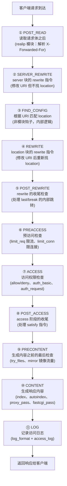

# 历史背景——Nginx 为什么要切 11 个阶段？

Nginx 被设计为"模块驱动"的架构。所有功能（rewrite、access、gzip、proxy、fastcgi……）都以模块形式插入，核心引擎只负责按顺序调度这些模块。但模块们不是随便挂在任何地方的——它们有严格的执行顺序要求。

例如：**rewrite 必须在 access 之前执行**（因为你先要知道"请求的实际 URL 是什么"，再做权限检查）。**access 必须在 content 之前执行**（因为你要先验证权限，再决定返回什么内容）。Nginx 把 HTTP 处理流水线切成了 11 个阶段：每个阶段只允许特定类型的模块挂钩，模块不能跨阶段执行。这样就保证了无论谁来写模块，执行顺序绝不会乱。

理解这 11 个阶段，你就能回答那些折磨人的 Nginx 问题：

- 为什么 `if` 不能用在 `location` 中的 `proxy_pass` 之前？
- `rewrite ... last` 和 `rewrite ... break` 的区别到底在哪里？
- `deny` 和 `return 403` 哪个更正确？

---

# 一、11 阶段全景图



**一个请求可以跳过某些阶段，但顺序不会改变**。比如静态文件请求不需要 `REWRITE`，但它仍会经过这 11 个阶段——只是某些阶段没有注册的 handler，直接跳过。

---

# 二、阶段详解

## 2.1 POST_READ——第一个阶段，修改"客户端看起来是谁"

**时机**：Nginx 读完 HTTP 请求头之后，处理请求体之前。

**用途**：唯一注册在这个阶段的模块是 `ngx_http_realip_module`——它从 `X-Forwarded-For` 或 `X-Real-IP` 头部获取客户端真实 IP，替换 `$remote_addr`。

```nginx
# 场景：Nginx 前面还有一层 SLB/CDN，客户端真实 IP 在 X-Forwarded-For 中
set_real_ip_from 10.0.0.0/8;      # 信任来自哪些代理的真实 IP 头部
real_ip_header X-Forwarded-For;    # 从哪个头部解析
real_ip_recursive on;              # 递归解析（多级代理场景）
```

**为什么必须在第一个阶段？** 因为后续所有阶段（access 的 IP 白名单、limit_req 的 per-IP 限流、access_log 的 `$remote_addr`）都依赖正确的客户端 IP。

## 2.2 SERVER_REWRITE——server 级别的 URL 改写

**时机**：POST_READ 之后，但还没决定用哪个 location。

**用途**：`server { }` 块内的 `rewrite` 指令在这里执行。它在 location 匹配**之前**修改 URI，所以改完后的 URI 可以进入不同的 location。

```nginx
server {
    listen 80;
    
    # SERVER_REWRITE 阶段执行
    rewrite ^/old-api/(.*)$ /new-api/$1 permanent;  # 301 永久重定向
    
    location /new-api/ {
        proxy_pass http://backend;
    }
}
```

**关键区别**：`rewrite ... permanent`（301）直接返回给客户端（不执行后续阶段）。`rewrite ... last`（server 级别）会跳到 FIND_CONFIG 重新匹配 location。这两种行为完全不同。

## 2.3 FIND_CONFIG——内部阶段，匹配 location

这不是一个模块可注册的阶段。它是 Nginx 内部的 hard-coded 逻辑：**拿着当前的 URI，去 server 块的所有 location 规则中匹配**。

```nginx
location = /exact-match     { }   # ① 精确匹配（=）
location ^~ /prefix/        { }   # ② 前缀匹配（^~），匹配后停止搜索
location ~ \.php$           { }   # ③ 正则匹配（~ / ~*）
location /prefix/           { }   # ④ 普通前缀匹配（最长优先）
```

Nginx 对 URI 的查找顺序并非"从上到下"，而是：
1. 先跑所有前缀匹配（记下最长匹配）
2. 如果最长匹配是 `=` 精确匹配 → 直接选中
3. 否则如果最长匹配是 `^~` 优先前缀 → 直接选中
4. 否则按书写顺序逐个跑正则匹配 → 第一个匹配的正则被选中
5. 没有任何正则匹配 → 回退到第 1 步的最长前缀匹配

**这段逻辑不在任何模块的代码中**——它是 Nginx Core 内置的 location 匹配算法，发生在 `FIND_CONFIG` 阶段。

## 2.4 REWRITE——location 级别的 URL 改写

**时机**：location 已经被选定之后。

**用途**：`location { }` 块内的 `rewrite` 指令在这里执行。如果你在 location 内执行了 `rewrite`，修改后的 URI 会触发**新一轮的 FIND_CONFIG**（等于重新走一次 ②+③+④ 阶段）。

```nginx
location /app/ {
    rewrite ^/app/(.*)$ /new-app/$1 last;  # last = 重新走 FIND_CONFIG
    proxy_pass http://backend;
}
```

**last vs break 的区别**：

```nginx
# last：执行完这条 rewrite 后，跳到阶段② 重新开始（用修改后的 URI）
rewrite ^/old/(.*)$ /new/$1 last;  # → 跳到 FIND_CONFIG，重新匹配 location

# break：执行完这条 rewrite 后，停止 rewrite，继续当前阶段的后续指令
rewrite ^/old/(.*)$ /new/$1 break; # → 不跳，继续执行同一个 location 中的后续指令
```

**常见的困惑**：在 `if` 块中使用 `rewrite` 时，`last` 和 `break` 的行为可能不符合直觉。原因是 `if` 在 Nginx 中是"配置块嵌套"——`if` 内的 `rewrite` 会创建新的 location 上下文。

## 2.5 POST_REWRITE——rewrite 的收尾检查

这个阶段也是 Nginx 内部逻辑，不是模块钩子。它检查：刚才在阶段 ④ 有没有执行过 `rewrite ... last`？有 → 跳过 ⑤，直接回到 ②（重新找 location）。没执行 → 正常进入阶段 ⑥。

**这也解释了为什么无限 `rewrite` 循环会被 Nginx 检测到**：Nginx 记录重写次数，超过 `rewrite_log` 内设的上限（默认 10 次）→ 返回 500 Internal Server Error。

## 2.6 PREACCESS——限流的第一道防线

**时机**：权限检查之前，先做"频率控制"。

**注册在这里的模块**：
- `ngx_http_limit_req_module`（`limit_req`：请求频率限制——漏桶算法）
- `ngx_http_limit_conn_module`（`limit_conn`：并发连接数限制）

```nginx
http {
    # 定义一个限流区域：按客户端 IP，速率 10r/s
    limit_req_zone $binary_remote_addr zone=api_limit:10m rate=10r/s;
    
    server {
        location /api/ {
            # PREACCESS 阶段执行
            limit_req zone=api_limit burst=20 nodelay;
            proxy_pass http://backend;
        }
    }
}
```

**为什么限流在 access 之前？** 因为如果你先验证了用户的 JWT Token 或做了复杂的鉴权，然后才发现这个 IP 应该被限流——那这个 IP 已经消耗了你的鉴权资源。限流必须"在最前面、代价最小的阶段"就拦掉。

## 2.7 ACCESS——权限检查

**时机**：已经确认请求没有被限流拦住，现在检查"你能不能访问这个资源"。

**注册在这里的模块**：
- `ngx_http_access_module`（`allow` / `deny`：IP 黑白名单）
- `ngx_http_auth_basic_module`（`auth_basic`：HTTP Basic 认证）
- `ngx_http_auth_request_module`（`auth_request`：子请求到后端鉴权）

```nginx
location /admin/ {
    # ACCESS 阶段：IP 限制
    allow 10.0.0.0/8;
    deny all;
    
    # ACCESS 阶段：子请求鉴权
    auth_request /auth;
    
    proxy_pass http://backend;
}

location = /auth {
    internal;
    proxy_pass http://auth-service/verify;
    proxy_pass_request_body off;
    proxy_set_header Content-Length "";
}
```

**`satisfy` 指令的控制**：

```nginx
# satisfy all（默认）：IP 限制 AND 认证 都要通过
satisfy all;
allow 10.0.0.0/8;
deny all;
auth_basic "Restricted";

# satisfy any：IP 限制 OR 认证 有一个通过就行
satisfy any;
allow 10.0.0.0/8;     # 内网直接放行
deny all;
auth_basic "Restricted";  # 外网需要密码
```

## 2.8 POST_ACCESS——access 阶段的收尾

也是 Nginx 内部逻辑。它处理 `satisfy` 指令的结果：`satisfy all` 但其中一个 access 模块拒绝了 → 返回 403 Forbidden。`satisfy any` 且有一个通过了 → 继续后续阶段。

## 2.9 PRECONTENT——内容生成之前的最后一关

**注册在这里的模块**：

- `try_files`：按顺序检查文件是否存在，存在就返回，不存在继续
- `ngx_http_mirror_module`（`mirror`：镜像流量，不影响主请求）

```nginx
location / {
    # PRECONTENT 阶段：
    # 1. 先检查 $uri 对应的文件是否存在
    # 2. 不存在 → 检查 $uri/index.html
    # 3. 不存在 → 交给 index.php（进入 CONTENT 阶段）
    try_files $uri $uri/ /index.php?$query_string;
}
```

**为什么 try_files 不能在所有阶段执行？** 因为它做着"如果找不到文件就内部重定向"的操作——这个重定向发生在 PRECONTENT 和 CONTENT 之间，是在决定"谁来生成内容"之前的最后一步。

## 2.10 CONTENT——真正生成内容

**这是最核心的阶段**。只有**一个**模块会在这个阶段被执行——Nginx 会找到第一个在 CONTENT 阶段注册的模块，执行它，其他模块跳过。

**注册在这里的模块**：
- `ngx_http_index_module`（`index`）
- `ngx_http_autoindex_module`（`autoindex`：目录列表）
- `ngx_http_static_module`（静态文件服务）
- `ngx_http_proxy_module`（`proxy_pass`：反向代理）
- `ngx_http_fastcgi_module`（`fastcgi_pass`：FastCGI）
- `ngx_http_uwsgi_module`（`uwsgi_pass`）

```nginx
location / {
    index index.html;        # CONTENT 阶段 handler
    proxy_pass http://app;   # CONTENT 阶段 handler（优先级更高）
    # 只有一个会被执行！
}
```

**为什么说"只有一个 content handler 被执行"？** 因为上面每个模块都在 CONTENT 阶段注册了不同的 handler——`ngx_http_index_handler`、`ngx_http_proxy_handler` 等。Nginx 在阶段 ⑩ 按顺序查找第一个已注册的 handler，找到就执行，结束 CONTENT 阶段。这保证了一个请求只有一个"回答者"。

## 2.11 LOG——记录访问日志

每个请求的最后阶段。`access_log` 和 `log_format` 注册的变量在这里被填充并写入日志文件。

```nginx
http {
    log_format main '$remote_addr - $remote_user [$time_local] '
                    '"$request" $status $body_bytes_sent '
                    '"$http_referer" "$http_user_agent" '
                    '$request_time $upstream_response_time';
    
    server {
        access_log /var/log/nginx/access.log main;  # LOG 阶段写入
    }
}
```

---

# 三、完整的请求处理流程

```
客户端 → Nginx

① POST_READ       realip 模块解析 X-Forwarded-For
② SERVER_REWRITE  server 块的 rewrite
③ FIND_CONFIG     根据新 URI 重新匹配 location
④ REWRITE         location 块的 rewrite
⑤ POST_REWRITE    如果执行了 rewrite...last → 跳回 ③
⑥ PREACCESS       limit_req → limit_conn（限流检查）
⑦ ACCESS          allow/deny → auth_basic → auth_request（权限）
⑧ POST_ACCESS     satisfy 指令判断
⑨ PRECONTENT      try_files → mirror（预处理）
⑩ CONTENT         生成响应（index/static/proxy_pass/fastcgi_pass）
⑪ LOG             写入 access_log

返回响应给客户端
```

---

# 四、两个经典排错场景

## 4.1 为什么 `rewrite` 没生效？

```nginx
# ❌ 错误：rewrite 在 proxy_pass 后面，不会被执行
location /api/ {
    proxy_pass http://backend;       # CONTENT 阶段执行
    rewrite ^/api/(.*)$ /new/$1 last; # REWRITE 阶段（在 CONTENT 之前，不会被跳过后执行）
}
# Nginx 不会"因为你在 proxy_pass 后面写了 rewrite 就不执行它"，
# rewrite 在阶段④一定会跑到，proxy_pass 在阶段⑩才执行。
# 所以上面这个配置中，rewrite 是有效的。但要注意：proxy_pass 用的是改写后的 URI。

# ✅ 正确配置
location /api/ {
    rewrite ^/api/(.*)$ /new/$1 break;
    proxy_pass http://backend;
}
```

## 4.2 为什么 `if` 中的 `proxy_pass` 不安全？

```nginx
# ❌ 经典错误："if is evil"
location /api/ {
    if ($arg_token = "") {
        return 403;  # if 中的 return 属于 REWRITE 阶段的 rewrite
    }
    proxy_pass http://backend;
}
# 这个配置本身没有 Bug。但如果你在 if 里写 proxy_pass：
# if ($condition) { proxy_pass http://backend1; }
# proxy_pass http://backend2;
# → 两个 proxy_pass 在不同的"配置上下文"中，
# → 只有第一个会被注册到 CONTENT 阶段
# → 如果 $condition 不满足，Nginx 卡在 CONTENT 阶段：没有 handler → 返回 500

# ✅ 替代方案：用 map + 变量
map $arg_token $backend {
    ""     "http://auth-fail";
    default "http://backend";
}
location /api/ {
    proxy_pass $backend;  # 变量驱动的 proxy_pass
}
```

---

# 五、总结

| 阶段 | 关键模块 | 问题诊断 |
|------|---------|---------|
| ① POST_READ | realip | 客户端真实 IP 错 → 查 X-Forwarded-For 解析 |
| ② SERVER_REWRITE | rewrite (server 级别) | server 级 rewrite 是否影响 location 匹配? |
| ③ FIND_CONFIG | (内置) | URI 改完后匹配的是哪个 location? |
| ④ REWRITE | rewrite (location 级别) | last vs break 的行为差异? |
| ⑤ POST_REWRITE | (内置) | rewrite 循环检测? |
| ⑥ PREACCESS | limit_req, limit_conn | 限流是否生效? |
| ⑦ ACCESS | allow/deny, auth_basic, auth_request | 403/401 是哪个 access 模块拒绝的? |
| ⑧ POST_ACCESS | (内置) | satisfy 策略是否正确? |
| ⑨ PRECONTENT | try_files, mirror | 内部重定向后到了哪个 location? |
| ⑩ CONTENT | proxy_pass, fastcgi_pass, index, static | 请求最终谁处理了? |
| ⑪ LOG | access_log | 日志格式中会记录"这个请求经过了哪些阶段"? (不会) |

# 延伸阅读

**Do——动手验证：**
- 开启 Nginx debug 日志（`error_log /var/log/nginx/debug.log debug;`）发一个请求，观察 11 个阶段的顺序
- 测试 `rewrite ... last` 的循环检测：写一个无限重定向的 rewrite，观察 Nginx 的 500 错误
- 在 access 阶段同时配置 `deny` 和 `auth_basic`，用 `satisfy any` 验证"内网不输密码，外网必须输密码"

**Todo——深入方向：**
- Nginx 模块开发——如何在特定阶段注册自己的 handler（基于 `ngx_http_handler_pt` 的源码分析）
- `auth_request` 子请求的实现原理——Nginx 如何处理"在 access 阶段暂停主请求，发起子请求鉴权"的内部逻辑
- Nginx Plus 的动态模块加载与 OpenResty 的 `*_by_lua` 阶段——第三方如何扩展这 11 个阶段

*本文参考资料：*
- Nginx 官方文档: Development Guide (HTTP Phases)
- Nginx 源码 `src/http/ngx_http_core_module.c` —— `ngx_http_core_phase` 枚举
- Igor Sysoev, "Nginx: Architecture of an Open Source HTTP Server"
- OpenResty 官方文档: `*_by_lua` phases 覆盖图
