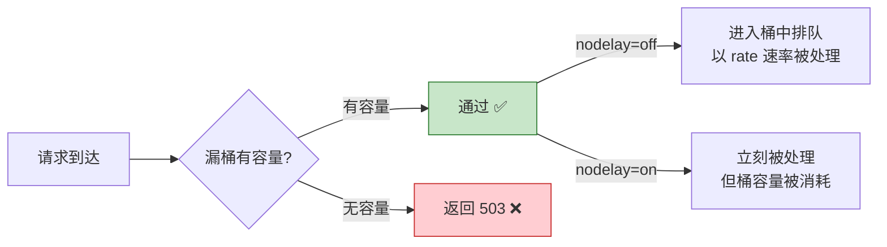

# 历史背景——Nginx 为什么需要安全层？

Nginx 最初被设计为一个高性能 Web Server，安全不是它的核心命题。但现实是——Nginx 往往部署在整个系统的最前面，直面公网流量。CC 攻击、暴力破解、扫描探测、SQL 注入——这些威胁的第一个接收者就是 Nginx。

社区的回应是两层的：**第一层是 Nginx 内置的限流和访问控制指令（limit_req、limit_conn、allow/deny）**，解决"频率类攻击"和"基础访问控制"；**第二层是第三方 WAF 模块（ModSecurity、OpenResty + 自定义 Lua 规则）**，解决"内容类攻击"（SQL 注入、XSS、命令注入）。

这篇文章覆盖这两层的完整配置，从一条 `limit_req` 的漏桶参数到 ModSecurity 的 OWASP 核心规则集。

---

# 一、limit_req——漏桶限流，高并发下的第一道防线

## 1.1 基础配置

```nginx
http {
    # 定义限流区域（10MB 的共享内存，按客户端 IP 统计，速率 10r/s）
    limit_req_zone $binary_remote_addr zone=api_limit:10m rate=10r/s;
    
    server {
        location /api/ {
            # 基础用法：严格限流，超过 rate 立刻返回 503
            limit_req zone=api_limit;
            proxy_pass http://backend;
        }
    }
}
```

## 1.2 burst + nodelay——漏桶的两种溢出处理

`limit_req` 底层是一个**漏桶算法**。`rate` 控制出水速率，`burst` 控制桶的大小。

```nginx
# 模式 1：无 burst（严格限流）
limit_req zone=api_limit;
# rate=10r/s，所有超过 10r/s 的请求立刻返回 503

# 模式 2：有 burst，无 nodelay（排队 + 平滑）
limit_req zone=api_limit burst=20;
# rate=10r/s，桶容量 20，超过 10r/s 的前 20 个请求进桶排队
# 排在桶里的请求以 rate 速率被处理（平滑出桶）
# 桶满后多余的请求返回 503

# 模式 3：burst + nodelay（允许突发，不排队）
limit_req zone=api_limit burst=20 nodelay;
# rate=10r/s，桶容量 20，前 20 个超额的请求立刻被接受（不排队）
# 但桶里的令牌以 rate 速率恢复（= 通过量最终仍受 rate 限制）
# 桶满后多余的请求返回 503
```



## 1.3 不同粒度的限流

```nginx
http {
    # 基于 IP 的限流（最常用）
    limit_req_zone $binary_remote_addr zone=per_ip:10m rate=10r/s;
    
    # 基于请求 URI 的限流（针对特定 API 的精细控制）
    limit_req_zone $request_uri zone=per_api:10m rate=50r/s;
    
    # 基于用户 ID 的限流（需要后端把用户 ID 放在特定头部）
    limit_req_zone $http_x_user_id zone=per_user:10m rate=5r/m;
    
    server {
        location /api/ {
            # 三层限流叠加
            limit_req zone=per_ip burst=20 nodelay;    # 每 IP
            limit_req zone=per_api burst=100 nodelay;  # 每 API
            proxy_pass http://backend;
        }
    }
}
```

## 1.4 limit_req 的日志与调试

```nginx
http {
    limit_req_zone $binary_remote_addr zone=api_limit:10m rate=10r/s;
    limit_req_status 429;  # 被限流时返回 429 Too Many Requests（代替默认的 503）
    
    server {
        location /api/ {
            limit_req zone=api_limit burst=20 nodelay;
            proxy_pass http://backend;
        }
        
        # 自定义 429 响应
        error_page 429 = @rate_limited;
        location @rate_limited {
            default_type application/json;
            return 429 '{"error":"rate_limited","retry_after":1}';
        }
    }
}
```

**`$binary_remote_addr` vs `$remote_addr`**：前者是 4 字节（IPv4）或 16 字节（IPv6）的二进制形式，后者是字符串（7-15 字节）。用 `$binary_remote_addr` 可以节省共享内存——10MB 用 `$remote_addr` 能存约 10 万条，用 `$binary_remote_addr` 能存约 16 万条。

---

# 二、limit_conn——限制并发连接数

`limit_req` 管的是"速率"（请求有多少频繁），`limit_conn` 管的是"并发度"（同时有多少请求在处理）。

```nginx
http {
    # 定义一个连接数区域
    limit_conn_zone $binary_remote_addr zone=conn_per_ip:10m;
    
    server {
        location /api/ {
            limit_conn conn_per_ip 10;  # 每 IP 最多 10 个并发连接
            proxy_pass http://backend;
        }
        
        # 下载/流媒体接口——限制更低（防止单用户占满带宽）
        location /download/ {
            limit_conn conn_per_ip 1;   # 每 IP 只能 1 个下载连接
            limit_rate 500k;            # 每个连接限速 500KB/s
            proxy_pass http://backend;
        }
    }
}
```

**`limit_conn` 与 `limit_req` 的配合**——它们作用在不同的 Nginx 阶段，不会互相干扰：

```nginx
location /api/ {
    limit_req zone=api_limit burst=20 nodelay;  # 速率限制（PREACCESS 阶段）
    limit_conn conn_per_ip 10;                   # 连接限制（PREACCESS 阶段）
    proxy_pass http://backend;                   # 核心处理（CONTENT 阶段）
}
```

---

# 三、IP 黑白名单与访问控制

## 3.1 allow / deny——静态 IP 控制

```nginx
location /admin/ {
    allow 10.0.0.0/8;
    allow 172.16.0.0/12;
    deny all;  # 其余全部拒绝
    proxy_pass http://backend;
}
```

`deny all` 必须写在最后——Nginx 按顺序匹配，第一个命中的生效。

## 3.2 geo——基于 IP 地理位置的动态控制

```nginx
http {
    geo $is_internal {
        default 0;
        10.0.0.0/8 1;
        172.16.0.0/12 1;
    }
    
    server {
        location /admin/ {
            if ($is_internal = 0) {
                return 403;
            }
            proxy_pass http://backend;
        }
    }
}
```

## 3.3 auth_request——子请求鉴权

```nginx
location /private/ {
    auth_request /auth;
    auth_request_set $auth_status $upstream_status;
    proxy_pass http://backend;
}

location = /auth {
    internal;  # 只能由 Nginx 内部子请求访问，不暴露给外部
    proxy_pass http://auth-service/verify;
    proxy_pass_request_body off;
    proxy_set_header Content-Length "";
    proxy_set_header X-Original-URI $request_uri;
    proxy_set_header X-Forwarded-For $proxy_add_x_forwarded_for;
}

# auth-service 返回 200 → 允许访问
# auth-service 返回 401 → Nginx 返回 401 给客户端
# auth-service 返回 403 → Nginx 返回 403
```

**子请求鉴权的强大之处**：Nginx 在 ACCESS 阶段发起一个内部子请求到独立的后端鉴权服务——鉴权通过才进入 CONTENT 阶段。后端不需要用任何语言框架修改，鉴权逻辑单独部署、独立扩展。

---

# 四、WAF——Web 应用防火墙

## 4.1 ModSecurity——最广泛使用的 WAF 引擎

ModSecurity 是 Trustwave SpiderLabs 维护的开源 WAF。它作为 Nginx 动态模块加载，拦截 HTTP 请求/响应并检测攻击模式：

```bash
# 安装 ModSecurity + Nginx connector（Ubuntu/Debian 示例）
apt-get install libmodsecurity3 libmodsecurity-dev
# 下载并编译 ModSecurity-nginx connector
# --add-dynamic-module=/path/to/ModSecurity-nginx
```

```nginx
# nginx.conf
load_module modules/ngx_http_modsecurity_module.so;

http {
    modsecurity on;
    modsecurity_rules_file /etc/nginx/modsecurity/main.conf;
    
    server {
        location / {
            # ModSecurity 在 PREACCESS 阶段介入
            proxy_pass http://backend;
        }
    }
}
```

```conf
# /etc/nginx/modsecurity/main.conf
SecRuleEngine On
SecRequestBodyAccess On
SecResponseBodyAccess On

# 加载 OWASP 核心规则集（CRS）——覆盖 SQL 注入、XSS、命令注入等
Include /etc/nginx/modsecurity/crs-setup.conf
Include /etc/nginx/modsecurity/rules/*.conf
```

**ModSecurity 的处理阶段**：它在 Nginx 的 PREACCESS 和 LOG 阶段之间介入——在请求到达后端之前检测攻击，在响应返回客户端之前检测信息泄露。

## 4.2 轻量替代——OpenResty + Lua 自定义规则

如果你的攻击面很窄（只需要防特定模式的 SQL 注入或参数校验），可以用 OpenResty 写 Lua 规则，比 ModSecurity 轻量得多：

```nginx
# OpenResty (基于 Nginx + LuaJIT)
location /api/ {
    # 用 Lua 在 access 阶段做参数校验
    access_by_lua_block {
        -- 简单规则：请求参数中不能出现 SQL 关键字
        local args = ngx.req.get_uri_args()
        for k, v in pairs(args) do
            if string.match(v, "select.*from") or 
               string.match(v, "union.*select") then
                ngx.exit(403)
            end
        end
    }
    proxy_pass http://backend;
}
```

## 4.3 与外部 WAF/安全网关的配合

```nginx
# 如果前面有 WAF 设备/CDN，Nginx 只需做第二层兜底
location /api/ {
    # 限制请求体大小（防止大 POST 攻击）
    client_max_body_size 10m;
    
    # 限制请求头大小（防止头部溢出攻击）
    client_header_buffer_size 1k;
    large_client_header_buffers 4 8k;
    
    # 屏蔽可疑的 User-Agent
    if ($http_user_agent ~* (scrapy|curl|wget|python-requests)) {
        return 403;
    }
    
    proxy_pass http://backend;
}
```

---

# 五、完整的安全配置

```nginx
http {
    # === 基础安全 ===
    server_tokens off;                     # 不暴露 Nginx 版本
    server_names_hash_bucket_size 64;
    client_max_body_size 10m;              # 请求体上限（防大 POST 攻击）
    client_header_buffer_size 1k;          # 请求头缓冲
    large_client_header_buffers 4 8k;      # 大请求头缓冲
    
    # === 限流 ===
    limit_req_zone $binary_remote_addr zone=api_limit:10m rate=10r/s;
    limit_req_zone $request_uri zone=login_limit:10m rate=5r/m;  # 登录每分钟 5 次
    limit_conn_zone $binary_remote_addr zone=conn_per_ip:10m;
    limit_req_status 429;
    
    # === IP 白名单 ===
    geo $whitelist {
        default 0;
        10.0.0.0/8 1;
        172.16.0.0/12 1;
    }
    
    server {
        listen 80;
        
        # === 隐藏不期望的请求 ===
        if ($request_method !~ ^(GET|HEAD|POST|PUT|DELETE)$) {
            return 405;
        }
        
        location /api/ {
            # 限流
            limit_req zone=api_limit burst=20 nodelay;
            limit_conn conn_per_ip 10;
            
            # 安全头部
            proxy_set_header X-Content-Type-Options nosniff;
            proxy_set_header X-Frame-Options DENY;
            
            proxy_pass http://backend;
        }
        
        location /api/login {
            limit_req zone=login_limit burst=3 nodelay;  # 登录严格限流
            proxy_pass http://backend;
        }
        
        location /admin/ {
            if ($whitelist = 0) { return 403; }
            proxy_pass http://backend;
        }
        
        location /private/ {
            auth_request /auth;
            proxy_pass http://backend;
        }
        
        location = /auth {
            internal;
            proxy_pass http://auth-service;
            proxy_pass_request_body off;
        }
        
        # 自定义错误页面（隐藏内部架构信息）
        error_page 403 404 405 429 500 502 503 504 /error.html;
        location = /error.html {
            internal;
        }
    }
}
```

---

# 六、总结

| 层级 | 指令 | 解决的问题 |
|------|------|----------|
| **速率限流** | `limit_req` + burst/nodelay | CC 攻击、API 滥用、暴力破解 |
| **连接限制** | `limit_conn` + limit_rate | 单用户占满带宽、慢速攻击 |
| **IP 控制** | `allow/deny` / `geo` | 内网/白名单访问控制 |
| **鉴权** | `auth_request` | 子请求到鉴权服务，集中鉴权 |
| **WAF** | ModSecurity | SQL 注入、XSS、命令注入 |

# 延伸阅读

**Do——动手验证：**
- 用 Apache Bench 或 wrk 测试 `limit_req rate=10r/s burst=20 nodelay`，观察 429 响应率
- 配置 `auth_request` 后，用 `curl -v` 验证"鉴权失败返回 401"和"鉴权成功正常返回"两种路径
- 用浏览器开发者工具观察 `X-Content-Type-Options` 和 `X-Frame-Options` 头是否生效

**Todo——深入方向：**
- ModSecurity CRS 规则解析——核心规则集的分类（SQLi/XSS/RCE/RFI）和 `paranoia_level` 分层
- OpenResty 的 `lua-resty-waf` 模块——纯 Lua 实现的应用层 WAF
- Nginx 的 `js` 模块（njs）——用 JavaScript 写请求处理逻辑（可以作为轻量 WAF 的替代方案）

*本文参考资料：*
- Nginx 官方文档: ngx_http_limit_req_module / ngx_http_limit_conn_module
- ModSecurity Reference Manual v3.x: https://github.com/owasp-modsecurity/ModSecurity
- OWASP Core Rule Set (CRS): https://coreruleset.org/
- OpenResty 官方文档: `access_by_lua` 阶段
