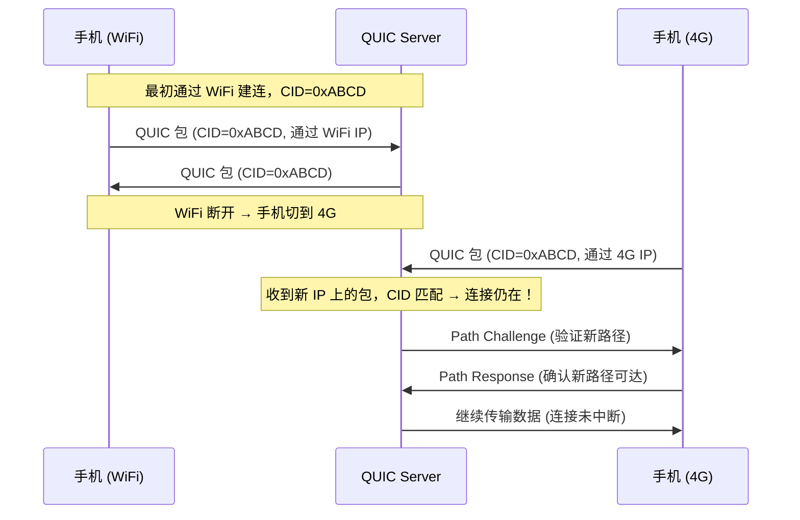
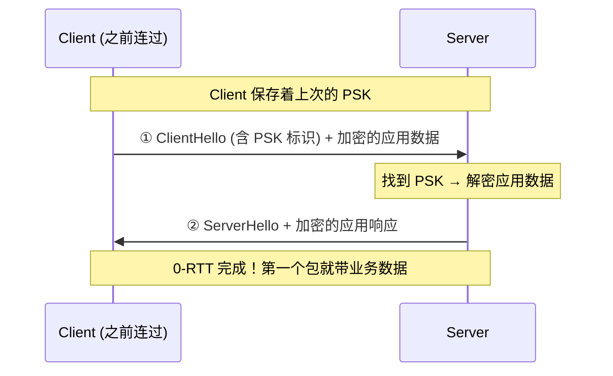

# 历史背景——Google 为什么要在 UDP 上重建传输层？

2013 年，Google Chrome 的工程师团队面临一个困境：他们想把 Web 变得更快，但 TCP 在 OS 内核中——改一下代码，需要 Linux 内核维护者接受补丁、发行版集成、用户升级 OS、手机厂商推送 OTA。从"写好代码"到"10% 用户用上"，需要 3-5 年。

Google 做了一个激进的决策：**不在内核里改 TCP，而是在用户态用 UDP 重新实现一套传输层。** 这套协议叫 QUIC（Quick UDP Internet Connections）。2013 年发布原型，2016 年提交 IETF 标准化，2021 年以 RFC 9000 系列正式发布。今天，YouTube、Google Search、Gmail 超过 50% 的流量走 QUIC，HTTP/3 = HTTP over QUIC。

QUIC 不是"修补 TCP"，而是**重新审视传输层应该长什么样**——如果从头设计，不考虑 40 年的历史包袱，你会怎么做？QUIC 给出了一个激进的答案。

```
协议栈对比：
  HTTP/2:  HTTP → TLS → TCP → IP
  HTTP/3:  HTTP → QUIC (内置 TLS 1.3) → UDP → IP
                        ↑
                  加密和传输在同一个协议内，不再是两层
```

---

# 一、Connection ID——"换 IP 了？没事，我认识你"

## 1.1 TCP 的四元组困境

TCP 用四元组 `(src_ip, src_port, dst_ip, dst_port)` 唯一标识一个连接。这个设计在 1981 年是合理的——那个年代的终端不会移动。但在 2020 年代的移动互联网上，手机从 WiFi 切到 4G，src_ip 变了——**TCP 连接断开**，必须重新三次握手 + TLS 握手才能恢复。

```
一次 WiFi→4G 切换的代价（TCP）：
  ① 旧连接断开（客户端发 RST 或等超时）
  ② 新 TCP 三次握手   = 1-RTT
  ③ 新 TLS 1.3 握手   = 1-RTT
  ④ 发送 HTTP 请求    = 1-RTT
  总延迟：3-RTT ≈ 150-300ms（移动网络下更多）
  用户感知：视频卡顿、页面重新加载
```

## 1.2 QUIC 的解法：Connection ID

QUIC 用 **64 位随机数** 作为连接的标识，称为 Connection ID：

```
TCP 连接标识：四元组 (IP1:Port1, IP2:Port2) → IP 变了 = 连接断
QUIC 连接标识：Connection ID (64 位随机数) → IP/端口变但 CID 不变 = 无缝切换
```



**Path Validation（路径验证）**：为了防攻击者伪造新路径，QUIC 在切换时要做一次挑战/响应验证：
1. Server 发 Path Challenge Frame（包含随机 nonce）
2. Client 回 Path Response Frame（回显 nonce）
3. Server 确认新路径可达 → 数据传输恢复

整个迁移过程 < 1-RTT，对比 TCP 的 3-RTT 重连。

**负载均衡的场景**：连接迁移也意味着 L4 负载均衡器不能再依赖"四元组哈希"来保持会话粘滞——因为 IP/Port 可能变。LB 现在需要基于 Connection ID 做路由。对于无状态的 LB，可以抽取 CID 中的路由字节来决策（QUIC 允许 CID 的前几个字节由 LB 编码）。

---

# 二、握手——1-RTT 首次，0-RTT 重连

## 2.1 首次连接：1-RTT

```
TLS 1.3 over TCP（传统 HTTPS）:
  TCP 三次握手     = 1-RTT
  TLS 1.3 握手     = 1-RTT
  HTTP 请求/响应   = 1-RTT
  总延迟：3-RTT 后才能收到第一个字节的数据

QUIC 首次连接：
  QUIC ClientHello (含 DH 公钥) → ServerHello (含 DH 公钥 + 证书 + 加密数据)
  总延迟：1-RTT 后 Server 已经可以发数据了（省掉了 TCP 握手和 TLS 的分层延迟）
```

QUIC 把传输握手和加密握手**合并**了——ClientHello 里同时有 QUIC 的连接参数和 TLS 密钥协商参数。Server 收到 ClientHello 后，在同一个包中回应 QUIC 参数和 TLS 证书 + 密钥协商完成。

## 2.2 重连：0-RTT

如果客户端之前和 Server 建立过连接，可以保存 PSK（Pre-Shared Key）：

```
QUIC 0-RTT 重连：
  ClientHello (含 PSK) + 应用数据（HTTP 请求）→ Server 收到后直接处理！
  总延迟：0-RTT！

和 TLS 1.3 0-RTT 的区别：
  TLS 1.3 0-RTT 仍然需要 TCP 三次握手 → 实际是 1-RTT（TCP） + 0-RTT（TLS） = 至少 1-RTT
  QUIC 0-RTT = 真正的 0-RTT
```



**0-RTT 的安全代价：不防重放攻击。**

```
攻击者截获 Client 的 0-RTT 包 → 缓存 → 24 小时后原样发给 Server
  → Server 检查 PSK 还在有效期内 → 解密 → 执行业务操作
  → 如果这个操作是"扣款"，就产生了重复扣款

防御手段：
  ① 服务端只接受幂等操作的 0-RTT 数据（GET 类请求）
  ② 服务端在 ServerHello 中携带"最大可接受的 0-RTT 包的时间窗口"
  ③ Client 和服务端协商 0-RTT 最大数据量
```

---

# 三、Stream 多路复用——根治队头阻塞

## 3.1 TCP 的队头阻塞问题

这是 QUIC 设计中最核心的改进。先理解 TCP 层面的队头阻塞：

```
TCP 的字节流抽象：
  Client 发送了属于 Stream 1, 2, 3, 4 的数据
  TCP 把它们按顺序打包成一个连续的字节流发给 Server

  如果 Stream 2 的一个 TCP 包丢了：
    → TCP 必须等这个包被重传并成功接收
    → 在这个包之后的 Stream 3 和 Stream 4 的数据（虽然已经到了！）
    → 被 TCP 的接收窗口卡住 → 不能交给应用层
    → 这叫做"TCP 队头阻塞"

  HTTP/2 的困境：
    多路复用的 Stream 共享同一个 TCP 连接
    一个 Stream 丢包 = 所有 Stream 被阻塞
    → HTTP/2 在丢包率 2% 时表现得比 HTTP/1.1 还差（因为 HTTP/1.1 开了 6 个独立连接）
```

## 3.2 QUIC 的设计：每个 Stream 独立

```
QUIC 的 Stream 抽象：
  连接：由 Connection ID 标识，管理共享状态（拥塞控制、流控）
  Stream：连接内的独立数据通道，每个有独立的 Stream ID

  一个 QUIC 包（UDP datagram）可以携带多个 Stream Frame：
    UDP Datagram ┌──────────────────────────────────────┐
                 │ Stream 1 Frame (offset=0,  data[...])│
                 │ Stream 3 Frame (offset=0,  data[...])│
                 │ Stream 1 Frame (offset=100,data[...])│
                 └──────────────────────────────────────┘

  如果一个 UDP 包丢了：
    → 只影响该包中包含的 Stream Frame
    → 不属于这个包的 Stream Frame 不受影响
    → 被阻塞的只有 Stream 1，Stream 3 正常交付给应用！
```

**QUIC 的 ACK 也是按 Stream 独立的**：
- TCP：ACK number 是字节流的偏移（累积确认，一个空洞挡全后面）
- QUIC：ACK Frame 包含 ACK Range 列表——"包 1-50 收到了，包 52-100 收到了，就差包 51"

```c
// QUIC ACK Range（简化表示）
ACK Frame {
    Largest Acknowledged: 100
    ACK Delay: 5ms
    ACK Range Count: 2
    ACK Ranges: [
        { Gap: 0, Length: 50 }  // 包 51-100 收到了
        { Gap: 1, Length: 49 }  // 包 0-48 收到了
                                // 只有包 49 没收到！
    ]
}
// 精确到"哪个包丢了" —— TCP 做不到这一点
```

## 3.3 Stream 类型

QUIC 有四种 Stream 类型：

```
① 单向 Client→Server Stream (Stream ID 0b00)
② 单向 Server→Client Stream (Stream ID 0b10)
③ 双向 Client 发起 Stream (Stream ID 0b01)
④ 双向 Server 发起 Stream (Stream ID 0b11)

每个 Stream 独立流控、独立最终大小、独立关闭。
Stream 之间完全隔离——这在 gRPC 的多路复用场景下尤其重要。
```

---

# 四、丢包恢复——比 TCP 更精确

## 4.1 单调递增的 Packet Number

TCP 有一个历史包袱叫 **"重传二义性"（Retransmission Ambiguity）**：

```
TCP 场景：
  发送方发: Packet(seq=100)
  超时 → 重传: Packet(seq=100)  ← 同样的 seq！
  接收方回: ACK=150
  
  发送方困惑了：
    ACK=150 是对原始包的确认？还是对重传包的确认？
    如果是原始包的 ACK → RTT=200ms → RTO 应该设大
    如果是重传包的 ACK → RTT=50ms → RTO 应该保持
    → 算不准 RTT → RTO 不准 → 要么过早重传（浪费），要么过晚重传（延迟大）
```

QUIC 的解法：**Packet Number 单调递增，永远不会重复**。

```
QUIC 场景：
  发送方发: Packet(pn=50, 应用数据)
  超时 → 重传: Packet(pn=51, 相同的应用数据) ← 不同的 pn！新的包号！
  接收方回: ACK(pn=51)
  
  发送方分析：
    收到 ACK(51) → 这是重传包的确认 → RTT=50ms
    原始包 pn=50 没被确认 → 可能丢了 → 不再用于计算 RTT
    → RTT 计算精确！→ RTO 准确 → 重传及时且不浪费
```

## 4.2 基于 NACK 的快速重传

QUIC 可以发 NACK Frame 显式告诉对端"我缺了哪些包"：

```
接收方：收到 0-48, 50-100 → 缺 49
  → 立刻发送 ACK Frame 标明"缺 49"
  → 不等超时，发送方就能知道丢了什么 → 快速重传
```

配合单调 PN，QUIC 不需要等 3 个重复 ACK 才能判断丢包——一个 ACK Frame 里的 Range 就精确标明了缺失的包。

---

# 五、拥塞控制——用户态可插拔

TCP 的拥塞控制在 OS 内核中（CUBIC/BBR），改算法意味着换内核。QUIC 的拥塞控制在用户态，应用可以自由选择算法：

```
QUIC 默认拥塞控制：NewReno（RFC 9002）

Google 的实际做法：在 QUIC 上跑 BBRv2
  检测到丢包 → 不够判为"拥塞"
  检测到 RTT 增大 → "拥塞信号" → 减 cwnd
  检测到吞吐不再增长 → "达到瓶颈带宽" → 维持 cwnd

为什么 QUIC 上的 BBR 比 TCP BBR 更好？
  - ACK 精确（不会算错 RTT，重传二义性问题消失）
  - 可以在 1% 的用户上测试新的拥塞算法，不用升级内核
  - 算法迭代周期从 2-3 年变成 1-2 周
```

---

# 六、包结构与头部保护

## 6.1 长头 vs 短头

```
Long Header（连接建立时）：
┌──────────┬──────────┬──────────┬──────────┐
│ 1 位: 1  │ Version  │  DCID   │  SCID   │ ...  ← 路由设备需要看 DCID
│ (长头标志)│ (32 位)   │ (目的CID)│ (源CID)  │
└──────────┴──────────┴──────────┴──────────┘

Short Header（正常传输时）：
┌──────────┬──────────┬──────────────────┐
│ 1 位: 0  │ DCID[0]  │ 加密的 Packet    │
│ (短头标志)│ (1字节)   │ Number + Payload │
└──────────┴──────────┴──────────────────┘

短头只有 3 字节 + 加密 Payload——比 TCP 头(20B) + TLS 头精简得多。
```

## 6.2 头部保护——ACK 也是加密的

QUIC 的包除了 Connection ID 是明文（路由需要），其余全部加密：

```
TCP 的可见性：
  TCP 头明文 → 中间设备能看到 seq/ack/窗口 → 可做流量分析/干扰
  → 中间设备看到 ACK=100 知道"前面的包到了"，可能主动重排或丢包

QUIC 的隐私性：
  Packet Number、ACK 帧、负载全部加密
  → 中间设备只看到"UDP 包，CID=xxx，Payload=密文"
  → 无法做 TCP 层级的流量分析和干扰
  → 运营商/中间件所谓的"TCP 优化"在 QUIC 上完全失效

代价：
  网络管理员无法通过抓包 QUIC 内容来排查问题
  需要依赖服务端的 QUIC 事件日志（qlog）做诊断
```

---

# 七、HTTP/3 = HTTP over QUIC

## 7.1 HTTP/3 继承了 HTTP/2 的语义

```
HTTP/2 的二进制帧（HEADERS/DATA/PRIORITY/RST_STREAM）在 HTTP/3 中全部变成了 QUIC Stream Frame

HTTP/2 → HTTP/3 的映射：
  HTTP/2 帧      → HTTP/3 QUIC Frame
  HEADERS Frame   → HEADERS Frame (QPACK 压缩)
  DATA Frame      → DATA Frame
  SETTINGS Frame  → SETTINGS Frame  
  GOAWAY Frame    → GOAWAY Frame
  PUSH_PROMISE    → 已从 HTTP/3 移除
  PRIORITY        → 已从 HTTP/3 移除（太复杂，实际没用）
```

## 7.2 QPACK——独立 Stream 的头部压缩

HPACK（HTTP/2）有一个致命问题：它依赖动态表是**严格有序**的——因为 TCP 保证了帧的顺序。但在 QUIC 中，Stream 之间不保证顺序。

```
HPACK 在 QUIC 上的问题：
  Stream A: HEADERS Frame → 更新动态表，条目 62 = "Accept: text/html"
  Stream B: HEADERS Frame → 引用条目 62
  → 如果 Stream A 的包丢了！Stream B 的 HEADERS Frame 先到达
  → 引用条目 62 时动态表中还没有 62 → 解压失败 → 连接重置

QPACK 的解法：两个独立的单向 Stream
  ① Encoder Stream: 发送方告诉对方"我要更新动态表了"
  ② Decoder Stream: 接收方反馈"我收到你的更新了，可以引用了"
  → 通过这两个控制 Stream 保证动态表的插入和引用之间的顺序
  → 而承载 HTTP 数据的数据 Stream 之间完全无顺序依赖
```

## 7.3 HTTP/3 部署现状

```
浏览器：Chrome 87+ / Firefox 88+ / Edge 87+ / Safari 14+ 默认启用 HTTP/3
服务端：
  - Nginx 1.25+ (ngx_http_v3_module)
  - Caddy (原生支持 QUIC)
  - LiteSpeed (最早的 HTTP/3 支持者)
  - Cloudflare / Fastly CDN (边缘全面支持)
  - AWS CloudFront / Google Cloud CDN (支持 HTTP/3)

负载均衡：
  - L4 LB（NAT/DSR 模式）：不需要理解 QUIC，按五元组转发
  - L7 LB：需要终止 QUIC（LB 本身作为 QUIC endpoint）
  - 混合模式：在边缘节点终止 QUIC → 内网用 TCP/HTTP2 到后端
```

---

# 八、全维度对比

| 维度 | TCP + TLS 1.3 | QUIC |
|------|-------------|------|
| **部署位置** | OS 内核 | 用户态（应用进程内） |
| **握手延迟** | 2-RTT (TCP+TLS) | 1-RTT（首次）/ 0-RTT（重连） |
| **连接标识** | 四元组 (IP 变 → 断连) | Connection ID (IP 变 → 无缝) |
| **队头阻塞** | TCP 层阻塞（影响所有 Stream） | 只有丢失的 Stream 阻塞 |
| **ACK 精度** | 累积确认（丢包位置模糊） | ACK Range（精确到包号） |
| **重传二义性** | 有（seq 重复） | 无（PN 单调递增） |
| **拥塞控制** | 内核固定（CUBIC 默认） | 用户态可插拔（BBR/自定义） |
| **加密范围** | TCP 头/ACK 明文 | 连 ACK 都加密 |
| **协议迭代** | 2-3 年（等内核更新） | 1-2 周（应用重新部署） |
| **CPU 开销** | 较低（加密在内核或硬件 offload） | 较高（用户态加密 + 拥塞控制） |
| **中间件兼容性** | 完全兼容 | 部分防火墙/负载均衡器不支持 |

---

# 九、总结

| 机制 | TCP 的遗留问题 | QUIC 的解 |
|------|-------------|-----------|
| **Connection ID** | IP 变 = 连接断 | 连接迁移，无感切换 |
| **0-RTT** | TCP 三次握手绕不过 | 首次 1-RTT，重连真 0-RTT |
| **Stream 隔离** | TCP 字节流队头阻塞 | 丢一个 Stream 不影响其他 |
| **单调 PN** | seq 重复 → 算不清 RTT | 每次重传都是新 PN → 精确 RTT |
| **ACK Range** | 累积确认 → 不知丢哪个 | 精确告诉你丢哪个包 |
| **用户态拥塞控制** | 内核中，改不了 | 在应用内，按需换算法 |

> QUIC 的哲学：**不是"UDP 比 TCP 快"，而是"在用户态重新实现传输层，可以比内核态的 TCP 做得更好"。** 它解决的不只是延迟问题，更是整个传输层的工程迭代模式——从"等 Linux 内核更新"变成"周三写代码、周五全量上"。

# 延伸阅读

**Do——动手验证：**
- Chrome 访问 `chrome://net-internals/#quic` 查看当前活跃的 QUIC 连接和 Stream 状态
- `curl --http3-only -v https://www.google.com` 强制走 HTTP/3，观察 ALPN 协商（h3）和连接建立
- 用 Wireshark 3.4+ 抓 QUIC 包：`tshark -i eth0 -f "udp port 443" -Y "quic"` 观察 Long Header/Short Header 切换

**Todo——深入方向：**
- QUIC Loss Detection（RFC 9002）的丢包检测算法——`kPacketThreshold` 和 `kTimeThreshold` 的双阈值机制
- QUIC 的流控——连接级流控 vs Stream 级流控的两层窗口控制
- QUIC 的 DoS 防护——Retry Token + Address Validation 如何防止 QUIC 被用作反射放大攻击
- qlog（QUIC Logging Schema）——用结构化日志诊断 QUIC 连接的内核

*本文参考资料：*
- RFC 9000: QUIC: A UDP-Based Multiplexed and Secure Transport
- RFC 9001: Using TLS to Secure QUIC
- RFC 9002: QUIC Loss Detection and Congestion Control
- RFC 9114: HTTP/3
- Google QUIC Design Document: https://www.chromium.org/quic/
- Robin Marx, "QUIC and HTTP/3: Too Big to Fail?" (FOSDEM 2020)
