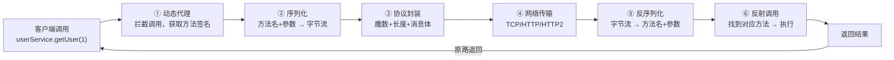

# 历史背景——为什么 RPC 是分布式系统的"标准通信方式"？

1980 年代，Sun Microsystems 的 ONC RPC 是第一个被广泛使用的 RPC 框架。它的核心思想很简单：**让"调用远程服务"和"调用本地函数"看起来一样。** 程序员只需要写 `add(1, 2)`，框架负责把参数打包、通过网络发给远程服务器、执行、再把结果传回来。

30 多年后，RPC 的形态已经从单一框架变成了微服务架构的标配。Dubbo、gRPC、Thrift 是第二代 RPC——它们不只是在"调用"和"返回"之间加网络，而是加入了服务发现、负载均衡、熔断降级、监控链路追踪等整套微服务治理能力。

RPC 框架设计是面试中"系统设计题"的经典题目，因为它在 200 行代码就能覆盖分布式系统的核心概念。

---

# 一、RPC 六大核心组件——从调用到返回的完整链路



## 1.1 动态代理——"让调用方无感"

```java
// 用户代码：看起来就像调本地方法
UserService userService = rpcClient.create(UserService.class);
User user = userService.getUser(1);  // 实际上这是个远程调用！

// RPC 框架内部：通过动态代理拦截
public class RpcProxy implements InvocationHandler {
    @Override
    public Object invoke(Object proxy, Method method, Object[] args) {
        // ① 拿到方法签名和参数
        String serviceName = method.getDeclaringClass().getName();
        String methodName = method.getName();
        Class<?>[] paramTypes = method.getParameterTypes();
        
        // ② 封装为 RPC 请求
        RpcRequest request = new RpcRequest(serviceName, methodName, paramTypes, args);
        
        // ③ 选一个服务节点（从注册中心拿到 IP:Port）
        ServiceNode node = loadBalancer.select(registry.discover(serviceName));
        
        // ④ 发送请求 → 等待响应
        RpcResponse response = nettyClient.send(node, serialize(request));
        
        return response.getResult();
    }
}
```

## 1.2 序列化——JSON vs Protobuf vs Hessian

```java
// 序列化框架的选择：
// JSON (Jackson/Gson):  人类可读，跨语言，体积大，速度慢
// Protobuf:             体积小（二进制），速度快，需要定义 .proto 文件
// Hessian:              二进制，Java 友好，跨语言有限
// Kryo:                 高性能 Java 序列化，需要注册类

// RPC 框架的序列化应该可插拔：
public interface Serializer {
    byte[] serialize(Object obj);
    <T> T deserialize(byte[] data, Class<T> clazz);
}
```

## 1.3 协议设计——自定义协议 vs HTTP

```java
// 自定义 RPC 协议（Dubbo 风格）
// ┌──────────┬──────┬──────┬──────┬──────┬──────────────┐
// │ Magic(2B)│Flag(1B)│Status(1B)│ReqID(8B)│Len(4B)│Body(var)│
// └──────────┴──────┴──────┴──────┴──────┴──────────────┘

public class RpcProtocol {
    public static final short MAGIC = 0xDABB;  // 魔数：识别这是 RPC 协议包
    private byte flag;        // bit0=请求/响应, bit1=是否心跳, bit2=序列化方式
    private byte status;      // 20=OK, 30=服务端错误, 40=客户端错误
    private long requestId;   // 请求 ID（关联请求和响应）
    private int bodyLength;   // Body 长度
    private byte[] body;      // 序列化后的 RPC 请求/响应
}

// 对比直接用 HTTP/JSON：
// ✅ HTTP 的 REST：调试方便（curl 能调），跨语言兼容，不需要自定义协议
// ✅ 自定义协议：体积更小（二进制头 vs HTTP 头），功能可控，性能更高
```

## 1.4 网络传输——Netty 是事实标准

```java
// Netty 的 Reactor 模型处理 RPC 的连接和 IO
// 服务端：
ServerBootstrap bootstrap = new ServerBootstrap();
bootstrap.group(bossGroup, workerGroup)
    .channel(NioServerSocketChannel.class)
    .childHandler(new ChannelInitializer<SocketChannel>() {
        @Override
        protected void initChannel(SocketChannel ch) {
            ch.pipeline()
                .addLast(new RpcDecoder())    // 自定义协议解码
                .addLast(new RpcEncoder())    // 自定义协议编码
                .addLast(new ServerHandler()); // 业务处理
        }
    });
```

## 1.5 反射调用——"找到方法、调用它"

```java
// 服务端收到 RPC 请求后：
public Object invoke(RpcRequest request) {
    // ① 从本地注册表中找到服务实例
    Object service = serviceRegistry.get(request.getServiceName());
    
    // ② 用反射找到对应方法
    Method method = service.getClass().getMethod(
        request.getMethodName(), 
        request.getParameterTypes()
    );
    
    // ③ 反射调用
    return method.invoke(service, request.getArgs());
}
```

---

# 二、服务注册与发现——"哪里有这个服务"

```java
// 注册中心不只是"存 IP:Port"，它负责：
// ① 服务注册：Provider 启动 → 注册到注册中心
// ② 服务发现：Consumer 从注册中心拉取 Provider 列表 + 订阅变更
// ③ 健康检查：Provider 宕机 → 注册中心踢出（临时节点过期或心跳超时）

public interface Registry {
    void register(String serviceName, ServiceNode node);     // 注册
    List<ServiceNode> discover(String serviceName);          // 发现
    void subscribe(String serviceName, NotifyListener listener); // 订阅变更
}
```

| 注册中心 | 一致性 | 健康检查 | 适用 |
|---------|--------|---------|------|
| **ZooKeeper** | CP（强一致，选主期间不可用） | 临时节点 + Session 心跳 | Java 生态（Dubbo 默认） |
| **Nacos** | AP+CP 可切换 | TCP/HTTP 探活 | Spring Cloud Alibaba |
| **etcd** | CP（Raft 强一致） | Lease 续约 | K8s/云原生/gRPC |
| **Consul** | CP | HTTP/TCP/脚本探活 | 多数据中心 |

---

# 三、负载均衡与容错——"选哪个节点，挂了怎么办"

```java
// 负载均衡策略
LoadBalancer {
    Random,                 // 随机
    RoundRobin,             // 轮询
    LeastActive,            // 最少活跃调用数
    ConsistentHash,         // 一致性哈希（同一个 key 总到同一台）
    WeightedRoundRobin      // 加权轮询
}

// 容错策略（Cluster 层）
Cluster {
    Failfast,        // 失败立刻报错
    Failover,        // 失败换一台重试（默认）
    Failsafe,        // 失败不管，返回空
    Failback,        // 失败后台自动重试
    Forking,         // 同时调多台，谁先返回用谁的
    Broadcast        // 广播给所有节点
}
```

---

# 四、超时控制——"别让我等太久"

```java
// RPC 调用的超时 = 连接超时 + 等待响应超时
// 超时后不是"这个请求就取消了"——TCP 包可能已经发出去了！

@RpcReference(timeout = 3000, retries = 1)
private UserService userService;

// 超时设计原则：
// ① 每一跳的超时 = (总超时 - 已消耗时间) / 剩余跳数
// ② 超时不等于取消（需要 Cancel 信号或幂等操作）
// ③ 长尾请求（P99）对用户体验的影响远超平均延迟
```

---

# 五、总结

| 组件 | 解决的问题 | 选型建议 |
|------|---------|---------|
| **动态代理** | 让远程调用像本地调用 | JDK Proxy / CGLIB / Javassist |
| **序列化** | 对象 → 字节流 | 内部用 Protobuf/Hessian，对外用 JSON |
| **协议** | 怎么拆包/粘包 | 简单场景用 HTTP，高性能用自定义 + Netty |
| **注册中心** | 服务在哪些机器上 | Java → Nacos/ZK，云原生 → etcd |
| **负载均衡** | 选哪台 | 默认加权轮询，有状态用一致性哈希 |
| **容错** | 挂了怎么办 | 核心接口 Failover，非核心 Failsafe |

# 延伸阅读

**Do——动手实现：**
- 写一个最小 RPC：用 JDK 动态代理 + Socket + Java 原生序列化，client 调 server 的方法并拿到返回结果
- 加入 Netty 替代 Socket，加入 JSON 替代 Java 原生序列化
- 引入 ZooKeeper 做注册中心，实现 Provider 注册 + Consumer 发现

**Todo——深入方向：**
- Dubbo 的服务治理体系——路由规则、权重调节、灰度发布
- gRPC 的拦截器链——类比 HTTP 中间件和 Netty Pipeline
- RPC 的线程模型——BIO vs NIO vs 异步 Future vs 协程

*本文参考资料：*
- Apache Dubbo 官方文档: https://dubbo.apache.org/
- gRPC 官方文档: https://grpc.io/docs/
- Netty 官方文档: https://netty.io/wiki/user-guide.html
