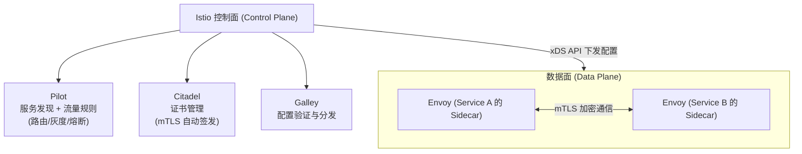

# 历史背景——微服务通信的"从 SDK 到平台"

2016 年之前，微服务通信的治理能力（服务发现、负载均衡、熔断、重试、链路追踪）是通过**内嵌 SDK** 实现的：Dubbo/Spring Cloud 的依赖 jar 包被编译进每个微服务中。每个语言都要有对应的 SDK，升级 SDK 需要每个服务重新发布。

2016 年，Lyft 的工程师 Matt Klein 开发了 Envoy——一个独立于应用进程的**边车代理（Sidecar Proxy）**。应用不再需要集成 SDK，只需要把所有流量发给本地的 Envoy 进程，由 Envoy 负责服务发现、负载均衡、熔断、链路追踪。2017 年，Google/IBM/Lyft 联合发布了 Istio——在 Envoy 之上加了一层控制面（Pilot），统一管理所有 Envoy 的路由规则和策略。

这就是 Service Mesh（服务网格）的核心思想：**把"网络通信治理"从应用代码中剥离到独立的基础设施层。**

---

# 一、Service Mesh 的"边车模式"——为什么是 Sidecar？

## 1.1 传统 SDK 模式 vs Sidecar 模式

```
SDK 模式（Dubbo/Spring Cloud）：
  ┌─────────────────────────┐
  │      微服务 A (Java)     │
  │  ┌───────────────────┐  │
  │  │  Dubbo SDK         │  │ ← 通信治理编译在服务内部
  │  │  (服务发现/LB/熔断) │  │
  │  └───────────────────┘  │
  └─────────────────────────┘
  
  痛点：
  - Polyglot（多语言）：Java 有 Dubbo，Go 有 gRPC，Python 有...什么？→ SDK 不一致
  - 升级：SDK 升级需要重编译 + 发布所有的微服务
  - 侵入性：业务代码和通信代码混在一个进程中

Sidecar 模式（Service Mesh）：
  ┌──────────────────────────┐
  │ 微服务 A (任何语言)       │
  │ 只处理业务逻辑             │
  │ localhost → 127.0.0.1    │
  └──────────┬───────────────┘
             │ 所有流量通过 localhost
  ┌──────────┴───────────────┐
  │ Envoy Sidecar            │ ← 与微服务在同一 Pod 中
  │ (服务发现/LB/熔断/追踪)    │
  └──────────┬───────────────┘
             │ 转发到其他 Pod
        网络

  优势：
  - 语言无关：Envoy 用 C++，所有语言的微服务都能用
  - 透明升级：升级 Envoy → 不需要改一行业务代码
  - 无侵入：业务代码只是把请求发给 localhost
```

## 1.2 iptables 流量拦截——应用"无感"接入 Mesh

```
Sidecar 注入后，Istio 在 Pod 中设置 iptables 规则：

# 所有从应用发出的流量 → 重定向到 Envoy Sidecar（端口 15001）
iptables -t nat -A OUTPUT -p tcp -j REDIRECT --to-port 15001

# 所有从外部进入 Pod 的流量 → 先到 Envoy Sidecar（端口 15006）
iptables -t nat -A PREROUTING -p tcp -j REDIRECT --to-port 15006

效果：
  应用认为自己直接连到了后端服务 → 实际经过 Envoy
  Envoy 处理服务发现/负载均衡/熔断/重试 → 转发到真正的后端
  应用代码完全不知道 Mesh 的存在
```

---

# 二、Istio 架构——控制面 + 数据面



## 2.1 Pilot——流量的"空中交通管制"

```yaml
# VirtualService: 定义"什么样的请求走什么路径"
apiVersion: networking.istio.io/v1beta1
kind: VirtualService
metadata:
  name: reviews-route
spec:
  hosts:
  - reviews
  http:
  - match:
    - headers:
        end-user:
          exact: jason          # 特定用户走 v2 版本
    route:
    - destination:
        host: reviews
        subset: v2
  - route:                      # 其余用户走 v1
    - destination:
        host: reviews
        subset: v1
---
# DestinationRule: 定义"到目标后怎么分发"
apiVersion: networking.istio.io/v1beta1
kind: DestinationRule
metadata:
  name: reviews-destination
spec:
  host: reviews
  subsets:
  - name: v1
    labels:
      version: v1
  - name: v2
    labels:
      version: v2
  trafficPolicy:
    loadBalancer:
      simple: RANDOM
```

**这个配置实现了灰度发布**："jason 这个用户看到新版本 v2，其他用户继续用 v1"。不需要改任何 Kubernetes Pod 的标签，不需要重启任何服务——只需要改 Istio 配置。

## 2.2 Citadel——自动 mTLS

```
传统服务：A → B 之间的 HTTP 是明文（如果没额外配 HTTPS）
  → 数据可能被同一 K8s 集群中的恶意 Pod 窃听

Istio mTLS：
  Citadel 自动给每个 Sidecar 签发 TLS 证书
  A 的 Envoy 和 B 的 Envoy 之间自动启用双向 TLS
  A 和 B 的应用代码完全不知道有 TLS
```

---

# 三、Service Mesh 的收益与代价

| 维度 | 传统 SDK 模式 | Service Mesh |
|------|------------|-------------|
| **语言无关** | 每个语言需要自己的 SDK | 任何语言，只要发 HTTP/gRPC |
| **升级** | SDK 升级 → 全部服务重编+发布 | 升级 Envoy → 业务代码不改 |
| **可观测性** | 需要接入 Jaeger/Prometheus | 自动！Envoy 内置指标+追踪 |
| **mTLS** | 每个服务自己配证书 | 自动签发+自动轮换 |
| **灰度发布** | 改代码或改 LB 配置 | VirtualService 一条规则 |
| **延迟** | 0（同进程） | ~1-3ms（额外一次 Sidecar 转发） |
| **资源开销** | 无额外进程 | 每个 Pod 多一个 Envoy 容器（~100MB 内存） |
| **复杂度** | 低 | 高——istiod 控制面 + 每个 Pod 的 Sidecar |

**Service Mesh 不是"免费的性能提升"——它增加了延迟和资源消耗，换取的是治理能力的统一和运维的简化。** 对于 < 10 个微服务的小团队，Service Mesh 的收益可能抵不上复杂度；对于 > 50 个微服务的组织，SDK 维护的开销已经超过了 Mesh 额外资源的成本。

---

# 四、Service Mesh 的替代方案——什么时候不用 Mesh？

```
方案 1：API 网关（只处理南北向流量，不处理东西向）
  → 服务间的调用（A→B）不走网关，直接连 → 不需要 Mesh

方案 2：轻量 SDK + 统一框架（如 Java 全 Dubbo 栈）
  → 如果全公司都用 Java，SDK 版本统一管理 → Mesh 的优势不明显

方案 3：gRPC 原生能力
  → gRPC 已经自带 LB/重试/拦截器 → 小规模下不急着上 Mesh
```

---

# 五、总结

| 概念 | 一句话 |
|------|--------|
| **Sidecar** | 业务进程旁边的代理进程，拦截所有进出流量 |
| **Envoy** | 最广泛使用的 Sidecar 代理（C++ 实现） |
| **Istio** | 在 Envoy 之上加控制面，统一管理服务间的流量规则 |
| **VirtualService** | "哪些请求走哪条路径"（路由规则） |
| **DestinationRule** | "到了目标后怎么分发"（负载均衡、版本子集） |
| **mTLS** | 自动的双向 TLS，应用完全无感 |

# 延伸阅读

**Do——动手搭建：**
- 用 Minikube/Kind + Istio 搭建一个 3 微服务（frontend→service-a→service-b）的 Demo 集群
- 修改 VirtualService 的 weight 实现 90% v1 + 10% v2 的灰度发布
- 在 Kiali（Istio 的可视化面板）中观察服务间调用拓扑和请求延迟

**Todo——深入方向：**
- Envoy 的 xDS 协议——Pilot 如何通过 LDS/RDS/CDS/EDS 动态更新 Sidecar 配置
- 服务网格与 API 网关的关系——东西向（服务间）走 Mesh，南北向（外部→内部）走 Gateway
- 无边车 Service Mesh（Sidecar-less）——eBPF/Cilium 能否替代 Envoy Sidecar？

*本文参考资料：*
- Istio 官方文档: https://istio.io/latest/docs/
- Envoy 官方文档: https://www.envoyproxy.io/docs/
- Matt Klein, "Envoy: 7 months later" (2017)
