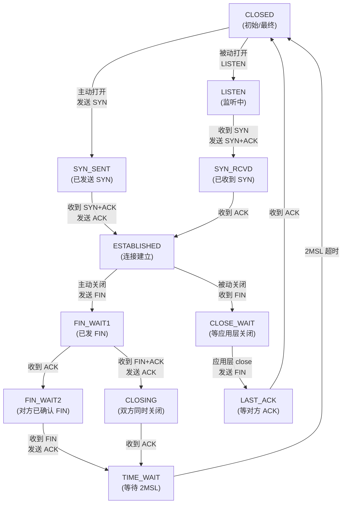
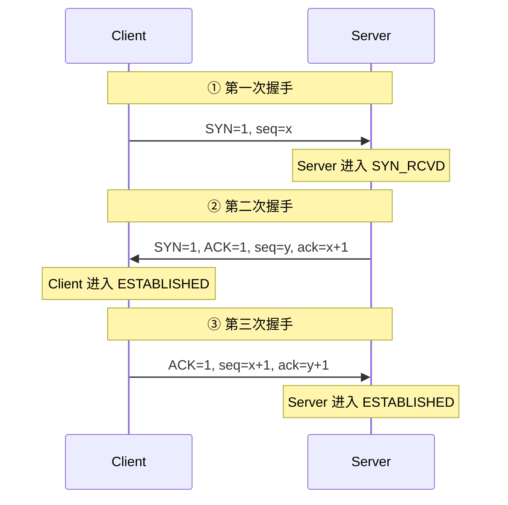
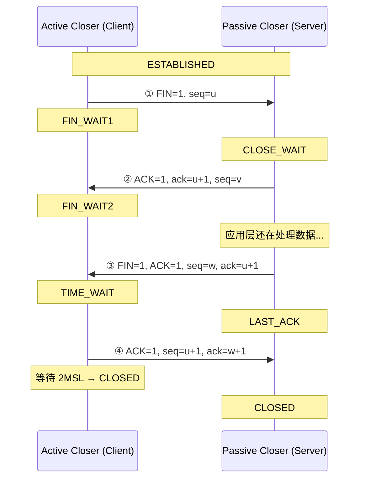

# 历史背景——TCP 状态机为什么有 11 个状态？

1981 年，Jon Postel 在 RFC 793 中定义了 TCP。当时没有"连接"和"断开"的自动状态管理，每个操作系统实现都有自己的理解——有些实现不清理连接，导致"僵尸连接"永远占着端口。RFC 793 用一个**11 状态的状态机 + 严格定义了每个状态下的合法行为和超时**——解决了这个问题。40 多年后的今天，我们排查 TIME_WAIT 堆积时，依然是在和 1981 年的这个有限状态机对话。

理解 TCP 状态机，不是为了应付面试，而是因为**生产环境中的 TIME_WAIT、CLOSE_WAIT、SYN_RECV 堆积，根源在于没有理解这些状态是什么条件下进入和退出的**。

---

# 一、TCP 11 状态全览



**11 个状态分三组记忆**：
- 连接建立：CLOSED → LISTEN → SYN_SENT / SYN_RCVD → ESTABLISHED
- 连接断开：ESTABLISHED → FIN_WAIT1/CLOSE_WAIT → FIN_WAIT2 → TIME_WAIT → CLOSED
- 特殊路径：CLOSING（双方同时关闭）、LAST_ACK（被动关闭方最后一步）

---

# 二、三次握手——为什么不是两次？

## 2.1 标准流程



**序列号的作用**：`seq` 不是从 0 开始，而是随机初始化的（ISN, Initial Sequence Number）。这样做的原因是防止网络上延迟的旧数据包被误认为是新连接的合法数据。

## 2.2 为什么不是两次握手？

**核心原因：防止历史连接（旧的 SYN）初始化连接。**

```
场景：Client 发了一个 SYN（seq=90），但网络延迟了。Client 超时后重新发了一个 SYN（seq=100）。
  旧的 SYN(90) 在网络中晃了很久 → 终于到达 Server
  → Server 回复 SYN+ACK
  → 如果两次握手就建立连接（Client 收到 SYN+ACK 后连接就建立）
  → Client 此时已经用 seq=100 建立了新连接，收到 seq=90 的 SYN+ACK 会回 RST
  → 但 Server 却认为这个连接已经建立（因为它只收到了 SYN 就建连）→ 单边连接！
  
三次握手 → Server 必须收到 Client 的 ACK 后连接才建立
  → Client 收到旧的 SYN+ACK 时，发现 ack 值不对 → 回 RST → Server 收到 RST 关闭连接
```

**另一个原因**：三次握手让双方都收到对方的序列号并确认对方收到了自己的序列号——这是双向可靠通信的基础。

## 2.3 SYN Flood 攻击与 SYN Cookie

攻击者发送大量 SYN 但不完成第三次握手 → Server 端大量连接卡在 SYN_RCVD → SYN 队列（半连接队列）满 → 正常用户无法连接。

```bash
# 查看 SYN_RCVD 状态的连接
ss -tan state syn-recv | wc -l

# 查看半连接队列大小
cat /proc/sys/net/ipv4/tcp_max_syn_backlog  # 默认 256（太小！）
```

**SYN Cookie 防御**：
```bash
# 开启 SYN Cookie
echo 1 > /proc/sys/net/ipv4/tcp_syncookies
# 原理：不把 SYN 存入半连接队列，而是将连接信息编码到 SYN+ACK 的 seq 中
# Client 回的 ACK 中 ack=seq+1 → Server 解码出原始连接信息 → 创建连接
# 优点：半连接队列满时仍然可以处理新连接
```

---

# 三、四次挥手——为什么要四次？



**为什么要四次而不是三次？** TCP 是全双工的——两个方向可以独立关闭。当主动关闭方发 FIN 表示"我的数据发完了"，被动方可能还有数据要发——它先 ACK 这个 FIN，等自己的数据也发完了，再发自己的 FIN。如果被动方也没有数据了，**FIN+ACK 可以合并**（三次挥手）：

```
主动方 FIN=1 → 被动方 FIN=1,ACK=1（合并）→ 主动方 ACK=1
```

## 3.1 TIME_WAIT——为什么要等 2MSL？

MSL（Maximum Segment Lifetime）= TCP 报文在网络中的最大存活时间（RFC 793 建议 2 分钟，Linux 实际 30 秒）。

```
TIME_WAIT = 2 × MSL = 60 秒（Linux 默认）

作用 1：保证最后一个 ACK 能到达对方
  如果最后的 ACK 丢了 → 对方重发 FIN → 需要 TIME_WAIT 状态来接收并重发 ACK

作用 2：让旧连接的所有报文在网络上消失
  如果 TIME_WAIT 不够长 → 旧连接的报文延迟到达
  → 而同一个端口对（src_ip, src_port, dst_ip, dst_port）已经被新连接复用
  → 旧报文被当成新连接的数据 → TCP 错乱
```

## 3.2 生产问题：TIME_WAIT 过多

```bash
# 查看当前 TIME_WAIT 数量
ss -tan state time-wait | wc -l

# 典型原因：
# 1. Nginx 反向代理没有开 keepalive → 每次代理请求新建+关闭连接 = TIME_WAIT 堆积
# 2. 短连接高并发 → 频繁建连/断开 → TIME_WAIT 持续产生
```

**解决方案**：
```bash
# ① 允许复用 TIME_WAIT 的端口
echo 1 > /proc/sys/net/ipv4/tcp_tw_reuse

# ② 加快 TIME_WAIT 回收（谨慎使用）
echo 1 > /proc/sys/net/ipv4/tcp_tw_recycle  # Linux 4.12 已移除（NAT 下有问题）

# ③ 减少 TIME_WAIT 的 bucket 数量
echo 5000 > /proc/sys/net/ipv4/tcp_max_tw_buckets

# ④ 根本解决：开长连接
# Nginx: proxy_set_header Connection "" + proxy_http_version 1.1 + keepalive
```

## 3.3 生产问题：CLOSE_WAIT 堆积

```bash
# CLOSE_WAIT 是"被动方收到了 FIN 但没有调用 close()"的状态
ss -tan state close-wait | wc -l

# 原因：应用层代码没有关闭连接！
# - Java: 没有调 socket.close() / 没有在 finally 中关连接
# - 连接池泄漏：从池里 borrow 了连接但没归还
# - 用了连接，但忘了在 catch 中关闭

# 这不是 OS 问题，是应用代码 Bug。
```

---

# 四、RST 报文——TCP 的"异常终止"

```bash
# RST 不需要四次挥手，收到立刻结束连接
# 常见场景：
# 1. 向一个没有 LISTEN 的端口发 SYN → 回 RST
# 2. 向一个已关闭的连接发数据 → 回 RST
# 3. SO_LINGER 设置为 0 → close 时直接发 RST（而不是 FIN）

# tcpdump 抓 RST
tcpdump -i eth0 'tcp[tcpflags] & tcp-rst != 0'
```

---

# 五、TCP 状态速查表

| 状态 | 含义 | 生产关注点 |
|------|------|-----------|
| **LISTEN** | 服务端等待连接 | 正常 |
| **SYN_SENT** | 客户端发了 SYN，等回应 | 多 → 网络不通或服务端不可达 |
| **SYN_RCVD** | 服务端收到 SYN 回了 SYN+ACK，等 ACK | 多 → SYN Flood 攻击 |
| **ESTABLISHED** | 连接正常 | 正常 |
| **FIN_WAIT1** | 主动关闭方已发 FIN | 多 → 对方不响应 FIN |
| **FIN_WAIT2** | 主动关闭方等对方的 FIN | 多 → CLOSE_WAIT 在对方堆积 |
| **CLOSE_WAIT** | 被动方收到 FIN，等待应用层 close() | **> 0 即告警！** 应用代码 Bug |
| **TIME_WAIT** | 主动关闭方等 2MSL | 几千 → 正常；几万 → 开 keepalive 或 tcp_tw_reuse |
| **CLOSING** | 双方同时关闭 | 极少见 |
| **LAST_ACK** | 被动关闭方发了 FIN，等 ACK | 正常（瞬态） |

---

# 六、总结

| 问题 | 答案 |
|------|------|
| **为什么三次握手？** | 防止旧 SYN 初始化连接 + 双向交换序列号 |
| **为什么四次挥手？** | TCP 全双工——双方各自独立关闭自己的方向 |
| **TIME_WAIT 为什么 2MSL？** | 保证最后一个 ACK 到达 + 让旧报文在网络中消亡 |
| **CLOSE_WAIT 堆积？** | 应用层忘记 close()——不是 OS 问题 |
| **SYN Flood 怎么防？** | SYN Cookie + 增大半连接队列 |

# 延伸阅读

**Do——动手验证：**
- 用 `ss -tan` 观察一次 TCP 连接的完整状态变化（配合 `curl http://localhost` 快速建连+断开）
- 用 `tcpdump -i lo port 8080` 抓一次三次握手和四次挥手，数 seq/ack 的变化
- 写一个永远不 close 的 Socket Server，用 `ss -tan` 观察 CLOSE_WAIT 堆积

**Todo——深入方向：**
- TCP Keepalive 与 HTTP Keep-Alive 是两个完全不同的东西——前者是 OS 层面的心跳，后者是 HTTP 协议层面的连接复用
- TCP Fast Open (TFO) —— 在 SYN 中携带数据，省掉一次 RTT
- TCP_NODELAY 与 Nagle 算法的博弈

*本文参考资料：*
- RFC 793: Transmission Control Protocol (1981)
- RFC 1122: Requirements for Internet Hosts
- W. Richard Stevens《TCP/IP Illustrated, Volume 1》
- Linux 内核文档: tcp(7)
