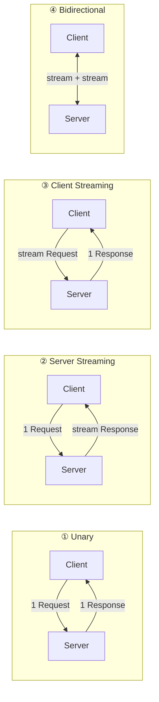

# 历史背景——HTTP 不够用的时候

HTTP 是"一问一答"的请求-响应协议——客户端发请求，服务器回响应，一轮结束。但在两个场景下这个模型有局限：

1. **实时推送**：聊天消息、股票价格、游戏状态——服务器需要主动向客户端发数据
2. **流式调用**：上传大文件、AI 模型的流式输出、数据库的批量写入——需要在单次连接上传递大量数据

WebSocket（2011 年 RFC 6455）解决了第一个问题——在 HTTP 基础上把连接升级为全双工。gRPC（2016 年 Google 开源）解决了第二个问题——基于 HTTP/2 在单次连接上实现双向流式 RPC。

---

# 一、WebSocket——"把请求变成连接"

## 1.1 HTTP Upgrade：从 HTTP 到 WebSocket

```http
# 客户端发起 HTTP Upgrade 请求
GET /chat HTTP/1.1
Host: server.example.com
Upgrade: websocket
Connection: Upgrade
Sec-WebSocket-Key: dGhlIHNhbXBsZSBub25jZQ==
Sec-WebSocket-Version: 13

# 服务器响应
HTTP/1.1 101 Switching Protocols
Upgrade: websocket
Connection: Upgrade
Sec-WebSocket-Accept: s3pPLMBiTxaQ9kYGzzhZRbK+xOo=
```

**之后这个 TCP 连接就不再是 HTTP 了**——变成 WebSocket 的帧格式，双向发送。

## 1.2 WebSocket 帧格式

```
 0                   1                   2                   3
 0 1 2 3 4 5 6 7 8 9 0 1 2 3 4 5 6 7 8 9 0 1 2 3 4 5 6 7 8 9 0 1
+-+-+-+-+-------+-+-------------+-------------------------------+
|F|R|R|R| opcode|M| Payload len |    Extended payload length    |
|I|S|S|S|  (4)  |A|     (7)     |          (16/64)              |
|N|V|V|V|       |S|             |  (if payload len==126/127)     |
| |1|2|3|       |K|             |                               |
+-+-+-+-+-------+-+-------------+-------------------------------+
|     Masking-key (0 or 4 bytes)                                |
+---------------------------------------------------------------+
|     Payload Data ...                                           |
+---------------------------------------------------------------+

关键字段：
  FIN: 是否这是消息的最后一帧
  opcode: 0x1=文本帧, 0x2=二进制帧, 0x8=关闭, 0x9=Ping, 0xA=Pong
  MASK: 客户端→服务器的帧必须掩码（防止缓存投毒攻击）
```

**Ping/Pong 心跳**：
```javascript
// WebSocket 内置心跳（opcode=0x9/0xA）
// 不需要应用层自己发心跳包
ws.on('ping', () => ws.pong());  // 自动回复 Pong
```

## 1.3 与 SSE（Server-Sent Events）对比

| | WebSocket | SSE |
|------|----------|-----|
| **方向** | 全双工 | 单向（Server→Client） |
| **协议** | ws:// / wss:// | HTTP/1.1 |
| **断线重连** | 需手动实现 | `EventSource` 自动重连 |
| **二进制** | ✅ | ❌（只支持文本） |
| **复杂度** | 高（帧格式） | 低（纯文本事件流） |
| **适用** | 聊天、游戏 | 通知、股票、日志推送 |

---

# 二、gRPC——HTTP/2 + Protobuf 的现代 RPC

## 2.1 gRPC 的四种通信模式

gRPC 基于 HTTP/2 的多路复用能力，支持四种流式模式：

```protobuf
// service.proto
service OrderService {
    // ① Unary：一问一答（最常用）
    rpc CreateOrder (OrderRequest) returns (OrderResponse);
    
    // ② Server Streaming：客户端发一次，服务器流式返回
    rpc ListOrders (ListRequest) returns (stream Order);
    
    // ③ Client Streaming：客户端流式发送，服务器汇总后返回
    rpc BatchCreateOrders (stream Order) returns (BatchResponse);
    
    // ④ Bidirectional Streaming：双向流（聊天、游戏、实时协作）
    rpc Chat (stream Message) returns (stream Message);
}
```



## 2.2 gRPC 与 HTTP/2 的关系

```
gRPC 协议栈：
  gRPC 语义（service/method/status）
    → Protobuf 序列化
      → HTTP/2 Frame（HEADERS + DATA）
        → TCP

一个 gRPC 调用 = 一个 HTTP/2 Stream：
  Client 发 HEADERS frame（method=POST, path=/OrderService/CreateOrder）
  Client 发 DATA frame（Protobuf 序列化后的请求体）
  Server 发 HEADERS frame（:status=200）
  Server 发 DATA frame（Protobuf 序列化后的响应体）
  → Stream 结束
```

**gRPC 支持所有 HTTP/2 的特性**：多路复用（多个 gRPC 调用在一个 TCP 连接上交错）、流量控制、头部压缩。

## 2.3 Protobuf 编码——为什么比 JSON 小？

```protobuf
message User {
  int32 id = 1;
  string name = 2;
  bool active = 3;
}
```

```
JSON 编码：{"id":123,"name":"Alice","active":true} → 38 字节

Protobuf 编码（二进制）：
  Tag(field=1, type=0): 0x08        ← 1 字节
  Value(id=123):        0x7B        ← 1 字节（Varint 编码）
  Tag(field=2, type=2): 0x12        ← 1 字节
  Length(name="Alice"): 0x05        ← 1 字节
  Value("Alice"):       41 6C 69 63 65  ← 5 字节
  Tag(field=3, type=0): 0x18        ← 1 字节
  Value(active=true):   0x01        ← 1 字节
  → 总计 11 字节（JSON 的 29%）
```

**关键编码技术**：
- **Varint**：小数字用变长编码（1-5 字节），不用固定 4 字节
- **ZigZag**：负数映射到正数再 Varint（`sint32`），解决补码表示的高位浪费
- **Length-Delimited**：字符串/嵌套对象用 `Tag → Length → Data` 三段

---

# 三、WebSocket vs gRPC vs REST——选型

| | REST (HTTP/1.1 JSON) | WebSocket | gRPC |
|------|-------------------|----------|------|
| **通信模式** | 请求-响应 | 全双工 | 全双工（四种流模式） |
| **序列化** | JSON（文本） | 自定义 | Protobuf（二进制） |
| **头部大小** | 大（Cookie/Headers 每请求都带） | 小（建连后无头） | 更小（HPACK 压缩） |
| **浏览器支持** | ✅ 原生 | ✅ 原生 | ❌（需要 gRPC-Web） |
| **适用** | 通用 CRUD API | 实时推送、游戏 | 微服务间 RPC、移动端 App |

---

# 四、总结

| 协议 | 核心价值 | 一句话 |
|------|---------|--------|
| **WebSocket** | 把 HTTP 升级为全双工 | "客户端和服务器可以随时互相发消息" |
| **gRPC** | HTTP/2 + Protobuf 的高性能 RPC | "函数调用写成远程的，网络细节透明" |

# 延伸阅读

**Do——动手验证：**
- 用 `wscat -c ws://echo.websocket.org` 连接 WebSocket，手动发送帧观察
- 写一个 gRPC 的 `GreeterService`，用 `grpcurl` 命令行调用
- 用 Wireshark 过滤 `http2`，观察 gRPC 的 HEADERS/DATA frame 在 HTTP/2 Stream 中的传输

**Todo——深入方向：**
- gRPC-Web——在不支持 HTTP/2 的浏览器上运行 gRPC 的代理方案
- gRPC 的负载均衡——client-side LB vs proxy LB vs lookaside LB
- WebTransport——基于 QUIC 的下一代全双工协议，WebSocket 可能的继任者

*本文参考资料：*
- RFC 6455: The WebSocket Protocol
- gRPC 官方文档: https://grpc.io/docs/
- Protocol Buffers Encoding: https://protobuf.dev/programming-guides/encoding/
